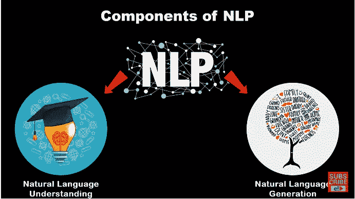

# 什么、为什么和如何:NLP

> 原文：<https://medium.com/analytics-vidhya/what-why-and-how-nlp-aafb1ee95fa6?source=collection_archive---------25----------------------->

自然语言处理(NLP)产生于 70 年代初，当时约翰·葛瑞德和理查德·班德勒在研究三位治疗师——维琴尼亚·萨提亚、弗里茨·帕尔斯和米尔顿·埃里克森的“行为建模”时。他们称之为神经语言程序。从 1971 年到 1976 年的最初几年，他们的生产力和创造力相当惊人。

这是 NLP 的简短历史，但我不会更深入。所以，让我们从自然语言处理(NLP)开始。

# 什么是 NLP？

简单来说，**自然语言处理(NLP)** 就是通过对人类语言的完整分析来获得更好理解的过程。

例如，如果一个人说“*他又高又帅*”。在做了完整的分析后，我们可以得出结论，那个人在谈论任何一个高**帅*的男孩的品质。因此，在自然语言处理的帮助下，我们对人类语言有了全面的了解，知道人类如何思考、行为、感受，并帮助他人做同样的事情。*

*这是一种精确理解你如何做你正在做的事情的方式——以及一套丰富的工具，使你能够改进你的好方法并取代你不那么好的方法。*

> ***“地图不是领地”，这意味着对事件的描述并非绝对真实，而仅仅是描述事件的人的感知！”***

*NLP 的两个组成部分是**自然语言理解(NLU)和自然语言生成(NLG)***

**

***自然语言理解** (NLU)被 [Gartner](https://www.gartner.com/it-glossary/nlu-natural-language-understanding) 定义为“计算机对人类语言(如英语、西班牙语、日语)的结构和意义的理解，允许用户使用自然语句与计算机进行交互”。它基本上用于开发聊天机器人，例如:谷歌的 Dialogflow。*

***自然语言生成(NLG) :***

*Gartner 最近关于商业智能和分析的[炒作周期](https://www.gartner.com/doc/3388326)很好地总结了 NLG 和自然语言处理(NLP)之间的区别:*

> *“自然语言处理侧重于从文本数据中获得分析见解，而 NLG 则通过将分析输出与语境化叙事相结合来合成文本内容。”*

*换句话说，NLP 在阅读，而 NLG 在写作。NLP 系统观察语言，并找出正在交流的想法。NLG 系统从锁定在数据中的一系列想法开始，并将它们转化为语言，进而进行交流。*

# *为什么是 NLP？*

*自然语言处理帮助计算机用人类自己的语言与人类交流，并扩展其他语言相关的任务。例如，NLP 使计算机有可能阅读文本，听到语音，翻译它，测量情绪并确定哪些部分是重要的。*

*今天的机器可以比人类分析更多基于语言的数据，不会疲劳，并且以一致、无偏见的方式进行分析。考虑到每天生成的非结构化数据数量惊人，从医疗记录到社交媒体，自动化对于高效地全面分析文本和语音数据至关重要。*

# *怎么 NLP？*

*让我们从 NLP 是如何工作的开始，在它和许多其他东西下有什么过程。NLP 的工作方式类似于编译器，因为编译器将代码作为输入并转换为机器代码。类似地，NLP 将原始文本作为输入，并产生输出，从中我们可以获得洞察力。*

**

*基本上，NLP 用于文本预处理，对原始文本进行清洗。它由多个过程组成:*

**

***1。记号化:**它是把句子分解成单词的过程，这些单词用空格隔开，通过这个过程我们可以进一步删除一些没有更多意义的单词。*

*例如:“他正在街上走”，所以标记化后它会给出以下输出:['他'，'是'，'行走'，'上'，'的'，'街']*

***2。词干化:**它包括去除额外的动词，如 ing、ed 等，这样我们就可以得到一个反映真实意思的真实单词。*

*比如:走路:walking 因此将考虑步行。*

***3。词汇化:**词汇化使用语言词典对词根进行精确化简。如果可能的话，词汇化比词干化更受青睐。*

***4。实体识别:**在这种情况下，名称、地点或地址等实体充当实体。*

*5.删除标点符号、缩写和停用词(那些重复出现且对句子没有太大意义的词)*

*6.将所有单词转换成小写*

*经过文本预处理后，文本被转换成向量。*

***单词嵌入**是我们用数值(向量)来表示单词的过程。有一些型号:*

***我)袋字(蝴蝶结)***

***ii) Tf-idf(术语频率—逆文档频率)***

***iii)word2vec(谷歌，2013) : CBOW & Skip-gram***

***iv)全球向量(GloVe)(斯坦福，2014)***

***v)快速文本(脸书，2016)***

*伯特(谷歌，2016)*

***七)埃尔莫(艾伦人工智能研究所，2018)***

***八)GPT-2(OpenAI，2018)***

# *自然语言处理的应用:*

**

***1。语音识别:谷歌助手、Siri、IBM 的沃森、Alexa***

***2。情绪分析:推特 SA，脸书 SA***

***3。自动摘要:媒体监控、时事通讯***

***4。聊天机器人***

***5。机器翻译***

***6。拼写检查***

***7。文本分类***

**

***跟我连线**[**LinkedIn**](https://www.linkedin.com/in/kushknows/)**和**[**Github**](https://github.com/kushknows)**。***