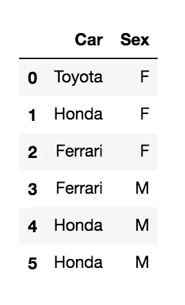
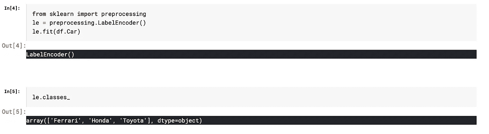
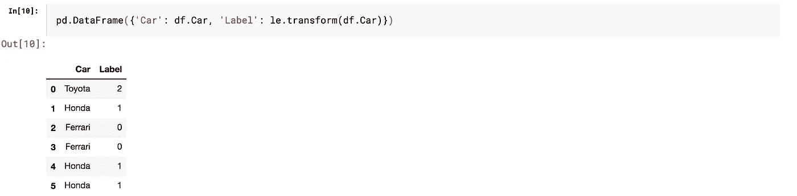
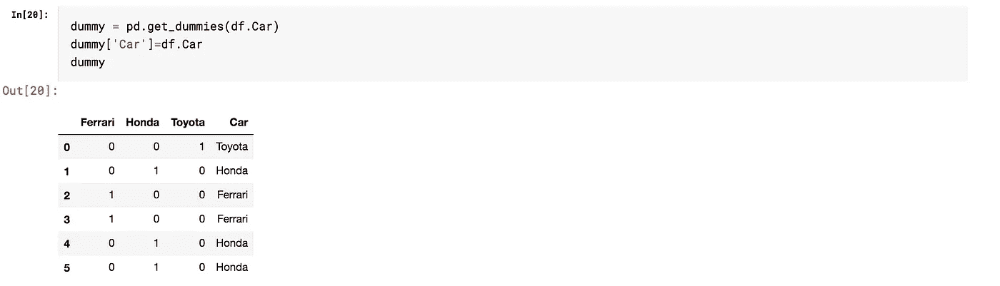

# 一个热门编码的内容、原因和时间

> 原文：<https://medium.com/analytics-vidhya/what-why-and-when-of-one-hot-encoding-52d25a5d3aba?source=collection_archive---------17----------------------->

在训练 ML 模型时，您会遇到数字变量和分类变量。您决定对分类变量进行编码，以便将这些特征输入到模型中。

一个最简单的方法就是给每个类别分配一个数字——也称为标签编码

让我们看一个数据帧的例子。

现在，要在 Car 列上使用标签编码，首先我们要确定所有存在的类。

我们数据集中的三个汽车类别是法拉利、本田和丰田。如果它是一个更大的数据集，我们可以有更多的类，但为了简单起见，我将考虑这个小数据集。

将每个类转换成编码的类别，以便 ML 模型可以使用它，我们得到:

你看到这里的问题了吗？以本田和丰田为例，前者编码为 1，后者编码为 2。这可能会给人一种印象，好像他们的排名让本田在某种程度上优于丰田。或者，这可能会给人一种重量的印象，使丰田比本田更“重”或“重要”。问题是，这与我们的编码意图相去甚远。我们只是想让它们作为特性被 ML 模型所接受。

在这种情况下，热编码是一种更好的方法。它将每个类别转换成一个特性，赋予它二进制值。通常 0 表示不存在，1 表示存在。

对于我们的数据帧的例子，

本田、丰田和法拉利都被转换为功能。仅当“汽车”列中的相应值表示该汽车时，该特性的值才为 1。否则为 0。

这可以对所有分类特征进行，以便 ML 模型可以使用它们，而没有简单标签编码带来的任何固有偏差。