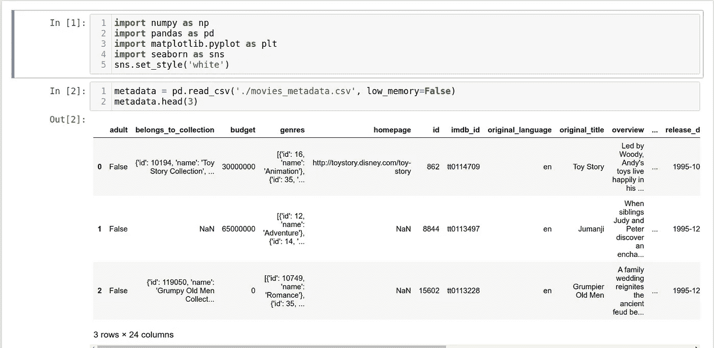
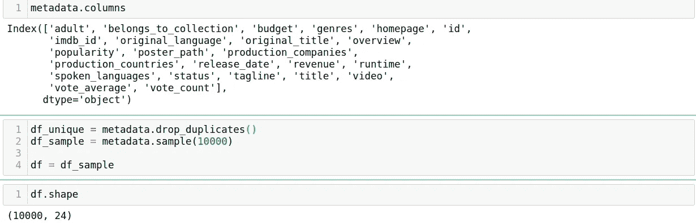
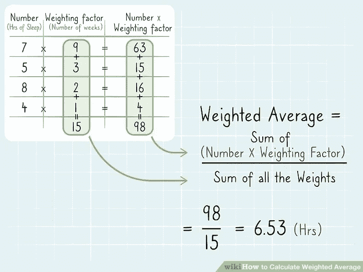
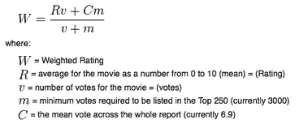
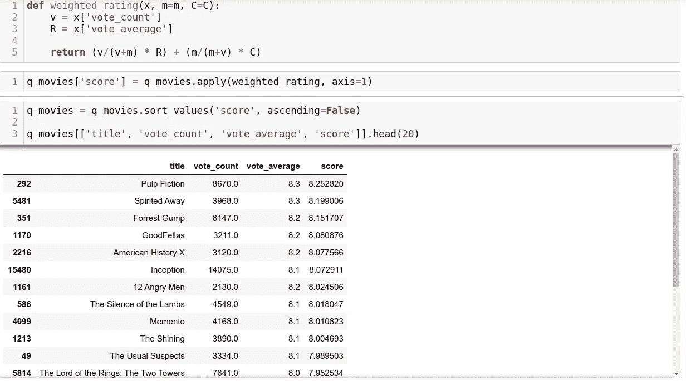
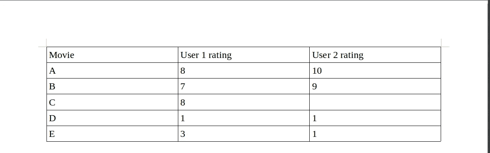
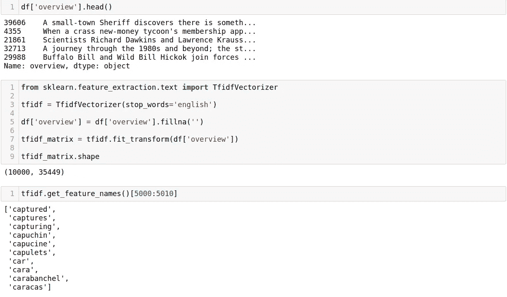
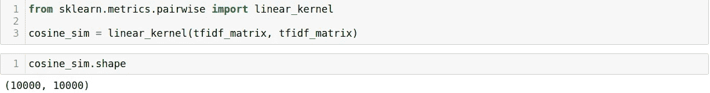
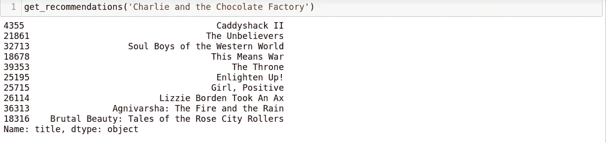

# 你会推荐什么？

> 原文：<https://medium.com/analytics-vidhya/what-would-you-recommend-80c7ab6dab78?source=collection_archive---------30----------------------->

这篇帖子的标题是我们去一家新餐馆时常用的一句话。当我们有多种选择时，我们倾向于寻求意见或请人推荐我们，并期望我们会喜欢它。但是如果我们不喜欢这个建议会怎么样呢？那是一家餐厅或者任何一个平台都承受不起的。因此，了解顾客/用户，了解他/她的品味/选择，对于推荐产品至关重要。只有在这之后，我们才能提出相关的推荐，以确保用户喜欢它并再次访问！尽管说起来容易做起来难。当你的客户群很大，而且他们的喜好很广的时候，会发生什么？不要担心，数据科学就在这里。推荐系统是数据科学的一个非常酷的应用，其中的输入是客户/用户的原始数据，他们对内容/产品的喜欢和评级，基于此，我们为他们提供非常适合他们的推荐，从而让他们满意。这适用于购物、音乐、电影和任何有多种选择的地方。

在本文中，我们将使用 MovieLens 提供的电影数据集，并开发一个电影推荐系统。

先决条件:

*   应用统计学(余弦相似性)
*   Numpy
*   熊猫
*   Python(初级、中级)

## 即使你不精通以上所有的方法，也不要担心。看完这些代码后，你就会明白。

## 步骤 1:数据采集

数据采集就是导入数据，阅读和理解给定的数据。在这个例子中，它将是关于阅读所有的专栏，对于我们建立推荐系统来说什么是必要的，什么是不必要的。

## 步骤 2:创建特征

来自 MovieLens 数据集的实际数据有 45466 行。行数越多，数据就越大，这意味着需要更多的内存。因此，对于 4–8gb 的系统，高效地对数据进行采样是明智之举。在这个例子中，我随机采样了 10000 行，几乎是实际数据集的四分之一。在这种情况下，这是可以接受的，因为这是为了实践，但实际上，在生产中，这将是一个巨大的错误，因为每个**数据点都是相关的。现在，在所有这些列中，我们将选择“vote_average”和“vote_count”来计算所谓的 ***加权评分*** *。***

礼貌:wikihow.com

著名的 IMDB 使用这个加权评级公式:

礼貌:trailerpark.weebly.com

我们将创建一个函数来计算加权评分，并为每部电影创建一个名为“分数”的变量。

注意:小心地将括号放在**回车**行中，因为它会改变“分数”的值

为什么要考虑“投票计数”？想象一部只有少量收视率的电影，或者假设只有 3 个用户收视率，并且都是 10/10。因此，该电影的“vote_average”将是 10。这将导致扭曲的结果。因此，有必要考虑有大量用户评分的电影，这样我们的推荐更接近完美，也不会偏向某一特定类型。

## 第三步:推荐者

粗略地说，推荐基于两个基本概念:

1.  基于内容的过滤:用户评价一部他们喜欢的电影(例如:9/10 ),来自该特定类型的电影将被推荐给他们。《钢铁侠电影情人》将会和续集、《复仇者联盟》等一起被推荐。
2.  协作过滤:这是一种广泛的方法。顾名思义，它会找到两个意思相似的用户，并把他们聚集在一起。

在上面的例子中，考虑了 2 个单独的用户评级。用户 1 和 2 对电影有相似的爱好。正如我们所看到的，用户 2 还没有看电影 C。因此，我们的推荐器将学习找到这样的相似用户，并理解这些评级，然后提供推荐，在这种情况下，电影 C 应该被推荐给用户 2。

我们将看看基于内容的过滤。首先，我们必须创建一个理解类型的函数。对于人类来说，这很容易理解，但对于一个系统来说，我们需要找到一种方法来理解电影的情节，并将其归类到正确的类型。为了做到这一点，我们将考虑电影的概述。(概述是一种总结性的情节)

TF-IDF 代表词频-逆词频，用于从文档(在这种情况下是概述)中进行信息检索，以给出旨在反映某个词在特定语料库中有多重要的数字统计。scikit 库**tfidf 矢量器**形成这些重要单词的矢量并创建一个矩阵。随后，我们从语料库中移除停用词(the、an 等)，这些停用词是数据(语料库)中的*噪声*。一旦这些矩阵形成，我们需要找到“相似的”指示相同类型的矩阵。如前所述，TfidfVectorizer 形成向量矩阵，因此为了找到相似性，我们需要找到相似向量之间的距离。这就是先决条件 1 出现的原因。

en.wikipedia.org

以上公式是针对*余弦相似度的。*相似的电影，属于同一个流派，余弦相似度得分会很高。为了计算相似性得分，我们将使用 sklearn 的 **linear_kernel()。**

使用这些分数，我们将创建一个函数，该函数将遍历数据集并给出输出—前 10 个建议。

瞧。

## 结论:

需要注意的是，使用的最终数据集是实际数据集的样本。当使用实际数据集时，可以实现更好的推荐。此外，这是**基于内容的过滤**，这是一种有点幼稚的方法。如前所述,**协同过滤**更加广泛，据说能提供更好的推荐，因为它的逻辑比简单的基于内容的过滤先进得多。除了余弦相似性，人的相关或欧几里德距离也可以尝试，我鼓励你们自己去做。很有趣。这个酷项目的完整方法是[这里](https://github.com/ramakrishnasonakam/Recommender)。

如果你还和我在一起，我希望你能学到一些东西，我也能增长见识。谢谢你。