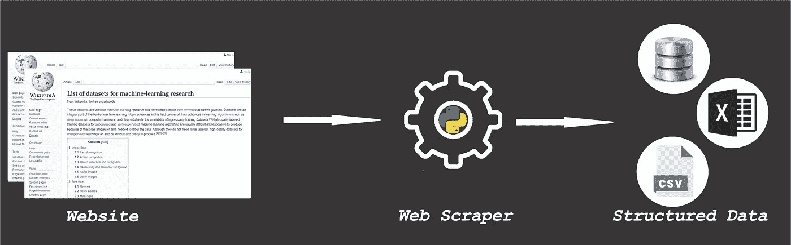
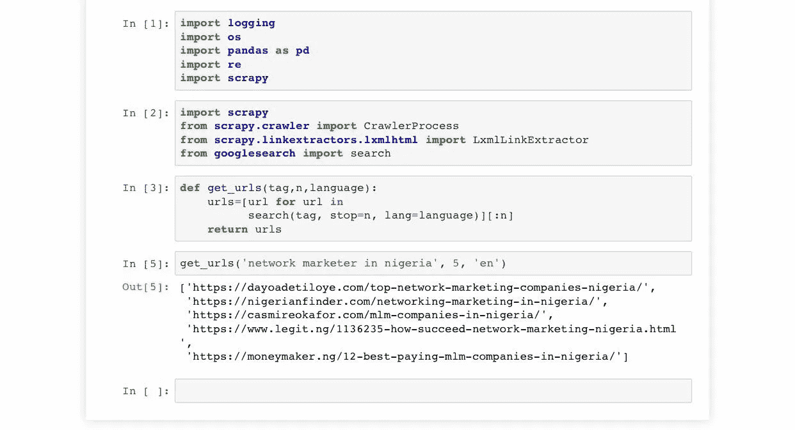
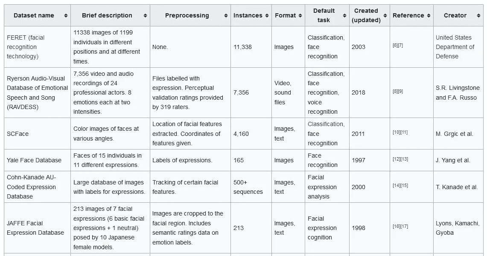
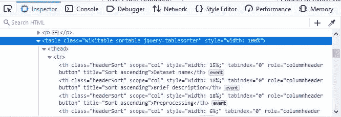
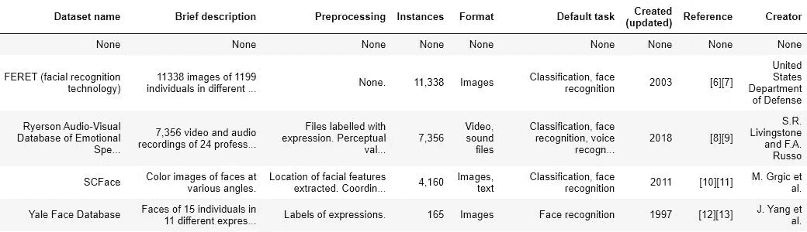
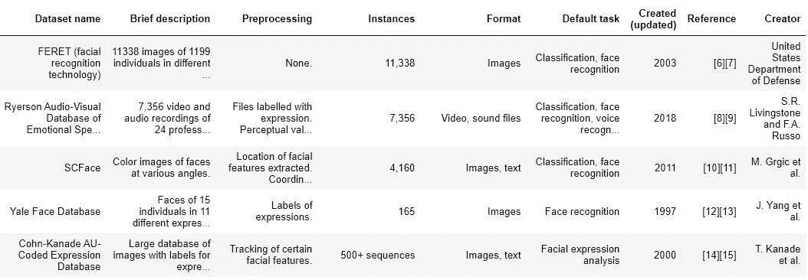

# 关于网络抓取你需要知道什么

> 原文：<https://medium.com/analytics-vidhya/what-you-need-to-know-about-web-scraping-fa626e447343?source=collection_archive---------12----------------------->

## 抓取 HTML 表格

您是否想过如何从没有应用程序编程接口(API)的网站上获取数据？好吧，继续阅读这篇文章，你会了解到如何做到这一点。

本文将涵盖以下子主题:

*   网页抓取的定义
*   网页抓取工作流程
*   网页抓取要求
*   如何获得最佳的网页抓取网址
*   实践经验

## 网页抓取的定义

网络抓取是从网站提取数据的过程。

从一个网站复制和粘贴信息也可以被称为网络抓取，但这是手动的。Web 抓取也称为 web 采集或 web 数据提取。

## 网页抓取工作流程



请求被发送到该 URL。服务器发送数据，并允许 scraper 读取 HTML 或 XML 页面。然后，解析 HTML 或 XML 页面，找到数据，提取数据并以某种格式存储。csv，。xslx 等。).

## 网页抓取要求

计算机、互联网连接、到您想要抓取的网站的链接、Web 浏览器、集成开发环境(Anaconda)、Python 库。

Python 库；

*   美丽的汤——用于从 HTML 和 XML 文件中挖掘数据。
*   请求——用于在 python **中发出 HTTP 请求。**
*   Pandas —用于加载、准备、操作、建模和分析数据。

## 如何获得最佳的网页抓取网址

这里有几行由 [Abimbola Smith](https://medium.com/u/5be21b6a5212?source=post_page-----fa626e447343--------------------------------) 编写的代码，可以为你的网络抓取获得最好的网址。( [*Linkedin 帖子*](https://www.linkedin.com/posts/oluwanifemi-o-abimbola_python-dashboards-microsoftpowerbi-activity-6690134048376922112-SiGd) *)*



它利用了 python 中的 Google 搜索库，该库可以搜索大量使用某种语言的网站，并返回搜索到的 URL。

## 实践经验

我们将按照以下基本步骤提取数据:

1.找到包含要提取的数据的 URL。

2.查看网站的“robots.txt”。

3.安装并导入必要的库。

4.向服务器发送 GET 请求。

5.使用漂亮的汤解析 html 数据。

6.编写提取表格的代码。

7.以某种格式存储数据。

我们将抓取 HTML 表以获得用于机器学习研究的数据集列表。

**第一步:找到包含您想要提取的数据的 URL**

我们将从“https://en . Wikipedia . org/wiki/List _ of _ datasets _ for _ machine-learning _ research”收集数据



**第二步:查看网站**的“robots.txt”

在抓取一个网站之前，先看看它的 robots.txt，这个告诉我们网站是否允许抓取。要获取 robots.txt，请将“/robots.txt”追加到统一资源定位器(URL)中。

```
If the robots.txt looks like this, then you are good to go:User-agent: *Disallow:If the robots.txt blocks all access, it’ll look like this:User-agent: *Disallow: /
```

> 有趣的事实:Python 有一个名为“用户代理”的库

**第三步:安装并导入必要的库**

如果你没有这些库，pip 安装 beautifulsoup4，pandas 和 requests *(一次一个)*。然后导入它们。

```
import requestsimport pandas as pdfrom bs4 import BeautifulSoup
```

**步骤 4:向服务器发送一个 GET 请求**

```
URL = ‘https://en.wikipedia.org/wiki/List_of_datasets_for_machine-learning_research'response = requests.get(URL)
```

**第五步:使用美汤解析 HTML 数据**

```
soup = BeautifulSoup(response.text,”html.parser”)soup.title.text #will display the title of the webpage
```

**第六步:** **写代码提取表**

检查表格并使用**查找**功能提取用于通过选择类中的文本“sortable”从网页中获取第一个表格。



使用标签从表中获取行，使用标签获取标题，使用标签获取数据。

使用查看数据帧的前 5 行；

```
df.head()
```



第一行包含空值，因此我们将删除它。

```
df = df.dropna()
```



**第七步:以某种格式存储数据**

您可以以任何格式存储数据。在本文中，我们将以. csv 格式存储数据，命名为“Wikitable.csv”

```
df.to_csv(‘Wikitable.csv’, index=False, encoding=’utf-8')
```

就这样，你成功地抓取了一个网站广告，并以. csv 格式存储。恭喜你！！！。

## 资源

1.  [数据请求](https://www.dataquest.io/blog/web-scraping-beautifulsoup/)
2.  [爱德华卡](https://www.edureka.co/blog/web-scraping-with-python/)

这里有一个[链接](https://github.com/KemmieKemy/Web-Scraping/blob/master/Web%20Scraper%20-%20Wikitable.ipynb)到 Github 上的代码。

我希望你喜欢这篇文章，如果你在遵循这些步骤的过程中遇到任何挑战，你可以在 Twitter 上直接给我发消息，或者在回复部分发表评论。