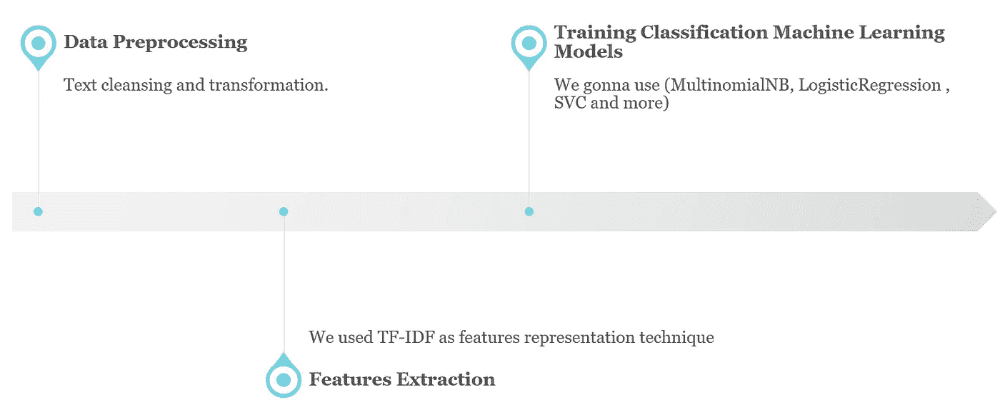
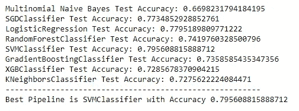
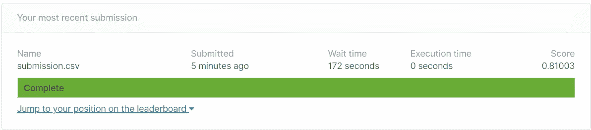

# 在煮什么？..NLP 卡格尔挑战

> 原文：<https://medium.com/analytics-vidhya/whats-cooking-nlp-kaggle-challenge-fb9e090bf00a?source=collection_archive---------10----------------------->

**81%** 精度模型是如何实现的！！

由[图形妈妈团队](https://pixabay.com/users/GraphicMama-team-2641041/)

在这篇文章中，我将讨论[什么是烹饪？](https://www.kaggle.com/c/whats-cooking/overview)挑战[卡格尔](https://www.kaggle.com/)。简单来说，这是一个分类问题，根据配料，我们应该对菜肴的类型进行分类。

# 数据类型和属性

挑战提供的[数据](https://www.kaggle.com/c/whats-cooking/data)以 [JSON](https://en.wikipedia.org/wiki/JSON) 格式分割成两个文件**(训练/测试)**。

这里我们将使用训练文件作为**训练**和**验证**数据，因为测试文件仅用于 kaggle 最终提交 ***(无标签)*** 。

训练文件:

*   `**id**`:食谱 id
*   `**cuisine**`:菜肴类型(即印度菜、希腊菜..等等)
*   `**ingredients**`:配料清单(即水、油、小麦..等等)

测试文件:

*   `**id**`:食谱编号
*   `**cuisine**`:菜系类型

# 环境和配置

以下是最常用的 Python 数据科学包..

熊猫列和行显示配置..

# 数据加载

# 数据管道

我来解释一下 [**sklearn 管道**](https://scikit-learn.org/stable/modules/generated/sklearn.pipeline.Pipeline.html) 的手法

> [*@ dbaghern*](https://www.kaggle.com/baghern)*在她牛逼的* [*笔记本*](https://www.kaggle.com/baghern/a-deep-dive-into-sklearn-pipelines) *:* ***管道*** *是一种精简大量例程流程的方法，将小块逻辑封装到一个函数调用中，这使得实际建模变得更加容易，而不仅仅是编写一堆代码。*

我的管道将如下:

管道设计

# 数据预处理

在这里，我将构建管道的预处理类，应用基本的简单文本预处理步骤，如下所示:

*   连接多词成分，这将是一个可选步骤，因为我正在检查它是否会增加我的准确性(我不会在预处理中使用它)..它降低了准确性。
*   将配料列表转换为字符串
*   从字符串中移除所有错误的符号
*   删除停用词

正如我之前提到的，我们会将训练文件数据分为训练和验证，我决定将其设为 **(70%训练和 30%验证)**，测试将用于 kaggle 最终结果提交。

# 特征抽出

在这一步我们将使用 **TfidfTransformer** ， [TF-IDF](https://scikit-learn.org/stable/modules/generated/sklearn.feature_extraction.text.TfidfTransformer.html) 是特征表示技术，强制使用 [CountVectorizer](https://scikit-learn.org/stable/modules/generated/sklearn.feature_extraction.text.CountVectorizer.html) 作为前一步，或者您可以使用 [TfidfVectorizer](https://scikit-learn.org/stable/modules/generated/sklearn.feature_extraction.text.TfidfVectorizer.html) ，因为它相当于 CountVectorizer 后跟 TfidfTransformer。

为什么我走了两步？！答案是，我们只能将**计数矢量器**用作特征表示器，我在模型训练试验中使用过它。

# 数据分类器(ML 模型)

使用许多已知的分类器和它们的默认参数，并且在训练之后，我们将获得具有最高准确度的模型，并且应用网格搜索来找到最佳的其他参数，这些参数促进算法实现更高的准确度。

使用的分类器:

*   [多项式朴素贝叶斯](https://scikit-learn.org/stable/modules/generated/sklearn.naive_bayes.MultinomialNB.html):简单的[基线](https://datascience.stackexchange.com/questions/30912/what-does-baseline-mean-in-the-context-of-machine-learning)算法
*   [SGD 分类器](https://scikit-learn.org/stable/modules/generated/sklearn.linear_model.SGDClassifier.html)
*   [逻辑回归](https://scikit-learn.org/stable/modules/generated/sklearn.linear_model.LogisticRegression.html)
*   [随机森林分类器](https://scikit-learn.org/stable/modules/generated/sklearn.ensemble.RandomForestClassifier.html)
*   [SVM 分类器](https://scikit-learn.org/stable/modules/generated/sklearn.svm.SVC.html)
*   [梯度推进分类器](https://scikit-learn.org/stable/modules/generated/sklearn.ensemble.GradientBoostingClassifier.html)
*   [XGB 分类器](https://xgboost.readthedocs.io/en/latest/python/python_api.html#xgboost.XGBClassifier)
*   [近邻分类器](https://scikit-learn.org/stable/modules/generated/sklearn.neighbors.KNeighborsClassifier.html)

# 管道

我们将为每个分类器创建一个管道，并创建一个字典来包含所有创建的管道。

# 培训和验证

我们将训练所有模型，然后找到验证数据的最佳准确性

模型准确性..

正如我们看到的，精度最高的模型是**SVM 分类器**，因此我们将应用网格搜索来找到最佳参数，看看我们是否可以获得更高的精度..

# 网格搜索

根据 **SVMClassifier** 文档，我们可以调整许多参数，因此我选择了如下最相关的参数，请注意，您必须包括所有**默认**参数，因为它达到了上述最高精度，我们不想降低精度

注意 **'clf__'** 是指该参数是流水线中的 **'clf'** 步骤之一

使用令人敬畏的例子[这里](https://scikit-learn.org/stable/auto_examples/model_selection/plot_grid_search_digits.html)我们在 **SVC_Pipeline** 上应用了网格搜索。

**警告..**用了大约 **24 小时**和 **4 个并行作业**(下面是 n_jobs 参数)得到最佳参数。

经过长时间运行后，我们发现最佳参数是:

{
'clf__C': 10，
' clf _ _ decision _ function _ shape ':' ovo '，
'clf__gamma': 'scale '，
'clf__kernel': 'rbf'
}

# 再次训练最佳模特

我们现在将重新训练模型，将整个训练文件数据(训练+有效)，所以更多的数据可能会提高准确性..

# 提交文件

我们将存储最终的预测输出，然后将文件提交给 Kaggle 进行评估

这是🥳🥳🥳的评估结果..

谢谢，我希望你们都觉得这个教程很有趣。

如果有任何澄清，反馈或意见，请随时分享。

完整的代码笔记本请点击[此处](https://github.com/MuhammedMaher/Whats-Cooking.git)。

也可以在 [LinkedIn](https://www.linkedin.com/in/mohamedmaher17/) 上关注我