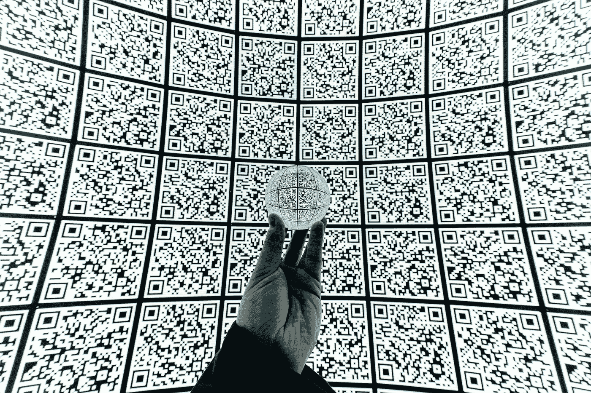
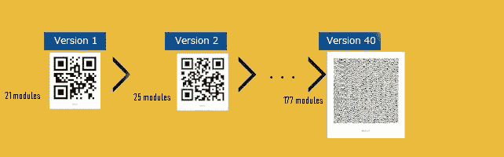
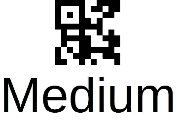
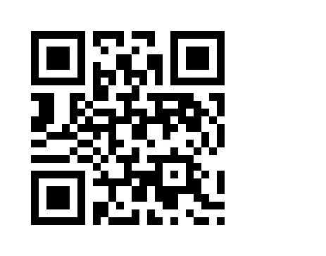
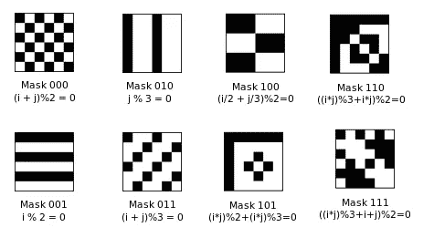
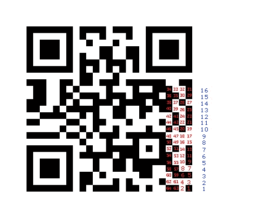

# 二维码里面有什么？

> 原文：<https://medium.com/analytics-vidhya/whats-inside-the-qr-code-bf8a465378fd?source=collection_archive---------5----------------------->

在我们的上一篇文章中，我们讨论了 EAN13 条形码的工作原理以及信息是如何存储在其中的，现在我们将讨论一种称为 QR 码(矩阵条形码或二维条形码)的新型可扫描图像的基础知识

QR 码缩写为(快速响应码)，于 1994 年引入日本汽车行业，由于其快速可读性和与其他条形码相比的存储容量，它在行业外赢得了声誉。

## 1-二维码的类型:

有许多类型的二维码，我们将提到一些:

a- **二维码型号 1 和型号 2:** 型号 1 是原来的二维码它可以存储长达 1167 个数字。型号 2 是型号 1 的升级版，它能够存储 7089 个数字，今天术语 Qr 码指的是型号 2 的 QR 码。

我们有如此多的二维码模型，每个模型包含许多模块(模块是二维码的基本单位，由黑色或白色块表示，它存储二维码的数据并形成其行和列，称为数据矩阵)找到以下一些版本的示例:

二维码版本

如何确定二维码模型 2 的版本是通过计算一列模块的数量，并做如下简单的数学计算:如果我们有 25 个模块，我们从 17 中减去并除以 4**(25–17)/4 = 2**…

b- **微型二维码:**这是一个小型版本的二维码，它可以保存多达 35 个数字，与二维码版本 2 相反，它必须在一个方向上扫描。

微二维码含文字“中”

c- **IQR 码:**这种类型可以生成为方形模块或矩形，最大版本可以存储多达 40000 个数字，这种类型可以打印为点模式条形码(例如在管道上)。

IQR 代码矩形

IQR 代码广场

d- **框架 Qr:** 这种类型允许在 Qr 中插入一个画布区域，可用于促销。

当扫描时，它将给出文本“中等”

e- **SQRC 码**:或安全 QR 码，这种类型可用于存储私人数据，只有拥有解密密钥的扫描仪才能读取，其外观与普通 Qr 码版本 2 相同。

## 2-QR 码的解码方式:

为了简单起见，我们将以二维码版本 2 为例，我们不会在这篇文章中谈论错误纠正(我们可能会在未来包括它)

**I —二维码的某些部分:**

a-静区:在我们的示例中，静区是围绕符号四边的区域，为 4X(4 个模块)

b-Finder 图案:是放置在每个角落(右下角除外)的三个类似结构，每个结构都由一个 3×3 的黑色模块矩阵组成，这些模块被白色模块包围，白色模块又被黑色模块包围，Finder 图案允许解码器软件识别二维码并确定正确的方向。

c-对齐模式:它们存在于二维码版本 2 和更高版本中，它们位于右下角。这种模式允许QR 阅读器在代码弯曲时纠正扭曲。

d-时序模式:时序模式中交替的黑白模块使解码器软件能够确定单个模块的宽度。

电子格式信息:存储关于二维码纠错级别和所选**屏蔽模式的信息。**

**二——如何手动解码二维码:**

我们将以下面的二维码为例，正如我之前提到的，我不会在二维码中包含所有功能，因为我们的目的是了解其概念:

第一步是从左上角或左下角的格式模式中提取数据，并将其与 10101:

正如我们所见，上下方的数据是相同的，它包含黑，黑，黑，白，白转换为 11100，用计算器和 XOR 是与 10101(您可以使用 windows 计算器中的程序员模式)我们得到了 01001 作为答案，前 2 位是纠错级别(我们将在本文中忽略它)下面的 3 位 001 定义了如何屏蔽 QR 码，见下面的屏蔽表:

I 表示列号，j 表示行号

根据上表，掩码 001 有 1 个偶数行和 1 个奇数行，偶数行的模块内容必须反转，如果是 1，将变成 0，反之亦然，我们从底部开始计数，第一个行号是 1(1 模 2 = 1)，因此行数据必须反转，依此类推…

红色的线条必须是 001 掩码的反转结果

第二步是从代码的右下方开始，按照以下方式阅读:

前 4 个模块包含 Qr 码的编码模式，该编码决定了它是数字、字母数字、字节、日本汉字(日语)，并且它将定义我们需要一次读取的模块块。

0001 数字 10 模块(位)

0010 字母数字 11 个模块(位)

0100 字节 8 模块(位)

1000 个汉字 13 个模块(位)

所以让我们开始读吧:

首先，从 1 到 4 的 4 位包含 1000，因为模块 1 和 2 在第 1 行(1 模 2 =1)，所以我们必须反转它们，所以结果是 0100，所以我们有一个字节编码，所以我们需要读取接下来的 8 个模块，以便定义内容的长度。

我们从 5 号模块读取到 12 号模块，结果= 11001010。现在我们必须反转 3 号和 5 号行中的模块，我们得到二进制的 00000110，结果是十进制的 6，所以内容长度是 6 字节。

我们现在知道我们有一个由 6 个字母组成的单词，我们从模块编号 13 开始，一直到 20 (10000001)，我们颠倒第 7 行和第 9 行，所以我们得到 01001101 二进制，这是十进制的 77，现在我们必须匹配 ASCII 表中的数字，77 = M(见下面的 ASCII 表)

我们继续接下来的 8 个模块，从 21 号到 28 号 10101001，我们反转第 11 和 13 行，得到二进制的 01100101，十进制的 101，参考 ASCII 表 101 = e

现在从模块号 29 到 36 10100111，我们反转第 15 行，我们得到二进制的 01100100 等于 100，参考 ASCII 表 100 = d

接下来，从 37 号模块到 44 号模块 01011010，我们反转第 11 行和第 13 行，得到 01101001 二进制= 105 十进制= 1

接下来，从模块号 45 到 52: 01000110，我们颠倒第 7 行和第 9 行，得到 01110101 二进制= 117 十进制= u

现在，从模块 53 到 60: 01011110，我们颠倒第 3 行和第 5 行，得到 01101101 二进制=109 十进制= m

所以我们最后的词是中等。

从 61 到 64 的接下来的 4 个块包含 0011，我们反转第 1 行，因此我们得到 0000，这意味着消息结束。

这就是本文的全部内容，注意为了简洁起见，我没有提到二维码的其他部分，如纠错部分，如需进一步澄清，请在评论中提及。