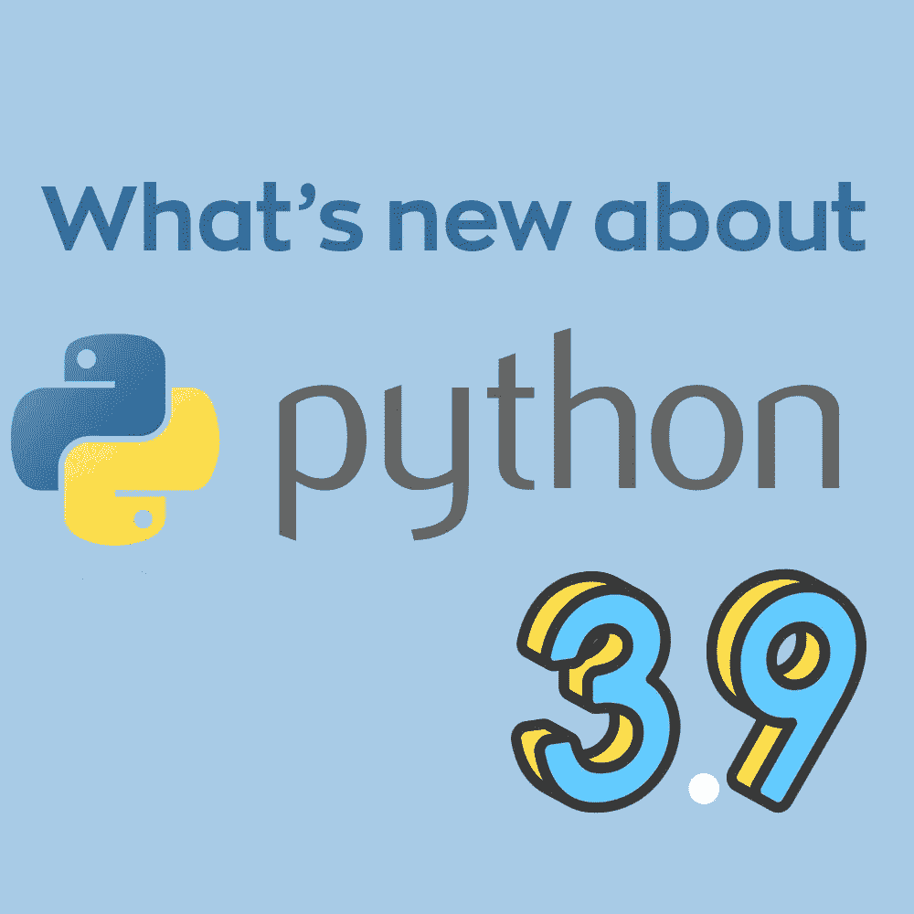
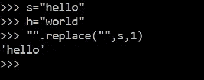
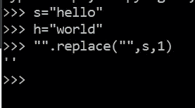

# Python 3.9 的新特性

> 原文：<https://medium.com/analytics-vidhya/whats-new-in-python-3-9-571963945560?source=collection_archive---------19----------------------->



[https://docs.python.org/3/whatsnew/3.9.html](https://docs.python.org/3/whatsnew/3.9.html)
阅读文档以更好地理解版本总是一个好习惯。
本文解释了 Python 3.9 的特性，这些特性将对开发者和 Python 初学者有所帮助。

使用下面给出的链接下载最新版本。
[https://www . python . org/FTP/python/3 . 9 . 0/python-3 . 9 . 0-amd64 . exe](https://www.python.org/ftp/python/3.9.0/python-3.9.0-amd64.exe)

**字典联合合并**

```
>> x={"key1":"value1", "key2":"value2"}
>> y={"key3":"value3", "key4":"value4", "key5":"value5"}
>> x|y
{'key1': 'value1', 'key2': 'value2', 'key3': 'value3', 'key4': 'value4', 'key5': 'value5'}
>>> y|x
{'key3': 'value3', 'key4': 'value4', 'key5': 'value5', 'key1': 'value1', 'key2': 'value2'}
```

**字符串方法去除前缀和后缀**

```
"remove this".removeprefix("remove")
Output: ' this'"remove this".removesuffix("this")
Output: 'remove '
```

**Zoneinfo 库简介**

创建以下模块是为了支持互联网号码分配机构。对相同的支持已经被添加到标准库中。datetime.tzinfo。

如果没有可用的系统时区数据，默认 zoneifno 使用系统的时区数据(如果有)。
如果系统数据和 tzdata 都不可用，所有对 ZoneInfo 的调用都会引发 ZoneInfoNotFoundError。

```
from zoneinfo import ZoneInfo
from datetime import datetime, timedelta
dt=datetime(2020,10,31,12, tzinfo("India/Mumbai"))
print(dt)
dt.tzname
```

**aysncio
不再支持 asyncio . loop . create _ datagram _ endpoint()。
新增协程 shutdown_default_executor()。
阿辛西奥。PidfdChildWatcher，一个特定于 linux 的子观察器实现，它返回文件描述符。**

**hashlib** 模块支持来自 OpenSSL 的 SHA3 哈希和 SHAKE XOF。
现在这一件大事。
安全哈希算法 3 是该家族的最新成员，于 2015 年首次发布。这与 SHA-1 和 SHA-2 的 MD5 结构完全不同。

https://en.wikipedia.org/wiki/SHA-3 阅读上面的文章以获得更多关于 SHA-3 的信息。

ipaddress 模块现在支持 IPV6 地址，可以使用 ipaddress.IPv6Address 解析地址。

**添加 HTTP 状态代码 103** 早期提示信息响应状态代码主要用于链接头，允许用户代理在服务器仍在准备响应时开始预加载资源。

**错误 418** 很有趣，我是茶壶，这是客户端错误响应代码，服务器拒绝煮咖啡，因为它永远是茶壶。

**graphlib** -操作类似图形结构的功能。
功能拓扑排序(图形=无)

这也是理解它的一个很好的模块，让我们理解什么是拓扑排序。
有向图的拓扑排序是其顶点的线性排序，使得对于从顶点 u 到顶点的每个有向边 uv，在排序中 u 在 v 之前。

拓扑排序是可能的当且仅当图没有有向圈，它必须是有向无圈图。

所以在深度优先遍历中，我们打印一个顶点，然后递归调用其相邻顶点的函数。在拓扑排序中，我们需要在相邻顶点之前打印顶点。
了解拓扑排序的实现。

Graphlib 有各种各样相关功能，我强烈鼓励用户为它做出贡献。

```
graph = {"D": {"B", "C"}, "C": {"A"}, "B": {"A"}}
ts = TopologicalSorter(graph)
tuple(ts.static_order())
('A', 'C', 'B', 'D')
```

**随机字节生成** 3.9 中的另一个特性是在引入函数**随机。Random.randbytes()** 上面的函数用来生成随机字节，随机数生成已经存在但是 3.9 自带了新的函数。它不能用于生成安全令牌，要求用户对它使用 secrets.token_bytes()。

```
import random
random.randbytes(5)
b'\xf1\x97\x12\x81\x82'
```

**字符串替换函数修复** 了解前面的替换函数
相同的语法是 string.replace(prev_value，old_value，count)。
现在，python 3.8 中的这个函数为所有非零返回空字符串。
但是现在在 Python 3.9 中它返回了**字符串 s.**



Python 3.9(字符串替换已修复)



Python 3.8

**math.factorial()** 接受浮点值，并对负浮点和非整数提高 ValueError。进一步的数学模块也支持 lcm 和 gcd。
**math.gcd()** 函数处理多个参数。在以前的版本中，用户必须使用递归来使用多值函数。但是在 Python 3.9 中已经解决了。

**math.lcm()** 返回指定参数的最小公倍数

**math.nextafter()** 将 x 之后的下一个浮点值向 y 返回。

**math.ulp()** 返回浮点数的最低有效位。

**isAlive()方法**已被移除，该方法用于检查线程是否活动。建议开发人员改用 is_alive()。

由于增加了两个新特性，Python 3.9 的速度和性能都有所提高。
对 **vectorcall 协议**的改进，该协议删除了调用过程中创建的临时对象，从而提高了许多 Python 内置函数(范围、元组、集、冷冻集、列表、字典)的性能。
第二个提高是由于 PEG 解析器，它支持更快的解析，在处理大量代码时，性能变得明显。

Python 中装饰器的松弛。
Decorator 可以用来实现记录器、定时器、格式转换、框架。
装饰器(Decorator)是一个以另一个函数作为参数的函数，称为装饰函数，然后返回一个新的函数。
返回的函数替换或进一步增加被修饰函数的行为。

因此，这是 Python 中一个有趣的特性，它允许向现有代码添加功能。
因此，装饰器也被称为元函数和使用元函数

关于 Cpython 的 PEG 解析器

https://www.python.org/dev/peps/pep-0617/
这篇文章解释了关于 LL(1)解析器以及 PEG 解析器如何解决歧义。
LL(1)解析器遵循自顶向下的方法，从左到右解析输入。语法中有一些规则会产生歧义，从而产生空字符串等等，PEG Parses 旨在解决这个问题。

此外，这个 Python 3.9 将向后兼容性扩展到了向后层，给项目维护者更多的时间转移到 Python 3.9。

[**https://medium . com/@ gvanrossum _ 83706/peg-parsers-7ed 72462 f97c**](/@gvanrossum_83706/peg-parsers-7ed72462f97c)

[https://medium . com/@ gvanrossum _ 83706/building-a-peg-parser-d 4869 b 5958 FB](/@gvanrossum_83706/building-a-peg-parser-d4869b5958fb)

来的文章。
什么是 Decorator，Parser PEG 和 LL(1)。因为这将需要单独的职位，以进一步了解该主题。