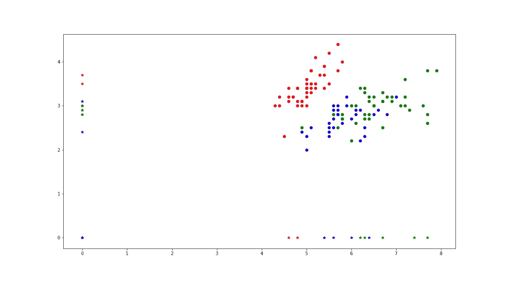
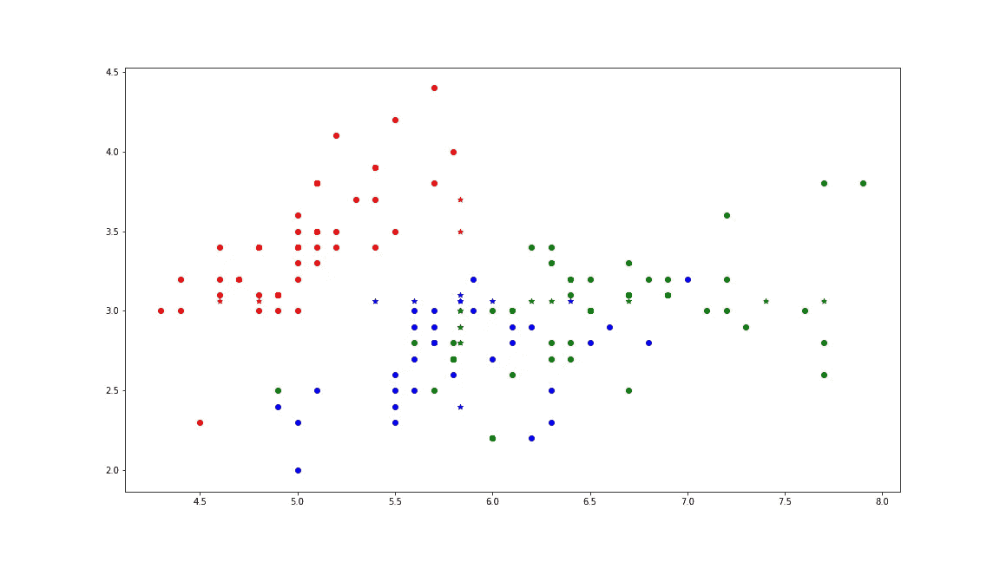
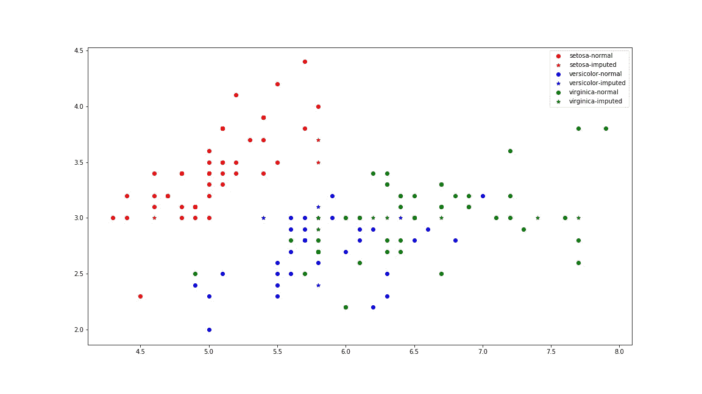
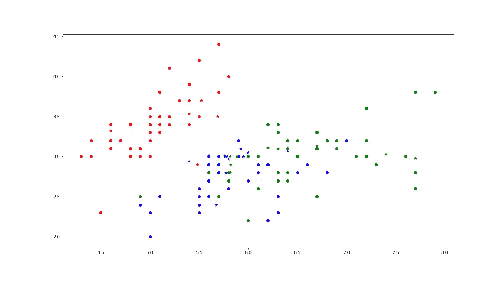
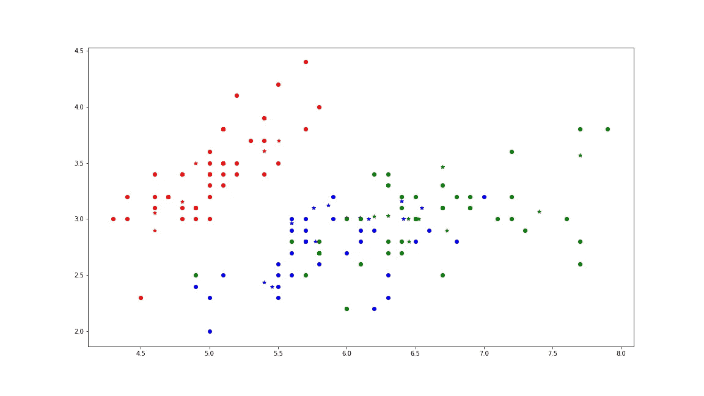
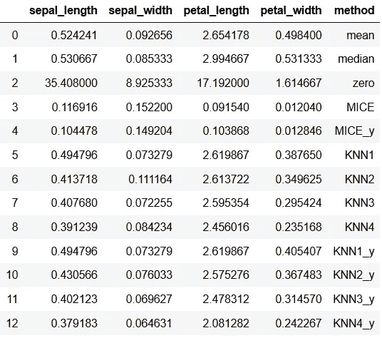

# 处理 NaN 值的最好方法是什么？

> 原文：<https://medium.com/analytics-vidhya/whats-the-best-way-to-handle-nan-values-part-1-continuous-values-c02a0afc15e5?source=collection_archive---------13----------------------->

在我进行大数据分析的实践中，我发现了一个可以破坏每个数据分析过程的障碍。这个障碍在数据科学和机器学习中被称为 NaN 值。

## 什么是 NaN 价值观？

NaN —不是数字，是在 [DataFrames](https://pandas.pydata.org/pandas-docs/stable/reference/api/pandas.DataFrame.html) 和 [numpy](https://numpy.org/) 数组中的特殊值，表示单元格中缺少某个值。在编程语言中，它们也被表示，例如在 Python 中，它们被表示为 None 值。

您可能认为 None(或 NaN)值只是零，因为它们表示没有值。但是这里有一个陷阱，零和 None 值的区别在于，zero 是一个值(例如 integer 或 float)，而 None 值表示没有这个值。这里有一个迷因很好地解释了零价值和零价值之间的区别:

## 南价值观有多危险？

NaN 值在两个方面是危险的:

1.  一些指标的变化，如平均值或中间值，因此给科学家错误的信息。
2.  sklearn 实现的算法不能在具有这种值的数据集上执行(尝试在 [hearth-disease](https://archive.ics.uci.edu/ml/datasets/Heart+Disease) 数据集上实现[决策树分类器](https://scikit-learn.org/stable/modules/generated/sklearn.tree.DecisionTreeClassifier.html)

## 怎么处理他们？

那么，如果 NaN 值对数据科学家的工作如此危险，我们应该如何处理它们呢？有几种解决方案:

1.  擦除具有 NaN 值的行。但是这不是一个好的选择，因为这样我们会丢失信息，尤其是当我们处理小数据集的时候。
2.  用特定的方法或值估算 NaN 值。本文参考了这些方法。

有很多方法来估算这些差距，在大多数情况下，数据科学家，尤其是新手不知道如何去做。以下是做这件事的方法:

1.  用特定值估算。
2.  用特殊指标估算，例如平均值或中值。
3.  使用方法估算:鼠标或 KNN。

因此，让我们看看每个人是如何工作的，以及他们如何影响数据集。

## 实验！

为了验证每一种方法，我选择了一个名为 Iris 数据集的数据集，这可能是机器学习测试中最常见的数据集。我还在更大、更复杂的数据集上尝试了这些方法，但对于某些算法来说，时间太长了。

首先，我为这个数据集中的每个特性列生成了 15 个介于 0 和 149 之间的随机且唯一的索引。使用这些索引(对于每个列，它们是单独生成的)，我用 NaN 更改了列值。

在对这些 NaN 值应用每种方法后，我使用均方差(MSE)来检查每种方法的“准确性”。

那么，我们开始吧。

## 方法 1:用特定值插补。

在这种方法中，NaN 值用一个特定的值(例如一个数字)来改变，在大多数情况下这个值是 0。有时这是最好的选择，就像你的特征是花在糖果上的钱，但有时这是最糟糕的选择，就像年龄。现在让我们看看它是如何影响初始数据集的:

零插补后的数据集可视化(开始有插补值)。

正如您所看到的，用 0 填充 NaN 值会强烈影响那些不可能有 0 值的列。这将严重影响空间，取决于所使用的算法，尤其是 KNN 和 TreeDecissionClassifier。

提示:*我们可以通过应用* [*来看看零是不是一个好的选择。描述()*](https://pandas.pydata.org/pandas-docs/stable/reference/api/pandas.DataFrame.describe.html) *函数到我们的数据帧。如果最小值等于 0，那么它可能是一个好的选择，如果不是，那么你应该选择另一个选项。*

## 方法 2:指标插补。

指标插补是一种用一些特殊指标填充 NaN 值的方法，这些指标取决于您的数据:例如平均值或中值。

平均值是一个序列中某个值的总和除以该序列中所有值的个数。它是统计学中最常用的度量类型之一。但是为什么我们用平均值来估算 NaN 值呢？均值有一个非常有趣的性质，如果你在数列中加入更多的均值，它不会改变。

均值插补后的数据集可视化。

在上面的图中，你可以看到它并没有过多地影响数据集的结构，最重要的是它没有将一个类的任何样本放入另一个类的区域。

中值通过将系列的最大值和最小值相加来计算。然后将这个总数除以 2。Median 显示一个系列的精确中间值。在正态分布中(实际上在现实生活中并不存在)，平均值和中值是相等的。

由于不存在正态分布，在大多数情况下，平均值和中值非常接近。

中位数插补后的数据集可视化。

从上面的图中，如果你仔细观察，可以清楚地看到中间值是如何工作的，所有的星星(估算的值)都排列在两条正交线上(萼片长度为 5.6，萼片宽度为 3.0)。

## 方法 3:用 KNN 进行估算

这种插补算法与 sklearn 的 KNearesNeighbours 非常相似。它从数据集中找到与 NaN 值的样本最接近的 k 个样本，并用它估算这些样本的平均值。

这个方法是在库 impyute 和 sklearn 中实现的(当我开始写这篇文章时，我不知道 sklearn 的实现。)

KNN 插补后的数据集可视化(有 3 个邻居)。

从上面的图中，我们可以看到一个严重的错误——将来自红色类的样本放置在蓝绿色区域中(这是具有 3 个邻居的 knn 实现)。

## 方法 4:用小鼠输入

本文的最后一个算法，也是我目前知道的最好的一个算法——链式方程的多重插补。这种算法适用于每一个有缺失值的列，用当前值进行线性回归。之后，它使用该线性函数来估算具有这些值的预测的 NaN 值。

小鼠插补后的数据集可视化。

我们可以看到，在上面的图上，它并没有强烈影响 2D 图上的数据集表示。但是为什么呢？

KNN 和 MICE 插补使用整个数据集来替换 NaN 值，而中值和平均值仅使用缺失值的列，这就是为什么后两种算法不会强烈影响数据集结构，也不会改变其信息。

## 但是这些数字说明了什么呢？

最后的话交给数字。他们发现上面提到的方法有多有效，我使用 MSE(均方误差)。我计算了原始值和估算值之间的 MSE 值。

上表显示了每种方法的 MSE(在 KNN 和鼠标上，我使用了两个版本:一个包括目标值(有 y 值),另一个不包括它)。

下面是哪种算法最适合哪一列。

*   萼片长度—小鼠
*   萼片宽度— KNN4_y
*   花瓣长度—老鼠
*   花瓣宽度—鼠标

正如我所想的那样，老鼠在大多数情况下表现良好。

## 遗言:

我从这个实验中得到的结论是，估算连续值的最好方法是使用整个数据集，如 MICE 或 KNN，而不仅仅是一列。当然，我在这个实验中还发现了更多的方法，但是我将在本文的下一部分继续介绍它们。

## **感谢您的阅读！**