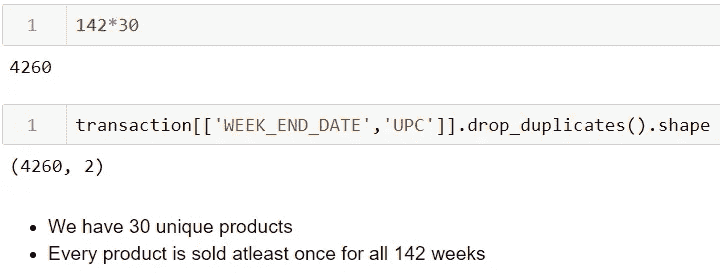

# 数据科学家获取数据的第一步是什么——理解和验证数据(使用 python 实现)

> 原文：<https://medium.com/analytics-vidhya/whats-the-first-step-when-a-data-scientist-getting-data-understanding-and-validating-data-with-524a2041d559?source=collection_archive---------18----------------------->


[活动发起人](https://unsplash.com/@campaign_creators?utm_source=unsplash&utm_medium=referral&utm_content=creditCopyText)在 [Unsplash](https://unsplash.com/s/photos/data-analysis?utm_source=unsplash&utm_medium=referral&utm_content=creditCopyText) 上的照片

当我们第一次获得数据时，首先要做的是理解和验证我们的数据。以下是我们需要考虑的要点，我将以零售需求预测项目为例，展示如何在第一步处理我们的数据，即理解和验证数据。

## 日期时间变量

*   数据捕获持续多长时间？
*   开始和结束日期是什么时候？
*   是否有数据点缺失？

## 数字变量

*   检查数值变量的分布
*   有没有极端值？
*   变量中是否有丢失的值？

## 分类变量

*   检查分类变量的唯一值
*   变量中是否有丢失的值？
*   有没有高基数/稀疏度的变量？

**问题陈述**:根据历史数据，预测下周的物料需求，防止物料库存过多或不足。

```
# Loading Required Libraries and Datasetsimport seaborn as sns
import pandas as pd
import numpy as np
import random
import matplotlib.pyplot as plt
```

我们有三个包含所需信息的表格:

*   **产品数据**:包含产品的详细信息
*   **store_data** :包含与零售商相关的各个商店的详细信息
*   **交易**:包含产品的交易数据

在本文中，我们将只使用**事务**表作为我们的例子，您可以在这里的链接中查看其他两个表的剩余分析。

```
transaction.head()
```


*   **周结束日期** —周结束日期
*   **商店编号** —商店编号
*   **UPC** —(通用产品代码)产品特定标识符
*   **基价** —物品的基价
*   **展示** —产品是店内促销展示的一部分
*   **特征** —产品在店内传阅
*   **单位** —售出的单位(目标)

```
# checking datatypes of columns in transaction data
transaction.dtypes
```


*   WEEK_END_DATE 具有对象数据类型，但它是日期时间变量
*   商店编号和产品代码被读取为 int，但它们是分类变量。

## 周结束日期

*   **数据捕获持续多长时间？**
*   开始和结束日期是什么时候？


*   **是否有数据点缺失？**


## 商店数量& UPC


*   每个商店每周至少举办一次活动吗？


*   **在所有 142 周内，每件产品都至少售出一次吗？**



*   在给定的时间段内，每个商店都在销售每种产品吗？


*   **对于销售特定产品的商店，我们是否有多个条目？**


*   **一家商店是在整个时期销售一种产品，还是有一段休息时间？**


## 基本价格


```
# distribution of Base Price variable
plt.figure(figsize=(8,6))
sns.distplot((transaction['BASE_PRICE'].values),bins=20,kde=True)
plt.xlabel('Price Distribution')
```


*   基础价格变量中没有极端值
*   基础价格的范围是 1 到 8 美元

## 特征和显示

*   **展示** —产品是店内促销展示的一部分
*   **特征** —产品在店内通告中


```
transaction['FEATURE'].value_counts().plot('bar')
```


大约 10%的产品是特色产品


```
pd.crosstab(transaction['FEATURE'], transaction['DISPLAY']).apply(lambda x: x/len(transaction))
```


## 单位


*   **数据中有多少行销售了 0 台？**
*   **1800 这么高的销量只有一排吗？**


```
plt.figure(figsize=(8,6))
plt.scatter(x = range(transaction.shape[0]), y = np.sort(transaction['UNITS'].values))
plt.xlabel('Index')
plt.ylabel('Units Sold')
```


*   大多数值都小于 250
*   有一些异常值

为了减少异常值的影响和更好的可视化，这里有一个变量的对数变换

```
# distribution of UNITS variable
plt.figure(figsize=(8,6))
sns.distplot((transaction['UNITS'].values),bins = 25,kde = True)
plt.xlabel('Unites Sold')
```


```
# log transformed UNITS column
plt.figure(figsize=(8,6))
sns.distplot(np.log(transaction['UNITS'].values),bins=25, kde=True)
plt.xlabel('Log Units Sold')
```


对数变换后，分布看起来更接近正态分布