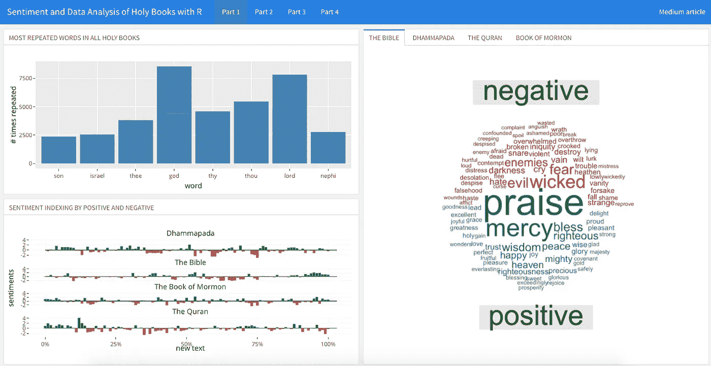

# 最积极或最消极的宗教是什么？—用 R 对圣书进行情感和数据分析

> 原文：<https://medium.com/analytics-vidhya/whats-the-most-positive-or-negative-religion-sentiment-and-data-analysis-of-holy-books-with-r-3fb881289f51?source=collection_archive---------3----------------------->

## 通过探索他们的圣书(《圣经》、《古兰经》、《正法》和《摩门经》)来分析宗教教义

仪表板查看圣书的情绪和数据分析。文末的链接。

据估计，目前全世界大约有一万种宗教，其中…