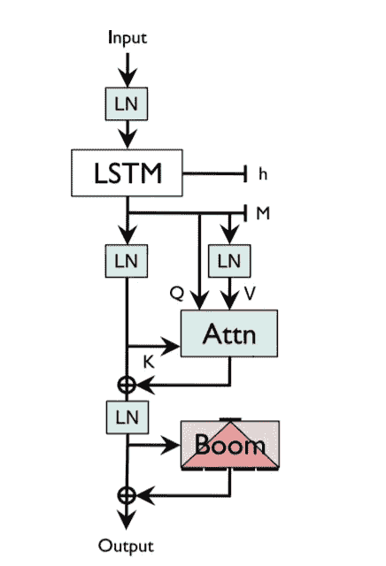
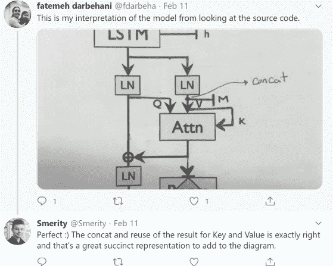
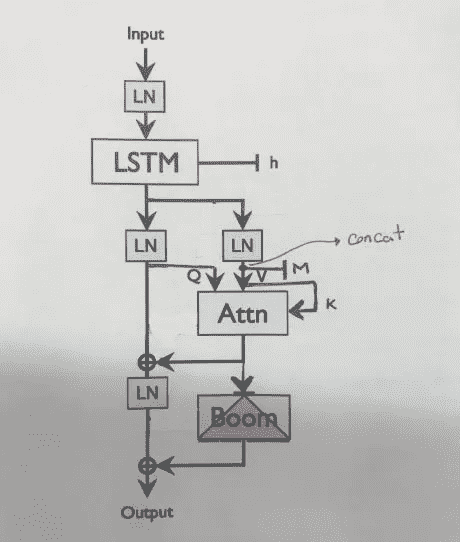
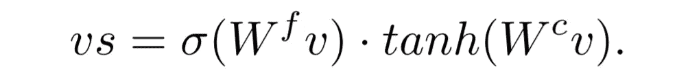
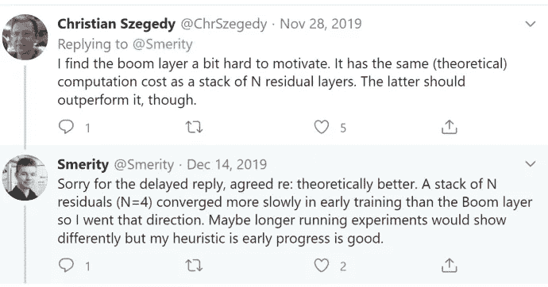
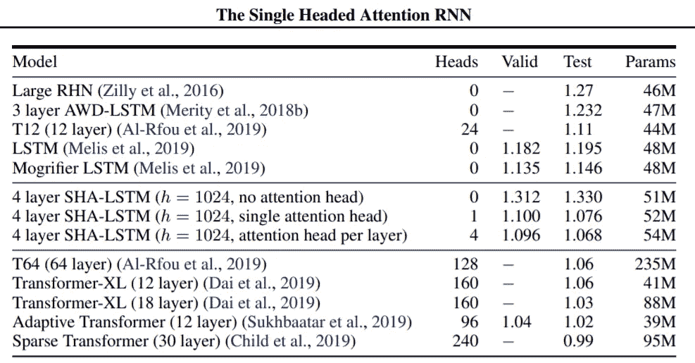

# NLP/SHA-RNN 怎么了

> 原文：<https://medium.com/analytics-vidhya/whats-wrong-with-nlp-sha-rnn-e1e2ae19546?source=collection_archive---------7----------------------->

单头注意力 RNN(斯蒂芬·梅蒂有一个 RNN🤷‍♀️)

在《变形金刚》问世后，任何研究者和实践者都终结了 RNN 及其变体，但作者没有。这项研究让许多认为计算是唯一出路的人大开眼界。SoTA 结果可以在单个 GPU 上 24 小时内实现”，因为作者已经等得不耐烦了😎".

> 虽然看起来不合理，但我不想在某个地方使用云集群，看着美元离开我的银行账户——作者

这篇文章不仅仅是关于架构和实现 SoTA，而是质疑社区的实践和方向，听听作者的话

> 如果在 20 世纪后期，小型机步履蹒跚，而大型机胜出，那么我们很可能在谈论不可避免的死胡同，即小型独立机器
> 
> 如果这个模型失败了，我会非常高兴，但是为什么不考虑可能性呢？为什么要像飞蛾扑向灯泡一样挤向一个方向呢？

## 模型架构

让我们开始深入研究这篇论文。*SHA-RNN 由 RNN、基于指针的注意力和带有少量层标准化的“Boom”前馈组成。持久状态是 RNN 的隐藏状态 h，以及从先前的记忆连接的记忆 M。在 200 华氏度的温度下，在桌面大小的烤箱中烘烤 16 到 20 个小时。这就是作者对建筑的准确描述，模糊但精确。*

与 PyTorch 实现相比，本文中的架构有一些不准确之处

> 代码有点可怕。我承认这是一堆垃圾，但这是一堆我知道如何飞行的垃圾——作者

这段代码在性能上做了很好的优化，但是不容易被破译。感谢 Fatemeh Darbehani。

来源:推特

让我们开始研究实验设置，任务包括在给定前 n 个标记的情况下预测序列中的第(n + 1)个标记。

沙-RNN(修正版)

## LSTM +神经缓存

LSTM 的使用方式非常传统，在 LSTM 之前有一个嵌入层，使用神经缓存来自[用连续缓存改进神经语言模型](https://arxiv.org/abs/1612.04426)，这是一项关于改进语言模型的研究，连续缓存存储对(hi，xi+1)，其中 hi 是当前隐藏状态，xi+1 是从 hi 预测的令牌。为了预测在时间 t(ht)给定隐藏状态的词的概率分布，我们使用隐藏向量的缓存作为关键字，ht 作为查询，我们在关键字和查询之间做简单的点积。单词的最终概率由高速缓存语言模型与常规语言模型的线性插值给出。与普通的 LSTMs 相比，这极大地改善了语言建模。

## 注意力分支

本文提出的注意力与《变形金刚》中提出的注意力头略有不同。来自 LSTM 的每个时间步长的当前隐藏状态通过 LR(层归一化)传递到注意分支，以连接到连续的内存缓存(M ),来自主分支的隐藏状态是查询，隐藏状态的连续缓存充当键和值。与传统的隐藏状态相比，通过允许每个隐藏状态关注许多类似的先前状态，这提供了对更长的上下文的访问。我们在键和查询之间做一个简单的点积，对值做加权加法。这里最大的性能提升是，通过使用特别的线性层，我们没有进行任何大的矩阵运算，也没有对连续缓存进行更新(反向传递),这与《变形金刚》中的多头关注形成了对比。

> 为什么我们在注意力层投入这么多工作？有了一个单独的注意力头，我就不会耗尽内存了。通过让内存只写一次，而不像在连续缓存中那样修改，我们避免了大量的计算。生活更简单—作者

## 过度参数化

静态学习向量(嵌入的)在训练期间会移动，但在生产中是固定的。通过在初始隐藏状态、门控机制等中的使用，它们与数百万或数十亿动态产生的向量进行交互。在训练的初始阶段，这些权重变化很大，并且在整个过程中，它们变得接近静态地适合数据集的分布。对于小批量(通常在单 GPU 系统上),我们预计静态学习向量的值在训练期间可能会大幅偏离，这需要许多个时期和一个衰减的学习速率，然后才能在整个数据集上收敛到最佳稳定值。如果模型的维度不是很高，这可能导致历史中的丢失(在更高维度的空间中，模型可以更新很少的位置，并且留下很少的位置来保留历史)。作者通过过度参数化静态学习向量来解决这个问题，而不是破坏性地修改值。模型现在可以选择通过移动模型内的权重来改变最终值。

注意机制中的键和值是连续缓存中的隐藏状态流。每个隐藏状态(v)在进入注意块之前都经过上述计算，在注意块中，当与 Tanh 相乘时，sigmoid 充当无用信息的屏蔽。这一层至关重要，因为在注意力模块中没有其他可学习的参数。

训练后，我们可以用上述等式的静态输出代替 vs，从而删除所有这些参数。因此，这些参数只存在于训练期间，不计入最终模型的参数计数。

## 吊杆层

这一层既新颖又有趣，它类似于《变形金刚》中的前馈层。输入被投影到一个更高的维度，并被投影回原始维度，但是在将向量还原到输入大小时，它被分割成与输入大小相等的长度，并且它们被求和(我们将向量从小(1024)到大(4096)再到小(σ(4 * 1024))，非常新！但是有用。作者还提到用这种方法收敛更快。

来源:推特

## 标记化攻击

这些标记化攻击在语言建模任务中非常常见。一般来说，语言模型的性能是使用交叉熵损失进行基准测试的，但是标记化在计算交叉熵损失时起着主导作用，因为人们可以使用单词级或字符级或类似单词片段标记化的东西，所以我们试图通过用标记的数量(每个标记的交叉熵)归一化交叉熵来克服这一点，但是这还不够，这样做假设所有标记的熵相等，这是不公平的。例如，如果我们回答“谁被杀了？邓布利多还是甘道夫？”对于单词级模型，我们只有一个猜测。然而，单词片段模型具有巨大的优势，因为熵可以主要加载在第一个令牌上(即[D][umble][dore])。教师强制和注意机制很好地利用了这种不一致性，当正确的上下文切换时，该机制可以有效地复制先前未知序列的出现

> 你的模型会找出最糟糕的技巧，找到并利用每一个边缘情况，继续把它搞得一团糟，然后欺骗你认为它在工作。标记化攻击只是一个例子

## 结果和结论

与早期论文中许多仍在发展的变压器模型相比，这些结果将是最先进的。更具体地说，它们很好地证明了竞争应该仍然存在，特别是当语言建模现在形成了许多 NLP 任务使用的预训练的基础时。对于给定的参数计数，单头注意力 RNN (SHA-RNN)在几乎没有超参数调整的情况下获得了很好的结果。仍有希望 LSTM 氏症患者尚未死亡。这是否属实，既是一个工程问题，也是一个研究问题。LSTMs 被迫主要通过递归来表达它们的隐藏状态，限制了它们的表达能力。这种方法是为了解决 RNN 的局限性。

## 参考

 [## 用连续缓存改进神经语言模型

### 我们建议对神经网络语言模型进行扩展，以使其预测适应最近的历史。我们的模型是…

arxiv.org](https://arxiv.org/abs/1612.04426)  [## 单头注意力 RNN:停止用你的头脑思考

### 语言建模的主流方法都痴迷于我年轻时的电视节目——即《变形金刚》和《芝麻街》…

arxiv.org](https://arxiv.org/abs/1911.11423) 

[https://github.com/smerity/sha-rnn](https://github.com/smerity/sha-rnn)