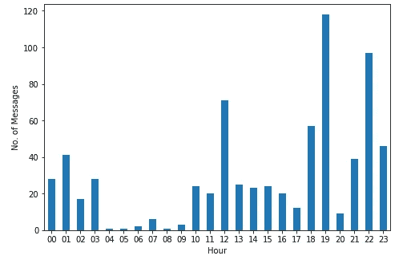

# 使用 Python 的 Whatsapp 聊天分析

> 原文：<https://medium.com/analytics-vidhya/whatsapp-chat-analysis-using-python-88123e63c8ae?source=collection_archive---------4----------------------->

Whatsapp 已经迅速成为世界上最受欢迎的文本和语音信息应用。专注于跨平台消息传递，每月活跃用户超过 15 亿，这使其成为全球最受欢迎的移动信使应用程序。


根据 Whatsapp 官方统计，截至 2018 年 5 月，Whatsapp 用户每天发送 650 亿条消息。平均每分钟有 2900 万条 WhatsApp 信息被发送。

在这里，我们将学习如何使用 Python 及其库开发我们自己的 Whatsapp 聊天分析器。

# 导入必要的库

我们将使用:

1) **Regex(re)** 根据特定模式提取和操作字符串

2) **熊猫**进行分析

3) **Matplotlib** 进行可视化

4) **表情符号**处理表情符号

```
import re
import pandas as pd
import matplotlib.pyplot as plt
import emoji
```

# 从哪里获取数据

第一步:进入你想分析的 Whatsapp 聊天

第二步:点击右上角的 3 个点

第三步:选择导出聊天选项并将其发送给自己

第四步:下载并开始探索

```
file = open(r'./WhatsApp Chat with Manish AG.txt',mode='r',encoding="utf8")
data = file.read()
file.close()
data
```

*注意:在导出数据时，避免包含媒体文件，因为如果媒体文件的数量大于某个数字，则不会导出所有媒体文件。*

在将我们的聊天内容存储在我们的**数据**变量中之后，我们将决定聊天内容的格式

我们的数据看起来像这样:

```
12:24 - Suyash: Hey\n03/01/2020, 12:25 - Manish AG: Hello\n03/01/2020, 12:26 - Manish AG: This message was deleted\n03/01/2020, 12:49 - Suyash: You deleted this message\n03/01/2020, 13:01 - Manish AG: <Media omitted>\n
```

我们将从计算每个发件人的邮件数量开始。为此，我们需要定义一个 regex 模式，将信使姓名与文本数据分开。

```
pattern = re.compile('\d+:\d+\s+-\s+([a-zA-Z0-9]+\s?[a-zA-Z0-9]+\s?[a-zA-Z0-9]+\s?):\s+')
messengers = re.findall(pattern,data)
```

这里，我们使用 regex 的 **()** 符号对所需的 messenger 名称进行了分组。()内的图案和符号的大小可以根据联系人的姓名进行更改。

要理解这个正则表达式模式是如何设计的，需要正则表达式符号的基本知识。供参考:[https://regex101.com/](https://regex101.com/)

# 每个用户的邮件数量

统计每个发送者的消息数量，并将结果存储在字典中。

```
count_messages={}
for each in messengers:
    if each in count_messages.keys():
        count_messages[each]+=1
    else:
        count_messages[each]=1
count_messages
```

输出:

```
{'Suyash': 387, 'Manish AG': 321}
```

现在，为了分别获取消息，我们将对之前用来获取发件人姓名的 regex 模式执行拆分操作。

```
messages_split = pattern.split(data)
messages_split[9:11]
```

输出:

```
['Suyash', 'Okay\n18/11/2017, ']
```

# 清除消息和创建数据帧

清理消息对于获取数据非常重要，在这些数据上可以在将来执行各种 nlp 任务。

*messages_split* 变量包含发件人姓名，后跟他的消息作为下一个索引。因此，我们将来自 *messages_split* 的字符串追加到一个新列表中，该字符串出现在 messneger name 旁边的索引处。消息按用户顺序附加在列表中。首先，来自一个用户的所有消息将被追加，然后是来自其他用户的消息。

```
sep_msgs=[]
for each in count_messages.keys():
    for msg in range(len(messages_split)):
        if each == messages_split[msg]:
            sep_msgs.append(messages_split[msg+1])   #obtaining the message mentioned after sender along with datesprint(len(sep_msgs))   
sep_msgs[7]
```

输出:

```
708
'Waiting\n18/11/2017,'
```

上面的输出是交换的消息总数，它相当于 *count_messages* 字典中的值之和。

此外，我们存储在 sep_msgs 变量中的分离消息在末尾出现了不需要的*\ n【date】*。由于日期从 0、1、2 或 3 开始，因此我们对' \n0 '、' \n1 '、' \n2' & '\n3 '执行拆分，并保存包含所需消息的拆分的第一个元素。

```
cleaned_sep_msg = []
for each in sep_msgs:
    if '\n0' in each:
        cleaned_sep_msg.append(each.split('\n0'))
    elif '\n1' in each:
        cleaned_sep_msg.append(each.split('\n1'))
    elif '\n2' in each:
        cleaned_sep_msg.append(each.split('\n2'))
    elif '\n3' in each:
        cleaned_sep_msg.append(each.split('\n3'))my_msg = []
for each in cleaned_sep_msg:
    my_msg.append(each[0])print(len(my_msg))
my_msg[7]
```

输出:

```
707
'Waiting'
```

最后，我们将消息存储在 *my_msg* 变量中，但是我们注意到消息的数量现在减少了 1。这是因为交换的最后一条消息的尾部没有跟随 *\n【日期】*，因此在执行分割时，不会考虑该消息。所以我们可以在变量 *my_msg* 的末尾单独添加消息。

因为 *messages_split* 变量包含发件人姓名，后跟他的消息作为下一个索引。我们将检查倒数第二个索引，并在 *my_msg* 变量中的适当位置添加遗漏消息。

```
for each in count_messages.keys():
    if messages_split[-2] == each:
        my_msg.insert(count_messages[each]-1,messages_split[-1])
len(my_msg)
```

输出:

```
708
```

这样我们所有的信息都被捕捉到了。

## 创建数据框架

现在，在下面的代码中，我们将创建一个数据帧，以 messengers 作为列名，messages 作为值。

```
who_sent_what = []
prev = 0
for each in count_messages.keys():
    num = count_messages[each]

    nex = num+prev
    messages = my_msg[prev:nex]
    who_sent_what.append(messages)
    prev = nex
who_sent_what
my_df=pd.DataFrame(who_sent_what)
my_df = my_df.transpose()
my_df.columns = [list(count_messages.keys())[0],list(count_messages.keys())[1]]
```

在上面的代码中，我们使用键和它们的值为每个 messenger 分隔了一个消息列表。' *count_messages[each]* '包含来自用户的消息数量。我们使用该信息对 *my_msg* 变量执行切片，变量 *who_sent_what* 将是包含 2 个列表的列表，每个用户一次。

该列表稍后用于创建数据帧。

# 获得洞察力

## 邮件已删除

我们可以查看谁删除了多少邮件。这里我们需要使用'*你删除了这条消息* ' & ' *这条消息被明确删除*，因为发送方&接收方删除的消息没有类似的描述。

```
suyash_deleted = my_df['Suyash'].value_counts()['You deleted this message']
manish_deleted = my_df['Manish AG'].value_counts()['This message was deleted']
print('Suyash deleted '+ str(suyash_deleted) + ' messages')
print('Manish deleted '+ str(manish_deleted) +' messages')
```

输出:

```
Suyash deleted 8 messages
Manish deleted 4 messages
```

## 表情符号计数

我们还可以通过使用一个*表情库和定义一个从消息中提取所有用户表情的函数，来查看哪个用户最常使用哪个表情。我们将使用的函数定义如下。它将按列解析 dataframe 中的每个字符串，并返回一个表情列表。*

```
def extract_emojis(columnname):
    emojis=[]
    for string in my_df[columnname]:
        my_str = str(string)
        for each in my_str:
            if each in emoji.UNICODE_EMOJI:
                emojis.append(each)
    return emojis
```

按用户创建表情数据帧，并提取每个人使用的前 5 个表情。

```
emoji_dict={}
for keys in count_messages.keys():
    print(keys)
    emoji_dict[keys] = extract_emojis(keys)
    emoji_df = pd.DataFrame(emoji_dict[keys])
    print(emoji_df[0].value_counts()[:5])
```

输出:

```
Suyash
😂    92
🏻    13
😇    10
🤣     7
🐒     7
Name: 0, dtype: int64
Manish AG
🤣    28
😂    12
😍    10
😅     8
🏻     6
Name: 0, dtype: int64
```

## 谁发送了更多的媒体消息

由于我们在导入文件时没有包括媒体文件，因此它们在我们的数据帧中用“ *<媒体省略>* ”表示。因此，我们可以查看谁发送了多少媒体文件。

```
suyash_media = my_df['Suyash'].value_counts()['<Media omitted>']
manish_media = my_df['Manish AG'].value_counts()['<Media omitted>']print('Suyash sent ' + str(suyash_media) + ' media files')
print('Manish sent ' + str(manish_media) + ' media files')
```

输出:

```
Suyash sent 79 media files
Manish sent 32 media files
```

## 一天中的哪个小时交换的消息最多？

我们将使用前面使用的相同 regex 模式从数据中获取日期，并通过使用 regex 的 group 方法来分隔小时值。Matplotlib 用于可视化

```
hour_pattern = '(\d+):\d+\s+-\s+\w+\s?\w+?\s?\w+\s?\w+:\s'
hours = re.findall(hour_pattern,data)time = pd.DataFrame({'hours':hours})busy_hours = time['hours'].value_counts()busy_hours.sort_index(inplace=True)
plt.axes([1,1,1,0.98])
plt.grid(True)
busy_hours.plot.bar()
plt.xlabel('Hour')
plt.ylabel('No. of Messages')
plt.xticks(rotation=0)plt.show()
%matplotlib inline
```

输出:



感谢你的阅读，希望你学到了新的有趣的东西！

在 LinkedIn 上和我联系:[https://www.linkedin.com/in/](https://www.linkedin.com/in/suyash-gupta-9b247b154)suya G10