# WhatsApp 聊天📱—分析🔍，可视化📊

> 原文：<https://medium.com/analytics-vidhya/whatsapp-chat-analyze-visualize-68e4d30be729?source=collection_archive---------2----------------------->

> WhatsApp 是当今世界上最受欢迎的即时通讯应用，在全球拥有超过 2B 的用户。每天发送超过 650 万条消息。


你好。我在用 **WhatsApp** 。

在这篇文章中，我将向你展示任何 WhatsApp 聊天工具都可以进行的有趣的分析和可视化。

此练习的完整脚本可从以下位置获得:

[](https://github.com/SinghalHarsh/WhatsApp-Chat-Analysis/blob/master/whatsapp_chat_analysis.ipynb) [## SinghalHarsh/WhatsApp-聊天-分析

### permalink dissolve GitHub 是超过 5000 万开发人员的家园，他们一起工作来托管和审查代码，管理…

github.com](https://github.com/SinghalHarsh/WhatsApp-Chat-Analysis/blob/master/whatsapp_chat_analysis.ipynb) 

## 分析我们自己的数据是如此有趣！相信我！

# 获取 WhatsApp 聊天

```
WhatsApp has a functionality that enables you to download the conversation logs of individual and group chats.
```

> **iPhone** :打开聊天|点击姓名|向下滚动|导出聊天➞ 文本文件
> 
> **安卓**:打开聊天|轻点更多选项*|更多|导出聊天➞ 文本文件*

# *数据准备*

```
*Chat data is in a semi-structured format. Therefore, we need to convert it into a structured format to enable us to analyze and visualize data in a more interpretable way.Each line in a text file follows a specific format:
**[date, time] Author: message**
Using RegEx, we will parse the text file and convert it into a pandas dataframe.*
```

*[**代码**](https://github.com/SinghalHarsh/WhatsApp-Chat-Analysis/blob/master/helper.py)*

*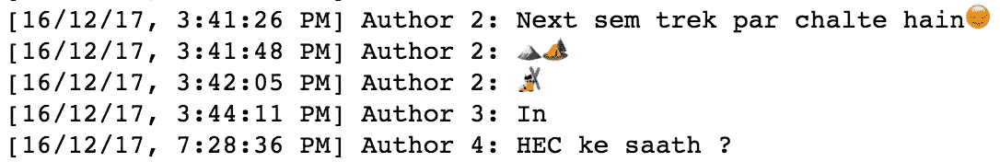**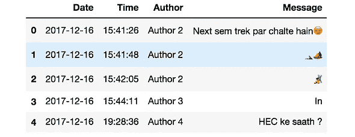*

*文本文件➞熊猫数据帧(使用**正则表达式***

# *探索性数据分析*

> ***首先，一些基本的统计数据***

```
*How many messages have been exchanged?
How many authors are there?
What is the average number of messages exchanged every day?*
```

*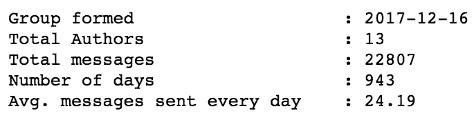*

> ***分析 1:日期时间***

```
*When was the group most active?
Which day of the week, part of the day, an hour of the day has the most number of messages exchanged?*
```

*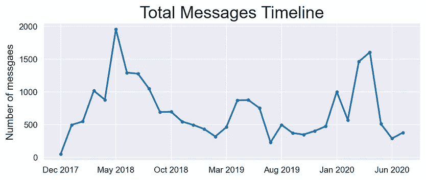**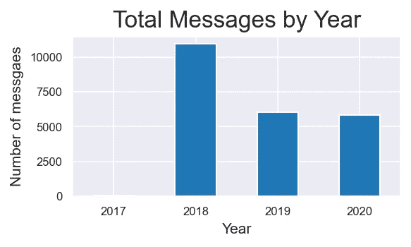**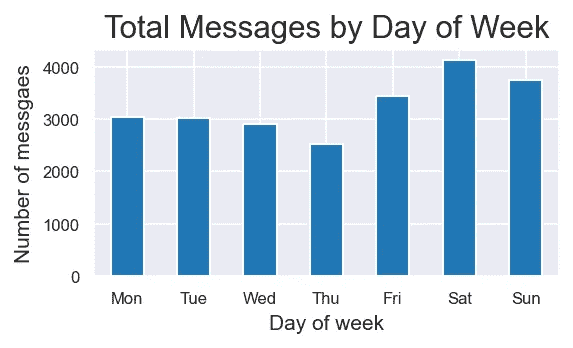*

***右图**:周末🕺*

*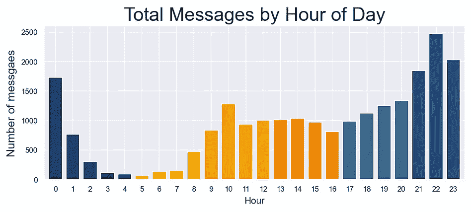**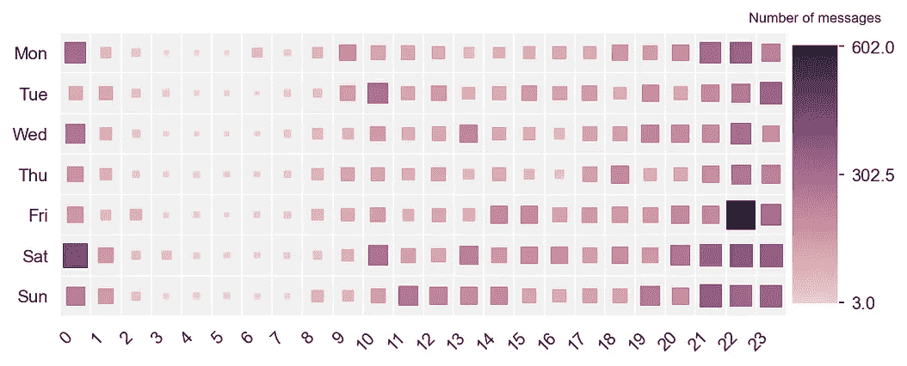*

***左**:猫头鹰🦉👻| **右**:周五晚上🙈*

> ***分析二:作者***

```
*Who is the most talkative?
Whose messages are decreasing with time?
Who sends long messages?*
```

*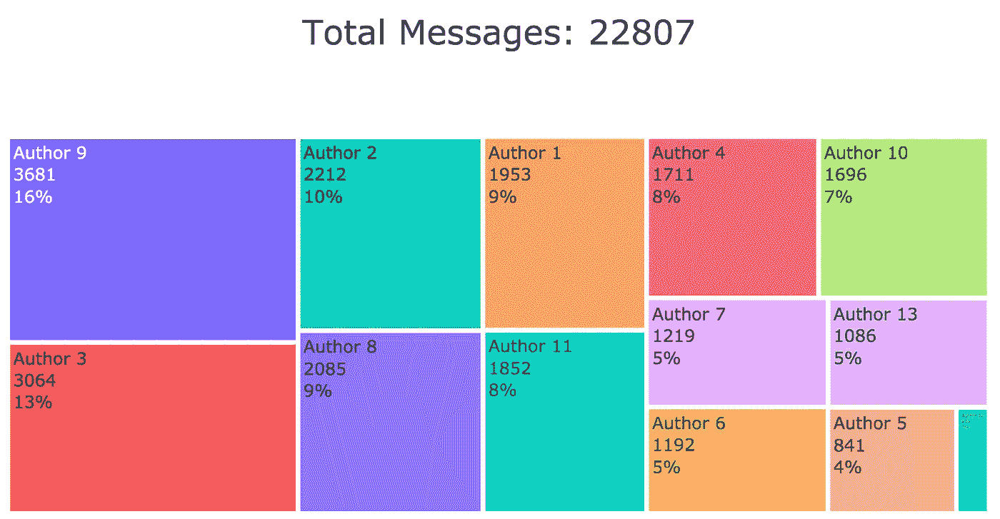**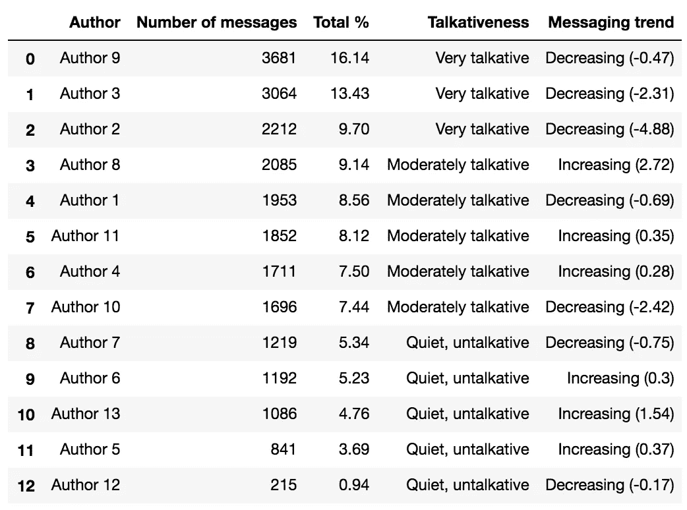**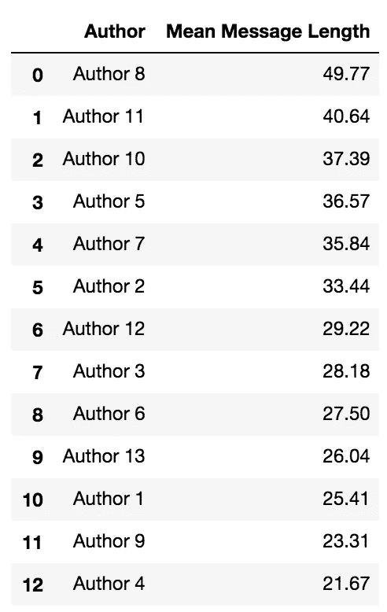****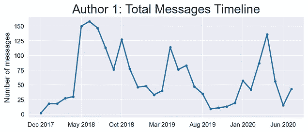**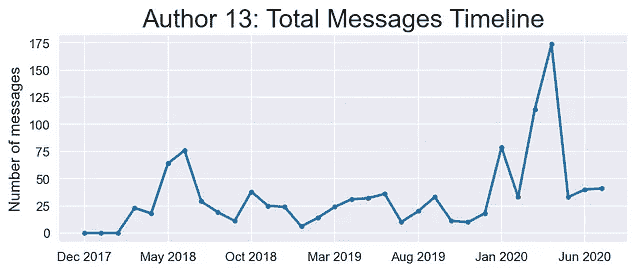*

***左**:全局| **中心**:作者 1 | **右**:作者 13*

> ***分析 3:消息***

```
*What are the most commonly used words in the messages (overall, author-wise)?*
```

*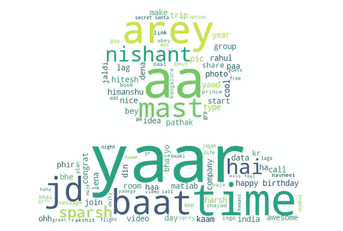**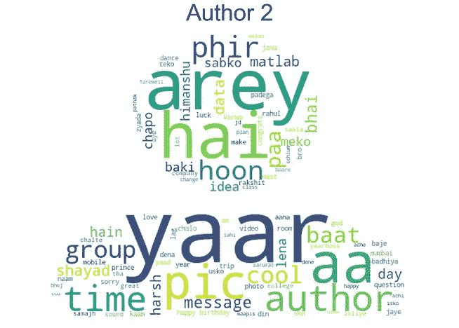**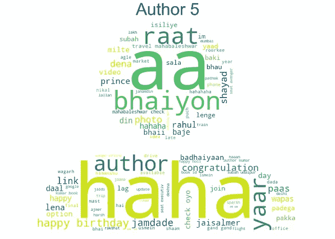*

***左**:总体| **中心**:作者 2 | **右**:作者 5*

> ***分析四:表情符号***

```
*What are the most commonly used emojis (overall, author-wise)?
What is the emoji-to-message ratio for the author?*
```

*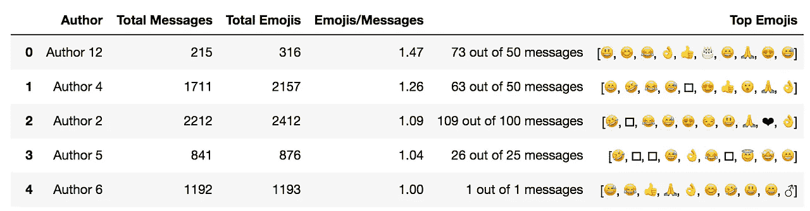**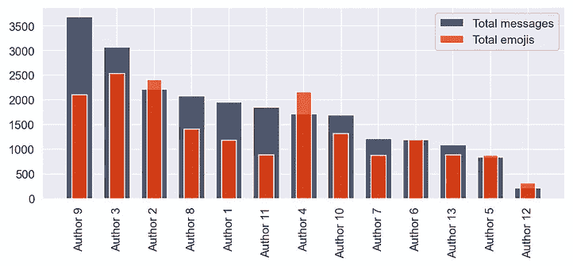*

*‎*

*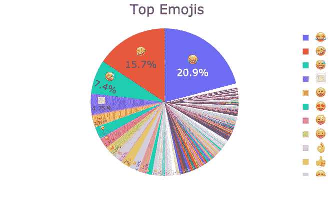**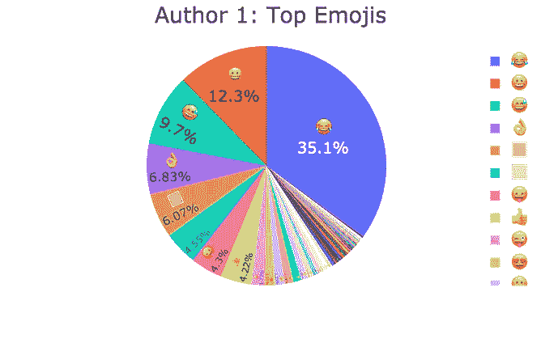**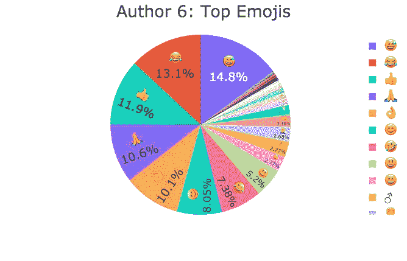*

***左**:全局| **中心**:作者 1 | **右**:作者 6*

> ***分析五:主题***

```
*What is the most common subject of the group?*
```

*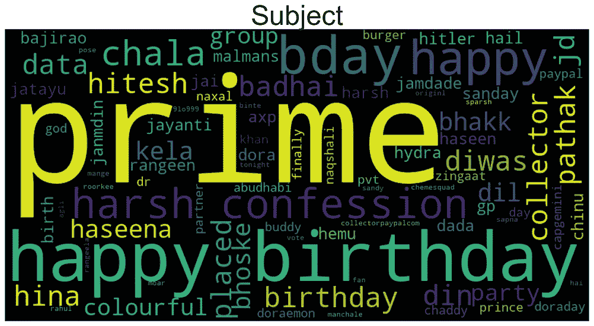***

*13 个质数！！*

> ***分析 6:活跃性***

```
*How many days the group was silent?
Who is the most active author?*
```

*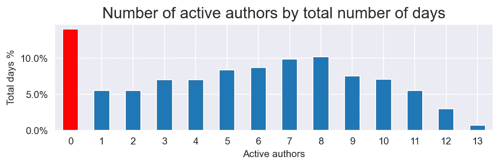*

*‎*

*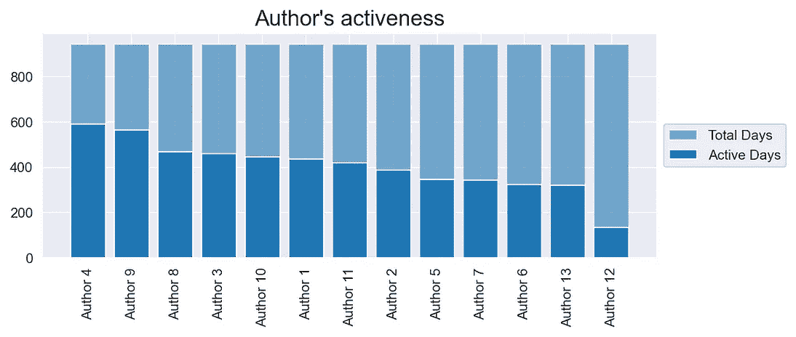**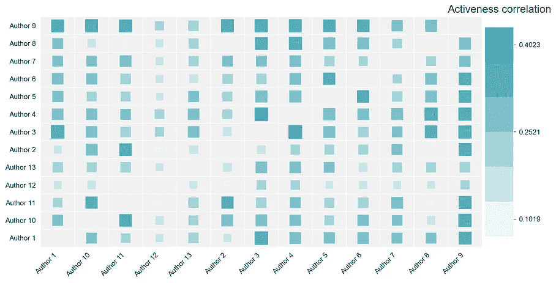*

*‎*

*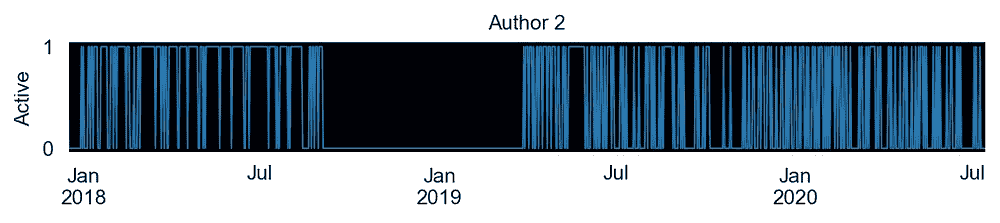**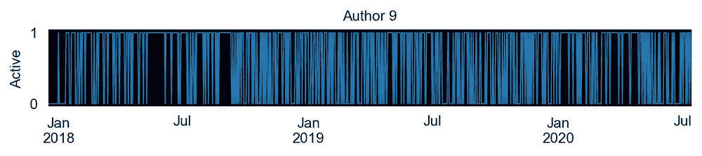*

> ***分析 7:删除的消息***

```
*Which author has deleted the most number of messages?*
```

*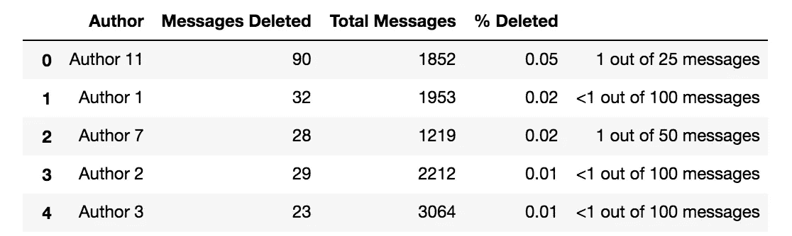*

> ***分析 8:互动***

```
*Whom the author has replied the most?
Who are the top responders to that author?*
```

*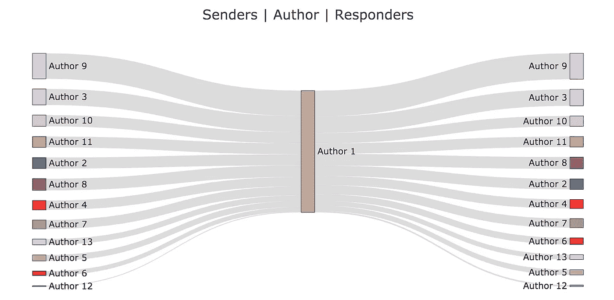*

> ***分析 9:感悟***

```
*Who is the most positive author?
When was the group or the author most happy?*
```

*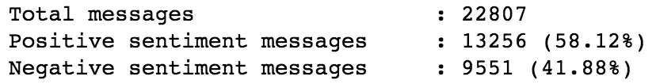**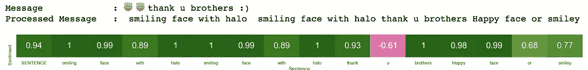*

*左:统计|右:示例*

*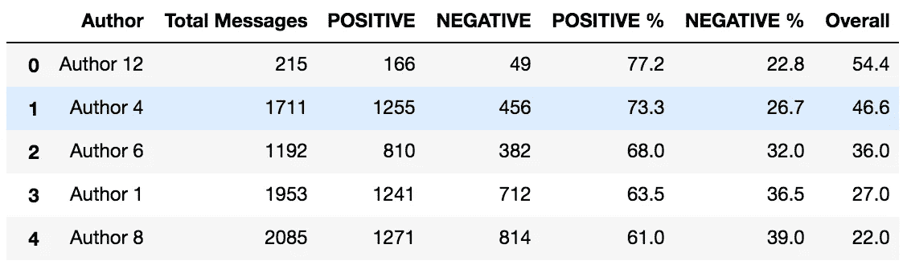**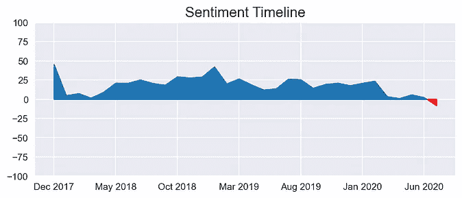**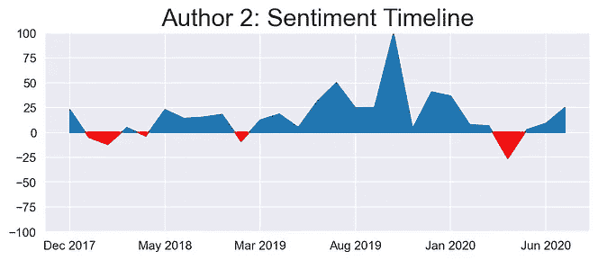**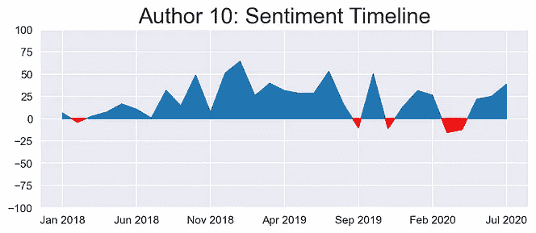*

***左**:总体| **中心**:作者 2 | **右**:作者 10*

# *感谢阅读这篇文章！如果你有任何问题，欢迎在下面留言。*

# *参考资料:*

> ***RegEx:**https://regexr.com/*
> 
> *[https://towards data science . com/build-your-own-whatsapp-chat-analyzer-9590 acca 9014](https://towardsdatascience.com/build-your-own-whatsapp-chat-analyzer-9590acca9014)*
> 
> *https://github.com/PetengDedet/WhatsApp-Analyzer*
> 
> *[https://level up . git connected . com/text-and-opinion-analysis-of-whatsapp-messages-1 eebc 983 a 58](https://levelup.gitconnected.com/text-and-sentiment-analysis-of-whatsapp-messages-1eebc983a58)*