# WhatsApp 群聊分析。

> 原文：<https://medium.com/analytics-vidhya/whatsapp-group-chat-analysis-8f184d3b4586?source=collection_archive---------11----------------------->


WhatsApp 是一款智能手机通讯应用，由雅虎两名前员工布莱恩·阿克顿和简·库姆于 2009 年创立。180 个国家的 20 亿用户使 WhatsApp 成为世界上最受欢迎的消息应用程序。WhatsApp 扩展到专注于生产一种干净快捷、运行完美的聊天服务。他们添加的任何功能，包括可以通过简单的一键实现的语音信息，都是对文本聊天应用核心功能的简单扩展。

印度是世界上最大的 WhatsApp 市场，拥有 3.4 亿用户。每天有近 650 亿条以上的消息通过 WhatsApp 发送，平均每分钟发送 2900 万条消息。


WhatsApp 提供了一个导出聊天内容的选项，我们可以用它来进行分析。建议导出任何群聊进行分析，因为群聊往往比较大。

你会在你的 WhatsApp 聊天(群组/个人)中找到“导出聊天”选项。找到*垂直省略号>更多>导出聊天*。 ***注意:*** *德国不支持此功能。*

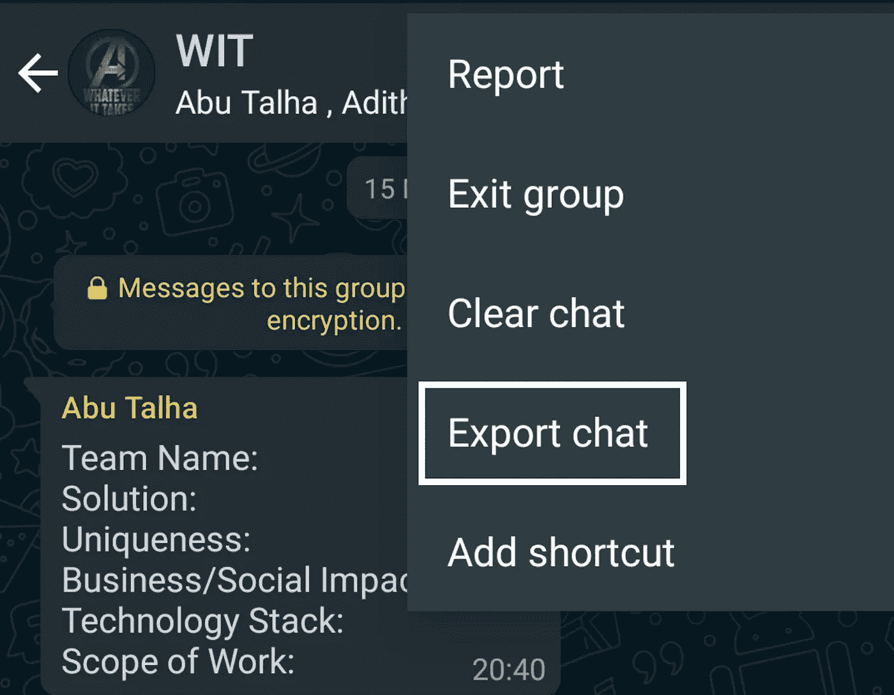

在 WhatsApp 中导出聊天选项

“导出聊天”选项将 WhatsApp 群组对话转换为文本文件(。txt)。一旦转换完成，我就把它分享到我的电子邮件 ID 来做分析。

确保您导出的消息“没有媒体”,因为我们在此分析中不需要媒体文件。使用媒体导出时，您最多可以发送 10，000 条最新消息。没有媒体，你可以发送 40000 条消息。


# Python 库

我用的是 Jupyter Notebook，这是一个开源的 web 应用程序，可以让你很容易地看到中间输出。这些是我在这个分析中使用的几个包。

*   **Pandas** 模块通过创建 DataFrame 来操作数据。
*   **Matplotlib** 是一个可视化库，用于通过可视化方法从数据中生成洞察。
*   **RegEx(re)**RegEx 或正则表达式是构成搜索模式的字符序列。RegEx 可用于检查字符串是否包含指定的搜索模式。Jupyter 笔记本中没有预装 RegEx 模块。使用 Anaconda 提示符下的下面一行来安装该软件包。

```
conda install -c conda-forge regex
```

*   **表情符号**用于处理用户发送的消息中的表情符号。由于表情模块没有预装在 Jupyter 笔记本中，请在 Conda 提示符下运行下面一行来安装包。

```
conda install -c conda-forge emoji
```


# 数据

我导出了一个 WhatsApp 群的聊天记录，该群有 15 名成员，创建于 2017 年 11 月。

我电子邮件中的文本文件看起来像这样。

```
01/02/2019, 06:01 - Siddharth: Good Morning friends!
01/02/2019, 09:53 - Adithya: Do we have class?
01/02/2019, 09:53 - Adithya: Who is the teacher?
01/02/2019, 09:53 - Emma Watson: Akila Ma'am
01/02/2019, 09:53 - Emma Watson: don't be late!
01/02/2019, 10:11 - Adithya: Thank you boy!
01/02/2019, 10:14 - Bala: Where are you guys?
```

*该文件包含从 2019 年 1 月 2 日到 2020 年 7 月 24 日的 40，000 条消息。*

通过查看文件，我们可以看到有 4 个属性—日期、时间、作者、消息。这 4 个属性将是我在熊猫数据框中的列。

***注:*** *艾曼纽在这里伪装成艾玛·沃森。虽然我可以在熊猫中使用****replace()****来更改作者值，但我只是不想失去原创性*😛


# 创建数据帧

这个纯文本文件必须进行标记化，并以有意义的方式解析成上述属性，以便存储在 Pandas 数据帧中。

为了从文本行中检测{Date}和{Time}标记，我使用了正则表达式匹配。这也将表明一行文本是新消息还是属于多行消息。

```
def date(l):
    pattern = '^([0-2][0-9]|(3)[0-1])(\/)(((0)[0-9])|((1)[0-2]))(\/)(\d{2}|\d{4}), ([0-9][0-9]):([0-9][0-9]) -'
    result = re.match(pattern, l)
    if result:
        return True
    return False
```

既然我已经确定了包含带有日期和时间组件的新消息的行，那么消息的下一部分就是检测{Author}标记。作者值取决于您在手机中保存联系人的方式。如果您没有从 WhatsApp 群组保存的联系人，作者值将是他们的手机号码。对于提到的所有约束，下面是 RegEx 模式，它将从文本行中检测{Author}标记。

```
def isauthor(l):
    pattern = [
        '([\w]+):', 
        '([\w]+[\s]+[\w]+):',
        '([\w]+[\s]+[\w]+[\s]+[\w]+):',
        '([+]\d{2} \d{5} \d{5}):'
    ]
    patterns = '^' + '|'.join(pattern)
    result = re.match(patterns, l)
    if result:
        return True
    return False
```

现在我检测到了日期、时间和作者标记，字符串的剩余部分(消息标记)会自动检测。

现在是时候根据分隔符标记(如*逗号*(，)、*连字符* (-)、*冒号*(:)和*空格*()来拆分每一行了，这样就可以提取所需的标记并存储在数据帧中。

```
def DataPoint(line):
    SplitLine = line.split(' - ')
    DT = SplitLine[0]
    DateTime = DT.split(', ')
    Date = DateTime[0]
    Time = DateTime[1]
    Message = ' '.join(SplitLine[1:])

    if isauthor(Message):
        authormes = Message.split(': ')
        Author = authormes[0]
        Message = ' '.join(authormes[1:])
    else:
        Author = None
    return Date, Time, Author, Message
```

最后一步是逐行解析整个文件，并处理多行文本。下面的代码将检查该行是否以日期开始，如果不是，那么它将被认为是一个多行文本。将使用定义的方法提取令牌，并将其存储在列表中。

```
parsedData = []
FilePath = 'WhatsApp Chat.txt'
with open(FilePath) as fp:

    messageBuffer = []
    Date, Time, Author = None, None, None

    while True:
        line = fp.readline() 
        if not line:
            break
        line = line.strip() 
        if date(line): 
            if len(messageBuffer) > 0:
                parsedData.append([Date, Time, Author,' '.join(messageBuffer)])
            messageBuffer.clear() 
            Date, Time, Author, Message = DataPoint(line)
            messageBuffer.append(Message)
        else:
            messageBuffer.append(line)
```

现在是时候使用 Pandas 模块创建一个数据框架了。列表“已解析数据”由来自 WhatsApp 导出文件的所有 40，000 条消息组成，已解析并准备好存储在 Pandas 数据帧中。

```
df = pd.DataFrame(parsedData, columns=['Date', 'Time', 'Author', 'Message'])
```

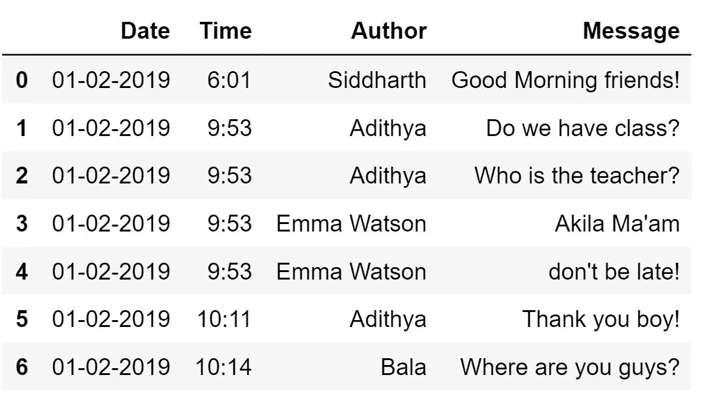

# 丢弃没有作者的邮件

在导出聊天中的所有消息时，WhatsApp 会导出与安全更改、离开群组的人、加入群组的人、群组名称更改等相关的消息。这些消息也将被导出，但没有作者(空值)。有必要删除所有空值数据点，以便进一步进行分析。

```
NoneValues = df[df['Author'].isnull()]
NoneValues
```

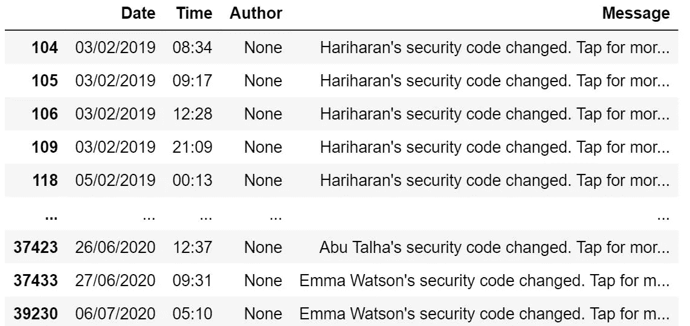

```
df = df.drop(NoneValues.index)
```

*删除数据帧中包含来自空作者的消息的所有行。*


# 分析群组成员发送的消息数量

```
Toppers = df['Author'].value_counts()
Toppers.plot(kind='bar')
```

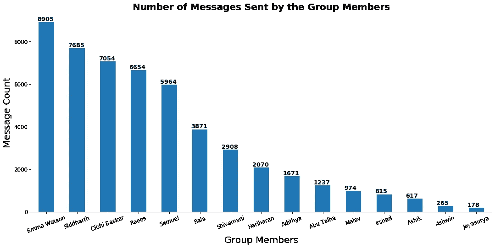

艾玛·沃森无疑是这个小组中最活跃的人。😮


# 分析群组成员发送的媒体消息的数量

虽然从 WhatsApp 导出聊天时不包含媒体，但它将被视为一条消息— *<媒体省略>。有了这些信息，我们可以分析群组成员发送的媒体消息的数量。*

```
MediaValues = df[df['Message'] == '<Media omitted>']
MediaValues
```

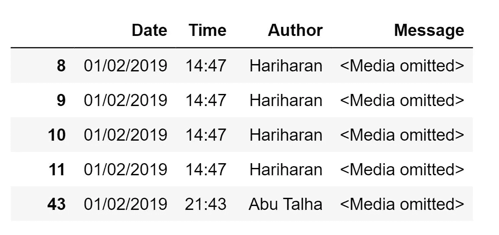

```
MediaTopper = MediaValues['Author'].value_counts()
MediaTopper.plot(kind='bar', color='m')
```

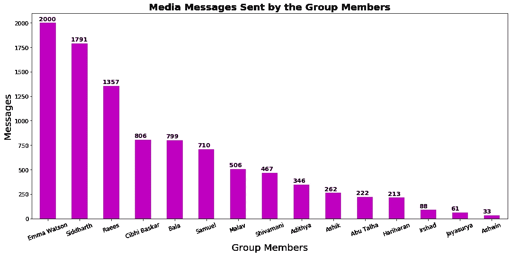

***艾玛·沃森*** *(又名艾曼纽)高居所有排行榜榜首。*😆


# 小组成员最常用的 5 个表情符号

是时候使用表情符号模块来查看小组成员最常用的 5 个表情符号了。这个模块将帮助我们从短信中提取表情符号，然后我们可以将它添加到列表中。

```
emojis=[]
for i in df['Message']:
    my_str = str(i)
    for j in my_str:
        if j in emoji.UNICODE_EMOJI:
            emojis.append(j)emo = pd.Series(emojis)
TopEmoji = emo.value_counts().head(5)
TopEmoji
```

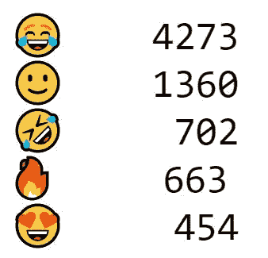

# 邮件总数—今年与去年

去年(2019 年)和今年(2020 年)有很多不同。2019 年，我们在大学里每天都见面，在这个 WhatsApp 群里没有不必要的聊天。但 2020 年是如此的不同，因为冠状病毒疫情的情况，我们处于封锁状态，而这个(西澳集团)是我们所有人保持联系的最佳媒介，就像我们过去一样。

```
df['Date'] = pd.to_datetime(df['Date'], dayfirst=True)# Extracting Year from the Date
YearData = df['Date'].dt.year
TopYear = YearData.value_counts()TopYear.plot(kind='bar', color='purple', width=0.09)
```

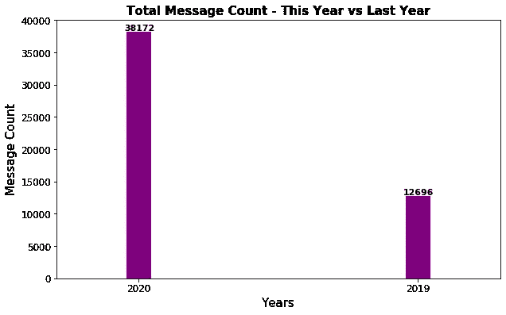

*上图显示，我们在 2020 年使用该 WA 组的次数是 2019 年的 3 倍。*

我们仍然在 2020 年的第 7 个月。😮


# 邮件总数—过去 18 个月

导出的文件包含过去 18 个月的聊天记录，从 2019 年 2 月到 2020 年 7 月。

```
# Extracting Month and Year from Date
df['Month_year'] = df['Date'].dt.to_period('M')TopMonth = df['Month_year'].value_counts()
TopMonth = TopMonth.sort_index()TopMonth.plot(kind='bar', color='salmon')
```

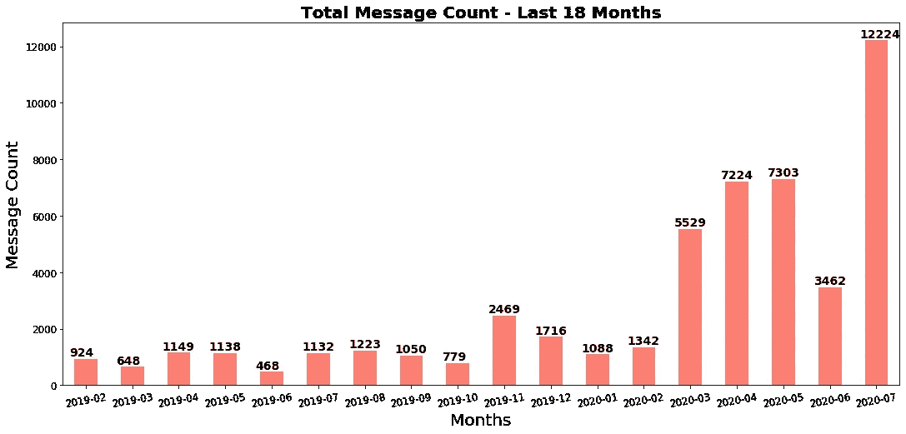

*很明显，从 2020 年 3 月开始，消息数量突然增加是因为封锁。*


# WhatsApp 群组前 25 个活跃日

由于我们从 2017 年开始有这个组，所有前 25 个活跃日都只在 2020 年。

```
TopDate = df['Date'].value_counts().head(25)
TopDate.plot(kind='bar', color='firebrick')
```

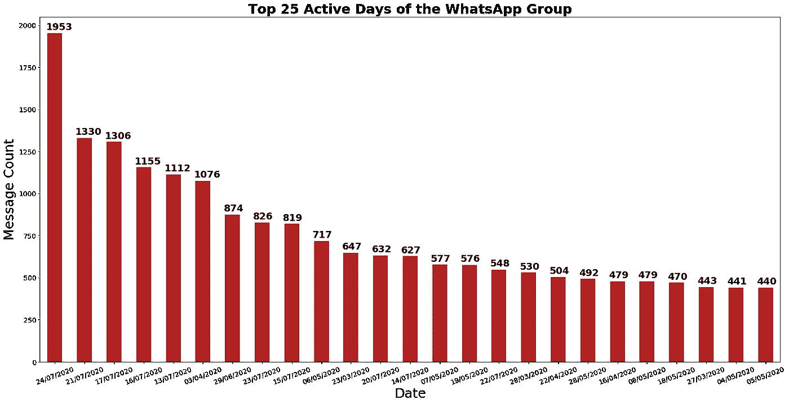

*看起来我们在这个锁定中使用这个 WhatsApp 组太多了！但是，为什么不呢？*😛


# WhatsApp 群组的活跃时间

```
df['Hour'] = df['Time'].apply(lambda a : a.split(':')[0])
TopHours = df['Hour'].value_counts()
TopHours = TopHours.sort_index()TopHours.plot(kind='bar', color='orange')
```

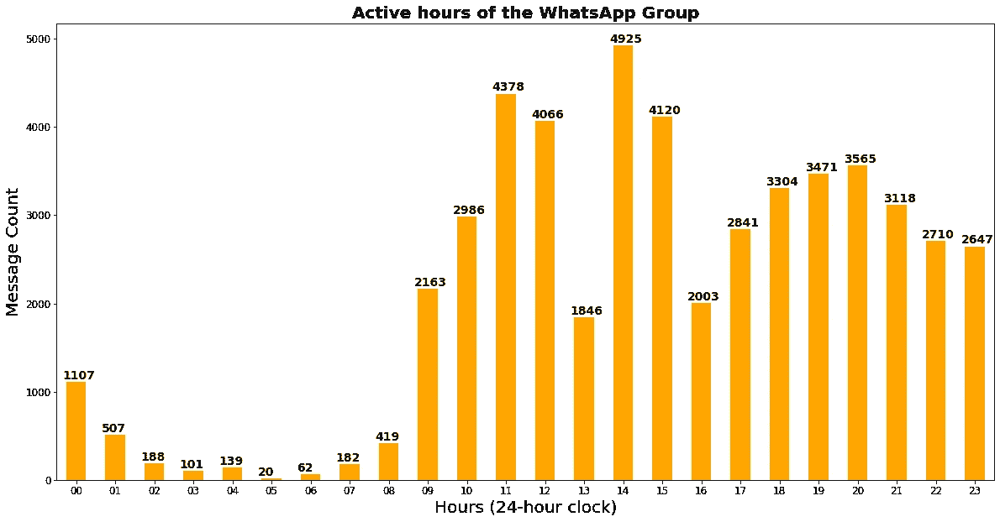

我们全天候营业。🙌


# 从每封邮件中查找字母和字数

深入分析，我提取了一个小组成员使用的字母和单词数。我们不需要这个分析的媒体值，所以我把它从数据帧中删除了。

```
df = df.drop(MediaValues.index)df['Letters'] = df['Message'].apply(lambda s : len(s))
df['WordCount'] = df['Message'].apply(lambda s : len(s.split(" ")))
```

## 分析哪个小组成员的字母和单词数最多

```
GroupedData = df.groupby(['Author']).sum()
LetterGroupedData = GroupedData.sort_values(by=['Letters'])
WordGroupedData = GroupedData.sort_values(by=['WordCount'])
```

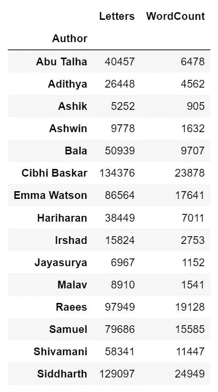

```
LetterGroupedData['Letters'].plot(kind='bar', color='hotpink')
```

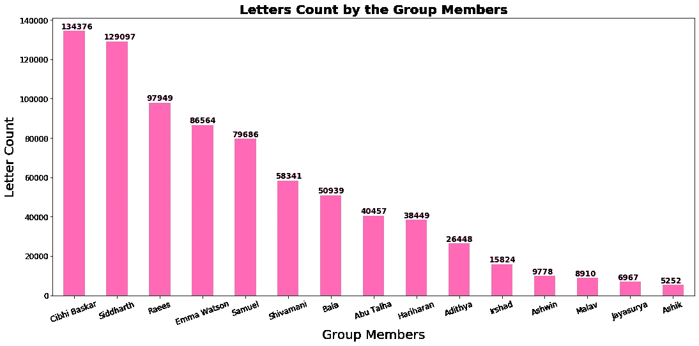

```
WordGroupedData['WordCount'].plot(kind='bar', color='teal')
```

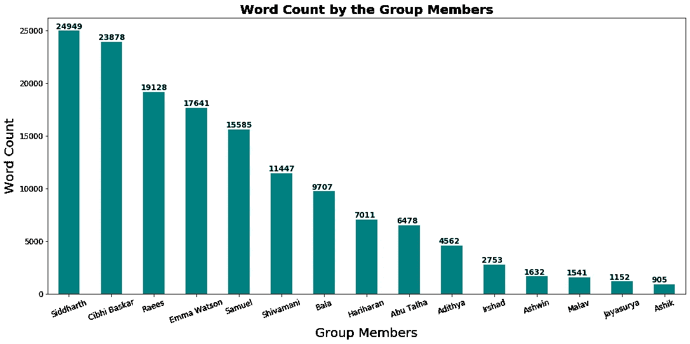

感谢大家阅读并深入了解我的 WhatsApp 群。

前往我的 GitHub Repo 查看 Jupyter 笔记本:[*https://github.com/CibhiBaskar/WhatsApp-Chat-Analysis*](https://github.com/CibhiBaskar/WhatsApp-Chat-Analysis)

*在 LinkedIn 上联系我【www.linkedin.com/in/cibhi】[](http://www.linkedin.com/in/cibhi)*

****注:*** *所有数据可视化代码行只是为了理解。查看我的 Jupyter 笔记本，看看完整的代码。**