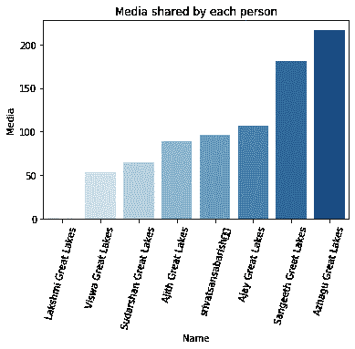
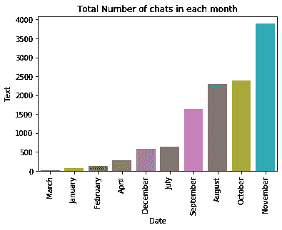

# 使用 Python 探索 WhatsApp 群聊

> 原文：<https://medium.com/analytics-vidhya/whatsapp-group-chat-analysis-using-python-91d1f49178cb?source=collection_archive---------10----------------------->

难怪社交媒体每天都会产生大量信息。Whatsapp 已经成为最受欢迎的消息平台之一，每天有 650 亿条消息被分享。全球超过 10 亿人、印度近 4 亿人每天都在使用 WhatsApp。每条信息都是以文本形式生成的，在 WhatsApp 中分析文本信息是一项复杂的任务，因为它涉及众多因素和限制。

数据科学家使用通常称为文本挖掘的过程来分析文本，该过程将原始或非结构化数据转换为一些有意义的信息，这些信息可以为业务带来洞察力，并从中做出更好的决策。

现在我们就来看看如何分析这篇文章中的 Whatsapp 群聊。这个又酷又有趣的项目可以帮助我们学习很多有趣的东西，分析很多有趣的事实，比如:

> -每个人发送的消息数量
> 
> -谁发送的媒体文件和表情符号最多😂
> 
> -一天中的哪个时间🕒用户更加活跃
> 
> -常用词
> 
> 哪个月生成的消息数量最多，等等。


要提取群聊内容，请遵循以下步骤

1.转到您的 WhatsApp 群，点击选项-更多

2.导出聊天内容—无媒体—通过电子邮件发送

将生成一个文本文件。

> Y **ou 可以在本** [**笔记本**](https://github.com/srivatsansabarish/Projects/blob/master/Whatsapp%20Chat%20Analyser/Whatsapp%20Chat%20Analyser.ipynb) 中获得完整的代码概览

# **数据准备部分**

**安装必要的库**

```
import numpy as np
import pandas as pd
import re
import seaborn as sns
import matplotlib.pyplot as pltfrom wordcloud import WordCloud, STOPWORDS
```

Python 3 总是将文本字符串存储为 Unicode *代码点*的序列。要将这些文本存储为二进制数据，您必须为该文本指定一个*编码*。有许多可用的编码，“utf-8”正成为许多应用程序的首选编码。

```
file = open(‘WhatsApp Chat 3.0.txt’,mode=’r’)
watsup_content = file.read()
file.close()
watsup_content
```

`mode="r”`:以只读模式打开文件。它从文件的开头开始读取，并且是`open()`功能的默认模式。

在文本文件中出现的每个句子的末尾。我们需要使用 split 函数拆分数据，并将其存储到一个变量中。

```
contents=watsup_content.split(“\n”)
```


这里每个聊天都是分开的。现在，我们需要使用各种模式搜索字符串，为了做到这一点，我们可以使用正则表达式找到模式，并将其存储到数据帧中(或)将内容存储到数据帧中，并执行提取部分。

在这里，我们将内容存储到数据框中:

```
df=pd.DataFrame({“data”:contents})
```

一旦创建了数据框架，我们就为数据争论部分做好了准备。

> **从数据列中提取组名**

# 提取组名

首先，我们通过寻找数据中的各种潜在模式来提取组名。

一般来说，组名在于:

1.  将主题从“X”更改为“X”
2.  某人 X 创建了组“X”

现在，我们将使用这两种模式提取组名。

```
df["Group_Name"]=df["data"].str.extract("(created group\s.*|changed the subject from\s.*)",expand=True)
```

提取后，通过删除不需要的文本来清除这些组名。

```
df["Group_Name"]=df["Group_Name"].str.replace("created group ","")df["Group_Name"]=df["Group_Name"].str.replace("changed the subject from ","")
```

有一个问题，除了组名行之外，它会将 Nan 返回给所有其他行，为了处理这个问题，我们使用 ffill 方法。**‘ffill’**代表‘向前填充’，并将向前传播最后一次有效观察。

```
df[“Group_Name”].fillna(method=’ffill’,inplace=True)
```

一般团名看起来像 ***【把主语从“团名 A”改成“团名 B”】***。我们只需要“组名 B ”,因为它包含最后更改的组名。

首先，我们将该列转换为“string”类型，然后使用***“to”***拆分组名，最后提取列表中的最后一个元素。因此我们得到了所有的组名。

```
df[“Group_Name”]=df[“Group_Name”].astype(str)df["Group_Name"]=df["Group_Name"].apply(lambda x:x.split("to"))df["Group_Name"]=df["Group_Name"].apply(lambda x:x[-1])
```

> **从数据列中提取日期**

例如，每一行看起来像 **[** **18/07/19，晚上 8:21—Srivatsan:嗨嗨】**

```
df[“Date”]=df[“data”].str.extract(‘(\d+\/\d+\/\d+)’,expand=True)
```

这里\d 是一个数字(0-9 范围内的一个字符)，+表示 1 次或多次。所以，\d+是一个或多个数字。

> **从数据栏中提取时间**

时间看起来是这样的**【晚上 8 点 21 分】**

```
df[“time”]=df[“data”].str.extract(‘(\d+\:\d+\s\w*)’,expand=True)
```

**\s** -空格和 **\w** -查找单词字符

**“*”**代表 0 次或更多次。因此它将查找长度为 0 或更长的单词字符。


> **从数据栏提取聊天和用户名**

```
df[“Name”]=df[“text”].str.extract(“(-\s\w*.*:)”,expand=True)
df["Text"]=df["text"].str.extract("(:\s\w*.*)",expand=True)
df["Word_count"]=df["Text"].apply(lambda x:len(x))
```

**例如:[** **- Srivatsan : Hey hi ]，**这是聊天和用户名的样子，所以我们提取名称部分，直到“:" and after:”可以提取聊天部分。提取姓名和聊天信息后，使用 replace 从相应的列中删除标点符号。生成文本列后，创建一个名为 word count 的列，这将在分析数据时派上用场。


> **将日期列转换为日期时间格式**

除非转换为日期-时间格式，否则我们无法使用日期执行其他基于序列的操作。下一步是将时间列转换为 24 小时格式，以便我们可以在后面的阶段轻松地进行分析。

```
df[‘Date’] = pd.to_datetime(df[‘Date’], format=’%d/%m/%y’)df["Time"] = pd.to_datetime(df['time']).dt.strftime('%H:%M')
```


> **检查聊天中是否有表情符号**

WhatsApp 里用的最多的一个东西就是表情符号。比起发短信，许多人更倾向于使用表情符号来更好地表达他们的感受。

```
df[“Emoticons”]=df[“Text”].apply(lambda x:re.findall(r’[\U0001f600-\U0001f650]’, x))
df["Emoticons_count"]=df["Text"].apply(lambda x:len(re.findall(r'[\U0001f600-\U0001f650]', x)))
```

在这个 Unicode 序列范围内，有多个表情符号字符。


> **检查是否有任何媒体存在**

在这里，媒体文件被列为“省略的媒体”,因此我们将检查任何一行是否包含省略的媒体。下面的代码返回布尔输出。

```
df[‘Media’]=df[‘Text’].str.contains(‘<Media omitted>’)
```

> **现在，数据帧已经完全清理完毕，所有必需的列都已提取。让我们继续分析和可视化部分。**

> **每人发送的表情数量**

```
emoji=df.groupby([“Name”])[“Emoticons_count”].sum().sort_values()sns.barplot(x=’Name’, y=’Emoticons_count’, data=emoji,palette=”RdPu”).set_title(‘Number of emoticons sent by each person’)
plt.xticks(rotation=75)
```


同样，以同样的方式，我们可以从中收集各种见解。

> **最常用的表情符号**

用户倾向于在聊天中使用大量表情符号，因为表情符号更有吸引力。这是表达我们感情的好方法。

```
emo=df.Emoticons.apply(lambda x: pd.value_counts(x)).sum(axis = 0)
```

#过滤前 10 个常用表情符号

```
emo=emo.sort_values(ascending=False).head(10)
```


最常用的表情符号

> 这里我们可以看到人们倾向于使用😂表情符号很多。

> **每个用户的总聊天次数**

```
Message=df.groupby(“Name”)[“Text”].count().sort_values()
```


> **每人总字数**

正如我前面提到的，当我们想要找出哪个用户使用了最多的单词时，单词计数列是很有用的。

```
Text_len=df.groupby([‘Name’])[‘Word_count’].sum()
```


> **常用词**

在词云的帮助下，我们可以直观地表示经常使用的词。文本的大小取决于特定单词的出现频率。

```
from wordcloud import WordCloud, STOPWORDSimport matplotlib.pyplot as plttext = df[“Text”].valueswordcloud = WordCloud( width = 3000,height = 2000,background_color = ‘white’,stopwords = STOPWORDS).generate(str(text))fig = plt.figure( figsize = (20, 10),facecolor = ‘k’,edgecolor =‘k’)
plt.imshow(wordcloud, interpolation = ‘bilinear’)
plt.axis(‘off’)
plt.tight_layout(pad=0)
plt.show()
```


这不是一个原始的聊天图像，它只是一个例子

> **每人分享的媒体**

```
Media=df.groupby(“Name”)[“Media”].sum().sort_values()
```



> **每月分享的媒体量**

`Series.dt.strftime()`函数将给定系列对象中的日期转换为指定的格式。

例如:Date = " 2020–05–01 "

```
df["Date"].strftime('%B *%d*, %Y')
**output:**
'May 01, 2020'
```

这里我们只需要从日期列中提取月份，并按它分组。

```
month_media=df.groupby(df[‘Date’].dt.strftime(‘%B’))[‘Media’].sum()
```


> **每月聊天总次数**

```
month_text=df.groupby(df[‘Date’].dt.strftime(‘%B’))[‘Text’].count().sort_values()
```



> **哪个时间段比较活跃**🕒

```
df[‘Time’]= pd.to_datetime(df[‘Time’])
df[“Time”].dt.hour
hour_text=df.groupby([df[“Time”].dt.hour])[“Text”].count().sort_values()
```


**显示用户在晚上 8 点到 12 点之间更活跃**

# C **结论**

在这篇文章中，我分享了我分析 Whatsapp 聊天的方法。请随意使用这种方法和代码来分析许多其他见解，或者根据您的假设和目标创建更多属性。我们还可以在这里使用情感分析来找出用户的情绪状态或观点，如积极、消极、悲伤、愤怒、喜悦、恐惧等。

但是与英语相比，情感分析在印度地方语言中有其自身的局限性。单词和拼写的用法因人而异，许多人使用非正式文本，这使得这更具挑战性。

因此，Whatsapp 聊天分析器有许多好处，可以收集各种有趣的事实，了解参与者的心理状态。换句话说，它在我们的数字生态系统中有着重要的地位和作用。

感谢您阅读这篇文章。快乐学习！

在 Linkedin 上联系我。