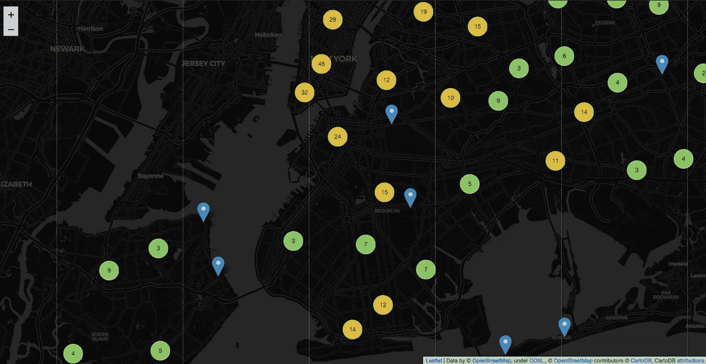

# 当仅有地址还不够时

> 原文：<https://medium.com/analytics-vidhya/when-addresses-alone-are-not-enough-35da9b37bbea?source=collection_archive---------6----------------------->

## Python 中的地理编码和反向地理编码


代表 ArcGIS 网站地理编码内容的漫画:[https://developers . ArcGIS . com/assets/img/features/features-hero _ geocoding . png](https://developers.arcgis.com/assets/img/features/features-hero_geocoding.png)

在之前的一个项目中，我试图预测一家餐厅是否会获得纽约市健康和心理卫生部门的 A 级检查，我的一个想法是:如果能看到一些餐厅因严重违规而被传讯的区域，看看是否有一种模式，这不是很好吗？违规越严重，餐厅获得 a 的机会就越小。但是，用于项目的数据集不包括经度和纬度坐标，而这是在地图上绘制位置所必需的。然后我听说了地理编码，这个问题的解决方案。

# **什么是地理编码？**

根据谷歌地图地理编码 API 的[网站](https://developers.google.com/maps/documentation/geocoding/start):

> **地理编码**是将地址(如街道地址)转换为地理坐标(如纬度和经度)的过程，您可以使用地理坐标在地图上放置标记或定位地图。

既然有把地址转换成坐标的方法，那就一定有逆向工作，把坐标转换成地址的方法。这叫做**反向地理编码。**这里我将重点介绍地理编码，但同样的步骤也可用于反向地理编码。

# 地理编码是怎么做的？

现在我们了解了什么是地理编码，下一个大问题是:地理编码是如何完成的？答案是:地理编码器！

**地理编码器**是一个软件或网络服务，由一个参考数据集和一个算法组成，实现将地址转换为经度和纬度坐标的过程。有多种地理编码器可用，如 ArcGIS、Google Maps 地理编码 API、TIGER(美国人口普查)和 Nominatim(使用 OpenStreetMaps 中的数据)。

但是使用哪一种地理编码器最好呢？选择地理编码器取决于数据和经验。有几种方法可以测试地理编码器，以了解哪种方法符合您的目的，例如单独使用每个地理编码 API。作为一个新手，我决定使用一个可以访问各种地理编码器的库。

# GeoPy 用于地理编码的 Python 解决方案


GeoPy 网站上的 logo:[https://geo py . readthedocs . io/en/stable/_ images/logo-wide . png](https://geopy.readthedocs.io/en/stable/_images/logo-wide.png)

正如他们的文档中所描述的， **GeoPy** 是一个 Python 包，作为一个客户端来提供对 web 上一些最流行的地理编码器的一致访问。对于那些熟悉使用数据库的人来说，这个包类似于使用 Python 驱动程序来访问 MySQL(即 mysql 连接器)或 PostgreSQL 数据库(即。psycopg2)。

> Geopy 使 Python 开发人员能够使用第三方地理编码器和其他数据源轻松定位地址、城市、国家和地标的坐标

最好的部分是它与 Pandas 配合得很好，这对批量地理编码真的很有帮助(想象一下你有一个很大的地址列表，批量地理编码比转换单个地址更高效)。

# 与地质公园和熊猫一起工作

了解一个包的最好方法就是直接投入进去。回到我开始研究地理编码的原因，我决定使用我之前项目中的纽约餐馆检查数据来试验 GeoPy。对于那些对这个迷你项目的完整代码感兴趣的人，可以在 Github [这里](https://github.com/lasoya/Restaurant_Inspections_Map)获得。

1.  首先，**使用 pip** — ***安装 GeoPy。***

2.接下来，**清理数据**。对于 Pandas 的批量地理编码，这也涉及到将地址隔离到它自己的列中。

***这一步为什么重要？***

嗯，如果地址中的拼写有差异，或者地址中单词的顺序有差异，这可能会导致错误。因为每个地址都与后端参考表上的条目进行比较，所以如果地址的格式与表上的条目不同，则不会对其进行地理编码。

3.既然数据是干净的，地址也是独立的，是时候通过地理编码器运行它了。由于这是我第一次进行地理编码，对于这个迷你项目，使用了默认的地理编码器。但是，也可以使用其他地理编码器。

*   每个地理编码器都使用自己的参考数据集。如果一个地理编码器没有产生任何结果，尝试另一个地理编码器可能会解决问题。例如，当我使用 nomist 对地址进行地理编码:“1057 LEXINGTON AVENUE MANHATTAN NY 10021”时，出现了一个错误，即没有找到该地址。然而，当我在谷歌地图上查找时，却发现。

以下是使用 GeoPy 和 Pandas 进行批量地理编码的通用代码:

```
# import modules from geopy library
from geopy.geocoders import Nominatim
from geopy.extra.rate_limiter import RateLimiter

# create an instance of the geocoder
geolocator = Nominatim(user_agent="inspections_locations")

# create an instance or geocoder object with rate limit implemented
geocode = RateLimiter(geolocator.geocode, min_delay_seconds=1, max_retries=0)

# create a new column in dataframe for storing the location details from geocoding
df['LOCATION'] = df['ADDRESS'].apply(geocode)

# create a new column called POINT and fill column with coordinates as tuple pulled from the Location column
df['POINT'] = df['LOCATION'].apply(lambda LOC: tuple(LOC.point) if LOC else None)
```

*   正如您可能在上面的代码片段中注意到的，使用了 RateLimiter 对象。这是因为批量地理编码会淹没地理编码服务，其容量与任何 API 相同。为了防止这种情况，有必要在每个地址或地址子集被处理后增加一个延迟。在这个小型项目中，数据以 100 个子集的形式输入地理编码器，每个地址后延迟 1 秒。
*   重试次数也可以在 RateLimiter 对象下编辑。多次通过地理编码器运行地址可能会延迟整个地理编码过程，这可能是因为难以将地址与一组坐标进行匹配，也可能是因为连接问题。因此，使用这个参数来限制重试次数是很有帮助的，这样可以减少总的花费时间。在这种情况下，我将最大重试次数设置为 0。

最终，在 800 个唯一地址中，有 486 个地址能够转换成地理坐标。不完美，但这些结果对我来说已经足够了。

唷！好了，地理编码步骤到此结束。很简单，对吧？即使是批量地理编码，也只有 3 个主要步骤。

# 正在运行的地理编码结果

现在我有了坐标，我可以创建可视化效果来查看是否有特定区域的餐厅存在更多严重违规行为。为此，我使用了 follow，这是一个 Python 包，构建在名为 fleed . js 的 Javascript 库之上，用于地图可视化。

下面的地图显示了每个餐馆的位置(红色)，似乎显示大多数严重违规的餐馆都在曼哈顿。


使用 flour 创建的地图可视化快照(单个位置)

这方面的另一个视图在下面的地图中，该地图将每个区域中存在严重违规的餐厅位置聚集在一起，以获得更清晰的外观。



使用 follow 创建的地图可视化快照(聚类位置)

然而，这可能是因为大多数餐馆都位于曼哈顿。按区查看餐馆检查的分布，检查最多的区是曼哈顿。


纽约市各区餐厅检查的分布情况

因此，看到曼哈顿的大多数餐馆都有严重违规行为，并不能真正产生在寻找安全就餐地点时应该避开的区域的洞察力。此外，如果一家餐厅有更多的严重违规行为，它不太可能获得 A，尽管在同一次检查访问或随后的检查访问中有严重违规行为，但仍有餐厅获得 A。

尽管没有从该项目中获得很多有用的见解，但这是了解地理编码并了解如何将其用于地图可视化的一个很好的方式。只有通过在这样一个简单的项目中实际尝试，我才能够理解地理编码的一些挑战。

# 资源

 [## 欢迎来到 GeoPy 的文档！- GeoPy 1.19.0 文档

### 编辑描述

geopy.readthedocs.io](https://geopy.readthedocs.io/en/stable/#) [](https://sunnykrgupta.github.io/a-practical-guide-to-geopy.html) [## 守护博客 Geopy 实用指南

### 桑尼·库马尔的文章和文章

sunnykrgupta.github.io](https://sunnykrgupta.github.io/a-practical-guide-to-geopy.html)  [## 快速入门-0 . 9 . 0 文档

### 要创建底图，只需将您的起始坐标传递给 follow:

python-visualization.github.io](https://python-visualization.github.io/folium/quickstart.html#GeoJSON/TopoJSON-Overlays) [](https://deparkes.co.uk/2016/06/10/folium-map-tiles/) [## 树叶地图切片-分离

### 使用不同的地图分块是更改或改善地图外观的好方法。这篇文章向你展示了如何…

deparkes.co.uk](https://deparkes.co.uk/2016/06/10/folium-map-tiles/) [](https://deparkes.co.uk/2016/06/24/folium-marker-clusters/) [## 叶子标记簇-分离

### 标记聚类是简化包含许多标记的地图的好方法。当地图缩小到标记附近时…

deparkes.co.uk](https://deparkes.co.uk/2016/06/24/folium-marker-clusters/)