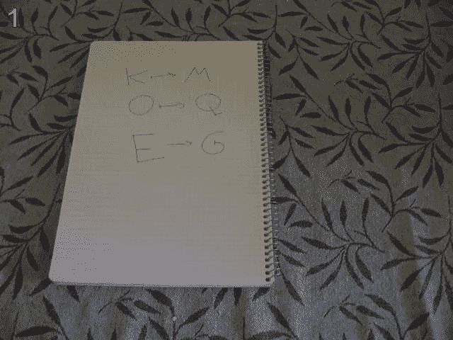

# Python 中的 maketrans()和 translate()在何时何地使用？

> 原文：<https://medium.com/analytics-vidhya/when-and-where-to-use-maketrans-and-translate-in-python-764670ff91fe?source=collection_archive---------4----------------------->

让我们从一个简单的字符串示例开始。

问题:编写一个程序将字符串转换成以下格式。



测试案例:-输入:“ae”输出:“cg”

一般来说，我们编写代码(用 Python3)如下:

```
>>> str1 = "ae"
>>> result = ""
>>> for c in raw:
...     if c >= 'a' and c <= 'z':
...         result += chr(((ord(c) + 2) - ord('a')) % 26 + ord('a'))
...     else:
...         result += c
...
>>> print(f"Output is:{result}")
Output is:cg
```

上述代码背后的逻辑很简单。将输入字符串中的字符转换为 ASCII 值，并将每个字符的 ASCII 值加上+2，然后将 ASCII 值转换回字符，并将所有字符连接起来形成输出字符串。这是我们可以在任何语言中应用的逻辑之一。

上面的逻辑绝对完美无缺，但是在编程的现实世界中，需要一次性替换整个文件中的所有单词/字符。在这种情况下，Python 使用函数 **translate()** 及其助手函数 **maketrans()** 来提供更高效的功能。

> **注:**请有点耐心看完整篇博客。如果你不知道这是什么，请在回复部分告诉我。

# **maketrans( ):**

maketrans()函数用于构造转换表，即指定整个字符串中需要替换的字符列表或需要从字符串中删除的字符

```
Syntax : **maketrans(str1, str2, str3)****Parameters :**
**str1 :** Specifies the list of characters that need to be replaced.
**str2 :** Specifies the list of characters with which the characters need to be replaced.
**str3 :** Specifies the list of characters that needs to be deleted.**->** If there is only **one argument**, it must be a dictionary mapping ASCII Values of integers or characters to ASCII Values of integers or characters or we can directly map with None if we want to delete the characters.
**Ex:** maketrans({'a':'b', 'c':'d'}) or maketrans({97:'b'}) or maketrans({'z':None})**->** If there are **two arguments**, they must be strings of equal length, and in the resulting dictionary, each character in ***str1*** will be mapped to the character at the same position in ***str2***.
**Ex:** maketrans('ac', 'bd')**->** If there is a **third argument**, it must be a string, whose characters will be mapped to None in the result.
**Ex:** maketrans('ac', 'bd', 'z')
Here, a -> b; c -> d; z -> None;**Returns :** Returns the translation table which specifies the conversions that can be used by translate().
```

> 我们可以使用 **help** 函数找到 Python 中 **maketrans** 函数的确切语法。
> 
> **help(str.maketrans)** —将产生 maketrans 函数的定义。
> 
> **help(str.translate)** —将产生翻译功能的定义。

# **translate( )**

**Translate** 函数用于翻译字符串中的字符。该函数使用通过 **maketrans** 函数指定的翻译映射。

```
Syntax : **translate(table, delstr)****Parameters :**
**table :** Translation table, which must be a mapping of ASCII Values to ASCII Values, strings, or None.
**delstr :** The delete string can be specified as optional argument is not mentioned in table.**Returns :** Returns the argument string after performing the translations using the translation table.
```

> 注:感谢您的到来。请继续获取这方面的实践经验。这绝对值得你花时间。如果你不知道这是什么，请在回复部分告诉我。

**代码#1 :** 使用 translate()和 maketrans()进行翻译的代码。

```
# Python3 code to demonstrate translations using maketrans() and translate()str1 = "ae"
table = str.maketrans(
"abcdefghijklmnopqrstuvwxyz", "cdefghijklmnopqrstuvwxyzab"
)
print(table)
result = raw.translate(table)
print(result)
```

输出:

```
{97: 99, 98: 100, 99: 101, 100: 102, 101: 103, 102: 104, 103: 105, 104: 106, 105: 107, 106: 108, 107: 109, 108: 110, 109: 111, 110: 112, 111: 113, 112: 114, 113: 115, 114: 116, 115: 117, 116: 118, 117: 119, 118: 120, 119: 121, 120: 122, 121: 97, 122: 98} cg
```

所以基本上，maketranslate()是为字符串的转换创建一个表。它映射了你在论点中提到的每个字符。

为了简化起见， ***str.maketrans({'a':'b '，' c':'d'})*** 或 ***str.maketrans({'ac '，' bd'})*** 【两者产量相同】将生成一个表，该表映射:

```
a -> b and c-> d,
```

所有其他字符将保持不变。

所以一旦生成了这个表，我们将提供这个表作为 translate()的参数。

```
table = str.maketrans({‘a’:’b’, ‘c’:’d’})
str1 = "acz"
str1.translate(table)Output: bdz
```

如您所见，只有“a”和“c”被替换为“b”和“d ”,而“z”在输出中保持不变，因为在 maketrans()中，我们只指定了“a”和“c”。所以只有 a 和 c 被替换了。

# **不使用 maketrans()进行翻译**

不使用 maketrans()也可以实现翻译。

所以基本上，我们必须创建一个翻译表，其中映射了所有的 ASCII 值。

因为假设‘a’应该被改为‘b’，所以我们指定{97:98}，这意味着‘a’[a 的 ASCII 值=97]被映射到‘b’[b 的 ASCII 值=98]。如果我们能以这种方式生成一个表，那么就没有必要使用 maketrans()函数。

```
table = {97:98, 99:100}
str1 = "acz"
str1.translate(table)Output: bdz
```

所以最后，

> **maketrans()** —用于创建变量之间的映射，
> 
> **translate()** —用于根据提供给它的映射转换字符串。

所以，伙计们，无论谁使用 python，都要利用这些函数，这将减少代码行，并且在编写转换字符串的逻辑时更加复杂。

快乐编码:-)

> ***感谢阅读！如果你喜欢这篇文章，点击下面的按钮👏。这对我意义重大，也有助于其他人了解这个故事。***