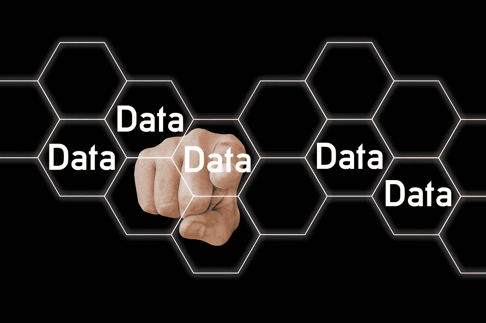

# 机器学习中什么时候用批次，为什么用批次？

> 原文：<https://medium.com/analytics-vidhya/when-and-why-are-batches-used-in-machine-learning-acda4eb00763?source=collection_archive---------2----------------------->

## 机器学习数据集中批次的本质细节

数据

## 介绍

嘿，你在加载数据集的时候有没有碰到过“批处理”这个术语？

不管答案是肯定的还是否定的，今天你将学习批处理，以及为什么你应该考虑在你的机器学习管道中使用它。

不要再拖延了，让我们马上开始吧。

嗯，这个肯定要通过一个例子来说明。

抓紧了，你的故事来了—

你有一个绝妙的想法，要建立一个深度学习模型，从 MRI 扫描中检测脑瘤和其他大脑异常。

创建一家创业公司似乎是个好主意，对吧？

第一件事是收集所需的数据，现在假设您已经完成了这项工作，现在您已经准备好了数据。

现在是了解什么是“批”的时候了。

## 何时以及为什么使用批处理？

在将数据集加载到内存之前，我们有两种选择-

1.您可以一次将整个数据集加载到内存中，也可以

2.你可以把一组样本数据装入存储器

什么都不明白，对吧？让我给你分析一下。

如前所述，你刚刚开始建立你的梦想创业，所以你可能没有高端的 GPU 或 CPU。

你可能有一个巨大的数据集，比如说，一百万张大脑扫描图像。因此，如果您将整个数据集加载到内存中，模型的训练速度将会非常慢，因为您在 CPU 中使用了大量内存，这是非常低效的。

伙计们，别灰心，有更好的方法适合你们。

你可以把你的数据集分成几批，也就是说，如果你有一个包含 10 个大脑扫描图像的数据集，你可以把你的数据集分成两批，每批有 5 个图像，

图像总数= 10

1 批= 5 张图像

所以，一共两批。

(批数*单批图像数=数据集总数)=> (2 * 5 = 10)。

这个孩子的游戏玩够了，让我们变得更大，如果你有一个包含 100000 个图像的大脑扫描图像数据集，我们可以将其转换为 3125 个批次，其中每个批次有 32 个图像。

图像总数= 100000

1 批= 32 张图像

所以，一共 3125 批，(3125 * 32 = 100000)。

因此，与将全部 100000 幅图像加载到内存中(这对计算机来说太昂贵了)相比，您可以加载 32 幅图像(1 批)3125 次，与加载完整的数据集相比，这需要更少的内存。

你应该考虑使用批处理的另一个原因是，当你训练你的深度学习模型而不分割成批处理时，那么你的深度学习算法(可能是神经网络)必须在存储器中存储所有那些 100000 个图像的误差值，这将导致训练速度大大降低。

该模型仅在通过整个数据集之后更新超参数(权重和偏差)。

但是，如果您将 100000 个图像数据集分成包含 32 个图像的批，则模型只需存储这 32 个图像的误差值。

这里，模型在完成每一批后更新超参数。

每 32 张图像(1 批)后，将更新 hyper 参数。

## 基于批量大小的不同梯度下降算法

根据批量大小，有 3 种梯度下降算法:

1.  随机梯度下降

这里，每个数据集行被认为是一个批次，也就是说，如果您有一个包含 1000 个图像的数据集，那么每个图像是一个批次(总共 1000 个批次)，因此像权重和偏差这样的超参数在数据集的每一行之后被更新。

2.批量梯度下降算法

在该算法中，整个数据集被视为一个批次，对于 1000 个图像数据集，只有一个批次，有 1000 个数据(即数据集中的总行数)。

3.小批量梯度下降

在该算法中，批量的大小大于 1 且小于数据集的总大小，常用的批量大小为 32(单个批量中 32 个数据点)。

如果您将所有数据打包在一个批次中，这称为批次梯度下降，如果批次数量等于数据集中的数据点数量，则称为随机梯度下降。最后，如果批数介于 1 和数据集中的数据点总数之间，则称为最小批梯度下降。

## 结论

你必须对批处理有完整的概念，并且你必须能够回答批处理的时间和原因。因此，下次当您加载数据集时，在训练您的模型之前请三思:)