# 当神经网络看到第一张黑洞图像时。

> 原文：<https://medium.com/analytics-vidhya/when-neural-networks-saw-the-first-image-of-black-hole-3205e28b6578?source=collection_archive---------0----------------------->

4 月 10 日，来自视界望远镜团队的科学家和工程师在探索了解宇宙的过程中取得了重大突破，公布了第一张黑洞图像。这进一步加强了爱因斯坦的广义相对论——“大质量物体会导致时空扭曲，这就像重力一样”。

我不是物理学家或天文学家，无法理解和详细解释这个问题，但是和我一样，有成千上万的人，尽管身处不同的领域，却对宇宙，尤其是黑洞着迷。黑洞的第一张照片在全世界引起了兴奋。我是一名深度学习工程师，主要从事卷积神经网络的工作，我想知道人工智能算法对黑洞图片的看法，这篇博客就是关于这一点的。

这段摘自《大纪元时报》的摘录描述了黑洞——黑洞是由“大量物质聚集在一个非常小的区域内”组成的，大部分是由“在超新星爆炸中死亡的大型恒星的残余物”形成的它们拥有如此强大的引力场，甚至连光都无法逃脱。下图是拍摄的 M87 黑洞。据 2 位天体物理学家称，[vox-如何理解黑洞图像在博客中很好地解释了这张黑色图片。](http://How to make sense of the black hole image, according to 2 astrophysicists)

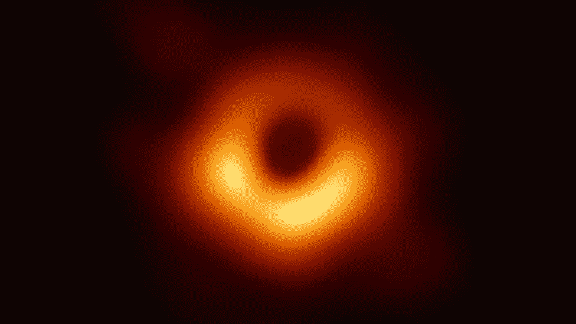

黑洞— M87 —视界望远镜

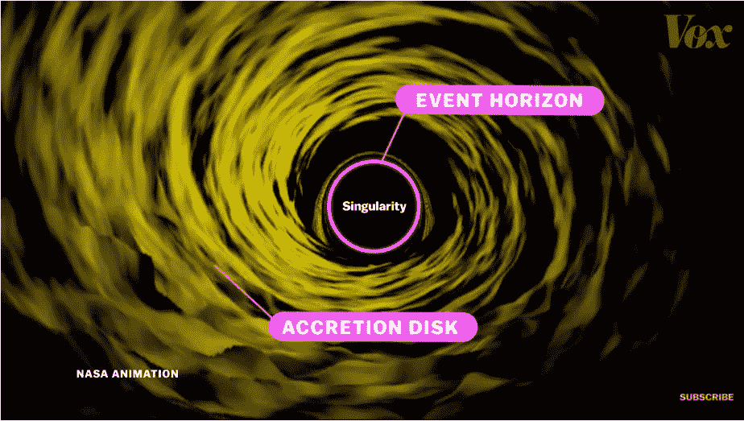

黑洞的不同区域。vox 视频截图— [为什么这张黑洞照片如此重要](https://www.youtube.com/watch?time_continue=379&v=pAoEHR4aW8I)

请访问这篇博文，它展示了解释黑洞图片为什么看起来像[以及如何理解黑洞](http://How to make sense of the black hole image, according to 2 astrophysicists)的很酷的动画。

1.  **CNN 如何看待黑洞图像**

CNN —卷积神经网络是一类深度学习算法，在识别真实世界对象方面非常有效。CNN 是解释和理解图像的最佳神经网络。这个网络在数百万张图像上接受训练，它们已经学会识别近 1000 种不同的现实世界物体。我想到给两个受过训练的 CNN 看黑洞图像，看看他们从图像中解读什么，根据网络，黑洞的图像与哪个真实世界的物体相似。这不是一个聪明的想法，因为黑洞图像是在解释和整合了大量来自太空的不同信号后生成的，但我只是想看看在没有任何其他信号信息的情况下，只有图片的解释是如何的。

VGG 16 网络预测——火柴棍

VGG-19 网络预测——火柴棍

ResNet-50 网络预测— Candle

从上面的图片中我们可以看到，预训练的 vgg16 和 vgg19 预测黑洞图像为火柴杆，而 ResNet50 认为它是蜡烛。如果我们做一些类比，我们可以看到它有一定的意义，因为燃烧的火柴杆和蜡烛都有一个黑暗的中心，周围是强烈的明亮的黄光。

**2。CNN 从黑洞图像中了解到什么特征**

我做的另一件事是可视化 VGG16 的中间层正在生成什么。深度学习网络被称为 Deep，因为它们有许多层，每层都学习输入图像的一些表示和特征。所以让我们看看网络的不同层从输入图像中学到了什么。结果相当漂亮。

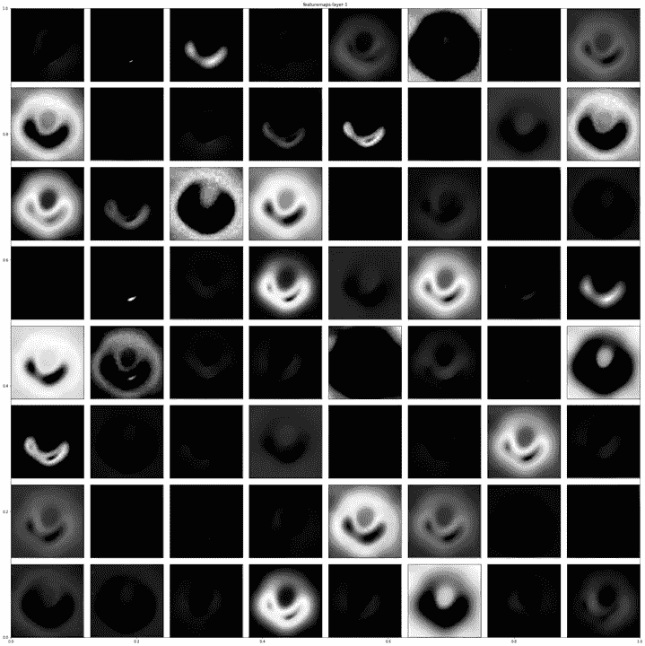

64 vgg 16 第一褶积层特征图

如果你仔细观察，你会发现黑洞较低的明亮区域是一个很强的特征，并且被许多过滤器所学习。一些有趣的过滤器输出如下所示，它们看起来已经像一些天体。

来自第一卷积层的上述 64 个特征图中的 4 个

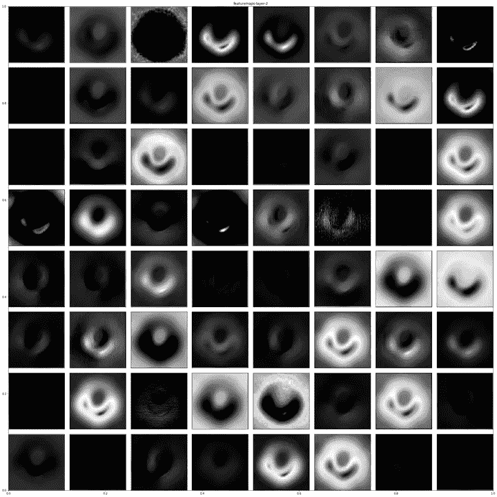

64 VGG-16 第二卷积层特征图

让我们放大到第二卷积层的一些有趣的特征地图。

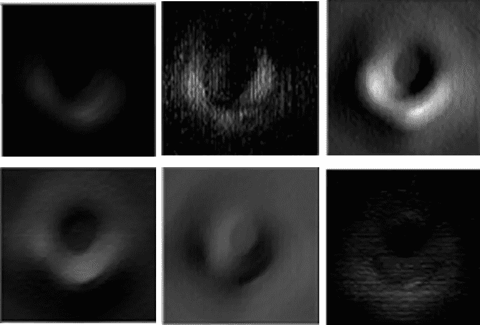

来自第二卷积层的上述 64 个特征图中的 6 个

现在让我们更深入，看看第三卷积层

VGG16 第三褶积层 128 张特征图

放大我们可以看到类似的模式

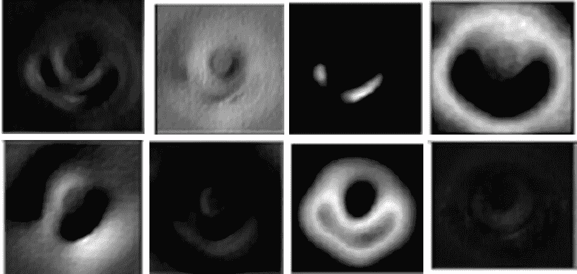

来自第三卷积层的上述特征图中的 8 个

进一步深入，我们得到这样的东西

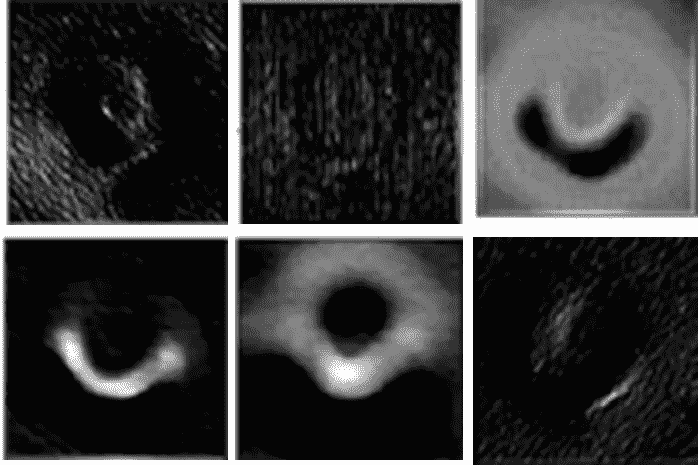

vgg 16 第四卷积层 128 个特征图中的 6 个

随着我们越来越深入，我们获得了更高级别的抽象信息，当我们可视化第 7、8 和 10 卷积层时，我们将只看到高级别的信息。

第七卷积层特征图

正如我们所看到的，许多特征图是暗的，并且只学习识别该类所需的特定高级特征。这在更深层变得更加突出。现在让我们放大，看看一些过滤器。

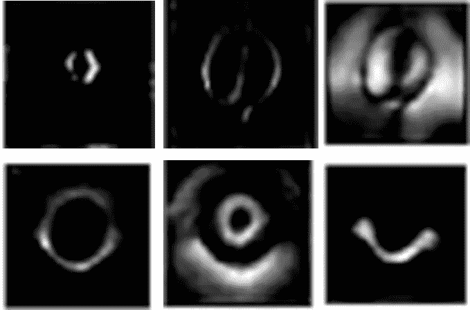

上述特征图中的 6 个

现在让我们看看第 10 卷积层的 512 个特征图

第十卷积层的特征图。大多数过滤器是暗的，并且仅学习识别该物体所需的特定的更高级信息

现在，您可以清楚地看到，在大多数输出特征图中，只有图像的一个区域被学习为特征。这些是神经元看到的高级特征。让我们看看上面的一些稍微大一点的特征地图

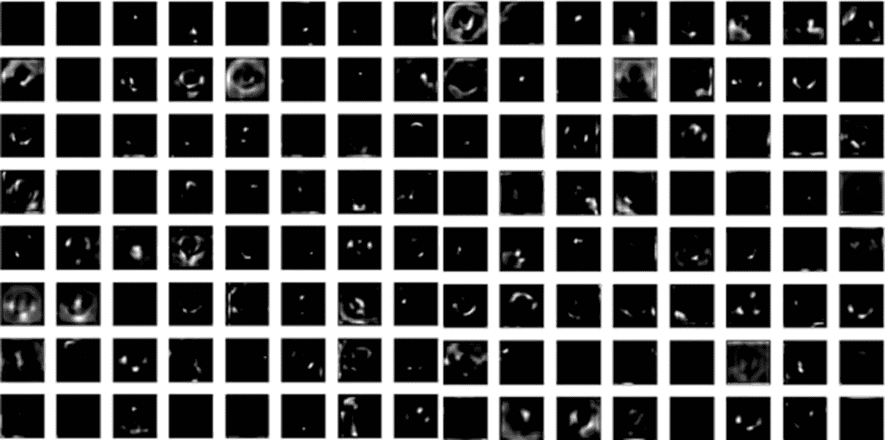

第 10 卷积层的一些特征图尺寸增大。

现在我们看到了 CNN 试图从黑洞图像中学习的东西，让我们试着将此图像传递给其他一些流行的神经网络算法，如神经风格转移和 DeepDream

**3。在黑洞图像上尝试神经类型转移和深度梦境**

神经风格转移是将风格图像的风格转移到源图像并从中生成艺术图像的智能网络。如果没有意义，下面的结果将完全阐明这个概念。我用 deepdreamgenerator.com[网站](https://deepdreamgenerator.com/)从原始的黑洞图像中生成了不同种类的艺术图像。这些照片相当诱人。

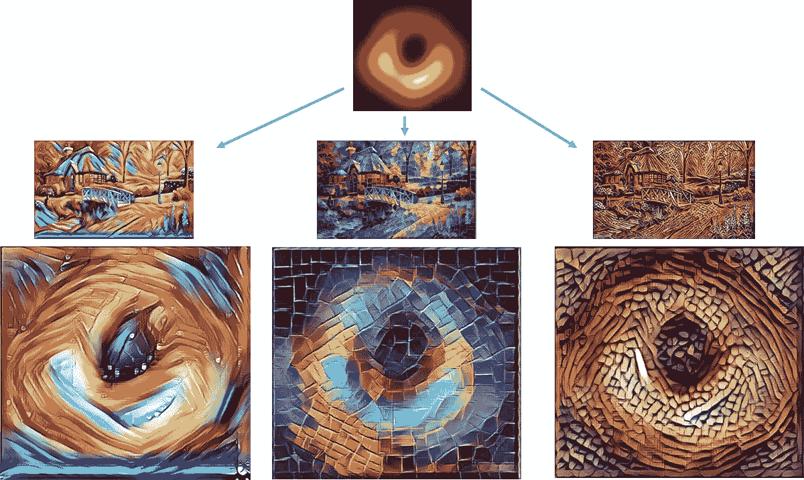

风格转移。它是通过 deepdreamgenerator.com 网站生成的

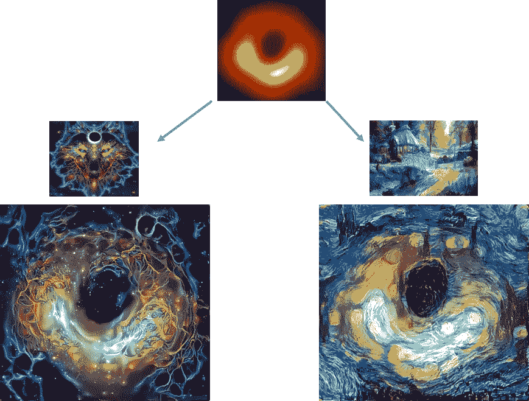

风格转移。它是通过 deepdreamgenerator.com 网站生成的

维基百科中提到的 DeepDream

> DeepDream 是由谷歌工程师 Alexander Mordvintsev 创建的一个计算机视觉程序，它使用卷积神经网络通过算法 pareidolia 来寻找和增强图像中的模式，从而在故意过度处理的图像中创建一个梦幻般的幻觉外观。

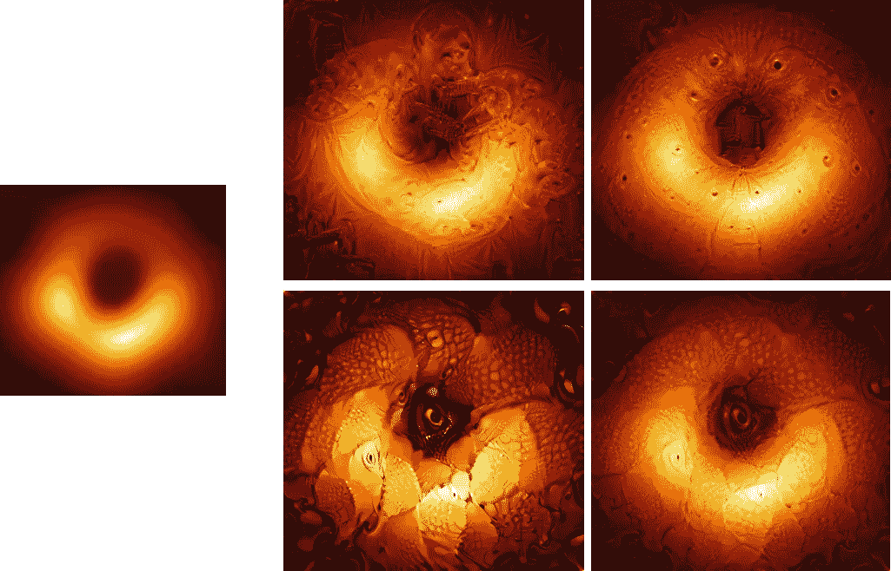

梦很深。它是通过 deepdreamgenerator.com 网站生成的

这个展示深度梦境的视频颇有一种幻觉效果——[深度梦境之旅](https://www.youtube.com/watch?v=SCE-QeDfXtA)

好了，现在就这样了，我很兴奋看到了黑洞的第一张照片，因此有了这篇博文。它可能没有那么有用，但上面生成的图片完全值得。欣赏图片！！