# 你应该什么时候去奥斯陆，应该住在哪里？

> 原文：<https://medium.com/analytics-vidhya/when-should-you-visit-oslo-and-where-should-you-stay-f4e2f2e400ab?source=collection_archive---------9----------------------->

## 使用 Airbnb 数据进行奥斯陆房源市场数据分析

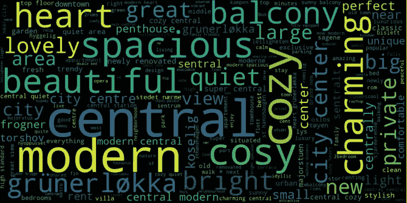

描述奥斯陆的词云

我已经在美丽的奥斯陆生活了大约 6 年。作为一个当地人，我非常乐意写一份建议清单，告诉你住在哪里，什么时候去，做什么。作为一名数据分析师，我很好奇我们能从 Inside Airbnb 提供的奥斯陆房源市场数据中看到什么。你可以在我的 GitHub 库[这里](https://github.com/kimjinhaha/airbnbOslo)找到我获取这些见解的步骤。

我有三个问题要回答，希望这能帮助你计划你的斯堪的纳维亚美丽城市之旅。

1.  *奥斯陆租赁市场这些年有增长吗？*
2.  *人们应该什么时候去奥斯陆？一年中最受欢迎的月份是什么时候，供应情况如何，价格如何？*
3.  在奥斯陆，人们应该住在哪里？我能说说不同社区的位置、价格、可用性和氛围吗？

**首先**，让我们看看奥斯陆上市市场在过去几年是如何发展的。我研究了有多少评论是用来推断奥斯陆上市市场的增长的。

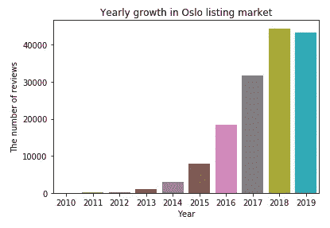

我们看看历年的点评数量，就能看出，房源市场真正腾飞是从 2016 年开始的。尽管 2019 年尚未结束，但与过去几年的快速增长相比，2019 年市场似乎已经稳定下来。

**第二个问题:**人们应该什么时候去奥斯陆旅游？我们能从数据中得出一些关于受欢迎程度、可用性和价格的信息吗？

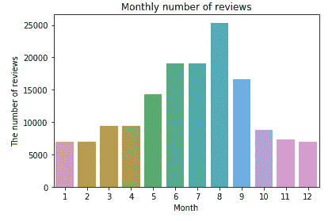

当我们查看过去几个月的评论数量时，**我们可以看到，夏季，尤其是八月，是游览奥斯陆的热门季节。**作为当地人，我可以向你保证，奥斯陆的夏天真的很棒！

那么，在热门的夏季时间里，上市地点的价格和可用性如何？

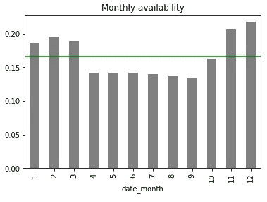

平均每月可用性

上图显示了奥斯陆每月的平均入住率，绿色水平线表示总体平均入住率。在受欢迎的月份(5 月至 9 月)，平均可用率会下降，所以如果人们计划在夏天去奥斯陆，我强烈建议他们提前预订。

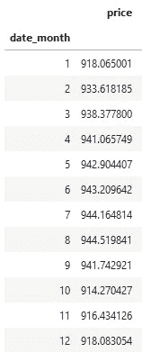

各月的平均价格

当我们比较几个月的平均价格时，我们可以看到在热门月份平均价格是最高的。

然而，考虑到每晚的最低和最高价格差大约是 30 美元，这种差别并不是很大。

最后，人们应该住在奥斯陆的什么地方？我能说说不同社区的位置、价格、可用性和氛围吗？

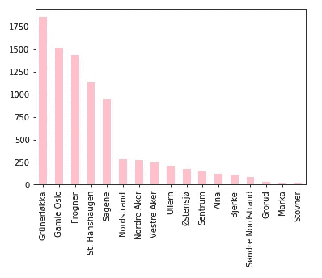

每个街区的列表数量

根据数据集，奥斯陆上市市场有 17 个街区，上图显示了每个街区的上市数量。

grünerl kka、Gamle Oslo、Frogner、St. Hanshaugen、和 **Sagene** 是排名前五的街区。

它们是如何定位的？我们可以看到，Frogner、Sagene、Gamle Oslo、St. Hanshaugen 和 grünerl kka(最多房源的前 5 名)都位于 Sentrum 附近，sent rum 在挪威语中是市中心的意思。

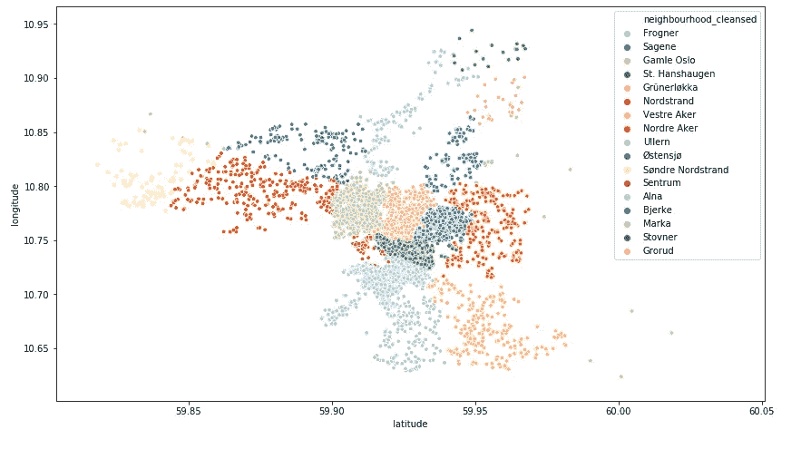

基于经度/纬度的邻域定位

不同小区的物价怎么样？

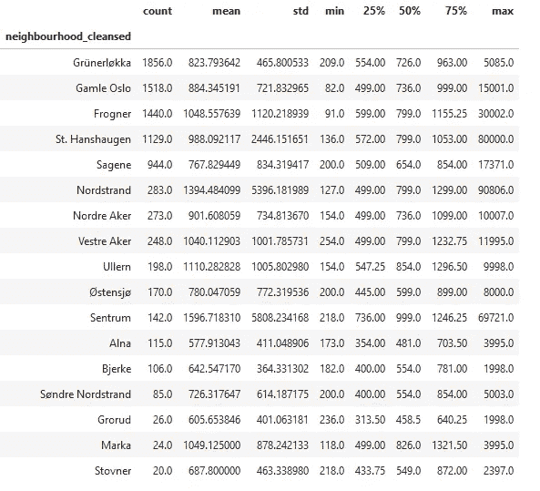

每个街区的价格汇总统计

查看平均价格和中值(50%)价格，我们可以看到，在拥有最多房源的五个街区中，Frogner 是最贵的街区。诺斯特兰德、诺德阿克、乌勒恩、马尔卡的价格似乎也很高

各个小区的可用性如何？

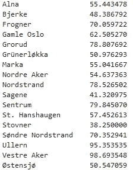

每个街区的平均可用天数

左边的表格显示了一年内每个社区的平均可用天数。

在列出的地方数量排名前五的社区中，grünerl kka 和 Sagene 的可用性最差。

***据 Airbnb 内部人士透露，整栋整栋的住宅或公寓全年对游客高度开放，很可能没有主人在场，可能是非法的，更重要的是，正在取代居民。*** 如果一年中有 60 天以上的地方是可用的，那么它就是高度可用的。

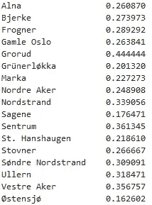

每个社区中高度可用的整个住宅/公寓的百分比

左边的表格显示了每个社区中高可用房屋占整个住宅和公寓的百分比。在房源最多的社区中，Frogner 和 Gamle Oslo 在整个住宅/公寓中所占的份额略大。具有高可用性。在这些社区预定地方之前，阅读关于主人的评论可能是明智的。

最后，**我们能根据主持人写的描述、名字和总结**谈谈每个街区的气氛吗？我使用了一些 NLP 技术来处理这里的文本变量。

我们将查看列出的前三个街区，grünerl kka、Gamle Oslo 和 Frogner。

grünerl kka 以时尚和年轻著称。下面的单词云显示“迷人”、“中央”、“舒适”和“现代”是最常用的单词。像**【都市】【新潮】【hip】【独特】****【时尚】** 这样的词也可以在这里找到。

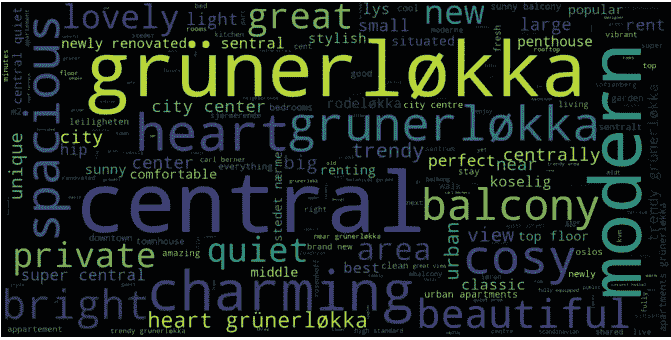

grünerl kka 的单词云

**Gamle Oslo** 意为“老奥斯陆”，下图显示 Gamle Oslo 可以用类似**、【市中心】、【老城区】、【中心】、**、*、*、**、【坎彭】、**这样的词来描述，这些都是位于 Gamle Oslo 的地方。

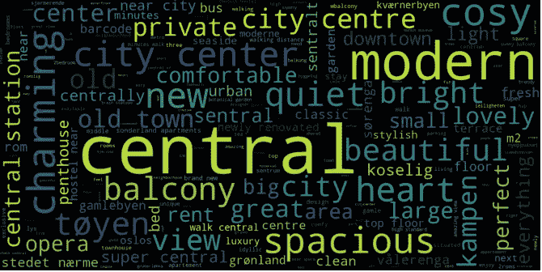

Gamle Oslo 的单词云

Frogner 可以用“现代”、“中央”以及“majorstuen”、“aker brygge”、“皇家宫殿”、“使馆区”、“bygdoy”(靠近 Frogner 的地方)等词来描述。Frogner 也可以用形容词来描述，如**‘奢华’，‘独家’，**和**‘私人’，**，我认为这些形容词很好地反映了这个地区的形象。

Frogner 的词云

我希望你已经对奥斯陆有所了解，根据我的分析，什么时候是最好的旅游时间。我也鼓励你去看看 Airbnb 内部提供的可视化和数据，链接如下。

 [## Airbnb 内部。为辩论添加数据。

### Airbnb 内部是一套独立的工具和开放的数据，允许你探索 Airbnb 是如何真正被用于…

insideairbnb.com](http://insideairbnb.com/get-the-data.html) 

参考资料和灵感来自:

*   [https://towards data science . com/NLP-for-初学者-清理-预处理-文本-数据-ae8e306bef0f](https://towardsdatascience.com/nlp-for-beginners-cleaning-preprocessing-text-data-ae8e306bef0f)
*   [https://www.kaggle.com/aashirwad01/airbnb-analysis](https://www.kaggle.com/aashirwad01/airbnb-analysis)
*   [https://sanjayasubedi.com.np/nlp/nlp-feature-extraction/](https://sanjayasubedi.com.np/nlp/nlp-feature-extraction/)
*   [https://www . ka ggle . com/div Sinha/情操分析-计数矢量器-tf-idf](https://www.kaggle.com/divsinha/sentiment-analysis-countvectorizer-tf-idf)