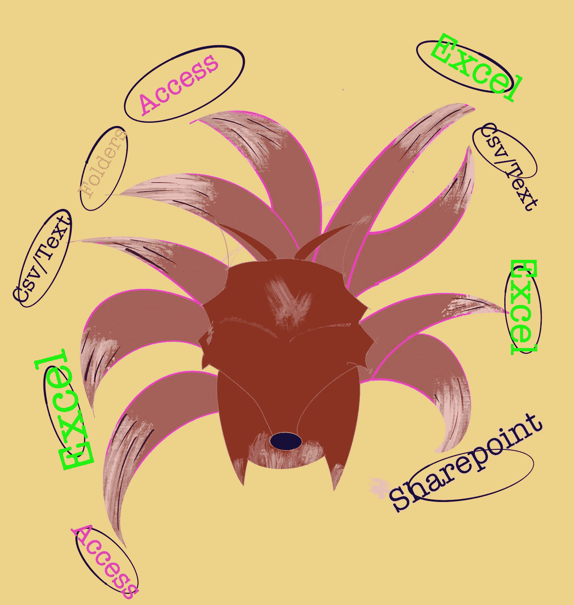
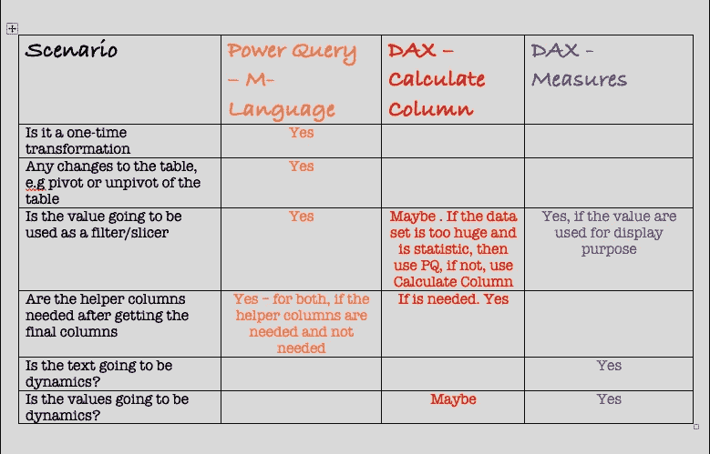

# 何时使用 PowerQuery，DAX —计算列，DAX —度量

> 原文：<https://medium.com/analytics-vidhya/when-to-use-powerquery-dax-calculate-column-dax-measure-bce4d41722e8?source=collection_archive---------24----------------------->

如果有人问这三者是否有区别，答案是肯定的！！！！【PowerQuery 或 DAX(计算列&度量)之间有一条细微的界限，错误的使用可能会导致数据模型效率降低(当处理巨大的数据集时)。
两种功能的最佳使用时间是什么时候？在过去几年学习 DAX & PowerQuery 的过程中，与 PQ 相比，找到一本写得好的 DAX 书籍要容易得多。《数据猴子》是目前为止最好的 PQ 书，等 2 版。youtube 上的 Excel 先生是另一个免费资源，有简单易懂的指南和例子。
即便如此，也没有总结或指南来概述何时使用其中一个或两个功能。

> *不像通常的技术写作，让我试着用诺尔托的术语解释一下。*
> **PQ、DAX 术语以粗体显示**
> Naturo 相关参考资料以斜体显示

# 《火影忍者&九尾》

PowerQuery 就像《火影忍者》中的九尾兽——从**不同的来源抓取不同的文件，并对每个文件执行数据角力**，直到它符合其*形式或者与其他自然元素*混合，如**各种计算或条件公式**形成*强大的形式*，或者**将多个表**合并为一个，如*一个* *大 charka 发布*。
RAM 是 PQ 的弱点之一

将数据组合成不同的用法

# 达克斯又名佐助和内奇卡的力量

DAX(算列&小节)就像*佐助*带着他的*须佐之男*和 *Sharingan* 一样，酷而有力，但耐力是一大弱点。
使用**关系**和/或编写**度量**与**变量**或**连接**等，给我们创建一个动态/ *怪物* *视觉*或**计算**的灵活性。像佐助一样，使用他的分享物来帮助创造可怕的视觉效果或视觉力量，但是过度使用分享物是他的弱点。
由于有各种可能获得结果，但如果应用于更大的数据集，并且计算列的使用不正确，则会对整体性能造成相当大的负担

> 怎样才能克服 PQ 和 DAX 弱势？

通过理解什么是你希望达到的结果，并结合两者来获得你想要的结果。这将提供更有效的数据模型或可视化

PQ 和 DAX 在一起使用时是高效和强大的，它可以提高某些任务的速度/性能。

**例如**文本。组合或串联 x(值)。我们可以写一个**文本。结合(列表。Distinct)** 在 PQ 中，如果需要使用值作为你的表的过滤器/切片器；
或 **Concatenatex(值)** in Measure(如果值仅用于显示目的)

**用例**
你需要计算利润率。您有多个销售数据集和 SKU 成本价数据集。
方法一:用 PQ 对**合并/追加**销售数据和成本价，用 DAX 测算**计算**利润率，或者；
方法 2:使用 PQ 创建唯一的 SKU，然后使用 DAX 中的**关系**提取销售价格和成本价来计算利润率。

就像与辉夜姬的最后一战一样，为了打败她，鸣人和佐助必须联合他们的力量，这赋予他们更大的力量来打败辉夜姬。

当 PowerQuery 和 DAX 结合时

与 DAX 相比，PQ 被低估的原因之一，如果我不得不猜测是因为， ***DAX 在 PowerBI*** 上构建我们所有的仪表板，我们认为它比 ***PQ 更“性感”和“有趣”，因为它隐藏在后端*** 。
什么时候用 PQ & DAX？总之， ***PQ 更多的是为了数据争论，或者把数据转换成一种‘可展示的’格式*** ，以便 DAX 很好地操作。目标是尽量减少 DAX 与 PQ 之间的数据转换活动，让 ***DAX 处理繁重的提升动态计算*** 。

何时使用 PQ & DAX 的总结。(我会试着加上我自己的工作经验)

PowerQuery 和 DAX 使用场景