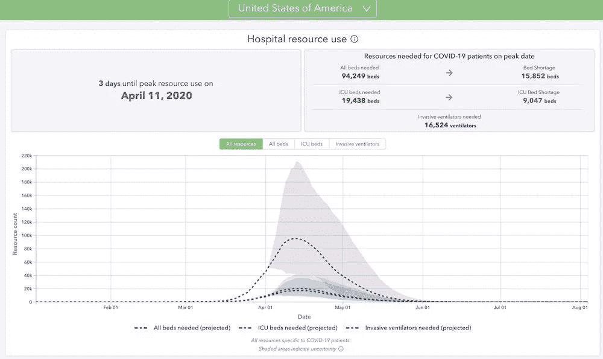
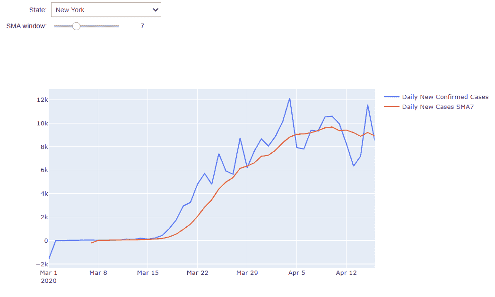

# 冠状病毒何时达到高峰？

> 原文：<https://medium.com/analytics-vidhya/when-will-coronavirus-peak-7d9ec81e91b5?source=collection_archive---------30----------------------->

我将 MA 交叉股票市场分析和交互式可视化相结合，来判断你们州的冠状病毒是否已经达到顶峰。



来源:[https://www . talktomira . com/post/when-will-coronavirus-peak-and-end-social-distanding](https://www.talktomira.com/post/when-will-coronavirus-peak-and-end-social-distancing)

今天我们的园艺师问我妻子，“你认为病毒的事情什么时候会结束？”园艺师认为数据科学家的妻子应该知道如何预测这种情况吗？或者，这只是一个安全和热门的聊天话题。

从技术上讲，峰值可以定义为与新冠肺炎相关的最大医院资源利用率和死亡人数。研究人员一直在开发预测病毒何时达到峰值的模型([https://www . talktomira . com/post/when-will-coronavirus-peak-and-end-social-distanding](https://www.talktomira.com/post/when-will-coronavirus-peak-and-end-social-distancing))。老实说，即使作为一名数据科学家，我也很难验证他们的模型预测有多准确。对于普通观众来说，我们没有知识和时间去收集所有这些信息。但有一点我们可以肯定的是，这一峰值与你所在州或城市的冠状病毒确诊病例高度相关。

我给大家介绍一个在股市分析中已经广泛使用的常用技术，检查你所在的州病毒是否已经达到顶峰。

**均线交叉策略**

如果你曾经交易过任何股票、期权或比特币，你应该熟悉均线交叉策略。如果没有，可以查看这个资源:[https://www . investopedia . com/articles/active-trading/052014/how-use-moving-average-buy-stocks . ASP](https://www.investopedia.com/articles/active-trading/052014/how-use-moving-average-buy-stocks.asp)。

在股票市场分析中，检查股票价格移动平均线(MA)是一种直接、流行和引人注目的技术。移动平均线消除了价格变化的噪音，价格和移动平均线交叉是主要的移动平均线策略之一。高于或低于均线(MA)的价格交叉给出了趋势可能变化的信号。

**新增确诊病例马交叉检查**

MA 交叉策略启发我应用每日新确诊病例 MA 交叉方法来检查病毒是否已达到峰值。我将分享我如何在 Python Jupyter Notebook 中开发解决方案。

1.  *加载包进行分析。*

```
import os
import pandas as pd
import datetime as dtimport matplotlib.pyplot as plt
import numpy as npimport warnings
warnings.filterwarnings("ignore")
```

2.*读入数据。*

你可能已经熟悉了约翰·霍普斯金在新冠肺炎追踪上的仪表盘([https://coronavirus.jhu.edu/map.html](https://coronavirus.jhu.edu/map.html))和他们在 Github 上的数据来源([https://github.com/CSSEGISandData/COVID-19](https://github.com/CSSEGISandData/COVID-19))。然而，我将使用来自纽约时报(【https://github.com/nytimes/covid-19-data】T4)的经过进一步处理的数据。这些数据可能仍然来自约翰·霍普金的网站。

```
path = '[https://raw.githubusercontent.com/nytimes/covid-19-data/master/'](https://raw.githubusercontent.com/nytimes/covid-19-data/master/')
file = 'us-states.csv'
df_us_states = pd.read_csv(os.path.join(path, file), parse_dates= ['date'])
df_us_states['date'] = df_us_states['date'].dt.date
df_us_states_sum = df_us_states.groupby(['state', 'date'])[['cases', 'deaths']].sum()
df_us_states_sum['new_confirmed'] = df_us_states_sum.cases.diff()
df_us_states_sum = df_us_states_sum.dropna()
df_us_states_sum['new_confirmed'] = np.where((df_us_states_sum.new_confirmed <  0), 0 ,df_us_states_sum.new_confirmed)
df_us_states_sum = df_us_states_sum.loc[df_us_states_sum.index.get_level_values(1) >= dt.date(2020, 3,10)]
df_comb_sum = df_us_states_sum.reset_index().set_index('date')
```

3.*交互式可视化*

我将使用 ipywidgets 进行交互式可视化设计。我在我的另一篇文章中介绍了如何使用 ipywidgets 进行 EDA:[Jupyter Notebook 中探索性数据分析的交互式可视化](/@ppeng08/interactive-visualization-for-exploratory-data-analysis-in-jupyter-notebook-adc826e1e76a)。有兴趣请参考。这里的一个区别是，这次我将使用 Plotly 而不是%matplotlib。

```
# create a list to store all the state names
states = df_comb_sum.state.unique()import plotly.graph_objects as goimport ipywidgets
from ipywidgets import widgets[@ipywidgets](http://twitter.com/ipywidgets).interact
def plot(state= widgets.Dropdown(options=states,value="New York", description='State:',disabled=False,), \
         ma_window=widgets.IntSlider(min=3, max=15, step=1, value=7, description="SMA window:")):           
    df = df_comb_sum.loc[df_comb_sum['state'] == state]
    df['new_cases_sma'] = df['new_confirmed'].rolling(window=ma_window).mean()fig = go.Figure()
    fig.add_trace(go.Scatter(
        x=df.index,
        y=df['new_confirmed'],
        mode="lines",
        name="Daily New Confirmed Cases"
    ))fig.add_trace(go.Scatter(
        x=df.index,
        y=df['new_cases_sma'],
        mode="lines", 
        name= "Daily New Cases SMA{} ".format(ma_window)
    ))

    fig.show()
```

现在我们可以得到如下的交互可视化:



纽约新冠肺炎峰检查的 MA 交叉分析

当每日新增确诊病例线越过 SMA7 曲线(最近滚动七天的简单移动平均线，红色上方为蓝色)上方时，新增确诊病例正在持续增长。医院的压力持续增长。当红线(MA)高于蓝线(每日新增病例线)时，该州每天新增确诊病例较少，表明病毒爆发可能达到峰值或开始向峰值移动。

从上面纽约州的图表来看，SMA7 线(红色)于 4 月 11 日开始越过每日新增确诊病例线(蓝色)，表明病例增加趋势开始改变。但是，4 月 15 日，蓝线再次秒杀，越过 SMA7 线(红色)上方，这是一个值得关注的迹象。

你可以从我的[要点](https://gist.github.com/phillip1029/35ceefc13924a65b28dcf44b7de45828)中获取代码，并在[谷歌实验室](https://colab.research.google.com/notebooks/welcome.ipynb#recent=true)中免费运行它们。如果您希望我将它部署为一个应用程序，以便您可以自己使用它而无需运行代码，请告诉我，以便我可以花一点时间将应用程序部署到云。感谢您的时间、问题和评论。

保持安全，保持健康，呆在家里。