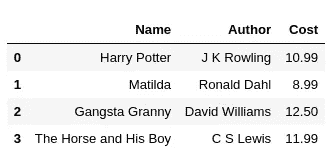
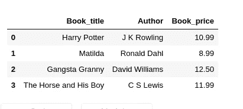
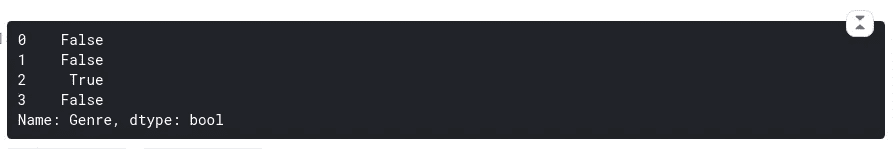

# 当你在 Python Pandas 中处理行和列时，同时进行数据分析。

> 原文：<https://medium.com/analytics-vidhya/when-you-are-dealing-with-rows-and-columns-in-python-pandas-for-data-analysis-16d172b4bc8c?source=collection_archive---------25----------------------->

当我做数据分析的时候，我已经创建了一套我经常参考的命令。我希望这些命令能帮助你开始，特别是如果你是一个初学者。

**数据帧创建**

使用 Jupyter 笔记本，我正在导入 pandas 模块，并通过使用 python 字典和列表添加数据来创建一个名为“books”的非常小的数据框架。

```
**import** pandas **as** pd books = { 
'Name': ['Harry Potter','Matilda','Gangsta Granny','The Horse and His Boy'],
'Author':['J K Rowling','Ronald Dahl','David Williams','C S Lewis'],
'Cost':[10.99, 8.99, 12.50, 11.99]
}
df = pd.DataFrame(books)df
```



这是我们要处理的原始数据框架。

# **列**

1.  **如何查看栏目名称？**

```
df.columns
```


**2。如何重命名列:3 种不同的方法**

1.  **通过** **将列名作为 Python 字典传递**

从我创建的原始数据框中，我将列“名称”重命名为“书名”，将“成本”重命名为“价格”。添加“inplace=True”将改变原始数据框。

```
df.rename(columns = {'Name': 'Book Title', 'Cost': 'Price'}, inplace = True)df
```


**更改的数据帧**


**旧数据帧**

**注**:请检查变化的数据帧和旧数据帧，看有什么不同。

**2。通过在 Python 列表中传递列名**

执行此操作时，新列名必须以与原始列名相同的顺序出现。我把**‘**书名’改名为‘图书 _ 书名’，把‘价格’改名为‘图书 _ 价格’。为此，我创建了一个变量“names ”,并向它传递了一个列名列表。然后，我将这个新变量添加到原始数据框中。

```
names = ['Book_title', 'Author', 'Book_price']
df.columns = namesdf
```



改变数据帧


**旧数据帧**

**3。使用 str.replace()方法**

当您必须更正太多包含空格、下划线或数字的列名时，请使用此方法。在我下面的代码中，列中的所有下划线都被替换为空格。我是这样做的。

```
df.columns = df.columns.str.replace('_',' ') 
df
```


改变数据帧


旧数据框

**3。如何移除/删除列？**

我有“作者”专栏。请注意，axis = 1 用于删除列。要删除一行，我们使用 axis=0

```
df.drop('Author', axis=1, inplace= True)
```


改变数据帧


旧数据框

**4。如何添加新列？**

为了添加一个新列，我创建了一个变量“Genre ”,并向它传递了一个列表。然后，我将该变量赋给数据框。

```
genre = ['Novel','Fantasy','Fiction','Fantasy Fiction'] 
df['Genre'] = genredf
```


改变数据帧


旧数据框

# 索引

1.  **如何设置 _index()**

索引没有像列名那样的名称标题。索引将有一个标签(名称)或索引号(总是从 0 开始)。一旦设置了索引，它就与行保持一致，永远不会改变，除非重置索引。在我下面的代码中，我将现有的“流派”列设置为索引。

```
df.set_index('Genre',inplace=True) df
```


改变数据帧


旧数据框

**2。reset_index()**

重置回原始索引。

```
df.reset_index(inplace=True)
df
```


改变数据帧


旧数据框

# **行**

**1。如何删除行？**

我已经删除了整整一行。请注意，axis = 1 用于删除列。要删除一行，我们使用 axis=0。使用 inplace=True 进行这些更改。

```
df.drop([2], axis = 0, inplace= True)
```


改变数据帧


旧数据框

# **数据过滤:行和列**

**1。如何从行和列中提取值？**

原始数据帧:


原始数据帧

**2。如何查看列中的值？**

要查看“书名”列中的值

```
df['Book title']
```


**3。如何根据条件按行取值？**

新数据帧‘new _ df’存储新的过滤数据，即‘虚构’类型的行。但是请注意，输出是布尔值 true 或 false。

```
new_df = df['Genre'] == 'Fiction'
new_df
```



要获取行值而不是布尔值，请执行以下操作:

```
new_df = df[(df['Genre'] == 'Fiction')]
new_df
```


新数据帧


原始数据帧

如果您发现本文对您处理数据框有所帮助，那么在下面的评论部分收到您的来信将会非常好。享受编码！