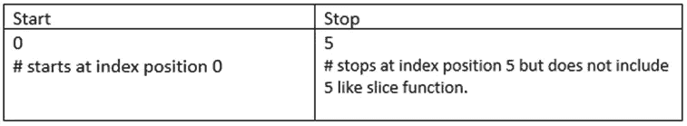

# 当您刚刚开始使用 Python 时

> 原文：<https://medium.com/analytics-vidhya/when-you-are-just-getting-started-with-python-c4693057b02?source=collection_archive---------29----------------------->


杰里米·毕晓普在 [Unsplash](https://unsplash.com?utm_source=medium&utm_medium=referral) 上的照片

如果你是初学者，以前从未学习过编程语言，我的简单指南将帮助你理解 Python 编程的基础。我们开始吧！

**1。编写你的第一个计算机程序**

```
print("Hello World")Output:
Hello World
```

2.**理解变量和变量赋值**

x 是保存(即被赋值)值 5 的变量。

```
x = 5
print(x)Output:
5
```

**3。** **理解索引**

在 Python 中，所有数据都从索引位置 0 开始。如果要访问数据，必须指定索引号。


```
my_text = "Hello World"
print(my_text[6])Output:
W
```

**my_text** 是保存值“Hello World”的变量。这就是位置 6 处的 **my_text** 的值的打印方式。

**4。** **Python 数字**

Python 中的数字是整数、浮点数和复数。


**5。**蟒蛇串

python 中的文本称为字符串。字符串用双引号或单引号括起来。

```
greeting ="Hello, how are you?"print(greeting)Output:
Hello, how are you?
```

**6。** **Python 布尔**

布尔值为真或假。代码返回条件语句是真还是假。


7。 **Python 操作符**


**赋值(=)和比较(==)运算符的区别:**

x = 5 #这意味着 x 的值是 5。或者 x 是 5

x == 5 #该==用于检查(比较)x 的值是否为 5。

**8。** **内置 Python 函数**

我们可以在代码中重用一系列内置的 python 函数。我在这里提到了其中的几个。

**切片()**

顾名思义，切片函数根据项目的开始和结束位置对所需部分进行切片。您还可以添加一个额外的步骤位置，以允许您跳过项目。


```
quotes = "To plant a seed is to believe in tomorrow"
print(quotes[0:8])>>>To plant
```

**引号**是一个变量名，保存着“种下一颗种子就是相信明天”的值。我们打印从索引位置 0 到 8 开始的报价值。

**范围()**

Range()函数指定项目的范围。



我们指定要打印的范围是从 0 到 5(但不是 5)。我使用了一个 for 循环来打印范围。For 循环将在后面的控制流语句中解释。

```
x = range(5)
for item in x:   *# A colon after for, if, while statements.*
    print(item)  *# Use of indentation after the colon on top line.*Output:
0
1
2
3
4
```

**9** 。 **Python 方法**

我们在类和对象中使用了一系列 python 方法。一个方法属于一个[类](https://data-flair.training/blogs/python-classes/)。我在这里没有解释类和对象。现在，我只是解释一些方法是如何使用的。

**输入()**

当我们需要用户输入一些内容时，使用 Input()方法。

```
name = input("Please enter your name:")
print("Welcome: " + name)>>>Please enter your name: Matrix
>>>Welcome:  Matrix
```

**10。** **Python 收藏**

Python 集合包括列表、集合、字典和元组。

**列表**

**列表**是以有序方式排列的数据集合。列表允许重复。列表有一组函数，可以用来操作存储在列表中的数据。让我们看看列表是什么样的。

```
my_list = ["apple", "orange", "grapes", "apricot", "apple"]
print(my_list)>>>['apple', 'orange', 'grapes', 'apricot', 'apple']
```

**设置**

**集合**是一个无序的数据集合。集合中的数据不能通过索引位置来访问。集合不允许任何重复，但可以更改。让我们看看 a 集是什么样的。

```
my_set = ("pine", "oak", "palm", "cherry blossom")
print(my_set)>>>('pine', 'oak', 'palm', 'cherry blossom')
```

**元组**

一个**元组**数据集合以有序的方式排列。元组允许重复。但是元组是不可改变的。这意味着一旦创建了元组并为其分配了数据，我们就不能对元组中的项进行任何更改。

```
my_tuple = ("book", "pen", "diary", "board")
print(my_tuple)>>>('book', 'pen', 'diary', 'board')
```

**字典**

字典是使用键值对形成的数据集合。字典不允许重复的关键字。

```
this_dict = {
    "brand": "Apple",
    "model": "iPhone SE",
    "year": 2020
}
print(this_dict)>>>{'brand': 'Apple', 'model': 'iPhone SE', 'year': 2020}
```

下表总结了数据如何存储在这些描述其属性的集合中。


11。 **了解控制流**

程序的控制流是程序代码的执行方式。Python 程序的控制流由条件语句和循环控制。

For 循环

嵌套 for 循环

While 循环

如果语句

If…else 语句

**为循环**

For 循环用于迭代给定的列表、集合、字典或元组

```
tress = ["pine", "oak", "palm"]
for x in tress:
    print(x)>>>pine
   oak
   palm
```

**嵌套 for 循环**

嵌套的 for 循环是一个 for 循环在另一个循环中。嵌套 for 循环一直让我很困惑。这是它的工作原理。假设外部 for 循环(x)是一年中的月份，即一月，内部 for 循环(y)是该月的天数，即 31。当外部 for 循环(x)在一月执行时，内部 for 循环(y)执行 31 次，然后从循环中出来并返回外部 for 循环(x)。现在(x)在二月，以此类推。

```
month = ["January", "February", "March"]
season = [1, 2, 3]

for x in month:
    for y in season:
        print(x, y)Output:
January 1
January 2
January 3
February 1
February 2
February 3
March 1
March 2
March 3
```

**While 循环**

While 循环类似于 for 循环，但用于在特定条件为真时进行迭代。

```
i = 0
while i < 5:
    print(i)
    i += 1Output:
0
1
2
3
4
```

**If 语句**

这是一个条件句。

```
x = 33
y = 200
if x < y:
    print("y is greater than x")Output:
y is greater than x
```

**12。现在是做迷你电脑项目的时候了**

**猜数字游戏:**

我们将导入一个名为 **Random** 的 python 模块。python 模块是一个现成的文件，其中包含一组要包含在代码中的函数。随机模块将为我们生成一个随机数，让猜数字游戏进行下去。我们将使用条件 while 和 if 语句。

```
**import** random

my_age = (random.randint(0,50))
guess = 0
print("Guess my age. Its between 1 to 50: ")

while guess != my_age:
    guess = int(input())

    if guess == my_age:
        print("Bingo! You got it right first time")
    else:
        if guess > my_age:
            print("Please guess lower: ")
        else:
            print("Please guess higher: ")
        guess = int(input())
        if guess == my_age:
            print("That's correct. Well done.")
        else:
            print("Sorry you have lost this game")
            breakOutput:
Guess my age. Its between 1 to 50: 
20
Please guess lower: 
10
That's correct. Well done.
```