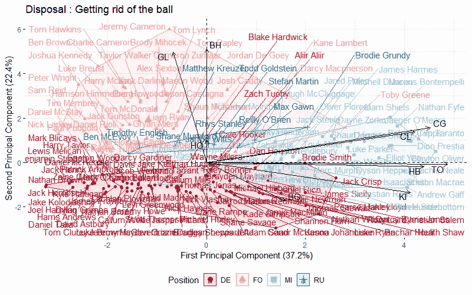

# AFL 玩家在这里赚取他们的梦幻积分

> 原文：<https://medium.com/analytics-vidhya/where-afl-players-earn-their-fantasy-points-f587d259877f?source=collection_archive---------17----------------------->

## 利用主成分分析探讨玩家位置与幻想分数之间的关系

[*“北墨尔本 V 港阿德莱德# 4”*](https://www.flickr.com/photos/40201951@N00/5826451641)*BY*[*NatalieTracy*](https://www.flickr.com/photos/40201951@N00)*是*[*CC BY-SA 2.0*](https://creativecommons.org/licenses/by-sa/2.0/?ref=ccsearch&atype=rich)

在我们之前对 AFL 球队统计数据的[分类的分析中](/analytics-vidhya/classifying-afl-team-stats-cd163f3c42e8)，我们观察到在主成分空间中，PCA 的前两个成分表明数据可以由(1)球所有权和(2)球相对于中场的位置来组织。

在这篇文章中，我们深入研究了数据集，以分析球员层面包含的结构信息。我们希望找出最能描述每个非典型职位的统计数据，并将这些观察结果应用于理解如何获得梦幻积分的联系。

根据类型和玩家位置对幻想分数进行归因

*   在有赛季经验的球员中，梦幻得分倾向于中场球员最典型的奖励行为。防守者(DE)和前锋(FO)无论是控球还是脱手统计都是少得可怜。
*   处置统计数据比持有统计数据更重要。右上象限的玩家相对于群体表现更好；一个直接的申请包括将这一组作为核心球员列入我们幻想队或队长选拔的候选名单。
*   相对于他们的比赛位置，值得注意的离群值是巴查尔·侯莉(DE)，杰克·克里斯普(DE)，罗里·莱尔德(DE)，杰克·罗埃德(DE)，布罗迪·格伦迪(RU)和托比·格林(FO)。

分析使用精英单位置球员作为我们的出发点；鉴于这本身已经是一篇很长的文章，我们将在未来的文章中扩展这个基线集的观察结果，以调查新秀、中等价位球员和双重位置球员。

## **数据**

公开的统计数据是从 2019 赛季 [Footywire](https://www.footywire.com/afl/footy/ft_match_statistics?mid=9917&advv=Y) 的每场比赛的个人页面上刮下来的。原始数据集包括玩家统计数据，并被匹配回各个玩家位置。衍生了一些新的属性，总共使用了 32 个不同的属性。

我们的完整数据集包括 2019 赛季的 656 名球员。为了平衡总结玩家位置行为和查看单个玩家的双重目的，我们将数据集分为玩家组(1)根据玩家经验-精英、中等价位或新手，以及(2)根据单位置与双位置玩家。

对于最初的分析，我们认为只有单个位置的精英球员才是地面上各种球员角色典型风格的真实代表。这些球员被定义为在赛季中至少打了 15 场比赛，平均至少有 80%的时间在球场上。这将我们的数据集减少到 175 个玩家——减少了我们可视化中的混乱。总共有 6367 个球员比赛观察用于分析。

**移除共线变量**我们移除高度相关的变量(对角线周围 0.75 以上)以减少数据集的共线性——这些省略的变量不提供额外的信息，并降低了数据的预测信心质量。为了从梦幻足球的角度保留尽可能多的信息，我们不删除影响 AFL 梦幻分数的变量。

去除共线变量后的相关矩阵

主成分分析(PCA)进一步简化了特征，这一技术将在下一节中解释。

**分组变量**我们通过拥有或处置对变量进行分组，以更好地了解每个玩家角色的特征。给定大量的统计变量，使用分组简化了分析，并允许我们从减少的变量集中进行观察。

## **主成分分析**

[主成分分析](https://en.wikipedia.org/wiki/Principal_component_analysis) (PCA)的目标是用比原始数据集更少的变量来解释数据中的大部分可变性。PCA 提供了一个工具来做到这一点。

*   主成分分析将数据集的维数减少到尽可能少的解释变量，同时信息损失最小。这些称为主成分的新变量对应于原始变量的线性组合，按照对数据集方差贡献的重要性进行组织。
*   这个想法是，每个观察值都存在于 p 维空间中，但并不是所有这些维度都同样有趣。PCA 找到尽可能少的感兴趣的维度，其中感兴趣的概念通过观察值沿每个维度变化的量来测量。

我们将主成分分析应用于每个分组，并在此基础上进行观察。

## **控球:球员是如何拿球的？**

对于占有统计，前两个主成分描述了数据集中 77%的方差，这是令人愉快的高值。与每种球员类型高度相关的是-

*   防守方(DE):标记对方(MX)，拦截对方(IT)
*   前锋(FO):50 分钟内得分(M5)，50 分钟内铲球(T5)
*   中场球员(MI):铲球对方(TX)，50 内铲球(T5)
*   Rucks (RU):争分夺秒(CM)，50 分钟内铲球(T5)

控球统计:球员位置的特征(放大查看更多细节)

*   **球位？**x 轴或第一主成分大致代表球在地上的位置。正的 x 值更接近目标正方形-50 次铲球以内(T5)和标记(M5)更靠近此轴)。负 x 值表示接近对方球门柱，因为它们通常与防守队员相关联。
*   **负相关？**防守者(DE)在拦截(IT)和其他标记(MX)上得分非常高；这两个统计数据与 50 (T5)以内的铲球方向几乎完全相反。假设 PCA 空间中表示每个统计数据的箭头呈 180 度角，这意味着这些统计数据是负相关的(缩放不允许我们比较绝对数字，只是相对于“平均值”)，也就是说，它们发生在地面的相对两端，如下面左侧的图表所示。

*   **防御者得分更低？**有趣的是，在控球统计中，只有马克(MK)和铲球(TK)获得幻想点数。因为我们根据这两个数据是否出现在球门区(50 以内)将它们分开，这意味着防守队员作为一个整体处理的比其他位置少，如上面右边的图表所示。
*   **不在位置的球员？球员位置之间的区别重叠可能表示位置外或双位置球员——后卫-中场和前锋-中场。鉴于该数据集仅涵盖 2019 年的单位置球员，调查 2020 赛季宣布的位置变化将是有趣的。**
*   **鹤立鸡群的玩家？处于边缘的球员——远离中心——在某项技能或角色上脱颖而出——戴恩·佐科(Dane Zorko)和杰克·斯蒂尔(Jack Steele ),马克斯·高恩(Max Gawn ),本·麦克埃沃伊(Ben McEvoy)。**

## **处置:球员是如何脱手球的？**

在处置统计中，前两个主成分描述了数据集中 59%的方差。与每种球员类型高度相关的是-

*   防守者(DE):踢(KI)，弹跳(BO)
*   向前(FO):进球(GL)，落后(BH)
*   中场球员(MI):手球(HO)，失误(TO)，踢球(KI)，解围(CL)，铿锵(CG)
*   Rucks (RU) : Hitouts (HO)

处置统计:球员位置的特征(放大查看更多细节)

*   **正相关？**图表确定了高度正相关对— (1)解围(CL)和失误(CG)以及(2)手球(HB)和失误(TO)。这意味着各种动作(手球和解围)与失误高度相关，也就是说，球通常会落到对方球员手中。

*   **中场统治力？**中场球员通过从踢球(KI)和手球(HB)中获得他们的梦幻得分而占据优势。其他同学在这方面的得分要低得多。反弹(BO)是防御者的特征，但是他们在幻想点数中是没有价值的。
*   **脱离位置的球员？** Toby Greene、Brodie Smith、Darcy Macpherson、Jack Crisp 和 Brodie Grundy 表现突出，因为他们与同龄人不太相似，处于“良好”的右上角象限，值得进一步调查。
*   **鹤立鸡群的玩家？处于边缘的球员——远离中心——在特定技能或角色方面脱颖而出——杰克克里斯普(Jack Crisp)、托比格林(Toby Greene)、克莱顿奥利弗(Clayton Oliver)。**
*   **不是所有的维护者都是平等的？**当防守队员踢球和手球时，在标准化的 x 轴尺度上差异很大。这些动作会计入幻想得分，因此在精英玩家中，Jack Crisp 是比 Jack Hombusch 更好的选择。总的来说，我们希望避开图表左半部分的防守者。

## **一般统计**

在占有统计中，前两个主成分描述了数据集中 69%的方差。与每种球员类型高度相关的是-

*   防守者(DE):百分之一(OP)，处置效率(DE)，篮板 50 (R5)
*   前锋(FO):得分参与(SI)，内线 50 (I5)，进球助攻(GA)
*   中场球员(MI):得分参与(SI)，内线 50 (I5)，进球助攻(GA)
*   Rucks (RU):对(FF)自由，对(FA)自由

一般统计:球员位置的特征(放大查看更多细节)

*   **处置效率？**防御者支配一个百分点(OP)和处置效率百分比(DE)。尽管处理效率可能是第二个选择标准，但这两个都不是幻想得分统计。
*   **Rucks？**正如所料，rucks 参与了许多免费游戏，包括免费对战(FA)和免费对战(FF)——挑战在于找到更擅长其中一项而不是另一项的玩家，这在前两个主成分中我们无法区分，但它可能会显示为次要特征。
*   **相关性？**在前两个主成分中，得分参与(SI)和进球助攻(GA)之间的相关性很高——可以考虑在未来的模型中去掉其中一个变量。

## **反思**

到目前为止，将数据集分组让我们了解了每种玩家使用的特定技能。到目前为止，我们的观察已经允许我们评估每个球员类型的个人技能。我们可以把我们的观察归纳如下-

*   一些统计数据与特定的球员位置密切相关。不是所有的统计数据在幻想点的得分方面都有价值。
*   一些重叠发生在球员定义的角色和他们在场上的预期行为之间。
*   在没有地理位置数据的情况下，利用统计数据和球员位置的结合可以给我们一个更好的想法来分析球队。

**扩展分析**扩展分析的方法之一是识别相对于他们定义的玩家角色是离群值的特定玩家——这就是他们如何赚取幻想点数的。

下图显示了精英玩家群体从拥有和处置统计中获得的幻想得分。只有比平均水平多或少至少 20 分的球员才会被贴上标签。

根据类型和玩家位置对幻想分数进行归因

*   在有赛季经验的球员中，梦幻得分倾向于中场球员最典型的奖励行为。防守者(DE)和前锋(FO)无论是控球还是脱手统计都是少得可怜。
*   处置统计数据比持有统计数据更重要。右上象限的玩家相对于群体表现更好；一个直接的申请包括将这一组作为核心球员列入我们幻想队或队长选拔的候选名单。
*   相对于他们的比赛位置，值得注意的离群值是巴查尔·侯莉(DE)，杰克·克里斯普(DE)，罗里·莱尔德(DE)，杰克·罗埃德(DE)，布罗迪·格伦迪(RU)和托比·格林(FO)。

## **未来研究方向**

到目前为止，在理解玩家角色的结构以及幻想评分系统和探索分析的可能可视化方面，这是一个富有成效的练习。

分析使用精英单位置球员作为我们的出发点；在未来的文章中，我们将从这个基线集扩展观察，以调查新秀、中等价位球员和双位置球员。

鉴于我们现在对[的了解，玩家定价的方式](/@denisewong1/how-afl-fantasy-pricing-works-part-2-bca9b6685d69)以及玩家如何赚取他们的幻想点数，我们的天堂是达到这样一个点，我们可以创建一个可视化系统，它(1)根据位置、价格、预期比赛次数和上场时间对玩家进行分组(2)汇总最近比赛以及整个赛季的玩家表现——并在此基础上识别异常值。

## **参考文献**

1.澳大利亚足球规则词汇表([链接](https://en.wikipedia.org/wiki/Glossary_of_Australian_rules_football))

2.统计术语表:每个统计解释([链接](https://www.afl.com.au/news/144837/stats-glossary-every-stat-explained))

3.使用相关图([链接](http://www.sthda.com/english/wiki/visualize-correlation-matrix-using-correlogram))可视化相关矩阵

4.AFL 梦幻积分是如何通过星星计算的([链接](https://www.fantasystars.com.au/afl/afl-fantasy-points-calculated))

5.Footywire 比赛统计([链接](https://www.footywire.com/afl/footy/ft_match_statistics?mid=9917&advv=Y))