# 哪里可以获得更好的 Airbnb 体验:西雅图还是波士顿？

> 原文：<https://medium.com/analytics-vidhya/where-can-i-get-a-better-airbnb-experience-seattle-or-boston-2b658736f382?source=collection_archive---------20----------------------->

从客人的角度分析和比较西雅图(WA)和波士顿(MA)的 Airbnb 挂牌物业的一些特征。

[图像信用](https://img.ibxk.com.br/2019/03/29/29111708696489.jpg?w=1120&h=420&mode=crop&scale=both)

## 介绍

对于那些不熟悉 Airbnb 的人来说，Airbnb 是一个在线市场，允许人们向客人出租他们的房产或空房，这始于 2008 年，在旧金山(CA)，当时两名设计师在他们的家中有空间分享，接待了三名旅行者。

从那以后，Airbnb 成长了很多，现在它是世界上最大的住宿共享网站之一，通过它可以预订世界各地的房产。

想象一下，下周末你想去自驾游，但是你还没有决定目的地，因为你想去两个相距很远的城市，在这么短的时间内不可能同时去这两个城市。

知道哪个城市更有可能提供更好的使用 Airbnb 预订房产的体验可能有助于决定你的旅行目的地，对吗？

这正是本文的主题:西雅图(WA)和波士顿(MA)的游客体验对比。

我使用过 Airbnb 在 *Kaggle* ( [波斯顿](https://www.kaggle.com/airbnb/boston)和[西雅图](https://www.kaggle.com/airbnb/seattle))可用的数据，这些数据是从 Airbnb 内部 *的 [*中提取的。*](http://insideairbnb.com/get-the-data.html)*

这些数据通过 92 个特征描述了这两个城市可供预订的酒店。波士顿有 3585 个注册房源，西雅图有 3818 个。

为了找出哪个城市更有可能在预订 Airbnb 时提供更好的体验，我选择分析列出的酒店的以下特征:**处理主人、预订价格和客人评论。**

## 第 1 部分—每个城市是否有特定的主机配置文件？

为了理解将如何处理 Airbnb 主机，有趣的是为每个城市建立一个主机配置文件。

有多少主持人提供房间？

首先，我已经检查了有多少不同的主机被分配给列出的属性，因此我们可以对*列表/主机*比率有一个概念:

> **波斯顿**
> 主机数量:2181
> 列表/主机比例:1.64
> 
> **西雅图**
> 主机数量:2751
> 列表/主机比例:1.39

我们知道西雅图有一个较小的*列表/主机*比率，这意味着有较少的主机提供一个以上的属性。这可能表明西雅图的主人倾向于对客人更体贴，因为他们能够一次只关注一个人。

**超级英雄**

Airbnb 有一个名为 [*Superhost*](https://www.airbnb.com/superhost) 的项目，它会表彰热情好客的最佳主持人，并给予他们专属奖励。每 3 个月检查一次所有主机，如果符合标准，主机将被授予*超级主机*状态。标准是:

*   4.8 +综合评分；
*   10 +住宿；
*   < 1% cancellation rate;
*   90% response rate;

This status looks is a good way to get a feeling of how good is the host’s hospitality in each city:

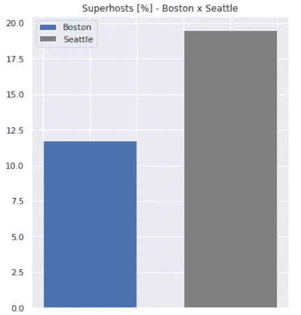

Figure 1 — Superhosts [%]

> Superhosts in **西雅图** : 19.52 %
> 
> 波士顿的超高房价:11.78 %

正如我们在图表中看到的，你在西雅图被超级主机托管的可能性几乎是在波士顿的两倍。

**响应时间**

每个城市的主持人回答问题和请求的速度有多快？

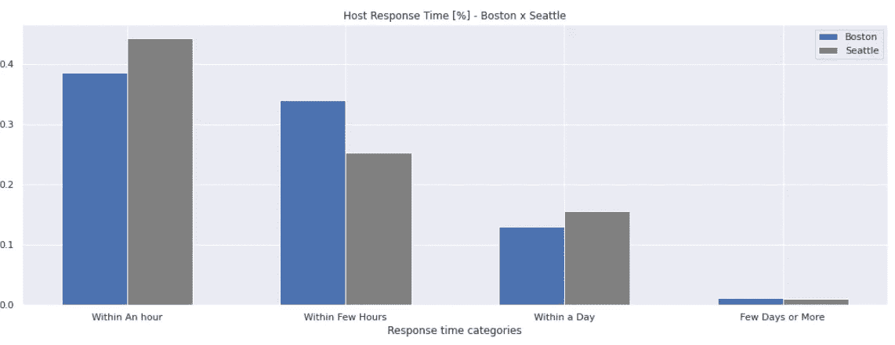

图 02 —主机响应时间[%]

如上面的柱状图所示，西雅图的顾客比波士顿的顾客更有可能在一个小时内得到回复。

**回复率**

当然，每个客人都希望他们所有的信息都能得到正确的回答。这就是为什么我检查了每个城市的回复率:

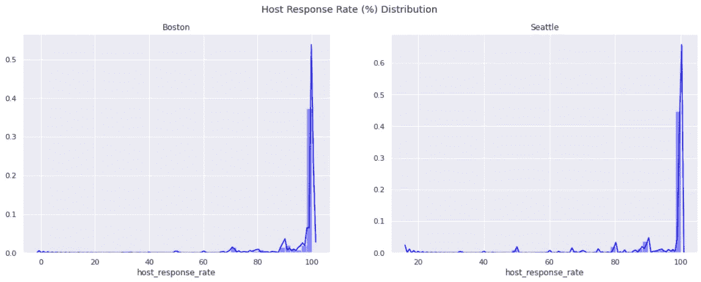

图 03 —主机响应率[%]分布

两个城市的主机响应率百分比的分布曲线形状非常相似，但是在西雅图，访客更有可能 100%回复他们的消息:

> **波士顿**
> 回复率为 100%的房源:57.80%
> 
> **西雅图**
> 100%回复率房源:62.10%

**接受率**

你的预订有可能被主人拒绝吗？

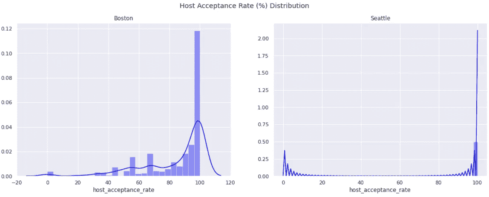

图 04-主机接受率[%]

通过观察上面的分布曲线，很明显，在波士顿比在西雅图更有可能出现预订请求被拒绝的情况。

**验证方法**

各城市最常见的主机 ID 验证方式有哪些？

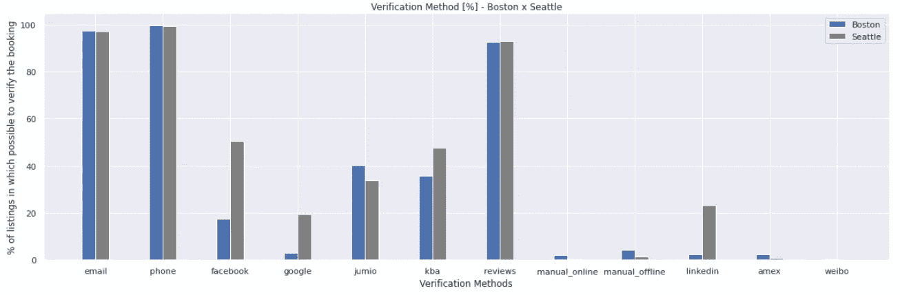

图 05 —验证方法[%]

我们可以在上面的条形图中看到，Airbnb 使用了不止一种方法来验证主机的 ID，三种最常见的方法对于两个城市都是相同的:电子邮件、电话和评论。

用于身份验证的社交网络(脸书、谷歌和 LinkedIn)在西雅图更常见。

基于知识的认证(kba)在西雅图也更常见。

另一方面，像 Jumio 和美国运通(amex)这样的公司和人工方法在波士顿更常见。

**主持人是否与所列物业居住在同一城市？**

主持人是在他们居住的同一个城市提供房产，还是住得很远？

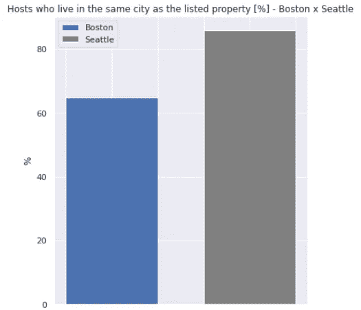

图 06 —主机位置[%]

> 与所列房产
> **居住在同一城市的房东:85.91 %**
> 
> **波斯顿** : 64.88 %

业主住在附近的房产应该得到更好的保护和照料。此外，靠近主人可能有助于解决逗留期间可能出现的任何问题。

**取消政策**

如果您遇到意外问题，不得不取消预订，该怎么办？在哪里做比较容易？

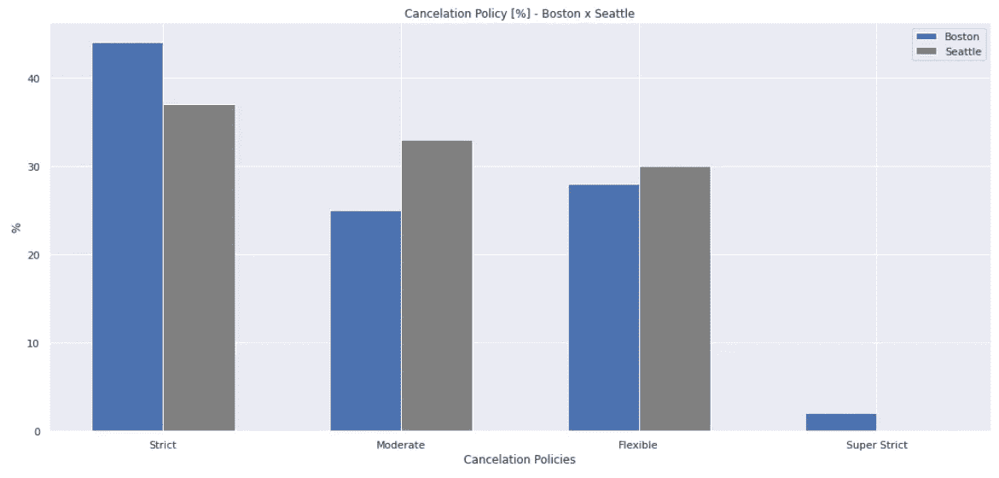

图 07 —取消政策[%]

上面的柱形图告诉我们，波士顿的东道主在取消政策上比西雅图的东道主更为严格。

## 第二部分-哪个城市的一晚预订更便宜？

支付合理的价格也是良好 Airbnb 体验的重要组成部分。然而，Airbnb 上有不同类型的房产可供预订，价格也各不相同。

在每个城市，Airbnb 最常见的房产类型是什么？其中有没有专属的类型？然后，最重要的是:价格相似吗？

**属性类型**

这两个城市共有十种常见的房产类型，分别是:

> 房子，公寓，公寓，床和早餐，联排别墅，阁楼，船，宿舍，其他和露营房车；

除了这些类型，每个城市都有其独有的财产类型:

**波士顿**的专属物业类型:

> 别墅、整层和宾馆；

**西雅图**的专属物业类型:

> 小屋、平房、树屋、蒙古包、小木屋和帐篷

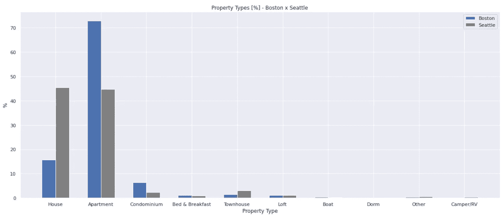

图 08 —财产类型[%]

通过比较常见的房产类型，我们可以看到波士顿的大多数房源都是公寓，而西雅图的房源和公寓各占一半。

如果你正在寻找公寓或船只，波士顿有更多的选择，而西雅图有更多的联排别墅和露营车/房车可供选择。

两个城市的阁楼和面包早餐的比例相当。

**每类房产的平均价格**

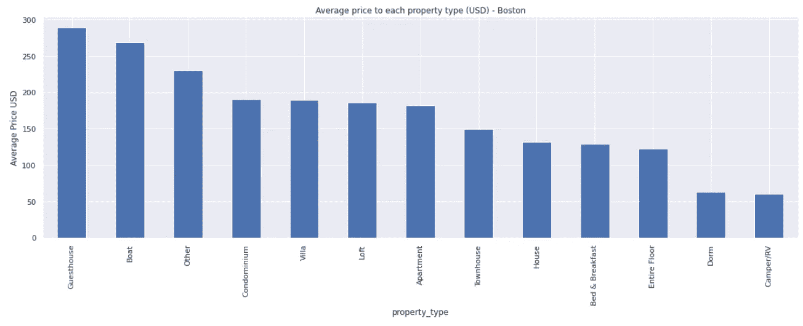

图 09 —按物业类型划分的平均价格—波士顿(马萨诸塞州)

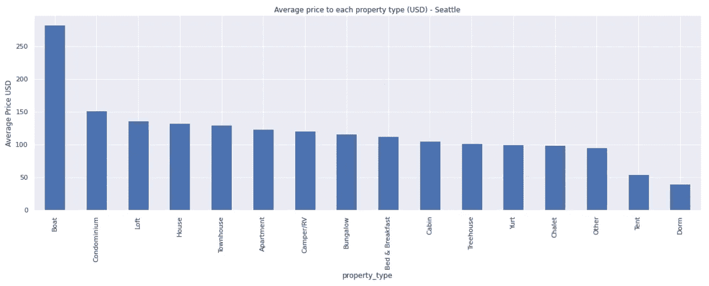

图 10 —按物业类型划分的平均价格—西雅图(华盛顿州)

图 09 和图 10 分别向我们展示了波士顿和西雅图最昂贵的房产类型。

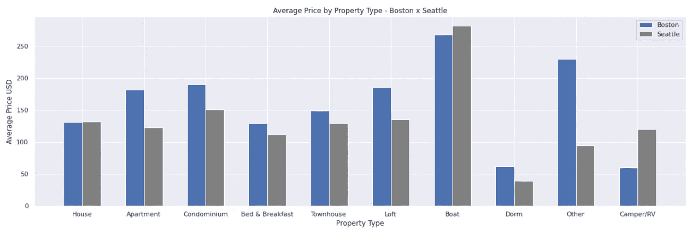

图 11 —各物业平均价格对比

比较普通房产类型的平均价格，可以看出西雅图所有类型的价格都更便宜，除了船和房子以及露营车/房车。

然而，由于这两个城市的平均房价几乎相同，人们可以说，除非你正在寻找一辆过夜的交通工具(一艘船或一辆露营车/房车)，否则西雅图的价格更有吸引力。

## 第 3 部分——哪个城市有最好的酒店(根据客人评论)？

Airbnb 对所列房源有七个审核评分，由客人在入住后给出:

*   **综合评分**[0–100]
*   **准确性**[0–10]—*评估酒店描述的准确性；*
*   **清洁度**[0–10]—*评估入住时酒店的清洁程度；*
*   **签入**[0–10]—*对签入过程(获取钥匙、进入物业等)进行评级；*
*   **通信**【0–10】—*对与主机的通信进行评级；*
*   **位置**【0–10】—*对物业的位置进行评级；*
*   **Value**【0–10】—*评价价格的合理程度；*

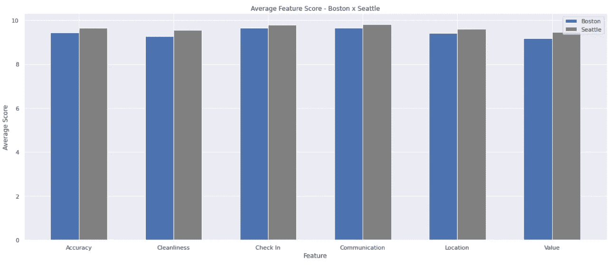

图 12 —平均特征分数

西雅图在所有六个方面的平均分都较高，得分范围为 0-10 分。然而，它们都很相似。

**值**两个城市的平均评分最小，其次是**清洁度**。

**沟通**的平均分最高，其次是**入住**，两个城市也是如此。

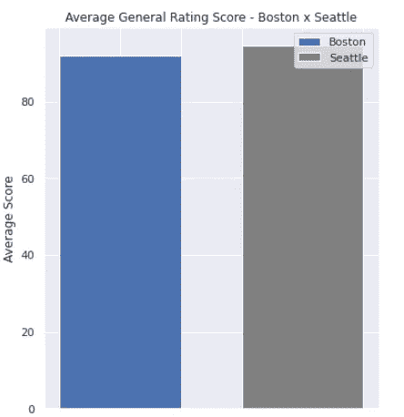

图 13 —平均综合评分

> 平均综合评分:
> **西雅图** : 94.54
> 
> 波士顿 : 91.92

正如在看到西雅图在所有其他功能上都有更好的评分后所预期的那样，这座位于太平洋西北部的城市也有更高的平均综合评分。

知道波士顿的平均综合评分较小，让我想知道这两个城市的评分分布情况如何:

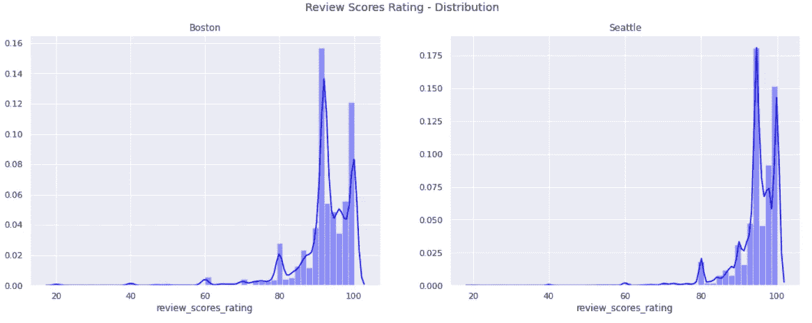

图 14 —总体评级分布

分布曲线形状非常相似:最高峰值在 90-100 范围内，连续较小的峰值在 80、60、40 和 20。

它们之间的主要区别是峰值的高度:西雅图在 90-100 区域有一个更高的峰值，而波士顿在左尾有更高的峰值。

在波士顿，有没有哪种类型的房产有更好的评价？

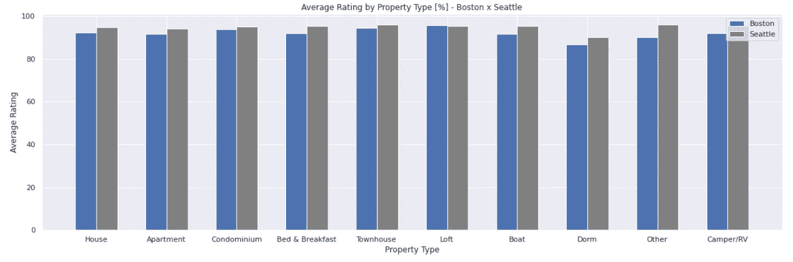

图 15 —按物业类型划分的平均综合评级

上面的柱状图表明，与西雅图相比，波士顿唯一平均综合评分较高的房产类型是阁楼，然而，就像本文第二部分的平均房价一样，它们实际上是一样的。

## 结论

以下是在分析的每个特征中哪个城市更好的总结:

**与主持人**打交道:西雅图

西雅图的主人似乎更体贴、积极和灵活，尽管事实上更接近所列的属性，并且在 superhost 计划中得到更好的评价。

**预订价格:**西雅图

西雅图所有类型的房产都有更好的价格，除了交通工具(船和露营车/房车)。

**嘉宾点评:**西雅图

西雅图不仅在七个被评估的特征上有更好的平均评级，而且在几乎所有类型的属性上也有更好的评级(阁楼除外，有一点点差距)。

因此，如果我对去西雅图或波士顿犹豫不决，而 Airbnb 的体验将是驱动我最终决定的因素，我肯定会选择垃圾城。

[图片来源](https://upload.wikimedia.org/wikipedia/commons/7/7b/Seattle_from_Kerry_Park_%281%29.jpg)图 16——西雅图，这个垃圾城市