# 网上买书应该去哪里？

> 原文：<https://medium.com/analytics-vidhya/where-should-you-buy-books-online-4af0d96ede5d?source=collection_archive---------26----------------------->

## Scikit-Learn 中不同机器学习分类算法的比较

乔纳斯·雅各布森在 [Unsplash](https://unsplash.com?utm_source=medium&utm_medium=referral) 上拍摄的照片

# Flipkart 和亚马逊:大卫和歌利亚的故事

我是在看了 Flipkart 上的这个[商业案例研究后受到启发写这篇文章的，Flipkart 是一家电子商务初创公司，它击败了亚马逊，成为印度最大的在线书商。它们在 2018 年被沃尔玛以 180 亿美元收购。](https://youtu.be/ltDepllHuSg)

鉴于他们的巨大成功，我开始思考:Flipkart 是如何做到的？他们是如何击败亚马逊这个万亿美元的巨头的？

据推测，创业公司如何战胜大公司的答案只有一个:差异化。

## 机器学习与此有何关联？

为了测试这一点的有效性，我试图训练一个机器学习分类器来回答以下问题:

> 给定一本在线销售的书，你能预测它在哪个平台上销售吗？

## 学习目标

在实验过程中，我学到了很多关于机器学习的实际应用，我打算与你分享这些发现。在这篇文章结束时，请期待了解以下内容:

1.  几种流行的最大似然算法之间的权衡，即:K-最近邻、支持向量机、逻辑回归、决策树和随机森林
2.  如何识别上面提到的机器学习算法中的过拟合
3.  标准缩放和最小最大缩放之间的权衡

虽然我从未经营过初创公司，也没有以数据科学家的身份从事过专业工作，但在这个项目中，我尽了最大努力来运用我在 [Make School](https://makeschool.com) 所学的最佳实践，我在那里专攻数据科学/机器学习。如果你在我的过程中发现了任何错误或者有任何反馈，我邀请你对这篇文章做出回应！

# 环境

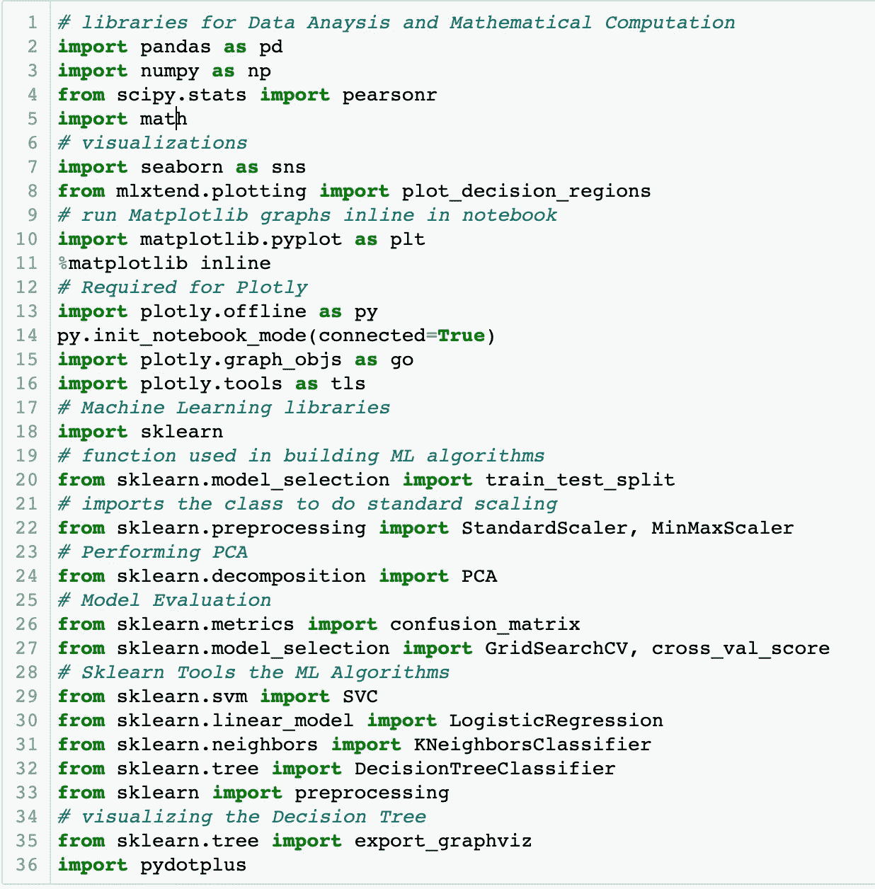

从 Jupyter 笔记本中导入的完整列表。

说了这么多，我先分享一下*我到底是怎么*进行这个实验的。

我使用了以下工具:

*   Python 3.7.6:编程语言
*   Jupyter Notebook:在浏览器中执行 Python 命令。

您将看到的所有机器学习算法都是使用 [scikit-learn](https://scikit-learn.org/stable/index.html) 实现的，scikit-learn 是一个在 Python 中实现 ML 的流行框架。

# 数据集

Kaggle 上名为“亚马逊与 Flipkart 图书价格”的数据集比较了亚马逊和 Flipkart 之间 1382 本相同的图书的销售差异。

有两个 CSV 模块:每个公司一个，显示他们销售的书籍，每个示例包含以下功能:

*   书名
*   作者
*   ISBN 号
*   价格
*   审核次数(也称为“审核计数”)
*   平均 5 星评级(或更简单地说，“评级”)

例如，下面是“Flipkart”CSV 上的一个部分:

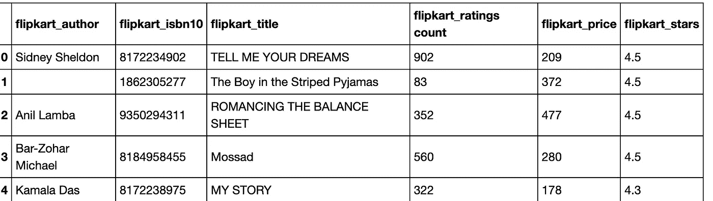

Flipkart 在线销售的图书的一个子部分。

在继续之前，我想特别感谢 [mandan](https://www.kaggle.com/mandan) 最初在网上发布这个数据集。

# 探索性数据分析

我决定只依靠*价格*、*评论数*和*评分*来训练机器学习算法，因为其他功能不会影响客户在 Flipkart 和亚马逊之间做出选择的决定。因此，这些特征是我数据分析的重点。

## 比较单个特征

**相同的分布，非常小的差异** 对于上面提到的每个特征，我覆盖了直方图，并为两个类创建了盒状图，以便容易地发现跨类分布的差异。

在这个阶段，我变得非常怀疑可以构建一个高性能的模型，因为对于所有三个特性，类共享一个*非常*相似的分布，并且显示出*彼此之间的低方差*。

例如，下面是通过绘制亚马逊和 Flipkart 的图书价格分布而生成的直方图:

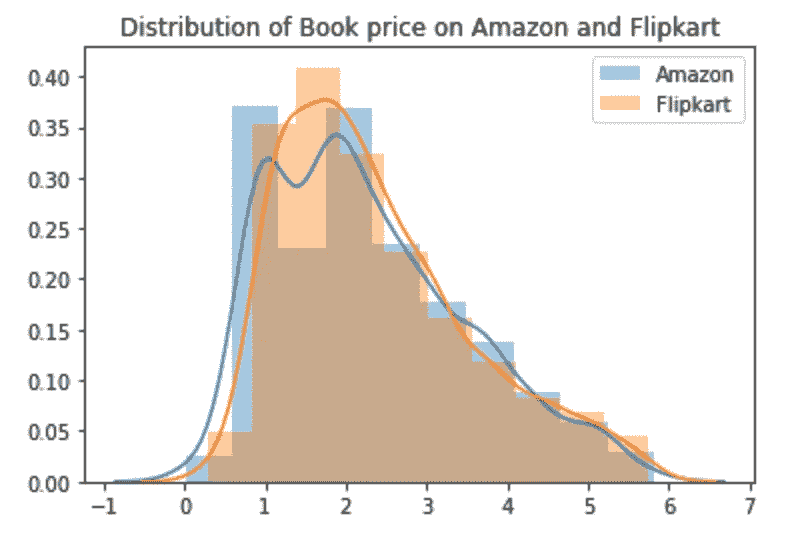

y 轴显示某个容器“包含”的样本占整个数据集的百分比。x 轴是书的价格，单位是美元。

这本书在每个平台上的评论数量和五星评级也是如此。为了简洁起见，我把它们留在这里，但是你可以浏览一下[配套幻灯片](https://docs.google.com/presentation/d/1uWk6AlWb-x6VRVdK_StVWo6UflCrgWWjv43tgBDnxck/edit?usp=sharing)来看看它们是什么样子的。

## 一起比较所有功能

我研究的数据集的下一个方面是每个类的样本分布。

由于只使用了三个预测变量(也称为特征)，我决定为这个数据可视化制作 3D 散点图。

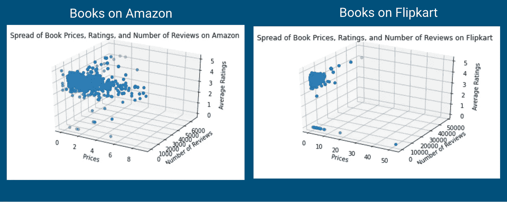

亚马逊和 Flipkart 的图书价格、评论数和平均评分的三维散点图。

和以前一样，没有太多的特征差异需要观察。然而，右边的散点图确实给了我们一个分类可能是如何形成的线索:从 Flipkart 取样的图书在方差上比亚马逊上的图书低得多。

## 相关热图

为了证实之前观察到的情况，我最终使用 [seaborn](https://seaborn.pydata.org) 生成了一个关联热图。这再次证明了一个要素与其他要素或数据集的标注有着密切的关系。

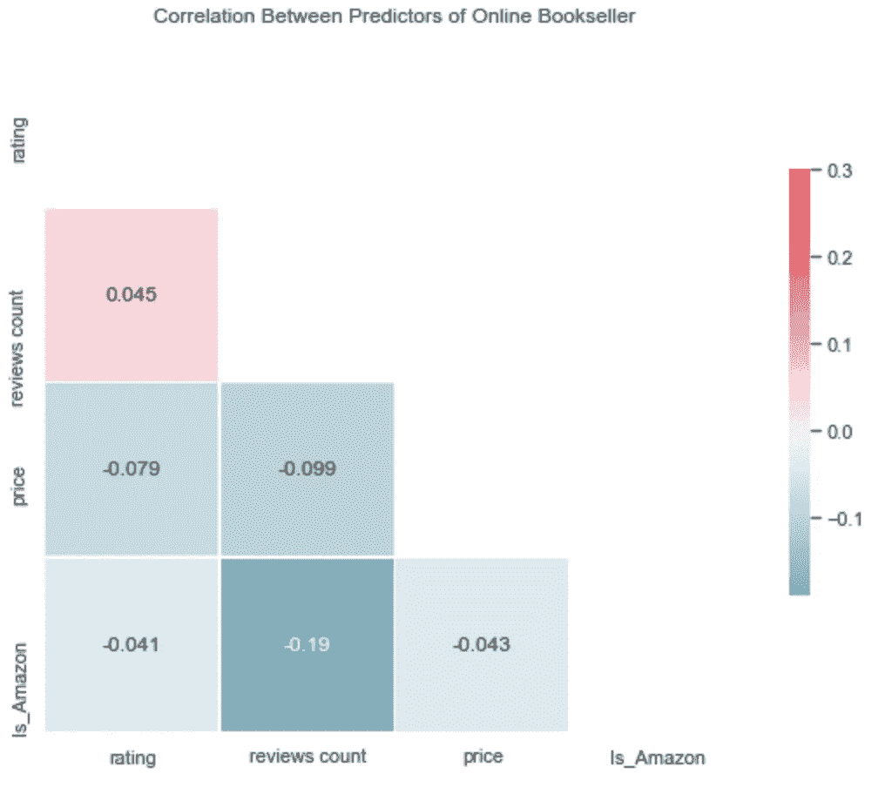

Flipkart 与亚马逊图书数据集的关联热图。

这让我得出结论，尝试建立一个将所有三个特征用作预测变量的模型是值得的。

# 数据集的修改

我必须承认，当我开始数据分析时，我有一个相当确定的假设，即数据集中不会有强烈的方差或偏差迹象，这是高性能机器学习分类器的两个最基本的成分。网上售书市场一开始就充满了激烈的竞争，所以价格紧张和评论看起来都一样是有道理的——可供选择的书籍太多了，很难用冷冰冰的数字来确定一本书与另一本书的不同之处。

幸运的是，这并不意味着我们就此放弃！作为机器学习工程师，我们有许多技巧来帮助构建更好的分类器。这里是我在这个实验中运行机器学习模型时尝试的一些东西，让你有个想法:

1.  根据四分位数范围从数据集中移除异常值
2.  将数据标准化为 Z 分布(也称为标准比例)，或 0–1 之间的范围(也称为最小最大比例)
3.  应用主成分分析——我将特征减少到两个维度，这样更容易直观地评估我的模型的性能

# 机器学习分类器的实现

## k-最近邻

**建立模型**
我尝试建立的第一批模型之一是 K-最近邻模型，这是一种基于以下思想的算法，即将数据集中的给定样本与一定数量(由变量 K 表示)的最相关样本进行比较，即可对其进行分类。

在实践中，我在 scikit 中训练了一个 KNNeighborsClassifier 的实例——在我的数据的两个版本上学习——所有 3 个特性，以及仅使用主要组件。在这两种情况下，我还尝试用经过标准缩放和最小最大缩放的数据来训练模型。

**结果:**
KNN 算法的表现比我想象的要好，在 K=1 的情况下，达到了大约 0.88 的最大 F1 值。然而，由于这种算法的天真性质，我们不应该把这个数字的表面价值。最有可能出现过度拟合。

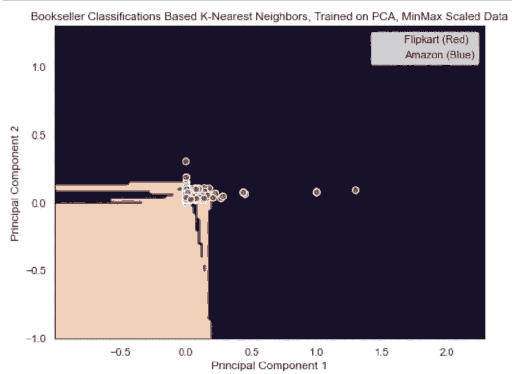

**补充说明**
为了说明，我将提供更多的上下文:上面提到的模型是在所有 3 个特征上训练的，所以在这里可视化是不可行的。但是，在左侧，让我们检查我训练的下一个最佳 KNN 模型，它是使用数据集的 2 个主要组件构建的，并使用最小最大缩放进行缩放。它的 F1 得分为 0.865。

这个模型也是用 K=1 来训练的。实际上，这意味着该算法“学会”如何根据两个样本的相互比较来判断一本书的卖家是亚马逊还是 Flipkart。换句话说，该模型认为它有足够的信息根据数据集的*分钟*片段来区分这两者。

在机器学习中，这种短视的决策实际上有一个特殊的名字——*过度拟合，*正如我上面简单提到的。就像一个汽车修理工认为他知道火箭如何飞行一样——尽管他对航空航天工程一无所知——有时我们设计我们的模型来获取对他们接受训练的数据过于专业的学习。然后，他们错误地应用这些信息来对测试数据做出判断，这些数据无论如何都不能与数据、经验等相比较。这个模型以前见过的。

在 K-最近邻模型中，我们可以通过查看决策边界的“锯齿状”来轻松识别过度拟合，如上图所示。这些往往在 K 值较低时形成，因为模型被迫在较小数量的样本之间查看方差和偏差来做出决策-根据定义，它在训练时会过度专门化这些数据样本。因此，对于这个项目来说，K-最近邻模型是不可取的，因为很难在不遇到一些过度拟合的情况下获得准确的模型。

## 支持向量机

接下来，我决定尝试使用支持向量分类器模型，下面简称为“SVC”。

与 KNN 相似，SVC 模型基于这样的思想，即通过查看许多样本，该模型可以通过将彼此相似的样本分组在同一类中来学习分类关系。

不过，SVC 和 KNN 之间的一个鲜明对比是在培训阶段。SVC 比 KNN 花费更长的时间来训练，因为在它完全形成分类函数之前，它本质上需要浏览训练数据中的所有样本。另一方面，KNN 可以设置为训练更长或更快，这取决于我们设置的 k 值有多高。然而，SVC 的训练阶段使其比 KNN 更加准确，给定相同的计算能力-因为通过一起查看所有样本，模型能够更好地避免过度拟合！

**对数据的修改** 支持向量分类器的最佳结果是通过在数据集的两个主成分上训练模型来实现的，这两个主成分都被缩小到 Z 分布。然后，我使用三种类型的“核”来比较结果:线性核、多项式核和 RBF(径向基函数)核。对于那些不熟悉“内核”这个术语的人来说(当我第一次看到它的时候，我很确定)，它指的是 SVC 正在使用的函数的“类型”——例如，线性分类边界、某种多项式等等。RBF 核指的是形成圆形分类边界的模型，也就是那些被描述为“放射状”的边界。

**结果**

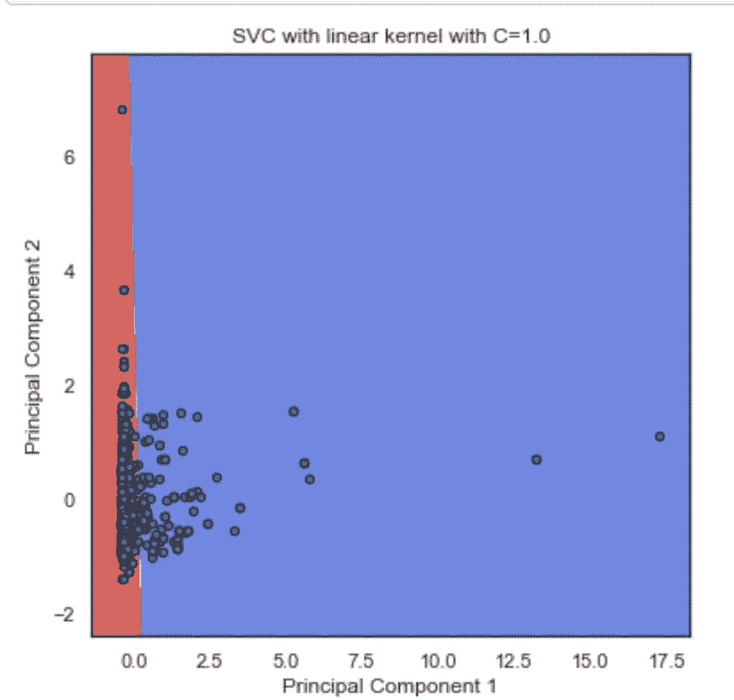

使用线性核，该模型实现了大约 58%的准确度分数，以及 0.6933 的 F1 分数。

使用**线性核**，该模型获得了大约 58%的准确度分数，F1 分数为 0.6933。

我相信这是最不过度拟合的模型，因为正如你将在下面看到的，其他内核形成了复杂的边界线——另一方面，这个边界明显匹配“线性”内核的样子。

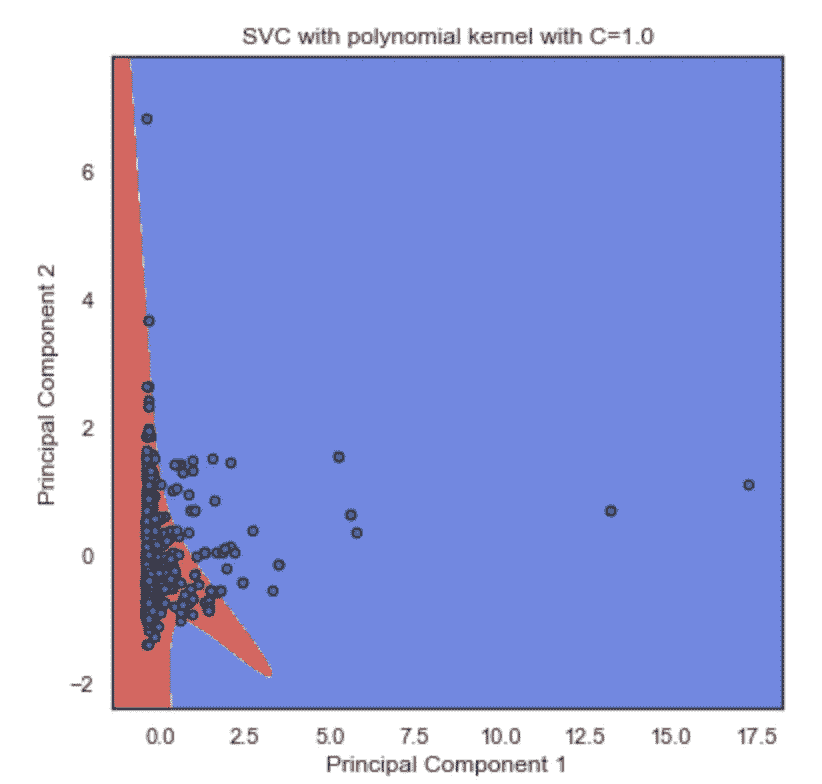

在多项式内核中，该模型实现了大致相同的 58%的准确性，但 F1 得分跃升至 0.7154。

在**多项式核**中，该模型实现了大致相同的 58%的准确率，但 F1 得分跃升至 0.7154。对我的 Jupyter 笔记本的进一步检查表明，这是由于召回分数的增加(99%对上述线性内核的 91%)，这意味着多项式函数对“亚马逊”标签的假阴性分类更少。

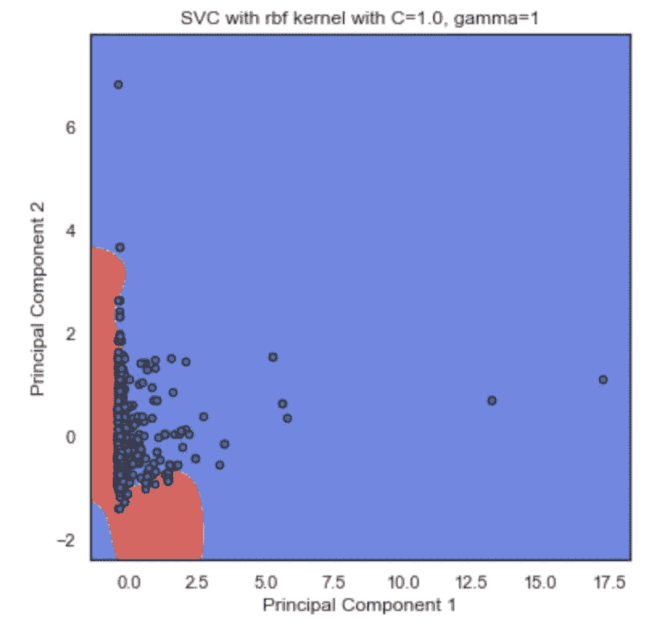

在 **RBF 内核**中，SVC 模型表现最佳，达到了 65%的准确率，尽管 F1 得分略低，为 0.7126。

由于 RBF 核的性质，决策边界能够更多地利用曲线，以便捕捉类之间的区别。然而，它仍然不像一个圆，所以我认为这仍然是过度拟合。

**附加评论** 总而言之，当在过度拟合模型和非过度拟合模型之间进行选择时，我们必须选择非过度拟合模型；因此，我归纳出支持向量机比 KNN 模型表现更好，并在其线性核中做得最好。

## 逻辑回归

接下来:如果我们想要一个模型，它不仅能对我们的书籍样本进行分类，还能为我们提供它认为分类实际上是准确的概率，那该怎么办？

这是逻辑回归模型的独特功能，所以我决定接下来尝试一下！

**对数据的修改**
逻辑回归模型在数据集的两个主成分上进行训练时表现最佳——在使用标准缩放和最小最大缩放对主成分进行训练后，我对模型进行了评估，以了解数据标准化如何影响结果。

**结果**

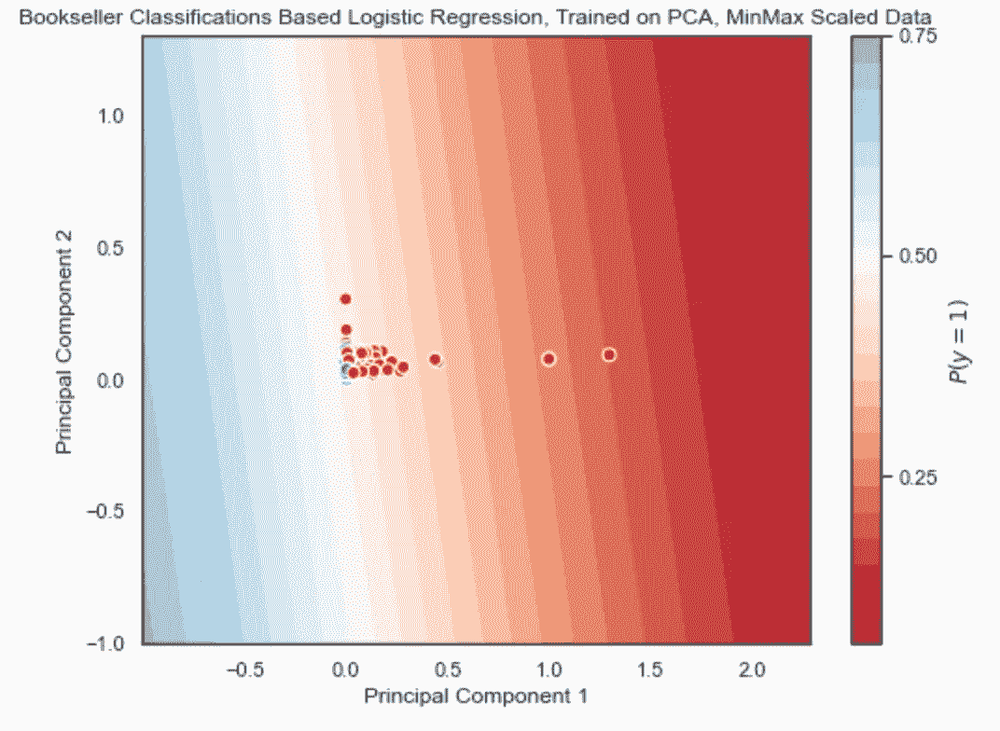

当使用**最小最大缩放**对数据进行缩放时，逻辑回归模型实现了 62%的准确性和 0.6999 的 F1 值。

当使用**最小最大缩放**对数据进行缩放时，逻辑回归模型实现了 62%的准确性和 0.6999 的 F1 值。

然而，正如你在左边看到的，数据点都聚集在一起。这是因为最小最大缩放试图将我们所有的样本推入 0-1 之间的分布。

虽然该模型的数值结果与支持向量分类器的结果相当，但是使用最小最大值缩放可能不是标准化数据的最佳方式。这是因为从图表中解读有用信息变得更加困难。

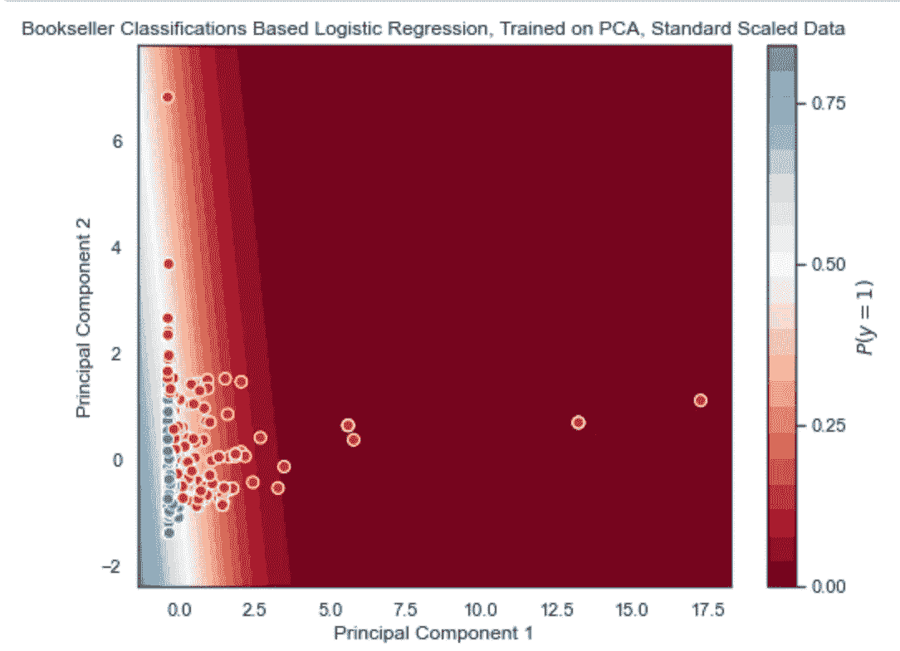

相比之下，当逻辑回归模型在标准规模的数据集的主要成分上训练时，保留了更多的方差。因此，正如您在左侧看到的，我们可以更清楚地看到数据！

为了在顶部添加一个樱桃，更好地保留方差意味着模型表现更好:它匹配 62%的准确性分数，并获得 0.7034 的 F1 分数。

## 决策图表

所有这些关于决策边界的讨论都很好，但是我们还有其他方法可以构建分类器模型吗？

当然啦！

这种模型的一个例子是建立一个*决策树，*一个图表方法允许我们在 Amazon 和 Flipkart 之间清晰地二进制化我们的分类。它通常用于商业领域的决策，因为它易于遵循，并且从层次结构中，我们将能够判断数据的哪些特征对最终决策的贡献最大！

**修改数据** 老实说，这对我来说是整个实验中最具挑战性的部分——我仍在寻找比我最终采用的方法更好的解决方案。

为了在 scikit-learn 中训练决策树分类器，这些特征需要表示*分类*数据，不像我的数据集的连续特征(如前所述，这些特征是图书价格、其平均五星评级和评论数量)。

因此，我得出结论，为了使这个过程有效，我需要找到一种方法来*二进制化*每个特征的值的分布…

**结果**
老实说，我会说我从来没有真正得到这个部分的工作。这是因为正如上面所看到的，这些特性中的每一个一开始都没有什么变化。因此，当我采用将某个特性的值“分桶”到某个特定值附近的常见方法时，我保证了一些样本进入了错误的桶中。关于这个过程的更多细节可以在我的 Jupyter 笔记本上找到[。](https://github.com/UPstartDeveloper/bookstore-classifier/blob/master/classifications.ipynb)

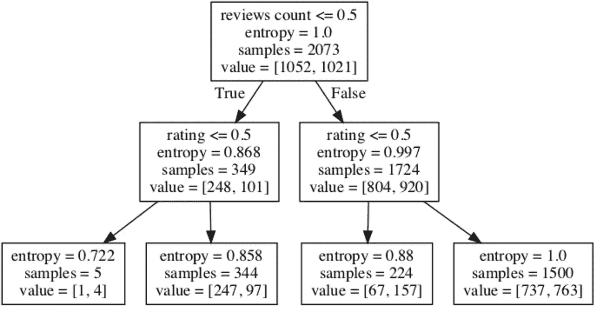

尽管二进制化数据存在问题，但使用 scikit-learn 的 DecisionTreeClassifier 实例被证明是相当强大的。所获得的模型实现了大约 58%的准确度，并且 F1 分数为 0.6962。

尽管如此，使用来自 scikit-learn 的 DecisionTreeClassifier 实例被证明是相当强大的。所获得的模型实现了大约 58%的准确度，并且 F1 分数为 0.6962。

该树的标准是熵，或模型在决策过程的每一步为分类计算的“不确定性”量(在这里表示为树的深度优先搜索)。

查看该树，我们可以得出结论，在进行分类时，该模型将评论计数列为数据集最有说服力的特征，因为该模型将评论计数作为树的根(见顶部)。

*还有一件事，对于那些对编程数据可视化感兴趣的人，比如上面显示的树形图:我使用* [*pydotplus 包*](https://pypi.org/project/pydotplus/) *实现了这个。使用 scikit-learn.tree 模块中的 export_graphviz 函数保存图像。*

## 随机森林

最后但同样重要的是，如果我不讨论最强大的分类模型之一:随机森林，那将是我的疏忽！

随机森林分类建立在决策树的思想之上，事实上，所有的随机森林分类器实际上都是一系列的*多个决策树，*每个决策树都是使用数据集的随机分配样本单独训练的。然后，每个模型，你也可以看到被称为“评估者”，对给定的测试样本进行自己的分类。由于每个估计者都接受了不同的训练，他们倾向于预测样本的不同标签；整体模型做出决定的方式是选择更多的模型类！

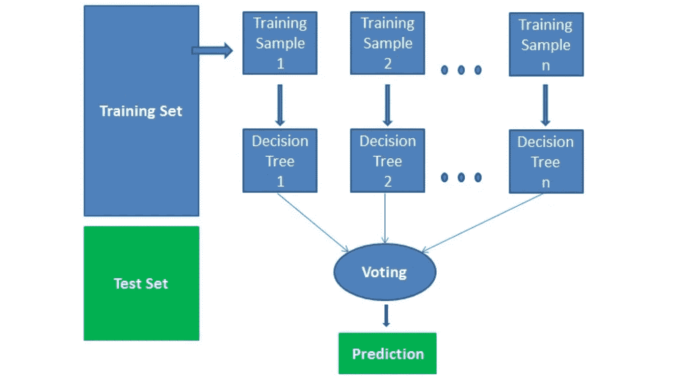

解释随机森林分类器如何工作。我不主张这张图片的所有权。我在这里使用它只是为了教育目的，这是公平使用准则所允许的。图片来源: [DataCamp](https://www.datacamp.com/community/tutorials/random-forests-classifier-python) 。

**对数据的修改**

这一次，我甚至没有费心对数据进行二进制化，因为当我以前尝试用单一决策树进行分类时，分类样本似乎没有用。相反，我做了一个大胆的决定，用 100 个评估者来评估这个模型，这样即使模型都被搞砸了，大众的“投票”通常也会产生准确的结果。

我使用了数据集的所有 3 个特征，因此最后我可以进行特征排序，以查看哪一个对最终分类贡献最大。

我使用标准的缩放比例，以使模型训练更快，减少偏差，并仍然保持大量的差异。

**结果**
幸运的是假设成立了。尽管随机森林结果是零星的(由于数据样本是随机分配给估计者的)，但该模型能够达到大约 89%的准确性，F1 值为 0.9。

通过创建特征重要性的条形图，我们还可以直观地排列哪些特征对模型的分类贡献最大:

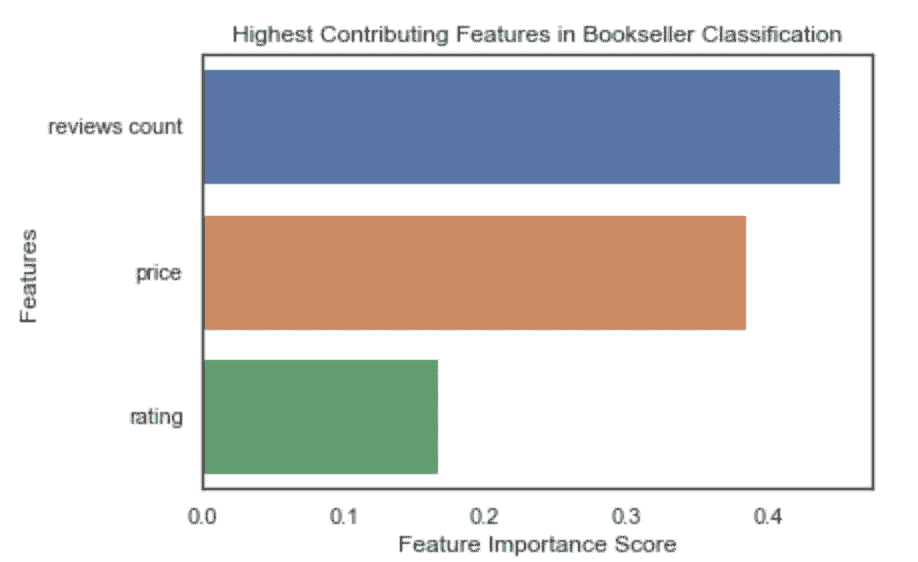

与单一决策树一样，审阅计数功能在模型中排名最高。然而，由于我还无法解释的原因，它将价格列为第二重要的功能，其次是评级。这与单一决策树不同，单一决策树将评分列为第二重要的特征，而完全不关心价格。

与单一决策树一样，审阅计数功能在模型中排名最高。然而，出于我还无法解释的原因，它将价格列为第二重要的功能，其次是评级。这与单一决策树不同，单一决策树将评分列为第二重要的特征，而完全不关心价格。

**解说** 这是机器学习中所谓的*集成方法*的一个例子。源自法语单词“在一起”，像随机森林这样的集合方法不同于迄今为止讨论的其他模型，因为它依赖于“群体的智慧”。这里的想法是*许多弱模型一起工作*，应该能够胜过单独工作的*一个模型。*

# 定论

将来，我的计划是在生产中使用这些模型中的一个。问题是，他们中哪一个是最好的？

## k 倍交叉验证

相互比较模型的一种常用技术是*交叉验证。*正如我们之前在随机森林中看到的那样，基于输入的训练数据类型，模型的表现通常会有很大差异(注意，这种想法必须仅适用于受监督的机器学习算法)。

因此，使用交叉验证的目标是分离模型的实际性能(即算法的鲁棒性如何，避免过度拟合的效果如何，等等)。)从它被训练的那种数据中。

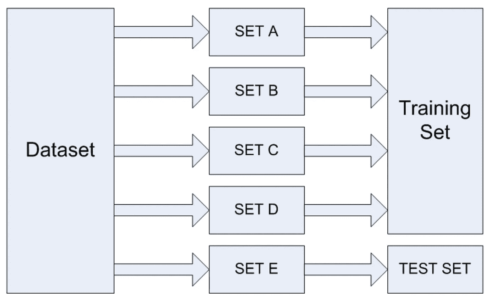

图片来源:[栈虐](https://stackabuse.com/cross-validation-and-grid-search-for-model-selection-in-python/)

交叉验证的实际过程本质上是实验。

1.  我们将整个训练数据分割成任意数量的片段。
2.  我们使用数据集的除了一个切片之外的所有切片来构建模型，并在测试数据上对其进行评估(测试数据成为不用于训练的任何切片)。

然后，我们可以将每次形成的模型评估为正常；因为我们有一个分类器，对我们来说，这意味着使用混淆矩阵中的指标，如准确性和 F1 分数。

另外，在这个过程中使用的切片数量通常被称为变量 k；正式地说，每个切片实际上被称为“折叠”。因此我们有了术语“K 倍交叉验证”。

## 那么，哪一个是最好的模型呢？

在交叉验证模型的最后，我们有一个新的数据集，它是我们在每次模型评估时采用的 F1 分数/准确度/另一个评估指标(大小与 K 值相同)。

在我的例子中，我决定执行 5 重交叉验证，每次取模型的 F1 值。最后，我确定最佳模型的 F1 值差异最小。

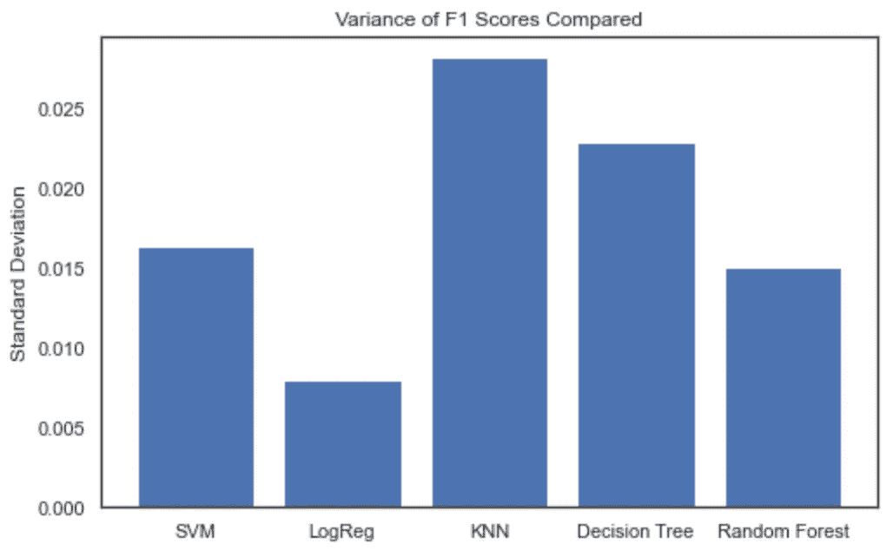

当比较不同的 ML 模型时，我们总是希望寻找在交叉验证中表现最一致(即具有最小方差)的模型。

因此，对于每个模型，我从所有 5 个分数的平均值(模型本身通过交叉验证生成)计算 F1 分数的标准偏差，然后在条形图上绘制所有五个模型

**逻辑回归方差最小，所以赢了！**

## 亚马逊和 Flipkart 有什么区别？

**功能排名** 我在开始时的一个关键问题是回答机器学习模型如何区分 Flipkart 上销售的书籍和亚马逊上销售的书籍。

概括来说，随机森林分类器的特征排名(如上所示)揭示了以下三个特征是最有影响力的，从影响力最大到影响力最小依次显示:

1.  评论数量
2.  价格
3.  平均五星评级

这表明该模型使用了一本书目前收到的评论数量来判断它在哪个网站上销售。这确实有道理，因为有人可能会说，由于亚马逊的庞大规模([据 The Motley Fool](https://www.fool.com/investing/general/2014/05/24/how-many-customers-does-amazon-have.aspx) 估计约有 2.44 亿活跃用户)，它们产生的用户反馈比 Flipkart 多得多，后者在 2018 年才刚刚开始突破数亿活跃用户([据《经济时报》](https://www.kaggle.com/mandan/amazon-vs-flipkart-book-prices))。

请注意，这只是我的推测。我没有考虑到 T4 是否有倾向于更多评论的用户。此外，我假设数据是在 2018 年获取的，因为它是在 2019 年首次发表在 Kaggle 上的[——然而数据集目前没有明确提到这些书籍插入数据集时的数据。](https://www.kaggle.com/mandan/amazon-vs-flipkart-book-prices)

## 最终想法，进一步改进

总的来说，迄今为止建立的最好的模型是逻辑回归分类器，其准确率为 62%。换句话说，对于一本书，这个模型有 62%的正确猜测率。

当然，学习永无止境！为了改进这项研究，我将尝试几件事，即:

1.  我会回去看看，如果增加在两个平台上独家销售的书籍，是否会改变模型的结果。例如，亚马逊和 Flipkart 可能对某些书籍有不同种类的交易。这些交易可能有助于分类模型吗？
2.  我将改进决策树和随机森林分类器的性能，因为它们是这些实验中最有前途的模型。为了处理数据的二进制化问题，我可能会考虑使用特征工程，这是一种我在这篇博文中根本没有提到的技术！

# 资源

在这篇文章中，我浏览了很多材料——因此，如果你没有马上理解，也不必担心！我鼓励你浏览下面的链接，以加深你的理解。

1.  查看 Jupyter 笔记本，看看我是如何进行这个实验的。
2.  检查数据集的[，因为它最初是在 Kaggle](https://www.kaggle.com/mandan/amazon-vs-flipkart-book-prices) 上发布的
3.  在 GitHub 上查看 [Make 学校的机器学习课程](https://github.com/Make-School-Courses/DS-2.1-Machine-Learning)