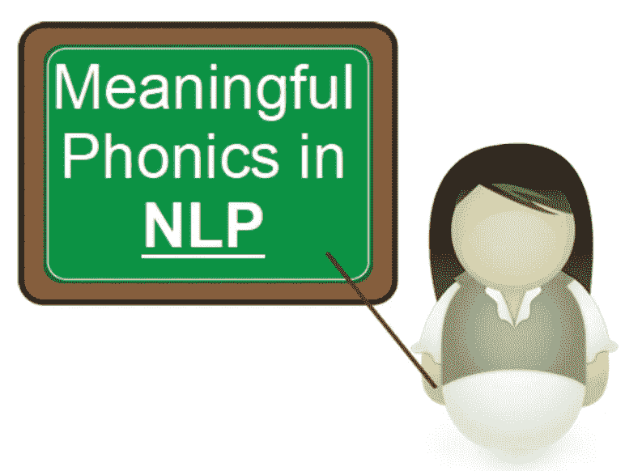
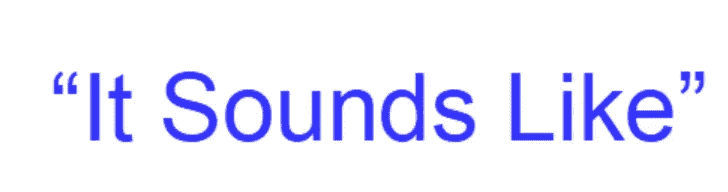

# 词干化和词汇化失败的地方——Soundex 起作用了。但是怎么做呢？？？

> 原文：<https://medium.com/analytics-vidhya/where-stemming-and-lemmatization-fail-soundex-works-but-how-e008626036f?source=collection_archive---------24----------------------->

让我们首先后退一步来理解“**规范化**”的概念。它的字面[定义](https://en.wikipedia.org/wiki/Canonicalization)是“将具有多种可能表示的数据转换成标准或范式的过程”。简单地说，这意味着将单词简化到它的词根或词根。词汇化和词干化是规范化的两个实例。

但是使用这两种技术，我们的数据中仍然会留下一些噪声。例如，Shaun，Sean，Shawn 有相似的发音，相似的名字(发音方面)，但他们将被视为 3 个不同的特征。

这就是语音散列概念发挥作用的地方。语音散列将所有相似的[音素](https://en.wikipedia.org/wiki/Phoneme)分组为一个组，并给所有这些不同的变体一个“散列码”。

在 python 中使用 [**SOUNDEX**](https://thottingal.in/blog/2009/07/26/indicsoundex/) 算法来完成。不同语言有各种各样的 soundex 算法，但是**美式英语**最受欢迎，使用最广泛。但是使用 soundex 的语音哈希是如何工作的呢？？？

语音散列实际上产生了一个**四个字母的代码。**

让我们试着看看我们的例子( ***Shaun，Sean，Shawn*** )得到了什么代码。我们将在这里使用美国英语 Soundex。

**1。代码的第一个字母实际上是我们要编码的单词的第一个字母。**

我们将把**“S”**作为所有 3 个变体的第一个字母

**2。**所有辅音字母的映射(第一个除外)。**重要提示:**所有元音和‘H’、‘Y’和‘W’都没有编码，即它们实际上被删除了。****

辅音的代码是:

*B，F，P，V = 1
C，G，J，K，Q，S，X，Z=2
D，T=3
L=4
M，N=5
R=6
H，W，Y =未编码*

因此，对于我们的示例:

Shaun= SAU5

肖恩= SEA5

Shawn =SA5

**3。**去掉元音所有的元音。

注:**有理**在**后面 Soundex** 算法即*英语发音取决于辅音的首字母和模式。*因此元音也不是必需的

肖恩= S5

肖恩= S5

肖恩=S5

**4。**最后一步是用多个零填充它，使它成为 4 个字母的代码。或者在长度超过四个字符的情况下，您需要从右侧截断它

我们的小于 4，所以我们必须添加零

肖恩= S500

肖恩= S500

肖恩=S500

我们可以看到，所有这些现在编码相同，并将被分组为一个特征，以便进行分析/建模。

希望现在清楚了，**语音哈希**是如何通过使用 **SOUNDEX** 工作的，并且可以帮助减少我们文本数据中的噪音。