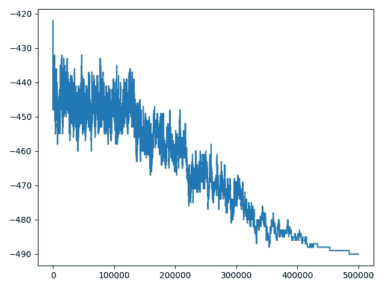
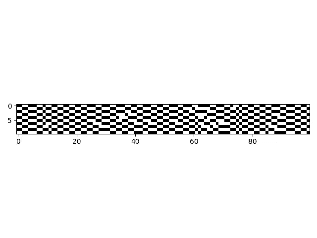

# 让人们坐在哪里以保持社交距离

> 原文：<https://medium.com/analytics-vidhya/where-to-seat-people-to-maintain-social-distancing-854851de1810?source=collection_archive---------20----------------------->

# 基于模拟退火的座位安排约束优化方法

**简介**

Covid 19 疫情为现场活动带来了一系列复杂的限制。例如:

*   人们可以坐在同一个社会阶层的人旁边，
*   但是必须在顶部和底部有一个空闲座位，
*   还有两个边上的免费座位。

**什么问题？**

给定一组已售出的活动门票，我们需要在遵守 COVID 准则的同时，让尽可能多的门票入座。

**简单的例子——hello world**

应用下面解释的方法，利用引言中解释的样本约束，对于 1000 人的标准，我们可以将我们可以适应的人数提高大约初始随机猜测的+15%。

在下图中，可以看出 SA 算法在接近计划预算结束时是如何更加保守的，这是由于接受概率函数的指数衰减。



算法在迭代运行的次数中可以容纳的人数(取绝对值)



座位的最终分配；白色的像素是空座位，黑色的是有人的座位

我们如何接近它？

我们没有可以用来优化的解析函数的数学表达式。也就是说，如果我们计算出一个标量函数，给定一些参数，返回我们可以适应的人数，我们可以只推导它来找到它的全局极值。然而，生活并非如此简单。

强行解决这个问题可能是一个解决方案，但考虑到现实情况(有标准数量的座位和与会者)，它有一个极其巨大的搜索空间。

然而，我们可以通过元启发式方法来实现优化；我们将使用模拟退火。给定一个有序的人员列表，该算法将按照顺序和社交距离约束安排他们的座位(因此，如果由于某种约束，某个座位必须空着，它会跳到下一个座位，并尝试让这个人坐在那里)；我们的“参数”是人们就座的顺序。因此，SA 算法将试图找到这个最佳顺序。

**模拟退火**

模拟退火(SA)是一种元启发式算法，用于在大搜索空间中逼近全局最优。这正好符合我们的需求！此外，它支持使用离散变量，我们将使我们。SA 可以被建模为通过初始猜测及其邻居的搜索图的随机行走。

```
SIMULATED ANNEALING ALGORITHM

    Let S = S0.
    Let k = MAX_K.
    WHILE k >= 1:
        Let S' = NEIGHBOUR(S).
        Let T = (k + 1) / MAX_K.
        IF UNIFORM_RANDOM(0, 1) <= P(S, S', T):
            Let S = S'.
        k--
    S
```

先前的 SA 算法使用固定的冷却时间表，但是也可以设计基于变化率的适应性解决方案。

这意味着我们还将实施:

*   一个函数得到一个解的邻居，对初始解进行一个小的随机变异。
*   评估某个解决方案成本的成本函数(适应度函数)。在我们的例子中，这可能仅仅是我们可以适应的每个人的负成本，如果那个人远离家庭，则是正成本(例如)。
*   定义接受邻居的概率的函数。

```
P(S, S', T) -> FLOAT:
    IF COST(S') < COST(S):
        RETURN 1
    ELSE:
        RETURN EXP(-(COST(S')-COST(S))/T)
```

关于模拟退火的更多信息。

[点击这里查看代码。](https://github.com/miquelvir/covid-seating-optimization)

感谢阅读！