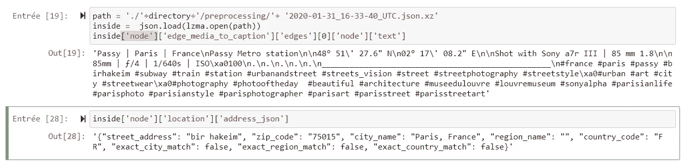
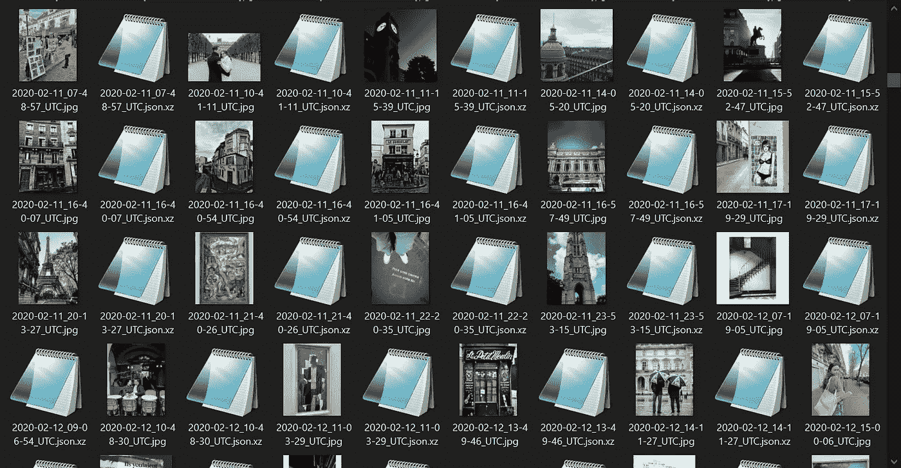
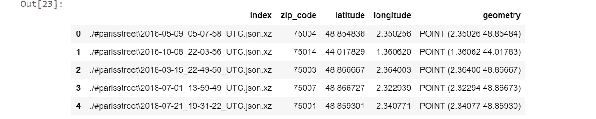
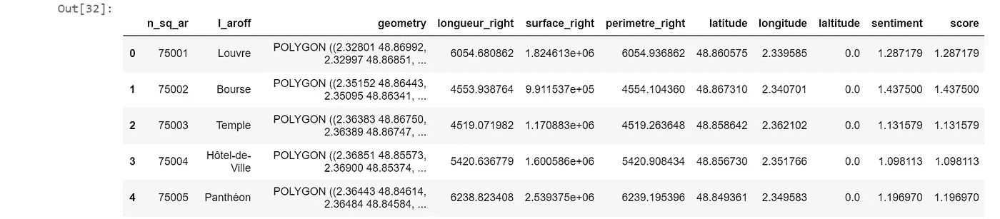
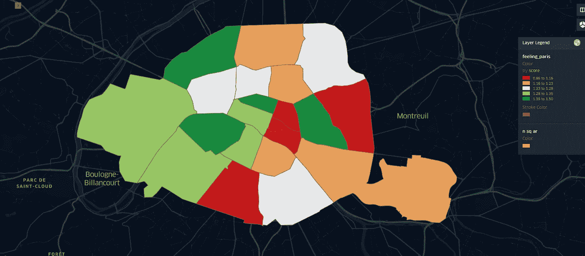

# 巴黎的哪个区最让人们开心？

> 原文：<https://medium.com/analytics-vidhya/which-arrondissement-in-paris-gladden-peope-the-most-488f0845f782?source=collection_archive---------25----------------------->

## 有一天，我问我的朋友:我们应该在巴黎的什么地方离开去赏月？我们用数据科学来回答一下吧！


莱昂纳尔·科特在 [Unsplash](https://unsplash.com?utm_source=medium&utm_medium=referral) 上拍摄的照片

那天我有两个解决办法，第一个是上网搜索。第二个是我自己解决的。正如你所料，我决定选择第一个，但我没有找到一个明确的答案。所以还是自己想办法解决吧！

像往常一样，让我们分工合作:

**0)数据集**

**1)启动包**

**2)预处理**

**3)加工**

**4)可视化**

# 0)数据集

开始时，我没有数据来回答以下问题:

> 我们应该去巴黎哪里开心呢？


照片由[雅各布·欧文](https://unsplash.com/@jakobowens1?utm_source=medium&utm_medium=referral)在 [Unsplash](https://unsplash.com?utm_source=medium&utm_medium=referral) 上拍摄

通过滚动社交媒体，我意识到我们有无限量的免费数据！事实上，人们正在社交媒体上发表意见。此外，由于有了标签，他们可以描述这些信息。在这项研究中，我使用了 Instagram，但它也可以很容易地扩展到 Pinterest、脸书、Twitter 等等



这是我输入数据的一个例子。我检索这个特定图片的所有评论和#号。此外，我检索数据的位置。基于此，我不得不在接下来的研究中做出以下假设:

*   **在 Instagram 上用位置发帖的人把好的位置放上去。**
*   如果你快乐，那么你就写一篇更快乐的帖子，如果你不快乐。
*   如果大多数人说这是个好地方，我们会承认这是个好地方。

现在我们必须“工业化”这个过程:更大量的数据！！
我用一个脚本用#ParisStreet 检索了 8762 个帖子(代码在 github 上[这里](https://github.com/BasileGoussard/ParisMap) ) (JSON.xz 文件是元数据) :



# 1)启动包

像往常一样，我将 anaconda 与基于三种环境的三个 Jupyter 笔记本一起使用:

*   一个从社交媒体下载数据的环境( **Instaloader** [*【链接】*](https://instaloader.github.io/) 从 Instagram 下载数据)
*   一个用于预处理和可视化结果的环境(常规 geo 环境，包含**pandas***[*[*link*](https://pandas.pydata.org/)*]*，**geo pandas***[*[*link*](https://geopandas.org/)*，NumPy*[*[*link*](http://xarray.pydata.org/en/stable/)*]*)*
*   *一个从数据中获得洞察力的环境有熊猫*[*链接*](https://pandas.pydata.org/)*，NumPy*[*链接*](http://xarray.pydata.org/en/stable/)*&****Afinn****[](https://github.com/fnielsen/afinn)*****

# ***2)预处理***

***首先，我们将只保留有地理位置的帖子。让我们深入元数据。在这里，我们可以在元数据(JSON 格式)中找到另一个名为“location”的 JSON。***

```
***import **json** #load json 
import **pandas** as pd  #do some data analysis
import **lzma** #open .xz file
import **glob** #retrieve all the file from our directory**post_list** = glob.glob('./#parisstreet' + '/*.xz')adress = dict()
for post in post_list:
    **metadata= json.load(lzma.open(post))**
    location = metadata['node']['location']
    if location :
        if location['address_json']:
            **adress[file] = json.loads(location['address_json'])****df_adress = pd.DataFrame.from_dict(adress, orient = 'index')*****
```

***在里面我们可以找到街道的北部，街道本身，城镇和乡村。对于这些位置中的每一个，我们检索纬度和经度。我建议您阅读来自 [Abdishakur](https://medium.com/u/d4284ce02aec?source=post_page-----488f0845f782--------------------------------) 的以下文章，该文章清晰地展示了地理编码方法(街道地址到位置)***

***[](https://towardsdatascience.com/geocode-with-python-161ec1e62b89) [## 使用 Python 进行地理编码

### 如何将物理地址转换为地理位置→经纬度

towardsdatascience.com](https://towardsdatascience.com/geocode-with-python-161ec1e62b89) 

现在我们必须过滤我们的帖子。事实上，我们将只保留那些在巴黎境内有确切位置的照片。经过这种预处理后，帖子的数量是 1694！(对比开头的 8762)



几乎 82%的帖子对我们的学习没有用！让我们将剩下的 18%保存在一个新文件夹中(预处理)

# 3)加工

让我们深入到情感分析部分。我用的是 afinn，这是最简单的情感分析算法。感谢 Afinn，我们可以根据描述检索每个帖子的情感。

现在，我们可以平均每个行政区的所有情绪，以检索最终得分！



# 4)可视化

在这里，我表示的是基于每个区的情绪的结果&基于分位数。事实上，这个想法是为了比较各区，而不是给出该市情绪的绝对值。



正如我们所见，最好的成绩是 17 分，最差的是 14 分……对不起，路易斯😉！

> 🥇:17ème
> 🥈:02ème
> 🥉:11ème*** 

> ***感谢您的阅读，并享受您的地理空间数据！(代码可在 github 上获得)***

> ****联系人****
> 
> ***[*basile.earthobservation@gmail.com*](http://basile.earthobservation@gmail.com/)***
> 
> ***[*https://github.com/BasileGoussard*](https://github.com/BasileGoussard)***
> 
> ***[*https://www.linkedin.com/in/basile-goussard/*](https://www.linkedin.com/in/basile-goussard/)***