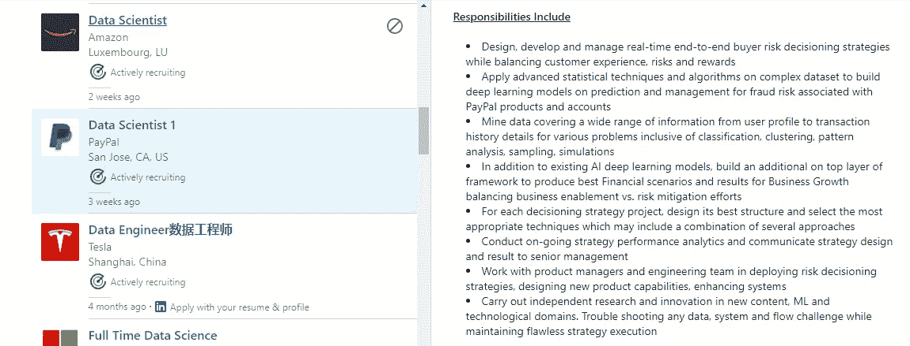
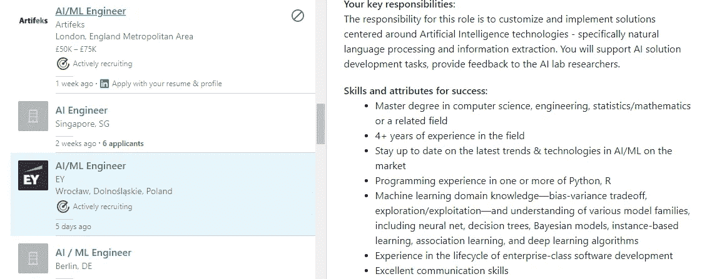
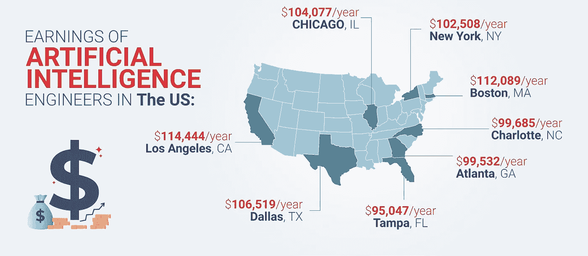

# 数据科学家和人工智能工程师哪个职业更好

> 原文：<https://medium.com/analytics-vidhya/which-career-is-better-a-data-scientist-or-an-artificial-intelligence-engineer-b2516c5b3058?source=collection_archive---------1----------------------->

A 根据全球最大的新闻专线分销网络 GlobeNewswire 的数据，全球人工智能(AI)市场预计将从 2018 年的 206.7 亿美元增长到 2026 年的 2025.7 亿美元。

而[数据科学全球市场](https://www.globenewswire.com/news-release/2020/07/14/2061682/0/en/Data-Science-Platform-Market-to-reach-US-178-billion-by-2025-Global-Insights-on-Top-Trends-Expansion-Plans-Investments-Analysis-Key-Growth-Drivers-Leading-Players-and-Future-Outloo.html)预计到 2025 年将超过 1780 亿美元。

数据科学和人工智能都被吹捧为科技行业的非凡职业。

不浪费太多时间，让我们更深入的探讨一下**数据科学**和 **AI 事业**。

# **人工智能工程师 vs 数据科学家——更广阔的视角**

## 👉**人工智能工程师**

人工智能不再是过去的事情，而是已经成为我们日常生活的一部分。从给你的杂货送货到提示 Alexa 播放你最喜欢的歌曲，AI 就生活在我们中间。

人工智能工程师在机器学习技术(如神经网络)的帮助下，帮助建立模型以加速基于人工智能的应用。这些工程师创建的一些基于人工智能的应用程序包括语言翻译、视觉识别和基于情感分析的上下文广告。

组织现在意识到人工智能和机器学习可以对他们的业务产生的最大影响。大多数商业分析专业人士正在提升技能，并转行成为公民数据科学家。对于一个完全由人工智能驱动的组织来说，该组织必须能够将人工智能应用到他们的应用程序中。这样做可以让组织中的每个人获得洞察力，从而做出更明智的决策。这些组织现在正在为有能力处理数据科学、软件开发和混合数据工程任务的个人创造更多的人工智能工程师职位。

人工智能在数据科学家的生活中扮演着至关重要的角色。

## 👉**数据科学家**

另一方面，数据科学家使用大数据分析、云计算和机器学习等技术来分析数据集，提取对未来预测有价值的见解。简单说，数据科学离不开 AI。

当谈到创造成功的业务时，人工智能和数据科学都有独特的作用。因此，如果企业希望与未来的工作竞争，它们需要人工智能和数据科学。

# **工作职责主要区别:数据科学家 vs 人工智能工程师**

虽然两者的工作角色和职责不同，但最好说 AI 和数据科学携手合作。这两种技术都有潜力将业务推向更高的高度。

## ✏️ **数据科学家**

数据科学家的一天主要围绕着数据。从收集数据到分析数据和转换数据，一名 [**数据科学家**](https://www.dasca.org/world-of-big-data/article/how-data-scientists-will-fit-in-data-driven-cultures-of-future) 可能会发现自己被这些职责所包围。

*   他们需要具备帮助识别业务或工程相关问题并将其转化为数据科学问题的技能，找到问题的来源，分析揭示有用见解的数据以找到解决方案。
*   使用多种工具和技术提供端到端的分析解决方案。
*   在研究或企业环境中处理机器学习、数据挖掘、统计建模和非结构化数据分析的深入实践经验。
*   展示与分类模型、神经网络、聚类分析、贝叶斯建模和随机建模等相关的技能。

实例:PayPal 数据科学家的工作职责

## ✏️ **人工智能工程师**

一名 [**人工智能工程师**](https://www.artiba.org/blog/the-artificial-intelligence-engineer-career-roadmap-all-you-need-to-know) 通过与数据科学团队合作，发起、开发和交付生产就绪的人工智能产品，以改进业务流程。

*   他们负责设计和构建计算机视觉解决方案，以利用机器学习和深度学习。
*   通过利用对象跟踪算法、实例分割、语义、对象检测和关键点检测来开发可扩展的算法。
*   使用机器学习方法，如零投、GANs、少投学习和自我监督技术。
*   Docker technologies 开发该模型的可部署版本。
*   测试和部署方法。
*   创建和部署智能人工智能算法。

实例:EY 人工智能工程师的工作职责

# 💲**谁赚得更多:数据科学家还是人工智能工程师**

根据 Payscale，数据科学家的平均工资从 9.6 万美元到 13.4 万美元不等，具体取决于经验年限、专业水平和工作地点。

而一名人工智能工程师的年薪约为 122，793 美元。

人工智能工程师工资

# **所需主要关键技能:数据科学家和人工智能工程师**

# ✔️ **数据科学家**

*   数学和统计学。
*   用 [R 和 Python](https://www.datacamp.com/community/blog/when-to-use-python-or-r) 编程。
*   大量使用大数据工具— Spark、Hadoop、Hive、Pig。
*   数据可视化工具— QlikView 和 Tableau。
*   深入了解数据清理、数据管理和数据挖掘。
*   数据库知识— SQL 和其他关系数据库。

# ✔️ **AI 工程师**

*   对计算机科学和软件工程有扎实的理解。
*   数学和算法。
*   精通 [R 和 Python 编程](https://www.artiba.org/blog/choosing-your-first-programming-language-python-and-ruby)。
*   精通 Unix 和 Linux 环境。
*   数据评估。
*   展示在[深度学习](http://brainstormingbox.org/discover-all-you-need-to-know-about-deep-learning/)、机器学习、图像处理、NLP、计算机视觉和神经网络架构方面的工作经验。

科技行业仍然面临着招聘数据科学和人工智能领域最优秀专业人士的挑战。虽然就业市场仍在蓬勃发展，但建议专业人士提升这两个领域的技能。最好的方法之一是获得 [**人工智能工程师认证**](https://www.artiba.org/certification/artificial-intelligence-certification) 或 [**数据科学认证**](https://www.dasca.org/) 。你可以选择任何一个最符合你标准的工作角色。

# 📍**收尾**

世界经济论坛预测，到 2020 年底，我们将有大约 5800 万份新工作。此外，在 2020 年初，人工智能专家已经成为人工智能领域最受欢迎的工作之一。

更不用说，世界仍然需要雇用更多的数据科学家来缩小技术差距。

**今天你会选择什么:**一个 ***数据科学家*** 还是一个 ***AI 工程师*？**