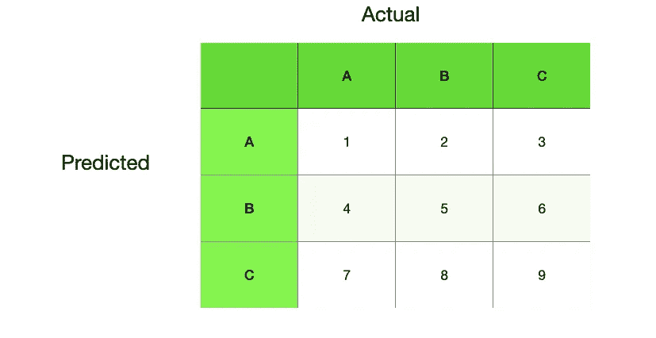

# 哪个评估指标将帮助您赢得这一局面？

> 原文：<https://medium.com/analytics-vidhya/which-evaluation-metric-will-help-you-to-win-the-situation-23eef8798605?source=collection_archive---------29----------------------->

在 [Unsplash](https://unsplash.com?utm_source=medium&utm_medium=referral) 上 [Tekton](https://unsplash.com/@tekton_tools?utm_source=medium&utm_medium=referral) 拍摄的照片

分类或监督学习是一项不需要向数据爱好者介绍的任务。建立一个模型对于现在的资源来说并不是什么大事。但是建立一个好的模型来解决你的问题是一个交易。

凭借目前的计算能力，人们甚至可以为庞大的数据建立多个模型。但是从他们中选择一个真正帮助你的是我们所需要的。

我们需要知道的就是模型的评估指标。同样，从指标列表中选择一个好的指标也很重要。这篇文章将帮助你做到这一点。

> 要选择最佳指标，您必须了解您的问题或情况。

# 关键术语

假设您正在执行一个二进制分类任务，其中有两个类别被标记为“好”和“坏”。

## 真阳性

真阳性是由模型正确识别的“好”样本。

## 假阳性

假阳性是“坏”样本，但被模型识别为“好”样本。

## 真正的否定

真阴性是由模型正确识别的“坏”样本。

## 假阴性

假阴性是“好”样本，但被模型识别为“坏”样本。

## 准确(性)

当数据平衡时，准确性是标准的衡量标准。准确度表明从数据集中正确识别的阳性和阴性样本的数量。

## 精确

精度表明有多少阳性鉴定样本实际上是阳性的。Precision 考虑 TP 和 TP+FP(被模型识别为阳性的样本)。

## 回忆

回忆告诉你你的模型在识别阳性样本方面有多好。它考虑 TP 和 TP+FN(阳性样本的实际数量)

## f 测度

通过取精确度和召回率的调和平均值来计算 f 值。

# 何时追求精准？

从技术上讲，当你想要你的模型应该对误报敏感。

考虑你正在寻找一个好的环境来进行一些测试。你设计了一个模型来识别好日子。

如果一个好日子被认定为坏日子，那么你可能会错过那天表演的机会，你可能会再等几天。

如果糟糕的一天被认为是好的一天，那么你将在糟糕的环境中进行测试，巨大的损失将会发生。

所以模型必须对这些误报敏感。

# 什么时候去召回？

从技术上讲，当你想要你的模型应该对假阴性敏感。

假设你正在使用图像来识别患病的植物，并对它们进行治疗。你设计了一个模型来完成你的工作。

如果你的模型将患病的植物识别为好的植物，那么你可能不会在正确的时间处理它。

所以模型应该对这些假阴性敏感。这里需要注意的一点是，患病植物是阳性样本。

# 何时进行 F 测量？

如果你的模型应该控制假阳性和假阴性，那么 F 值适合你。

> 如果我的任务是多类分类呢？

这里扩展它们的更好的方法是使用“一个对所有”。

假设您有 3 个类别 A、B 和 c。对于 A 类，阳性样本属于 A 类，阴性样本属于 B 和 c 类。其他类别也类似。

考虑以下混淆矩阵。

的精度为:

TP/(TP+FP)=1/(1+2+3)=1/6

回想一下 A 是:

TP/(TP+FN)=1/(1+4+7)=1/12

其他指标和类也类似。

## 补充说明

当你使用任何库生成混淆矩阵时，你一定会看到宏平均和加权平均。

宏观平均就是各个班级分数的平均值。

加权平均根据每一类在样本总数中所占的比例来分配权重。如果数据集不平衡，这很有帮助。

例如，样本比例为 1:2 的两个类的宏平均精度为(p1+p2)/2。

但是加权平均是(p1+2* p2)/2

类似地，我们将在下一篇文章中看到回归的度量。

感谢看帖:))