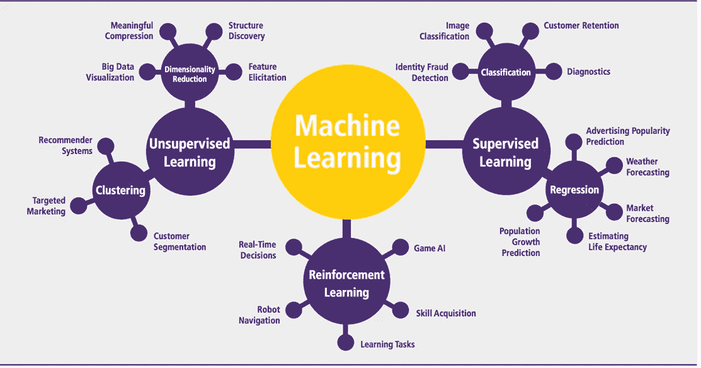

# 根据问题类型，应该使用哪种机器学习算法？

> 原文：<https://medium.com/analytics-vidhya/which-machine-learning-algorithm-should-you-use-by-problem-type-a53967326566?source=collection_archive---------0----------------------->

当我开始从事数据科学时，我**经常面临**为我的特定问题选择最合适的算法**的问题**。如果你像我一样，当你打开一些关于机器学习算法的文章时，你会看到几十个详细的描述。矛盾之处在于他们不会轻易做出选择。

好吧，为了不让你感觉脱离轨道，我建议你很好地理解几个监督和非监督机器学习算法背后的实现和数学直觉，比如-

*   **线性回归**
*   **逻辑回归**
*   **决策树**
*   **朴素贝叶斯**
*   **支持向量机**
*   **随机森林**
*   **AdaBoost**
*   **坡度提升树**
*   **简单神经网络**
*   **层次聚类**
*   **高斯混合模型**
*   **卷积神经网络**
*   **递归神经网络**
*   **推荐系统**

请记住，我提到的机器学习算法列表是必须要掌握的，而你是机器/深度学习的初学者！

现在我们对机器学习任务的类型有了一些直觉，让我们基于它们的问题陈述来探索最流行的算法及其在现实生活中的应用！

看完这篇博客后，试着去解决每一个问题。我可以保证你会学到很多，非常多！

## 问题陈述 1 -

**预测房价**

解决问题的机器学习算法 **—**

*   **高级回归技术，如随机森林和梯度推进**

## 问题陈述 2 -

**探索客户人口统计数据以识别模式**

解决问题的机器学习算法 **—**

*   **聚类(肘法)**

## 问题陈述 3 -

**预测贷款偿还**

解决问题的机器学习算法 **—**

*   **不平衡数据集的分类算法**

## 问题陈述 4 -

**根据其特征(大小、形状、颜色等)预测皮肤损伤是良性还是恶性**

解决问题的机器学习算法 **—**

*   **卷积神经网络(U-Net 是最好的分割材料)**

## 问题陈述 5 -

**预测客户流失**

解决问题的机器学习算法 **—**

*   **线性判别分析** (LDA)或**二次判别分析** (QDA)

(特别受欢迎，因为它既是分类器又是降维技术)

## 问题陈述 6 -

**为雇佣新员工提供决策框架**

解决问题的机器学习算法 **—**

*   **决策树**是这里的职业玩家

## 问题陈述 7 -

**了解并预测产品属性，使产品最有可能被购买**

解决问题的机器学习算法 **—**

*   **逻辑回归**
*   **决策树**

## 问题陈述 8 -

**分析情绪，评估产品在市场中的认知度。**

解决问题的机器学习算法 **—**

*   **朴素贝叶斯** — **支持向量机** (NBSVM)

## 问题陈述 9 -

**创建分类系统过滤垃圾邮件**

解决问题的机器学习算法 **—**

*   **分类算法—**

**朴素贝叶斯、SVM、**多层感知器神经网络和**径向基函数神经网络建议。**

## 问题陈述 10 -

**预测某人点击在线广告的可能性**

解决问题的机器学习算法 **—**

*   **逻辑回归**
*   **支持向量机**

## 问题陈述 11 -

检测信用卡交易中的欺诈活动。

解决问题的机器学习算法 **—**

*   **Adaboost**
*   **隔离林**
*   **随机森林**

## 问题陈述 12 -

**根据汽车特点预测汽车价格**

解决问题的机器学习算法 **—**

*   梯度推进树在这方面做得最好。

## 问题陈述 13 -

**预测患者加入医疗保健计划的概率**

解决问题的机器学习算法 **—**

*   **简单神经网络**

## 问题陈述 14 -

预测注册用户是否愿意为产品支付特定价格。

解决问题的机器学习算法 **—**

*   **神经网络**

## 问题陈述 15 -

**根据不同的特征(如年龄组)对客户进行分组**

解决问题的机器学习算法 **—**

*   **K 均值聚类**

## 问题陈述 16 -

**用于语音识别系统的语音数据特征提取**

解决问题的机器学习算法 **—**

*   **高斯混合模型**

## 问题陈述 17 -

**多个对象的对象跟踪，其中混合分量的数量及其均值预测视频序列中每一帧的对象位置。**

解决问题的机器学习算法**——**

*   **高斯混合模型**

## 问题陈述 18 -

**组织来自一组微阵列实验的基因和样本，以便揭示生物学上有趣的模式。**

解决问题的机器学习算法 **—**

*   **层次聚类算法**

## 问题陈述 19 -

**根据具有相似属性的其他客户的偏好，推荐消费者应该观看的电影。**

解决问题的机器学习算法 **—**

*   **推荐系统**

## 问题陈述 20 -

根据读者正在阅读的文章，推荐他们可能想要阅读的新闻文章。

解决问题的机器学习算法 **—**

*   **推荐系统**

## 问题陈述 21 -

**根据读者正在阅读的文章，推荐他们可能想要阅读的新闻文章。**

解决问题的机器学习算法 **—**

*   **推荐系统**

## 问题陈述 22 -

**优化自动驾驶汽车的驾驶行为**

解决问题的机器学习算法 **—**

*   **强化学习**

## 问题陈述 23 -

**通过医学扫描诊断健康疾病。**

解决问题的机器学习算法 **—**

*   **卷积神经网络**

## 问题陈述 24 -

**平衡不同需求周期的电网负荷**

解决问题的机器学习算法 **—**

*   **强化学习**

## 问题陈述 25 -

**当你处理时间序列数据或序列时(例如，音频记录或文本)**

解决问题的机器学习算法 **—**

*   **递归神经网络**
*   LSTM

## 问题陈述 26 -

**提供语言翻译**

解决问题的机器学习算法 **—**

*   **递归神经网络**

## 问题陈述 27 -

**为图像生成字幕**

解决问题的机器学习算法 **—**

*   **递归神经网络**

## 问题陈述 28 -

**强大的聊天机器人可以解决更细微的客户需求和询问**

解决问题的机器学习算法 **—**

*   **递归神经网络**

我希望我可以向你解释最常用的机器学习算法的常见认知，并给出如何为你的具体问题选择一个算法的直觉。

> **如果你是数据科学和机器学习的初学者，并对数据科学/ML-AI、向数据科学的职业过渡指导、面试/简历准备有一些具体的疑问，或者甚至想在你的 D-Day 之前获得模拟面试，请随时在这里** **预约 1:1 电话** [**。我很乐意帮忙！**](https://topmate.io/sukannya)

**快乐的机器学习！:)**

直到下次..！

> 通过 [LinkedIn](https://www.linkedin.com/in/sukannya/) 联系我