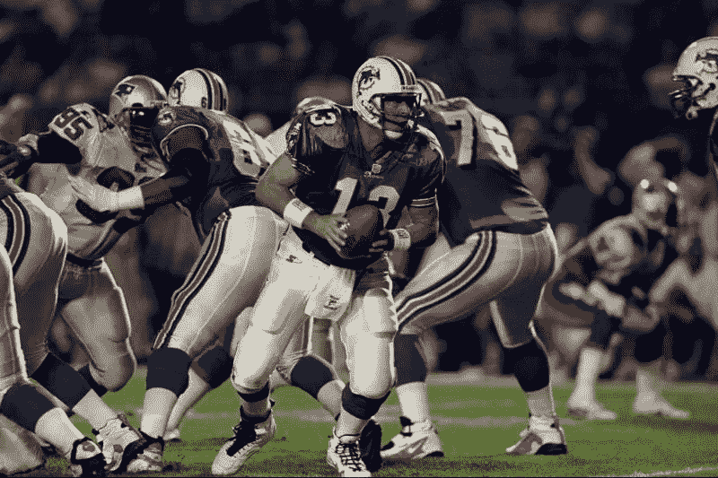
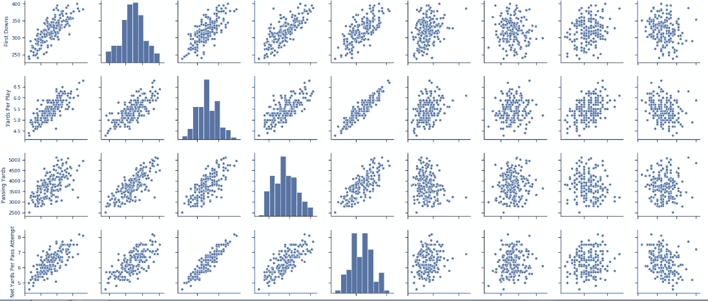
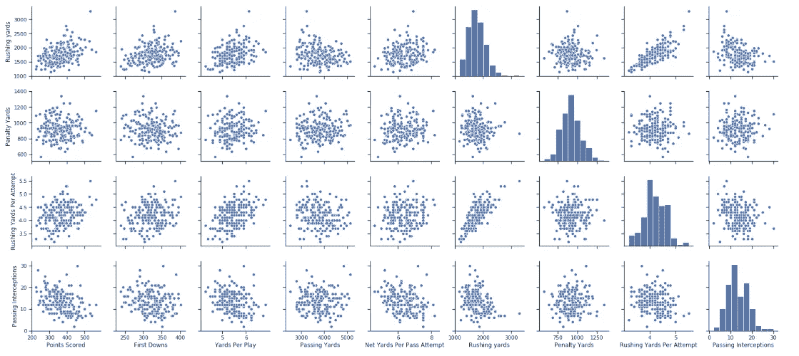
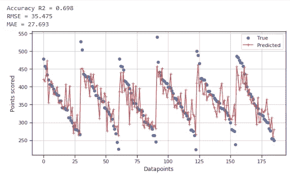
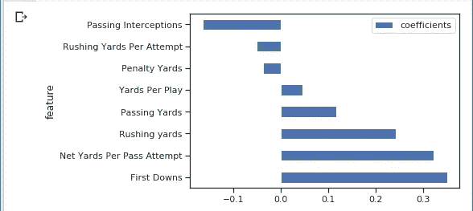
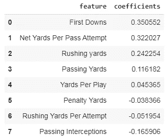
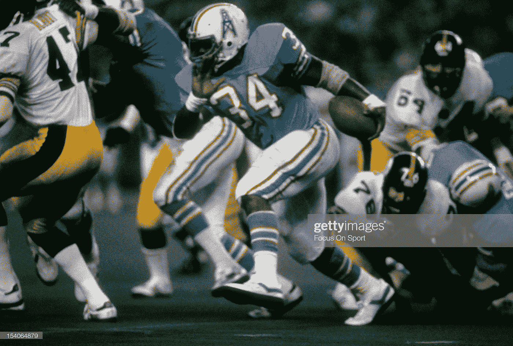
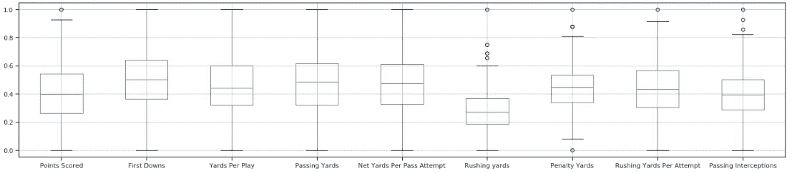

# 根据职业橄榄球参考，NFL 的哪些统计数据在进攻方面最重要？

> 原文：<https://medium.com/analytics-vidhya/which-offense-statistics-are-the-most-important-in-the-nfl-according-to-pro-football-reference-4d42cc6fc942?source=collection_archive---------5----------------------->

*我们查看了 NFL 2014-2019 常规赛的数据，并运行了随机森林回归模型，以确定哪些统计数据对得分产生了最大的影响，无论是积极还是消极的影响。第一次得分、每次尝试的净码数(传球者评分的替代方法)和冲刺码数对得分的影响最大，所有这些都是正相关的。每次尝试的冲刺码数实际上是负相关的。例如，与 20 世纪 70 年代不同的是，传球比赛似乎比整体上的快攻比赛对得分有更大的影响。*

作为一个终身的 NFL 球迷和偶尔的赌徒，我开始发现哪些进攻数据对得分有最大的影响。毕竟，比你的对手得分更多是游戏的名字，当然。例如，我想知道传球码是否比冲刺码更重要。或者惩罚是多么有害。

我们选择分数作为进攻成功(或目标)的衡量标准。许多 NFL 赔率制造者会告诉你，胜利是一个被高估的可持续成功的衡量标准，因为许多比赛比我们愿意承认的更接近 50-50 场比赛。由于与较低的胜利总数相比，我们如何得分的性质，几码可能是 9 胜(被认为勉强高于平均水平)和 11 胜(被认为非常成功)之间的差异。

我们运行了一个随机森林回归模型，根据 8 个统计数据的系数来衡量它们的影响，这些统计数据将统计范围内的不平衡标准化，因此，例如，传球码并不固有地比每次尝试的冲刺码等统计数据具有更大的权重，这只是因为传球码总数以千计，而每次尝试的冲刺码在 3 到 6 之间。

上面的散点图显示了各个变量的统计分布。对角条形图由单个统计数据组成。

我们查看了过去 6 个赛季(2014-2019)的 32 支 NFL 球队，因此随机森林回归模型共有 192 个样本。游戏会随着时间的推移而改变，所以我们不想回到过去太久。我认为，在 20 世纪 70 年代，冲码比传球更重要，当时的比赛与今天大不相同。我们包括了拦截而不是失误，因为失球是相当不可靠的。

随机森林回归模型构建了大量被称为“树”的随机决策，并根据单个树的平均预测输出类别。

具有最佳参数的测试模型的分数是. 698。

影响最大的统计数据，无论是积极的还是消极的，都是第一次传球，每次传球尝试的净码数和冲刺码数，所有这些都与得分呈正相关，这并不奇怪。《职业橄榄球参考》有一个统计数据，即每一次尝试的净码数，它主要衡量四分卫每一次尝试的传球码数，然后对麻袋、触地得分和拦截的传球进行调整。很难保持长时间的击球而不出错，所以我会预测每场比赛的码数会有更大的影响，甚至可能比第一次击球更大。

与此同时，传球拦截、每次尝试的冲刺码数和罚球码数都与得分呈负相关。这里一个令人惊讶的是，每次尝试的冲刺码数不是一个正数。也许，我们正处于 NFL 的一个点上，拥有一场好的传球比赛甚至比一场最有效的跑动比赛更重要。

该模型计算出数据集的最佳参数应该有 1，000 棵树，并且没有一棵树的最大深度应该为 20(或者每个分支不超过 20 个决策)。)

数据集中很少有异常值，也没有极端异常值。

这篇文章需要的所有代码、图表和表格都可以在这里找到。