# 强化学习和模型预测控制哪个更好？倒立摆—案例*

> 原文：<https://medium.com/analytics-vidhya/which-one-is-better-reinforcement-learning-or-model-predictive-control-inverted-pendulum-case-7fc29e52bbfb?source=collection_archive---------2----------------------->

***“你想过吗？如果有，那哪个更好？”***

*免责声明:这篇文章是根据我的经验和知识撰写的。所以，如果你认为这里有些地方写得不对，请随时联系我。

如果你来自控制工程背景，那肯定是个棘手的问题。作为一名过去学习控制工程的学生，在为系统设计控制器之前，我总是通过实现最能代表系统的数学模型来进行系统建模。有了收集到的系统模型，我们可以设计一个控制系统，在这个系统中，我们可以 100%地保证系统将根据我们的设计来跟随它的参考点。

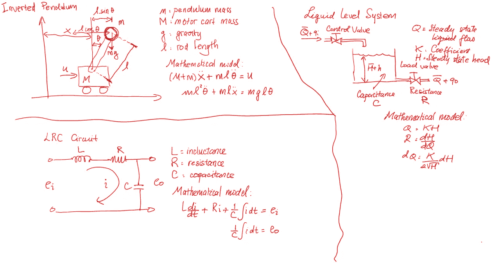

数学模型代表:电气、流体、机械系统

当设计一个控制系统时，我们可以使用很多框架和方法，从经典控制到现代控制理论。在处理单输入单输出(SISO)系统和传递函数的经典控制中，我们可以使用开关控制、PID 控制、极点配置等。

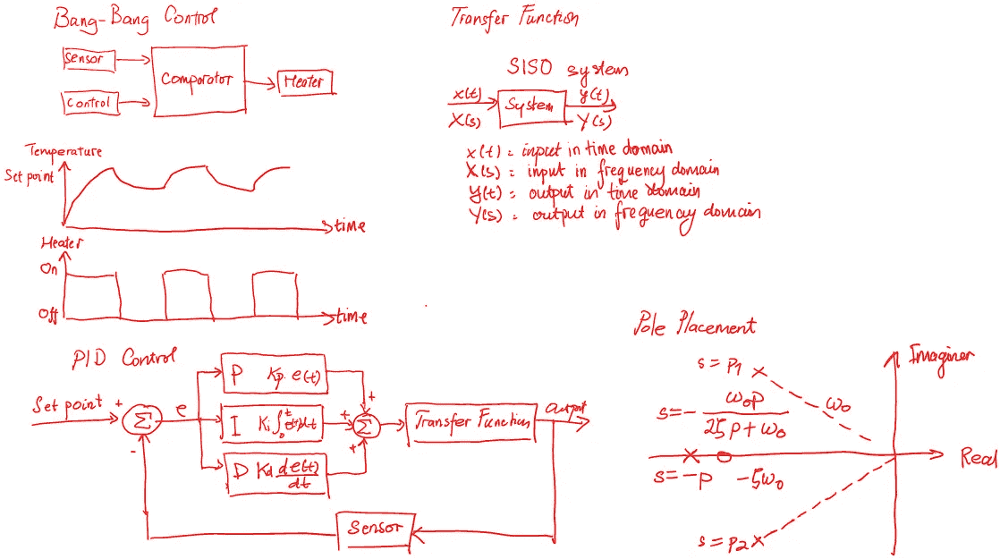

经典控制

在现代控制中，当我们处理多输入多输出(MIMO)系统时，我们需要将系统转换到状态空间，从而将多阶系统分解成一组一阶系统。有很多方法可以控制这种情况，如模型预测控制(MPC)，线性二次调节器(LQR)，鲁棒控制，庞特里亚金最大最小原理(PMP)，卡尔曼滤波器等。

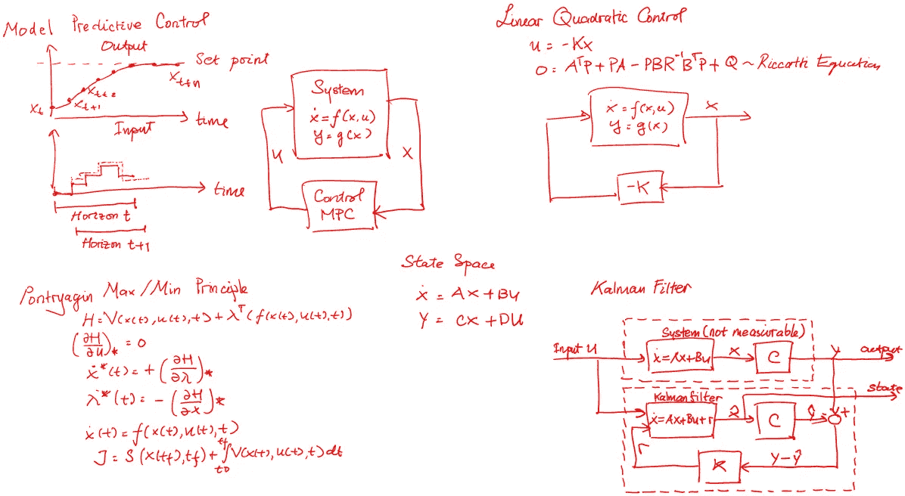

现代控制

最近几天，许多处理人工智能(AI)和机器学习(ML)的人试图实现这一点来控制理论。实际上这并不是一件新鲜事，因为一些研究人员已经尝试用神经网络来控制系统，但它仍然有局限性，因为神经网络只能在特定条件下处理控制任务，只有在它被训练的地方。如果我们有其他情况，我们需要重新训练它。当然，这与经典/现代控制非常不同，在经典/现代控制中，我们可以设置控制系统鲁棒性来处理这种情况。

后来，科学家们尝试使用 PID 控制框架，其中 PID 参数通过神经网络进行调整。此后，人工智能在控制领域的应用迅速发展，许多新的方法被用于控制系统，如蚁群优化、遗传算法、模糊控制等。现在，随着人工智能和人工智能世界的快速发展，有一种方法叫做强化学习。

> 总的来说，我们可以把控制世界分为一个**保守控制系统** **(古典和现代控制)**和**智能控制系统(AI 和 ML)** 。

现在，我们将尝试回答上面提到的关于控制倒立摆、模型预测控制和强化学习哪个更好的问题？

> **强化学习**

**强化学习** (RL)是**机器学习**的一个领域，它有两个组成部分:代理和环境。它被认为是与监督学习和非监督学习并列的三种基本机器学习范式之一。

> 它是如何工作的？

这个代理将把行动放入环境中，以最大化累积回报的概念。当代理对环境采取行动时，环境将更新其状态，作为代理计算奖励和更新行动的输入。在控制术语中，我们可以把代理想象成控制器，把环境想象成我们想要控制的系统。

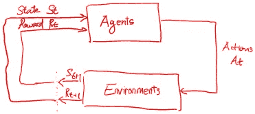

强化学习工作流程

为了给倒立摆任务的环境建模，我们将使用由 OpenAI 开发的工具包，名为 [OpenAI Gym](https://gym.openai.com/) 。OpenAI Gym 是一个用于开发和比较强化学习算法的工具包，它为训练和测试强化学习代理提供了几个预定义的环境，包括用于经典物理控制任务的环境。

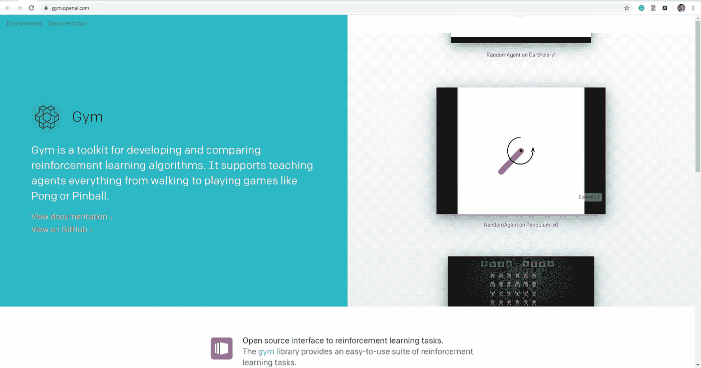

奥鹏健身馆

所以下面是用 Python 实现 OpenAI Gym 的 RL 的步骤[1]:

第一步:安装 OpenAI Gym 并给图书馆打电话

```
!pip install gymimport tensorflow as tf
import numpy as np
import base64, io, time, gym
import IPython, functools
import matplotlib.pyplot as plt
from tqdm import tqdm
```

第二步:初始化环境，我们将使用车杆环境，因为它最能代表倒立摆的情况

```
env = gym.make(“CartPole-v0”)
env.seed(1)
```

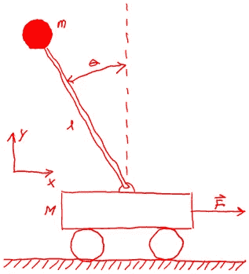

开放式体育馆的推车杆系统

第 3 步:定义推车杆代理

```
### Define the Cartpole agent ###
# Defines a feed-forward neural networkdef create_cartpole_model():
model = tf.keras.models.Sequential([# First Dense layer
tf.keras.layers.Dense(units=32, activation=’relu’),# Define the last Dense layer, which will provide the network’s output.
tf.keras.layers.Dense(units=n_actions, activation=None) # TODO])return model
cartpole_model = create_cartpole_model()
```

这个 cart 极点代理被描述为具有 32 个隐藏密集单元和 2 个输出的前馈神经网络。

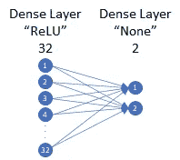

手推车杆代理描述

步骤 4:定义代理的动作

```
### Define the agent’s action function #### 
# Function that takes observations as input, executes a forward pass through model, and outputs a sampled action.# Arguments:
# model: the network that defines our agent
# observation: observation which is fed as input to the model# Returns:
# action: choice of agent actiondef choose_action(model, observation):
   # add batch dimension to the observation
   observation = np.expand_dims(observation, axis=0) # Feed the observations through the model to predict the log      probabilities of each possible action
   logits = model.predict(observation) # pass the log probabilities through a softmax to compute true probabilities
   prob_weights = tf.nn.softmax(logits).numpy() # Randomly sample from the prob_weights to pick an action.
   action = np.random.choice(n_actions, size=1,   p=prob_weights.flatten())[0] # TODOreturn action
```

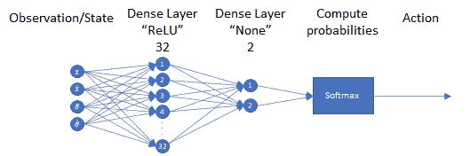

代理人的行动

第五步:定义代理的记忆

```
### Agent Memory ###class Memory:
   def __init__(self):
      self.clear()# Resets/restarts the memory buffer
   def clear(self):
      self.observations = []
      self.actions = []
      self.rewards = []# Add observations, actions, rewards to memory def add_to_memory(self, new_observation, new_action, new_reward):
      self.observations.append(new_observation)
      self.actions.append(new_action) 
      # Update the list of rewards with new reward
      self.rewards.append(new_reward)memory = Memory()
```

第六步:定义奖励函数

```
### Reward function ###
# Helper function that normalizes an np.array xdef normalize(x):
   x -= np.mean(x)
   x /= np.std(x)
   return x.astype(np.float32)# Compute normalized, discounted, cumulative rewards (i.e., return)
# Arguments:
# rewards: reward at timesteps in episode
# gamma: discounting factor# Returns:
# normalized discounted reward
def discount_rewards(rewards, gamma=0.95):
   discounted_rewards = np.zeros_like(rewards)
   R = 0
   for t in reversed(range(0, len(rewards))):
      # update the total discounted reward
      R = R * gamma + rewards[t]
      discounted_rewards[t] = R return normalize(discounted_rewards)
```

步骤 7:定义损失函数

```
### Loss function ###
# Arguments:
# logits: network’s predictions for actions to take
# actions: the actions the agent took in an episode
# rewards: the rewards the agent received in an episode# Returns:
# lossdef compute_loss(logits, actions, rewards):
   # Compute the negative log probabilities
   neg_logprob = tf.nn.sparse_softmax_cross_entropy_with_logits(logits=logits, labels=actions # Scale the negative log probability by the rewards
   loss = tf.reduce_mean( neg_logprob * rewards ) # TODO
   return loss
```

步骤 8:使用损失函数来定义学习算法的训练步骤

```
### Training step (forward and backpropagation) ###def train_step(model, optimizer, observations, actions, discounted_rewards): with tf.GradientTape() as tape:
      # Forward propagate through the agent network
      logits = model(observations)
      # Call the compute_loss function to compute the loss’’’
      loss = compute_loss(logits, actions, discounted_rewards)
      # Run backpropagation to minimize the loss using the    tape.gradient method grads = tape.gradient(loss, model.trainable_variables)
   optimizer.apply_gradients(zip(grads, model.trainable_variables))
```

第九步:运行车杆

```
### Cartpole training! #### Learning rate and optimizer
learning_rate = 1e-3
optimizer = tf.keras.optimizers.Adam(learning_rate)# instantiate cartpole agent
cartpole_model = create_cartpole_model()# to track our progress
smoothed_reward = mdl.util.LossHistory(smoothing_factor=0.9)
plotter = mdl.util.PeriodicPlotter(sec=2, xlabel=’Iterations’, ylabel=’Rewards’)
if hasattr(tqdm, ‘_instances’): tqdm._instances.clear() # clear if it existsfor i_episode in range(500):
   plotter.plot(smoothed_reward.get())
   # Restart the environment
   observation = env.reset()
   memory.clear()
   while True:
   # using our observation, choose an action and take it in the environment
   action = choose_action(cartpole_model, observation)
   next_observation, reward, done, info = env.step(action)
   # add to memory
   memory.add_to_memory(observation, action, reward)
   # is the episode over? did you crash or do so well that you’re done?
   if done:
      # determine total reward and keep a record of this
      total_reward = sum(memory.rewards)
      smoothed_reward.append(total_reward)
      # initiate training — remember we don’t know anything about how the
      # agent is doing until it has crashed!
      train_step(cartpole_model, optimizer, observations=np.vstack(memory.observations),actions=np.array(memory.actions),discounted_rewards = discount_rewards(memory.rewards)) # reset the memory
      memory.clear()
      break # update our observatons
   observation = next_observation
```

一般来说，下图总结了所有的工作流程:

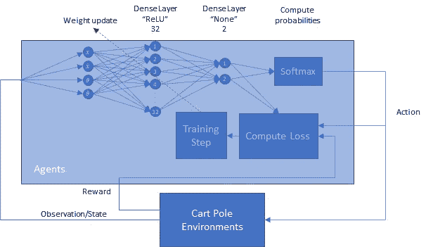

强化学习工作流程

> **模型预测控制**

**模型预测控制** (MPC)被广泛认为是过程控制的高级方法，用于在满足一组约束的同时控制过程。但近年来，它也被用于控制电气和机械系统。

> 它是如何工作的？

MPC 使用系统模型来预测系统的未来行为。MPC 求解一个在线优化算法，以找到将预测输出驱动到参考值的最优控制动作。MPC 可以处理输入和输出之间可能存在相互作用的多输入多输出系统。它还可以处理输入和输出约束[3]。

简而言之，MPC 是一种优化方法，您可以在每个有限时间范围内迭代优化输入。它被称为在线，因为优化是迭代完成的，直到系统达到其设定点。这不同于其它优化方法，在其它优化方法中，控制增益的计算仅在过程开始之前进行一次。

所以下面是用 Python 实现 OpenAI Gym 的 MPC 的步骤[2]:

第一步:确定大车行走杆的数学模型

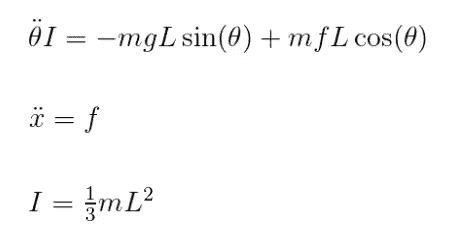

推车杆数学模型

事实上，我们可以使用很多 cart 杆数学模型，这取决于假设，因为有一个模型忽略了杆的惯性矩。所以我们需要明智地选择模型。

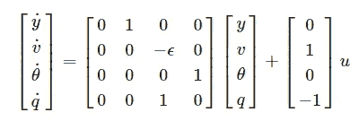

状态空间中的其他车极点数学模型[https://apmonitor.com/do/index.php/Main/InvertedPendulum](https://apmonitor.com/do/index.php/Main/InvertedPendulum)

步骤 2:确定成本函数

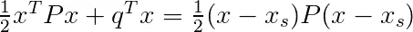

二次成本函数

第三步:打电话给图书馆

```
import matplotlib.animation as animation
import numpy as np
from mpc import MPC
import numpy as np
import gym
import mitdeeplearning as mdl
```

步骤 4:运行 MPC 模型

```
env = gym.make(‘CartPole-v0’)
env.seed(1)

start_theta = 0 
mpc = MPC(0.5,0,start_theta,0) 
action = 0
for i_episode in range(1):
   observation = env.reset()
    for t in range(500):
    env.render()
    observation, reward, done, info = env.step(action)
    a = mpc.update(observation[0] + 0.5, observation[1],     observation[2]+np.pi, observation[3])
    env.env.force_mag = abs(a)
    #print(a)
    if a < 0:
       action = 0
    else:
       action = 1
    if done:
       pass
```

> 结果

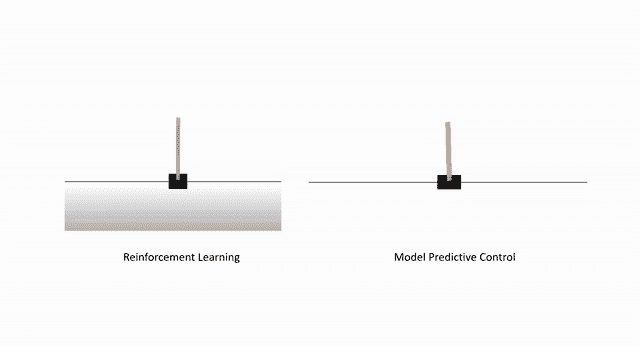

模拟结果

从上面的结果中，假设目标是保持极点平直，最大偏差为 15 度，我们可以看到 RL 比 MPC 给出了更令人满意的定性结果。RL 成功地从一开始就保持极点笔直，而 MPC 在开始时失败，即使它在那之后开始保持极点笔直。

这一结果肯定会让我们感到惊讶，因为我们需要有一个系统的数学模型，而这往往是控制工程师的一个痛点，所以我们花了很多精力来做 MPC 计算。当然，我们可以通过找到另一个数学模型或 MPC 参数来克服这个问题。但这里最重要的是 RL 给了我们更好的结果，即使我们不知道推车杆的数学模型，通过使用基于策略的策略，该算法成功地控制推车以保持杆笔直。

> 讨论

当然，从控制背景来看，我不能说 RL 完全克服了 MPC，所以我们将来不需要任何控制理论。系统的模型仍然很重要，因为有了它，我们可以用李亚普诺夫定理[4]检查系统的稳定性。如果你能保证系统的稳定性，那么你就能保证你的控制器在将来发生意外时不会出故障。

尽管 RL 给了我们一个满意的结果，但是仍然有一些限制，因为我们不能证明 RL 算法的成功，直到我们模拟它。好的一面是，现在对可解释机器学习的研究正在发展。希望这将是对持怀疑态度的保守控制工程师在实际情况下实施 RL 的一个回答，特别是在对安全要求非常严格的工业情况下[5]。

> 参考

[1]代码改编自 MIT 深度学习训练营:[https://github.com/aamini/introtodeeplearning](https://github.com/aamini/introtodeeplearning)

[2]代码改编自 Philip Zucker 的博客:[http://www . Philip Zucker . com/model-predictive-control-of-cart pole-in-open ai-gym-using-osqp/](http://www.philipzucker.com/model-predictive-control-of-cartpole-in-openai-gym-using-osqp/)

[3]https://en.wikipedia.org/wiki/Model_predictive_control

[https://en.wikipedia.org/wiki/Lyapunov_stability](https://en.wikipedia.org/wiki/Lyapunov_stability)

[https://arxiv.org/pdf/1901.04592.pdf](https://arxiv.org/pdf/1901.04592.pdf)