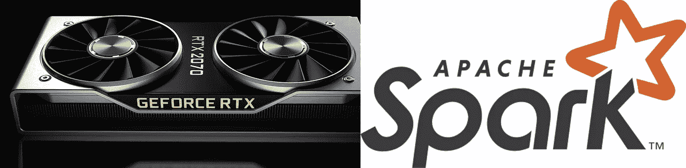

# 选哪个？GPU 计算与 Apache Spark 来扩展您的下一个大任务

> 原文：<https://medium.com/analytics-vidhya/which-one-to-pick-gpu-computing-vs-apache-spark-to-scale-your-next-big-task-c26b811b47a7?source=collection_archive---------3----------------------->

## 选择正确的并行计算框架的经验法则

GPU 对 Spark(图片[souce 1](https://en.wikipedia.org/wiki/Apache_Spark)&[source 2](https://www.nvidia.com/en-in/geforce/graphics-cards/rtx-2070/)

[并行计算](https://en.wikipedia.org/wiki/Parallel_computing)是一种计算类型，其中计算或进程的执行是同时进行的。大问题通常可以分成小问题，然后可以同时解决。双方[阿帕奇](https://en.wikipedia.org/wiki/Apache_Spark) …