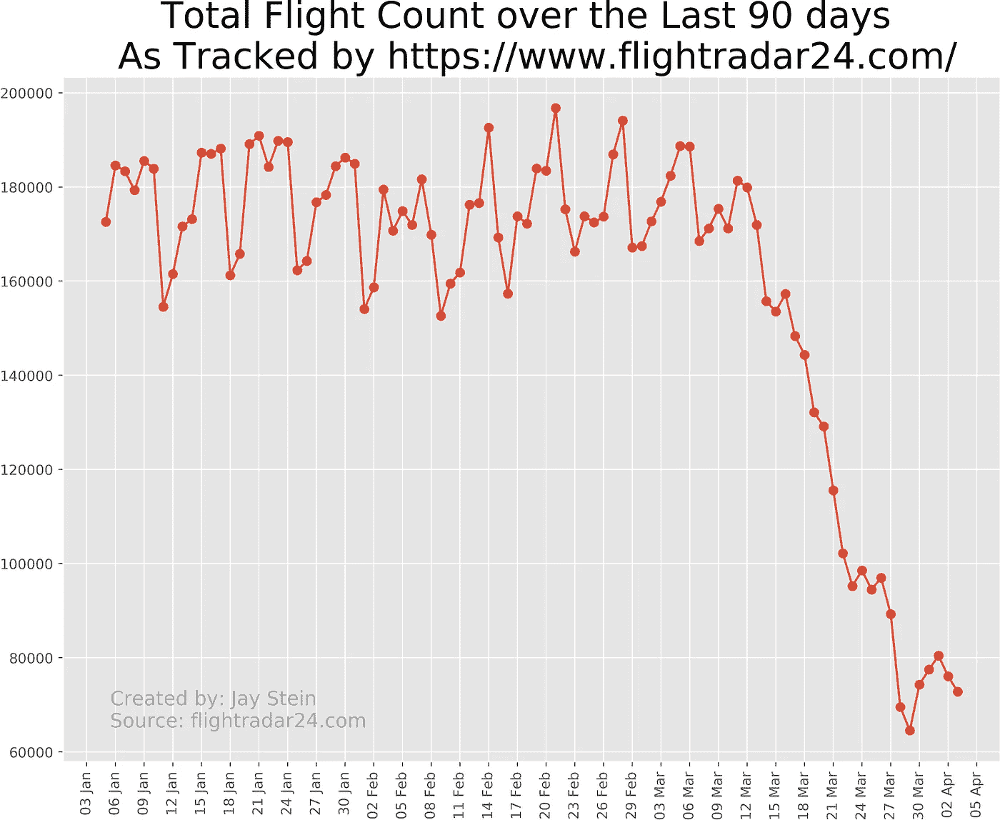
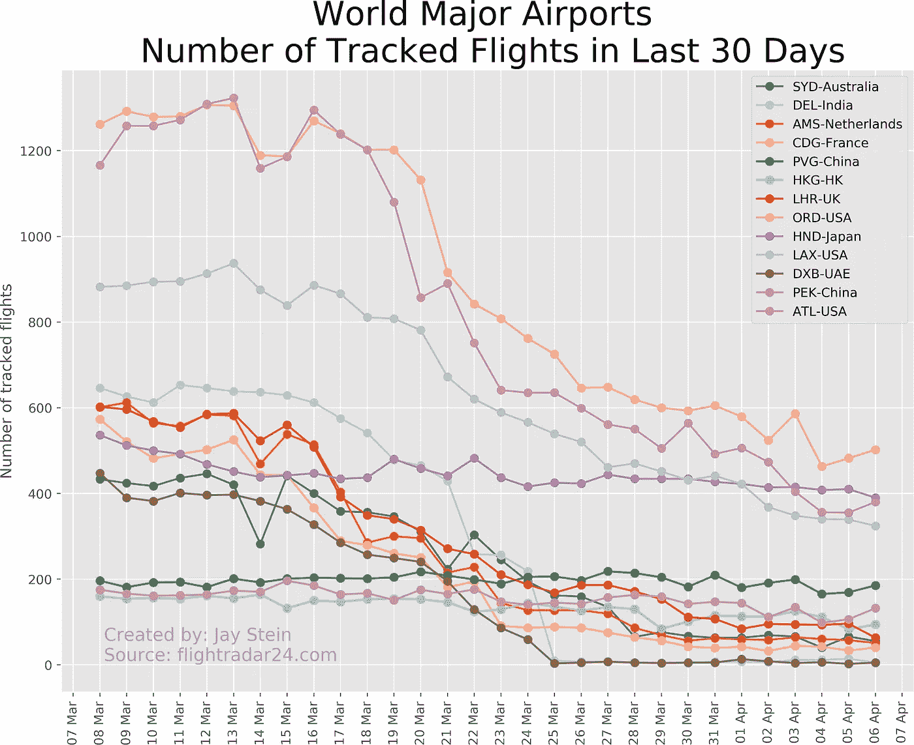
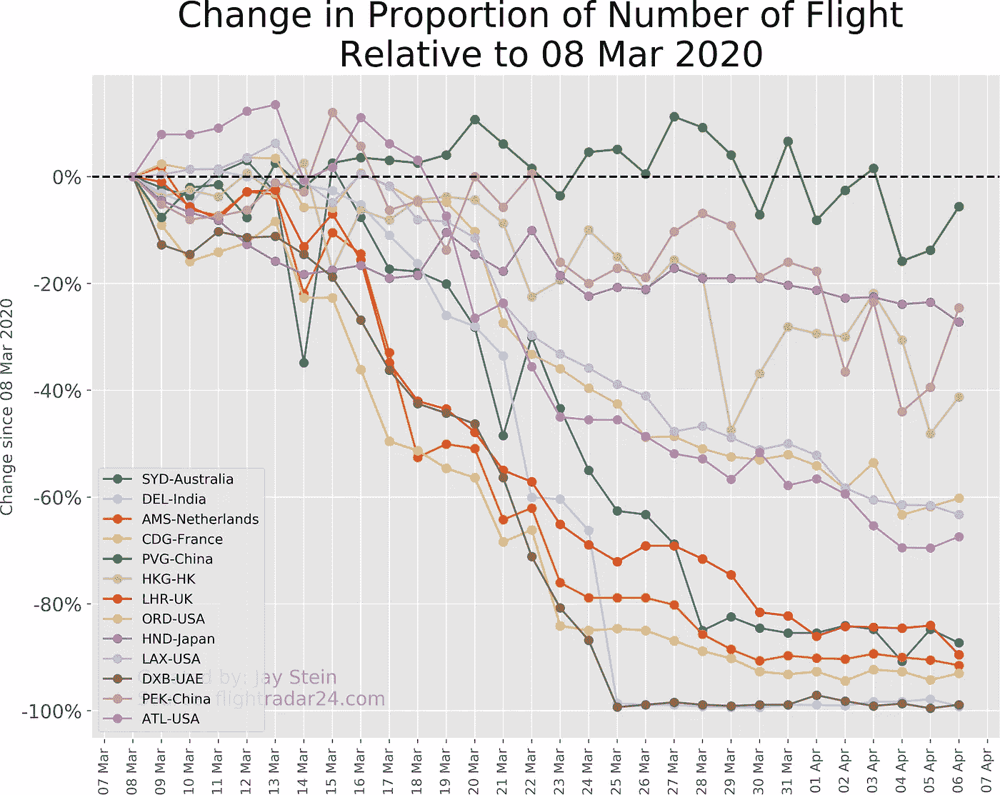

# 谁先行动的？冠状病毒及其对全球空中交通的影响

> 原文：<https://medium.com/analytics-vidhya/who-acted-first-coronavirus-and-the-impact-on-global-air-traffic-1986b2b792a6?source=collection_archive---------32----------------------->

随着新冠肺炎的影响越来越大，大多数国家都急于封锁边境，大幅减少任何形式的旅行。这意味着许多航空公司停飞了他们的机队，航空旅行被限制在绝对必要的范围内。


由[汤姆·巴瑞特](https://unsplash.com/@wistomsin?utm_source=medium&utm_medium=referral)在 [Unsplash](https://unsplash.com?utm_source=medium&utm_medium=referral) 上拍摄的照片

为了更好地理解这是如何影响航空旅行的，我求助于 www.flightradar24.com，过去我经常使用它来查找现在什么飞机正在我头顶飞过——以及跟踪即将到来的朋友和家人的航班。我没有意识到的是，flightradar24 也有每个机场的跟踪航班统计数据。这正是我在这里采用的数据来源。

我观察了世界上最繁忙的机场(来源:[https://www . international Airport review . com/article/32311/top-20-largest-airports-world-passenger-number/](https://www.internationalairportreview.com/article/32311/top-20-largest-airports-world-passenger-number/))然而，我承认我偷偷把悉尼机场加入其中，尽管它并没有排在前 20 名。

# **攻击计划**

*   下载并安装 Chrome 驱动程序
*   使用 pip 安装 Selenium
*   抓取每个机场的 JavaScript 图
*   探索数据，看看隐藏着什么样的见解

请随意跟进——我将把我的笔记本和数据放在我的 Github 账户[https://github.com/jay-stein/airtraffic-covid19](https://github.com/jay-stein/airtraffic-covid19)下。如果您发现任何错误或问题，请大声喊出来！

# 第一步:下载并安装 Chrome 驱动程序

首先，我弄清楚我使用的是什么版本的 Chrome。只需使用 URL chrome://system/

接下来，我从 https://chromedriver.chromium.org/downloads[下载并安装了 Chrome 驱动程序——我的 Chrome 版本是 v80，但你的可能会有所不同。确保您获得匹配的版本！](https://chromedriver.chromium.org/downloads)

最后，我需要下载 Selenium 包——我只是使用常规的 pip 来这样做。

# 第二步:观察全球整体飞行趋势

这部分很简单——我只是直接从 https://www.flightradar24.com/data/statistics 下载了数据。他们拥有如此多的数据，真是令人惊讶！

这张图表显示了他们所有被跟踪的航班，包括商业、商务飞机、一些私人航班、一些直升机航班，甚至(一些)无人机！



这个图表很能说明问题，3 月 19 日之后，全球航班数量直线下降。它很快下降到每天 180，000 次航班的原始基线的大约 1/3。

# 第三步:搜集全球最繁忙机场的数据

在下一步中，我创建了一个小函数来收集这些超级繁忙的机场的数据。每个图表都有两个系列，但是我在这里只看了跟踪的航班。

当你在 airport 列表中运行该功能时，你会注意到 Chrome 会打开一个新的实例来执行抓取。

您可能还会注意到代码中的下面一行——这一步是将 Unix 时间戳——原始图形就是用它创建的——转换成更熟悉的 datetime 格式。

```
pd.to_datetime(tracked[‘date’], unit=’ms’
```

*一个扩展练习是使用跟踪航班和计划航班计算取消率。*

# 包括哪些机场

*   ATL:亚特兰大哈兹菲尔德-杰克逊-美国
*   北京首都-中国
*   DXB:迪拜国际机场-阿联酋
*   洛杉矶国际机场:美国洛杉矶
*   HND:日本东京羽田
*   订单:美国芝加哥奥黑尔
*   LHR:伦敦希思罗机场-英国
*   HKG:香港-香港
*   PVG:中国上海浦东
*   CDG:巴黎戴高乐机场-法国
*   AMS:荷兰阿姆斯特丹史基浦机场
*   德尔:印度德里英迪拉·甘地
*   SYD:悉尼-澳大利亚(不是前 10 或 20 名！)

# 组合数据帧

为了创建最终的数据框，我使用下面的简短脚本来运行前面创建的 get_airport()函数。这将运行每个机场的功能，并将它们合并到一个数据帧中。

# 第四步:观想和洞见

下面我简单介绍了我的 Jupyter 笔记本的输出——请随意跟随 https://github.com/jay-stein/airtraffic-covid19

第一张图显示了这些特别繁忙的机场每天的绝对航班数量。由于对交通活动的严格限制，大多数机场的下降趋势显而易见。

令人吃惊的是一些机场的下降趋势有多快。相反，一些中国机场对疫情的反应要早得多，因此北京和 PVG 的航班相对稳定，每天大约有 200 个航班。

这些数字仅仅是你对这两个机场预期的 10-15%(PEK =每天 1682 次航班，PVG=平均每天 1383 次航班。来源:维基百科)



为了更好地了解这些超级繁忙机场的转折点，我计算了相对于 3 月 8 日(第一个数据点)的百分比变化。

这个 liner 过滤原始数据帧，只显示“跟踪的”航班，而不是预定的航班。lambda 函数然后计算自 3 月 8 日以来每个机场的百分比变化。

```
df_delta = df_final.filter(like='track').apply(lambda x: x.pct_change().fillna(0).add(1).cumprod().sub(1))
```



这一比例变化凸显了一些国家为遏制病毒传播而采取的戏剧性应对措施。

进一步分析的一个选择是，通过将每日航班数与滚动平均值进行比较，量化每个机场何时出现转折点。

如上所述，在很大程度上，对航班的影响似乎是随着病毒在地理上的传播而发生的。

*   如前所述，由于武汉病毒的出现，中国机场的反应要早得多。
*   AMS 和 CDG 等欧洲机场从 3 月 14 日开始减少航班
*   澳大利亚悉尼大约在 3 月 16 日做出了回应
*   美国机场从 3 月 19 日左右开始减少航班数量。
*   截至 3 月 25 日，印度德尔机场和 DXB 迪拜机场几乎完全停飞了所有航班。

非常感谢您阅读我的短文——希望这是一种通过 Selenium 探索一些伟大数据集的有趣方式。