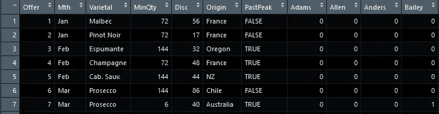
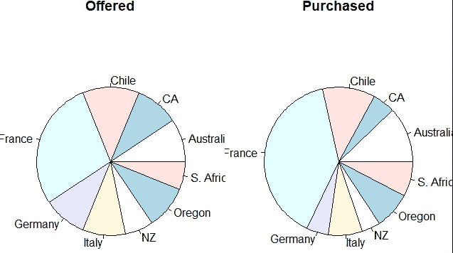
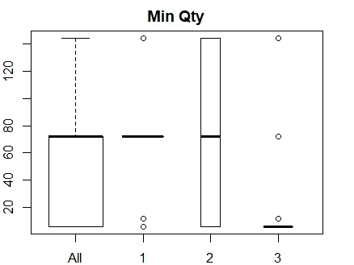
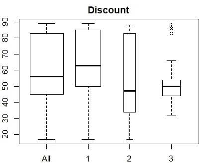
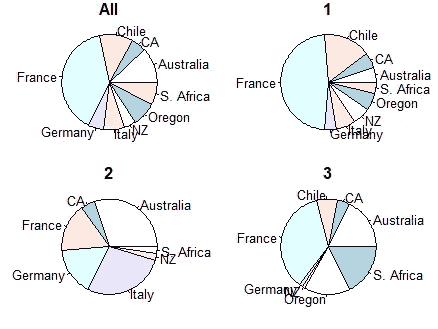
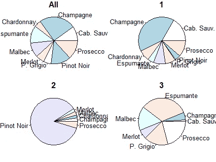
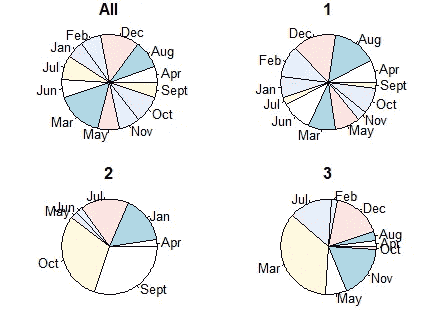
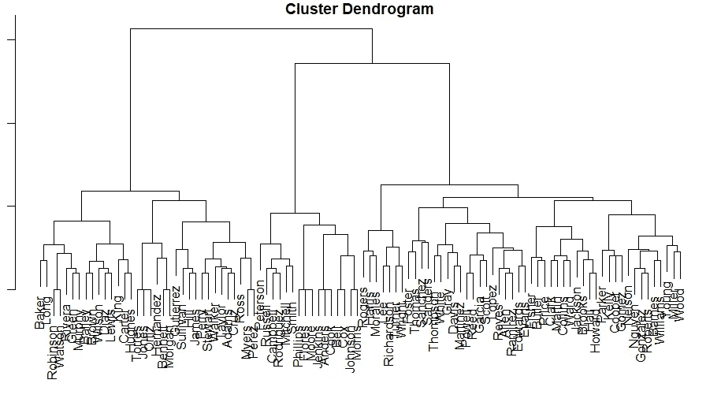
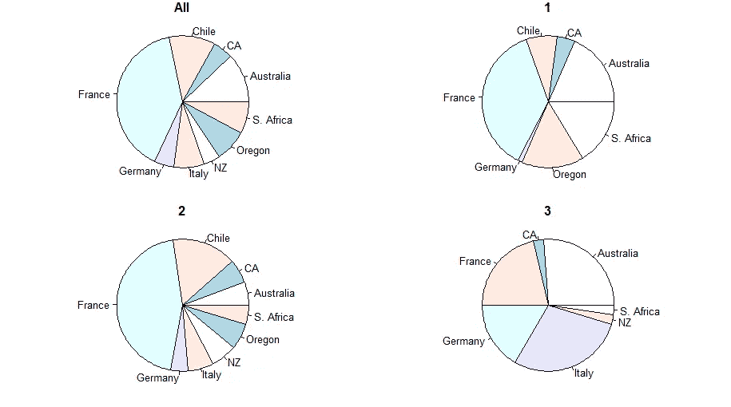
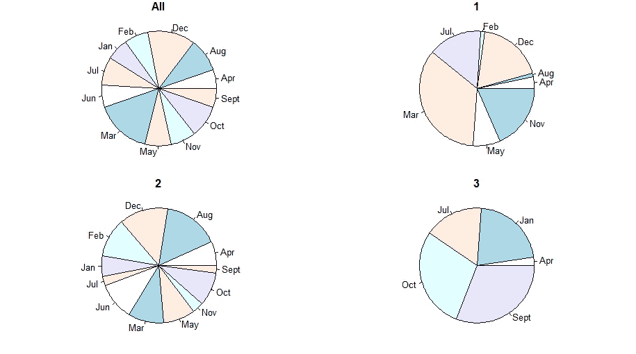

# 谁是你的客户？找出在 R 中使用集群的方法！

> 原文：<https://medium.com/analytics-vidhya/who-are-your-customers-find-out-using-clustering-in-r-f553296c8433?source=collection_archive---------29----------------------->

2020 快乐！作为一名商业分析师，我一直忙于利用机器学习方法，因此没有向 Medium 发帖。今天我想演示 R 中的集群，因为它适用于许多业务问题。我大多用 R，但是你要清楚，你可以在 Excel 里做机器学习！

几年前，约翰·福尔曼(John Foreman)出版了一本名为《数据智能》(Data Smart)的精彩书籍，演示了如何做到这一点。如果你是机器学习或统计的新手，我强烈推荐它，因为在如何在 Excel 中设置这些项目的过程中，你会了解算法是如何工作的。稍后，他展示了如何在 R 中完成这些项目，但重要的是这里的旅程，而不是目的地。我写这篇文章的灵感来源于这本书强调的一步一步地了解每个点上发生的事情。我将使用两种不同的方法对一个数据集进行聚类，但只使用基本的 R 函数，并展示探索性分析。当然，还有更快、更巧妙的方法，但我喜欢在本文中展示“先走后跑”。

对于本文，我使用 Data Smart book 中的一个数据集来演示集群。我曾在商业环境中使用聚类来发现人群，如客户和员工。例如，按绩效指标对员工进行分组可以快速向您展示绩效最高的员工与绩效最低的员工的区别，或者让您对员工有一个更细致的了解，他们在某个指标上可能很强，但在另一个指标上却很弱。它还可以为您突出显示哪些指标不能预测性能。

虽然 Data Smart 在他的书中展示了如何使用 R 对一家假设的葡萄酒公司的客户进行聚类，但我将在几行代码中完成，我希望这些代码将阐明某些步骤，并强调探索您的数据。我将对聚类使用两种不同的方法:k-means 和 hierarchical。

这本书的数据可以在该书的网站上找到，[wiley.com/go/datasmart](http://wiley.com/go/datasmart)

这里我简单地从 set.seed 开始，这样结果是可重复的。您需要使用 head 或 tail 函数来查看数据。我们有许多提供给客户的葡萄酒，葡萄酒报价显示了品种、产地等细节。如果顾客购买了它，他们的名字就会有一个 1。



数据集的一部分

我将在人们没有购买的地方添加零，然后转置文件，这样我们就可以正确地设置聚类。

```
set.seed(123)
AllWine<-read.csv(“WineKMC.csv”, stringsAsFactors = FALSE)
AllWine[is.na(AllWine)]<-0
#the 1’s and 0’s now start at row 8, ending on 107 and extend from column 1 to 32#creating a subset of only 1’s and 0’s for clustering which needs to be transposed
wine<-t(AllWine[1:32,8:107])
```

首先，我们来看看提供了什么，实际购买了什么。如果有很大的差异，我们发现了一个机会，要么消除浪费的机会，要么利用一些意想不到的流行。我将通过创建变量来实现这一点，方法是循环遍历并重复一个词，比如一个月中购买葡萄酒的次数。我将输出两个饼图，显示提供的品种数与购买的品种数之间是否存在差异。你也可以浏览和绘制月份，看看最受欢迎的月份在哪里。

```
MonthAll<-rep(AllWine[1,2],sum(AllWine[1, 8:(ncol(AllWine))]))
VarietalAll<-rep(AllWine[1,3],sum(AllWine[1, 8:(ncol(AllWine))]))
MinQtyAll<-rep(AllWine[1,4],sum(AllWine[1, 8:(ncol(AllWine))]))
DiscountAll<-rep(AllWine[1,5],sum(AllWine[1, 8:(ncol(AllWine))]))
OriginAll<-rep(AllWine[1,6],sum(AllWine[1, 8:(ncol(AllWine))]))
PastPeakAll<-rep(AllWine[1,7],sum(AllWine[1, 8:(ncol(AllWine))]))for (i in 2:32) {
  MonthAll<-c(MonthAll, rep(AllWine[i,2],sum(AllWine[i, 8:(ncol(AllWine))])))
  VarietalAll<-c(VarietalAll, rep(AllWine[i,3],sum(AllWine[i, 8:(ncol(AllWine))])))
  MinQtyAll<-c(MinQtyAll, rep(AllWine[i,4],sum(AllWine[i, 8:(ncol(AllWine))])))
  DiscountAll<-c(DiscountAll, rep(AllWine[i,5],sum(AllWine[i, 8:(ncol(AllWine))])))
  OriginAll<-c(OriginAll, rep(AllWine[i,6],sum(AllWine[i, 8:(ncol(AllWine))])))
  PastPeakAll<-c(PastPeakAll, rep(AllWine[i,7],sum(AllWine[i, 8:(ncol(AllWine))])))
}par(mfrow = c(1, 2))
par(mar = c(1,1,1,1))
pie(table(AllWine$Origin), main="Offered")
pie(table(OriginAll), main = "Purchased")
```



这两个看起来很相似。购买与出价成正比。

虽然目测显示提供的大部分是购买的，但您可以做一个快速的卡方检验来检查:

```
chisq.test((table(AllWine$Origin)),(table(OriginAll)), simulate.p.value = TRUE)
#the resulting p-value of .3088 does not indicate strong significance, as expected.
```

我们应该用多少个集群？为了回答这个问题，我将循环使用 k-means 聚类算法，并在具有 1 到 10 个聚类的情况下绘制平方和。

```
#Starting kmeans clustering. From the kmeans help file:
#"The algorithm of Hartigan and Wong (1979) is used by default. 
#...The Hartigan–Wong algorithm generally does a better job [than other algorithms]...
#trying several random starts (nstart> 1) is often recommended."
#You can tune your clustering by many different methods, let's keep it simple here.m<-matrix(nrow=10, ncol = 2)
for (i in 1:10){
  clusters<-kmeans(wine, centers = i, nstart = 10)
  m[i, 1]<-clusters$totss 
  m[i, 2]<-clusters$betweenss
}par(mfrow = c(1, 1))
par(mar = c(2,2,2,2))
plot(m[,2], type = "l")
```

从这一行看，3 到 5 个集群应该可以做到这一点，这与 Data Smart 一书中的发现一致。该图没有强烈的弯曲或“肘形”,但似乎在 3 至 5 个集群后开始变平。
让我们给三组试一试。

```
ThreeClusters<-kmeans(wine, centers = 3, nstart = 10)
ThreeClusters$size #these are the counts in each group
names(ThreeClusters$cluster)[ThreeClusters$cluster==1] #these are the names of people in cluster 1
ThreeClusters$cluster #these are the cluster assignments. It's always advisable to explore what output you get when you're unfamiliar with a method.
```

我用 k 均值法创建了三个聚类。现在，我将为每个聚类创建三个数据子集，以便我们可以分析它们并将其与总数据框进行比较。

我将初始化数据，以便您可以看到我是如何设置子集的，然后继续遍历其余的列，为三个集群中的每一个构建数据。

```
Month1<-rep(clust1[1,2],sum(clust1[1, 8:(ncol(clust1))]))
Varietal1<-rep(clust1[1,3],sum(clust1[1, 8:(ncol(clust1))]))
MinQty1<-rep(clust1[1,4],sum(clust1[1, 8:(ncol(clust1))]))
Discount1<-rep(clust1[1,5],sum(clust1[1, 8:(ncol(clust1))]))
Origin1<-rep(clust1[1,6],sum(clust1[1, 8:(ncol(clust1))]))
PastPeak1<-rep(clust1[1,7],sum(clust1[1, 8:(ncol(clust1))]))for (i in 2:32) {
  Month1<-c(Month1, rep(clust1[i,2],sum(clust1[i, 8:(ncol(clust1))])))
  Varietal1<-c(Varietal1, rep(clust1[i,3],sum(clust1[i, 8:(ncol(clust1))])))
  MinQty1<-c(MinQty1, rep(clust1[i,4],sum(clust1[i, 8:(ncol(clust1))])))
  Discount1<-c(Discount1, rep(clust1[i,5],sum(clust1[i, 8:(ncol(clust1))])))
  Origin1<-c(Origin1, rep(clust1[i,6],sum(clust1[i, 8:(ncol(clust1))])))
  PastPeak1<-c(PastPeak1, rep(clust1[i,7],sum(clust1[i, 8:(ncol(clust1))])))
}Month2<-rep(clust2[1,2],sum(clust2[1, 8:(ncol(clust2))]))
Varietal2<-rep(clust2[1,3],sum(clust2[1, 8:(ncol(clust2))]))
MinQty2<-rep(clust2[1,4],sum(clust2[1, 8:(ncol(clust2))]))
Discount2<-rep(clust2[1,5],sum(clust2[1, 8:(ncol(clust2))]))
Origin2<-rep(clust2[1,6],sum(clust2[1, 8:(ncol(clust2))]))
PastPeak2<-rep(clust2[1,7],sum(clust2[1, 8:(ncol(clust2))]))for (i in 2:32) {
  Month2<-c(Month2, rep(clust2[i,2],sum(clust2[i, 8:(ncol(clust2))])))
  Varietal2<-c(Varietal2, rep(clust2[i,3],sum(clust2[i, 8:(ncol(clust2))])))
  MinQty2<-c(MinQty2, rep(clust2[i,4],sum(clust2[i, 8:(ncol(clust2))])))
  Discount2<-c(Discount2, rep(clust2[i,5],sum(clust2[i, 8:(ncol(clust2))])))
  Origin2<-c(Origin2, rep(clust2[i,6],sum(clust2[i, 8:(ncol(clust2))])))
  PastPeak2<-c(PastPeak2, rep(clust2[i,7],sum(clust2[i, 8:(ncol(clust2))])))
}Month3<-rep(clust3[1,2],sum(clust3[1, 8:(ncol(clust3))]))
Varietal3<-rep(clust3[1,3],sum(clust3[1, 8:(ncol(clust3))]))
MinQty3<-rep(clust3[1,4],sum(clust3[1, 8:(ncol(clust3))]))
Discount3<-rep(clust3[1,5],sum(clust3[1, 8:(ncol(clust3))]))
Origin3<-rep(clust3[1,6],sum(clust3[1, 8:(ncol(clust3))]))
PastPeak3<-rep(clust3[1,7],sum(clust3[1, 8:(ncol(clust3))]))for (i in 2:32) {
  Month3<-c(Month3, rep(clust3[i,2],sum(clust3[i, 8:(ncol(clust3))])))
  Varietal3<-c(Varietal3, rep(clust3[i,3],sum(clust3[i, 8:(ncol(clust3))])))
  MinQty3<-c(MinQty3, rep(clust3[i,4],sum(clust3[i, 8:(ncol(clust3))])))
  Discount3<-c(Discount3, rep(clust3[i,5],sum(clust3[i, 8:(ncol(clust3))])))
  Origin3<-c(Origin3, rep(clust3[i,6],sum(clust3[i, 8:(ncol(clust3))])))
  PastPeak3<-c(PastPeak3, rep(clust3[i,7],sum(clust3[i, 8:(ncol(clust3))])))
}
```

让我们通过与整个数据集“全部”的比较来探索我们的集群。

```
par(mfrow = c(1,1))
par(mar = c(2,2,2,2))
boxplot(MinQtyAll, MinQty1, MinQty2, MinQty3, names = c("All", 1, 2, 3), main="Min Qty", varwidth=T)
boxplot(DiscountAll, Discount1, Discount2, Discount3, names = c("All", 1, 2, 3), main="Discount", varwidth=T)
```



对于最小数量，我们的中位数似乎是 70，这类似于集群 1 和 2 的购买量，而不是 3。集群 1 似乎喜欢折扣，而集群 2 无论折扣多少或最小数量多少都会购买，他们显然有一个比这些推动他们购买的因素更强的偏好。聚类 3 不会因为折扣而强烈移动，并且给定中值相对较低且分布紧密，看起来它们似乎会因为强烈的折扣而关闭，可能将高折扣的东西解释为较低的质量。



下面我将创建饼图，探索人们如何根据葡萄酒的原产地、葡萄酒的品种和购买月份进行购买。数据集中还有其他有趣的因素，比如“过去的峰值”,为了简单起见，我现在忽略它。

```
par(mfrow = c(2,2))
par(mar = c(1,1,1,1))
pie(table(OriginAll), main="All")
pie(table(Origin1), main="1")
pie(table(Origin2), main="2")
pie(table(Origin3), main="3")pie(table(VarietalAll), main="All")
pie(table(Varietal1), main="1")
pie(table(Varietal2), main="2")
pie(table(Varietal3), main="3")table(AllWine$Varietal, AllWine$Origin)
#exploring the data. Not all wine varieties are made by all countries, or are as well known. Some wine varieties are only produced in colder climates for example, so you may want to tease out if a customer is particularly interested in a certain country or variety. pie(table(MonthAll), main="All")
pie(table(Month1), main="1")
pie(table(Month2), main="2")
pie(table(Month3), main="3")
```



我们有哪些角色？首先，要注意两件事。如上所述，您首先需要与基线进行比较。我们提供并出售大量法国葡萄酒。我希望对葡萄酒行业的任何人来说，法国生产大量葡萄酒并在这一领域非常有名不是新闻:)其次，一些地区以某些品种而闻名，所以你可能无法迅速将客户的偏好与某个国家和品种组合联系起来。

集群#1 似乎全年都在购买葡萄酒，更倾向于在 3 月、8 月和 12 月购买。可能是春夏冬的假期在推动这种行为？这将符合他们对香槟的兴趣，这是庆祝活动的传统。法国和智利是他们的前两个国家，但是你应该回去看看这是否仅仅是因为这些国家是这个集群喜欢的品种的主要生产者。表格函数对于这样的任务非常有用。

第二类是疯狂的皮诺。他们似乎没有特别喜欢购买的国家，所以这可能是一个对探索不同葡萄酒商的产品感兴趣的群体。秋天是他们倾向于购买大部分东西的时候，可能是在 11 月的感恩节之前，或者只是为了搭配一些秋季菜肴。如果你从上面回忆他们的购买风格，他们会购买一系列折扣和最低价格。如果顾客对价格不敏感，你可能会失去一个机会。我建议用 plot 函数来研究这个组的行为。

集群#3 似乎是集群#1 的表亲，在集群# 1 中，他们对来自不同国家的起泡品种 espumante 和 prosecco 感兴趣，而不是购买法国香槟。三月在这一分布中占有重要地位，可能是因为复活节、母亲节或春季毕业典礼的到来。综合来看，年底(11 月和 12 月)也很突出。他们的购买行为显示出降低折扣的趋势。这一群体可能是为了一个重要的庆典而购买，他们不想冒险购买一种大幅打折的葡萄酒，却发现它的质量很低。如果你的销售机会警报没有响起，你需要找到另一份工作！

你还可以找到更多的途径来寻找更好的产品，比如探索同一个人最常购买哪两种葡萄酒。

我将在下面介绍分层集群，但不涉及数据操作，我将在这里重复上面的代码片段。我将从创建树的荣耀开始。我们将砍下这棵树，这样我们就有三个组了。

```
par(mfrow = c(1,1))
hc <- hclust(dist(wine), method="ward.D")
plot(hc)
```



减少到三组，然后像我在上面的 k-means 例子中那样循环。将创建相同的箱线图和饼图。

```
Level3 <- cutree(hc, k = 3)clust1<-AllWine[colnames(AllWine) %in% names(Level3)[Level3==1]]
clust2<-AllWine[colnames(AllWine) %in% names(Level3)[Level3==2]]
clust3<-AllWine[colnames(AllWine) %in% names(Level3)[Level3==3]]clust1<-cbind(Offers, clust1)
clust2<-cbind(Offers, clust2)
clust3<-cbind(Offers, clust3)Month1<-rep(clust1[1,2],sum(clust1[1, 8:(ncol(clust1))]))
Varietal1<-rep(clust1[1,3],sum(clust1[1, 8:(ncol(clust1))]))
MinQty1<-rep(clust1[1,4],sum(clust1[1, 8:(ncol(clust1))]))
Discount1<-rep(clust1[1,5],sum(clust1[1, 8:(ncol(clust1))]))
Origin1<-rep(clust1[1,6],sum(clust1[1, 8:(ncol(clust1))]))
PastPeak1<-rep(clust1[1,7],sum(clust1[1, 8:(ncol(clust1))]))for (i in 2:32) {
  Month1<-c(Month1, rep(clust1[i,2],sum(clust1[i, 8:(ncol(clust1))])))
  Varietal1<-c(Varietal1, rep(clust1[i,3],sum(clust1[i, 8:(ncol(clust1))])))
  MinQty1<-c(MinQty1, rep(clust1[i,4],sum(clust1[i, 8:(ncol(clust1))])))
  Discount1<-c(Discount1, rep(clust1[i,5],sum(clust1[i, 8:(ncol(clust1))])))
  Origin1<-c(Origin1, rep(clust1[i,6],sum(clust1[i, 8:(ncol(clust1))])))
  PastPeak1<-c(PastPeak1, rep(clust1[i,7],sum(clust1[i, 8:(ncol(clust1))])))
}Month2<-rep(clust2[1,2],sum(clust2[1, 8:(ncol(clust2))]))
Varietal2<-rep(clust2[1,3],sum(clust2[1, 8:(ncol(clust2))]))
MinQty2<-rep(clust2[1,4],sum(clust2[1, 8:(ncol(clust2))]))
Discount2<-rep(clust2[1,5],sum(clust2[1, 8:(ncol(clust2))]))
Origin2<-rep(clust2[1,6],sum(clust2[1, 8:(ncol(clust2))]))
PastPeak2<-rep(clust2[1,7],sum(clust2[1, 8:(ncol(clust2))]))for (i in 2:32) {
  Month2<-c(Month2, rep(clust2[i,2],sum(clust2[i, 8:(ncol(clust2))])))
  Varietal2<-c(Varietal2, rep(clust2[i,3],sum(clust2[i, 8:(ncol(clust2))])))
  MinQty2<-c(MinQty2, rep(clust2[i,4],sum(clust2[i, 8:(ncol(clust2))])))
  Discount2<-c(Discount2, rep(clust2[i,5],sum(clust2[i, 8:(ncol(clust2))])))
  Origin2<-c(Origin2, rep(clust2[i,6],sum(clust2[i, 8:(ncol(clust2))])))
  PastPeak2<-c(PastPeak2, rep(clust2[i,7],sum(clust2[i, 8:(ncol(clust2))])))
}Month3<-rep(clust3[1,2],sum(clust3[1, 8:(ncol(clust3))]))
Varietal3<-rep(clust3[1,3],sum(clust3[1, 8:(ncol(clust3))]))
MinQty3<-rep(clust3[1,4],sum(clust3[1, 8:(ncol(clust3))]))
Discount3<-rep(clust3[1,5],sum(clust3[1, 8:(ncol(clust3))]))
Origin3<-rep(clust3[1,6],sum(clust3[1, 8:(ncol(clust3))]))
PastPeak3<-rep(clust3[1,7],sum(clust3[1, 8:(ncol(clust3))]))for (i in 2:32) {
  Month3<-c(Month3, rep(clust3[i,2],sum(clust3[i, 8:(ncol(clust3))])))
  Varietal3<-c(Varietal3, rep(clust3[i,3],sum(clust3[i, 8:(ncol(clust3))])))
  MinQty3<-c(MinQty3, rep(clust3[i,4],sum(clust3[i, 8:(ncol(clust3))])))
  Discount3<-c(Discount3, rep(clust3[i,5],sum(clust3[i, 8:(ncol(clust3))])))
  Origin3<-c(Origin3, rep(clust3[i,6],sum(clust3[i, 8:(ncol(clust3))])))
  PastPeak3<-c(PastPeak3, rep(clust3[i,7],sum(clust3[i, 8:(ncol(clust3))])))
}
```



我们再一次找到了我们的香槟和起泡酒爱好者，以及秋天购买皮诺的那群人。看起来第二组好像变成了第三组。您可以使用 hierarchical 来查看 k-means 组中聚集了多少个成员以及它们属于哪个组:

```
table(ThreeClusters$cluster, Level3)
```

注意，在输出中，原始 k-means 聚类在垂直轴上，分级聚类在水平轴上。

```
 Level 3
   1   2   3
1  1  47   1
2  0   1  15
3 33   2   0
```

对于上面的输出，最初在 k-means 聚类#1 中的人大部分变成了等级聚类#2，尽管有少数边缘情况出现分裂，例如通过两种方法都留在聚类 1 中的人。在 100 个客户中，我们有 5 个是异常值。人数不多，但可能值得探索。也许这些人对探索各种各样的产品感兴趣，不容易被硬塞进一个群体。你可以看看你的产品以及你的网站和社交媒体，看看你吸引什么类型的群体。仅仅因为我们能够根据我们提供的产品从顾客那里提取信息，并不意味着你的数据集中的顾客是所有葡萄酒购买者的准确反映。总是要考虑你所取的样本，因此，你的发现适用于哪些群体。