# 谁是最愤怒的复仇者？

> 原文：<https://medium.com/analytics-vidhya/who-is-the-angriest-avenger-317f03c17485?source=collection_archive---------17----------------------->

## 超越情感分析的自然语言处理方法


复仇者联盟:地球上最强大的英雄(图片来源:漫威影业有限责任公司)

大部分读者和漫威粉丝会用绿巨人来回答题目中的问题。一点也不奇怪。毕竟，如果你的愤怒让你变成了一个可怕的绿色大怪物，那就是世界上最愤怒的人的记录。然而，有没有一种技术方法可以验证这个事实呢？

在我们开始着手处理细节之前，这里有一个简单的开始。

咚咚！

谁在那里？

看门妈妈。

看门妈妈，谁？

.

.

.

多玛姆，我是来讨价还价的。

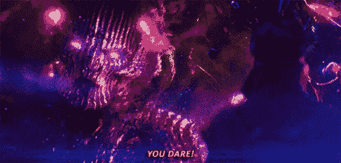

多玛姆没有幽默感(鸣谢:漫威影业有限责任公司)

那么，我们开始吧。这篇博客中的所有代码片段都是用 Python 写的。读者应该对 Python 的编码有一个基本的了解。

# 介绍

为了回答题目中提出的问题，我们将从电影剧本中寻找线索。一些读者可能已经熟悉了情感分析。情感分析是自然语言处理的一个长期研究的应用。然而，任何句子的肯定句或否定句的二元分类都不足以表达作者的意图。吃冰淇淋的积极感觉不同于赢得金牌的积极感觉。换句话说，并不是所有积极和消极的情绪都是一样的。最近的方法集中在检测情感而不是情绪上。

从口语或书面语中检测情绪在人机交互、市场营销和客户服务中具有潜在的应用。在缺乏训练有素的专业人员的情况下，情绪感知聊天机器人可以用作治疗师。情绪检测也有助于心理剖析和检测互联网聊天室和深层网络上的潜在犯罪威胁。

然而，话虽如此，人类的情感是复杂的，检测它们也是如此。缺乏面部表情或肢体语言进一步阻碍了纯粹基于文本的方法。这甚至忽略了人们可能会说谎或讽刺的事实。讽刺的检测在自然语言处理中是一个公开的问题。更多感兴趣的读者可以在这里阅读更多信息。

# 基本情绪

在机器上检测人类的情感？当然，你一定是在开玩笑！

不完全是。心理学理论已经找到了答案，可以用算术和原则性的方法来研究情绪。

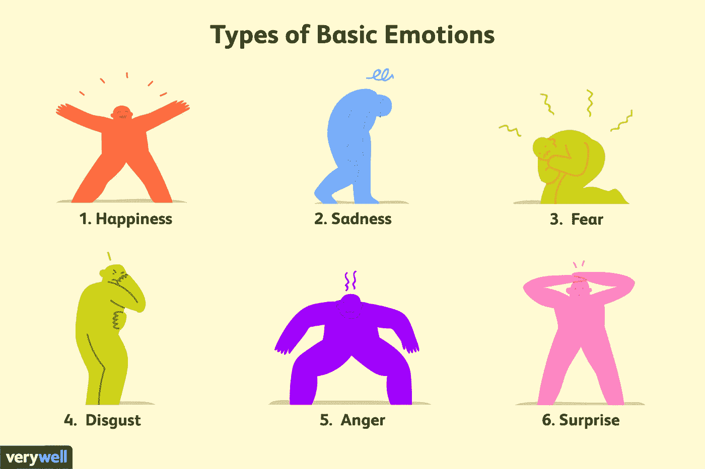

基本情绪(图片鸣谢:verywellmind.com)

现代情绪理论是由埃克曼提出的，他提出了快乐、悲伤、恐惧、厌恶、愤怒和惊讶六种基本情绪。这份清单扩大到包括信任、乐观、悲观、爱和期待。根据现代理论，人类的每一种情感都可以被认为是这些基本情感的组合。这是一个非常简单的模型来捕捉人类情感的全部。基于这个模型，所有人类的感觉都可以被认为是基本情绪的算术方程。

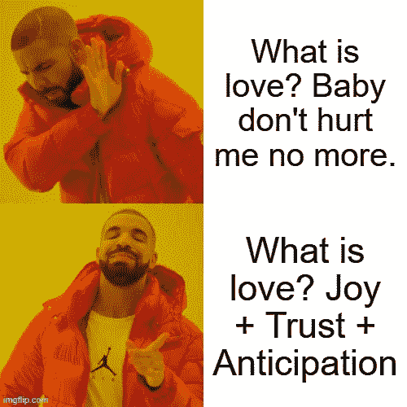

还有更复杂的情绪理论，但是为了这篇博客的目的，我们将集中讨论这 11 种基本情绪。

# 数据

像任何机器学习项目一样，这也依赖于拥有一个大型平衡数据集，其中有大量可供学习的例子。特别是对于 NLP 应用程序，这意味着拥有一个大的带注释的数据集。

那一定很容易，对吗？毕竟，我们在网上产生了大量的数据。Alexa 和 Siri 一直在听我们说话，记录我们。

嗯，这与事实相差甚远。好的数据很难碰到。任何机器学习应用程序都需要数百万甚至数千个样本来学习。这种规模的数据集既符合背景，又没有偏见和错误，这种情况很少见。即使有，它们也常常是私人的，不可访问的。出于本博客的目的，我们使用了来自 2018 年 [SemEval](http://alt.qcri.org/semeval2018/index.php?id=tasks) 任务的注释数据集。这些数据是用某种情绪的存在来标注的推文集合。它包含大约 6k 条类似这样的推文。

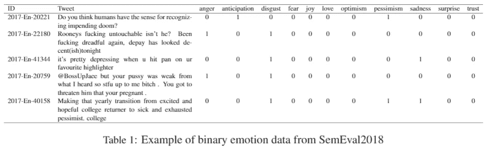

每条推文都标注了 11 种基本情绪，要么是 0，要么是 1。这不同于多类数据集中常见的一次性编码。一个句子可以包含多种基本情绪，因此，多列可以包含每个 tweet 的 1。

推特很少用简单的英语写。它们将包含特殊字符、表情符号和用户标签。所有的推文都需要去除这些特殊的字符和标签。为此，我们有一个非常强大的工具，叫做正则表达式，简称“regex”。正则表达式有助于在书面文本中搜索模式，并拆分字符串或去除这些模式。

CleanTweet 函数去除 Tweet 中的特殊字符

例如，所有标签都是@ <username>格式，其中用户名是由字母数字字符和下划线组成的有限但任意长度的字符串。上面函数中的第二行查找任意长度的模式，并返回 tweet 中出现的所有位置。代码片段还删除了所有标点符号、换行符和不可打印字符(阅读表情符号)。我们鼓励读者使用这个功能，并添加对他们的用例有用的部分。</username>

下一个数据是漫威电影的剧本。这些可以在这里找到 pdf[，在这里](https://www.scriptslug.com/scripts/category/marvel)找到抄本[。为了能够使用这些脚本，必须进行大量的手动数据清理。电影剧本是一份冗长的文件，包括对场景、角色表情和其他补充细节的描述。为了这个实验的目的，我们将只使用口语对话，并删除所有其他信息，除了谁是对话的说话者，谁在和谁说话，以及谁是屏幕中的其他角色。](https://transcripts.fandom.com/wiki/Category:Marvel_Transcripts)

这个过程大部分是手动的，xkcd 捕捉到了我对他们下面的 meme 的失望。

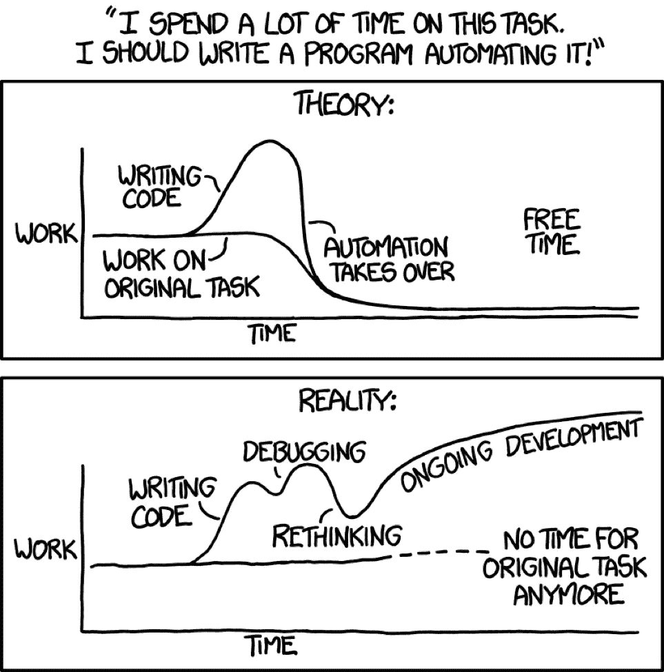

图片来源:xkcd.com

# 方法

所以，这就是我们开始动手的地方。如前所述，我们使用的机器学习方法需要数百万个样本来学习。我们只有几千个例子的小数据集。我们如何最好地利用它？

我们有一些相同的技巧。我们将在这里介绍这个概念。对于对更多细节感兴趣的读者，你可以阅读提供的链接。建议理解博客的其余部分，但这并不重要。

## 1.Word2Vec

2013 年，谷歌的研究人员发明了一个强大的工具，他们称之为 [word2vec](https://code.google.com/archive/p/word2vec/) 。它是一个在抽象的数学空间里，把文字转换成一个具有实数的多维向量的工具。每个单词都被表示为一个包含该单词含义的实数元组。

创建的向量在许多类比任务中是有用的。

```
# geography analogy
vector('paris')-vector('france') = vector('italy')-vector('rome')# relations and gender analogy
vector('king') = vector('queen') - vector('woman') + vector('man')
```

这里，我们将跳过一些底层机制的细节和一些用来创建这个工具的巧妙技巧。推荐读者阅读上面的链接和原文[这里](https://arxiv.org/pdf/1301.3781.pdf)。

从我们的数据生成这些向量的代码可以在[这里](https://code.google.com/archive/p/word2vec/source/default/source)找到。然而，用新数据训练网络既费时又徒劳。正如我们前面提到的，我们的数据集对于这段代码来说太小了。这段代码需要成千上万的单词来学习。令人欣慰的是，研究人员提供了超过 300 万个单词的矢量表示。可以从[这里](https://drive.google.com/file/d/0B7XkCwpI5KDYNlNUTTlSS21pQmM/edit)下载使用。如果你解压文件，你会发现它的大小超过 1 GB！

正在加载 word2vec 模型

对机器内存有严重限制的读者可以将模型精简到我们在这里使用的最小限度。我们将只需要单词的向量表示和从单词到它们在模型中的索引的映射。

小型 word2vec 模型

## 2.序列模型

语言有一个内在的顺序和序列模式。出现在一个句子中的单词与出现在它前面的其他单词相关。这使得对句子使用序列模型很有意义。

这些顺序模型中的第一个被称为递归神经网络。这些神经网络接受两个输入——一个是句子中的当前单词；二是导致当前单词的句子的“隐藏状态”。它背后的实际数学涉及到可怕的矩阵和微分方程。但是除非你想成为下面这个人，否则建议你对这些算法的魔力有一个基本的了解。这个博客[这里](https://towardsdatascience.com/illustrated-guide-to-recurrent-neural-networks-79e5eb8049c9)很好的解释了 RNNs。


典型的机器学习项目(图片鸣谢:xkcd.com)

但是，rnn 有其缺点。它们依赖于序列的上一个状态来预测序列中的下一个元素。对于语言或句子来说，这不一定是真的。

> 提米在路边发现的那只肥猫，终于有了新家。

在上面的句子中，“有了新家”指的是九个字前**提到的那只肥猫**。此外，句子可以有向后的依赖性。

> 受到最近在编码挑战中取得成功的鼓舞，Alice 决定辅修计算机科学。

在这里,“鼓励”是一个形容词，表示名词“爱丽丝”,出现在句子的**后面**。

RNNs 不能对多个单词的这种依赖性或回溯的依赖性进行建模。

为了解决第一个问题，RNN 的老大哥提出了长短期记忆(LSTM)单位。LSTM 单位不同于通常的循环单位。它们包含一种叫做记忆细胞的东西，这种细胞能记住句子中的早期单词。逻辑门控制着前一个单词对下一个单词的影响程度。逻辑门的参数可以通过训练来学习。

后向依赖的第二个问题是通过使用双向单元来解决的，该双向单元具有在句子中给定点之前和之后出现的单词的记忆。来自句子中较早的和句子中较晚的单词的记忆被用作当前单词的特征。

哇，未来的记忆？这是一些少数报告水平的胡言乱语！

我真的没有一个关于 LSTMs 的像“我是五”那样的解释报告。在这个博客中透露更多的细节超出了范围。读者需要对 LSTMs 有一个基本的了解。这里给出一个简短的解释[。如果你还没有看过《少数派报告》,停止阅读这篇博客，现在就去看吧。是反乌托邦犯罪惊悚片里的汤姆·克鲁斯。而且是在网飞！](/mlreview/understanding-lstm-and-its-diagrams-37e2f46f1714)

因此，我们有了单词的向量表示(我们称之为嵌入)和用于分类的神经模型。我们该走了，对吧？事实证明，没有。如果你要在我们的小数据集上训练 LSTM，你不会找到任何有用的模型。对于这样一个小数据集，LSTM 有大量的参数需要学习。

最近，门控递归单元(gru)在较小的数据集上表现更好。gru 也使用内存，但它们使用逻辑门来控制单元内的信息流。它们需要训练的参数更少，并且在较小的数据集上表现得比 LSTMs 更好。感兴趣的读者可以在这里阅读更多关于 GRUs和[的内容，这](https://arxiv.org/pdf/1406.1078.pdf)是介绍 GRUs 的原文。

这里的另一个博客可以说明香草 RNN、LSTMs 和 GRUs 之间的区别。

## 3.网络体系结构

最后，我们将所有的部分组合到我们的情感检测模型中。对于这个实验，我们将为每种情绪建立一个不同的模型——告诉我们特定的情绪是否出现在推文中。这样做是因为正如我们前面提到的，一条推文可能包含多种情绪。但是，这些型号的网络架构都是相同的。

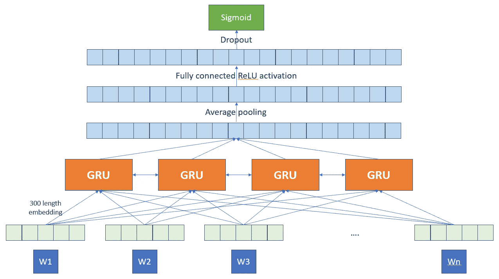

网络架构:最低层上的 Word2Vec 嵌入，随后是 16 个双向 gru，平均池化，128 个具有 ReLU 激活的全连接单元和一个用于预测的 sigmoid 输出层。

这对工程师来说可能看起来很复杂，但是我们已经建立了可以帮助我们的库。因此，我们不需要从头开始编写代码。没有必要重新发明轮子，对吗？

我们将数据加载到 pandas dataframe 中，并使用我们之前创建的 cleanTweet()函数清理 Tweet。然后，我们在数据集中创建所有推文的语料库。

清除 tweet 到 strip

我们将自己限制在数据集中最流行的 40k 个单词。选择单词是由 python 中 keras 包中的标记器执行的。

标记器

接下来，我们做一些预处理，将文本语料库输入模型。我们将输入模型的序列长度设置为语料库中最长句子最大长度的两倍。较小的句子用空标记填充，如果传递了较长的句子，它将被截断。

模型的数据准备

x_train_seq 包含所有预测值。我们需要为模型预测定义一个目标变量。对我们来说，就是目标情绪。

模型的目标

接下来，我们从分词器中提取我们使用的 40k 个单词的单词嵌入。

嵌入矩阵

现在，我们对模型进行编码。如前所述，我们为 word2vec 添加了一个嵌入层。我们保持该层不可训练。这意味着错误不会反向传播到这一层，也不会以任何方式改变原始嵌入。在我们的网络中发生的唯一训练是下一层。我们添加 GRU 层和全连接层。我们还添加了一个丢弃层来生成一个集合模型，并防止过拟合。最后，我们添加一个 sigmoid 函数来进行从 0 到 1 的预测，表明给定 tweet 包含特定情感的概率。

创建模型

最后，我们可以训练网络。选择超参数以获得验证数据集的最佳结果。鼓励读者尝试不同的值，以观察它们对模型准确性的影响。

训练模型

# 结果

为每种情绪生成的模型的性能如下表所示。


生成模型的分类结果

我们还可以查看一些精选模型的 ROC 曲线。这是恐惧和快乐的结果。我们注意到随机分类曲线的显著提升。我们现在可以用这些模型来研究我们最伟大的超级英雄。

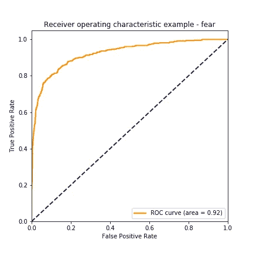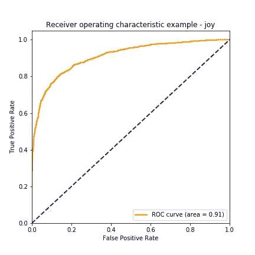

现在，我们准备回答我们在本博客开始时提出的问题。前方重大剧透！如果你没有看过电影，但打算这样做，现在回头。

为了分析我们的性格，我们做了一些简化的假设。角色 A 到角色 B 说出的台词中的所有情绪都代表了 A 对 B 的感觉。角色说出的所有台词的情绪得分的平均值被认为代表了该角色的情绪状态。此外，所有原始分数都通过电影中所有角色的平均情绪分数进行标准化。这样做是为了使电影中的固有色调正常化。戏剧中的喜剧角色与真实喜剧电影中的类似角色相比，会表现出非常不同的情感得分。解决这个问题的方法是用电影的平均分数来标准化所有角色的分数。在这里，我们看到了三部不同的漫威电影中的角色——奇迹复仇者联盟，美国队长:冬日战士和奇异博士。

## 1.单个字符

我们将标准化的情绪状态表示为放射状的图。

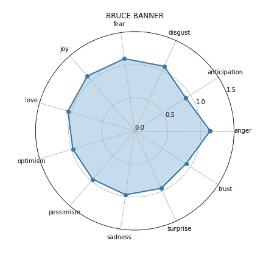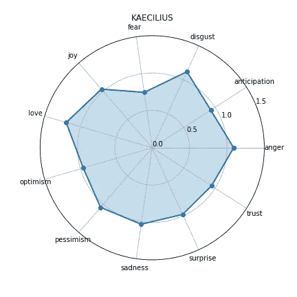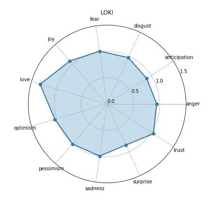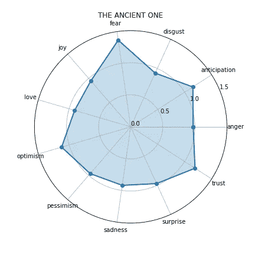

最愤怒的复仇者确实是布鲁斯班纳博士。看到愤怒轴附近的峰值了吗？这就是头发花白、戴眼镜的教授和两千多磅纯绿色狂怒之间的区别。


GIF 图片来源:漫威影业有限责任公司

最可怕的是古代的。如果我不得不保卫地球对抗魔法、平行维度和高等生物，我也会蜷缩在我的床单里。

黑魔王多玛姆的仆人凯西里乌斯最反感。孩子们，这是一个教训。为黑暗领主服务只会让你充满厌恶和仇恨。

## 2.情绪激动的事件

某些情绪化的事件会对角色的精神产生影响。影迷们会记得电影中的这类事件——通常角色的死亡会引发情感反应。

在电影《复仇者联盟》中，特工菲尔·科尔森的死亡是一个重要事件，在此之后，我们的英雄们搁置分歧，打败了共同的敌人。

这里我们看到了美国队长事件前后的变化。

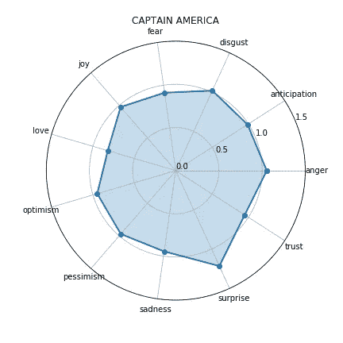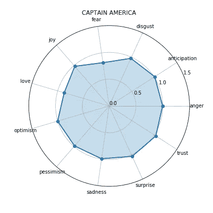

科尔森特工死亡前(左)和死亡后(右)的美国队长

美国队长表现出较少的恐惧和惊讶，但更多的爱。另一方面，我们有托尼·斯塔克(又名钢铁侠)的反应。注意，钢铁侠现在变得更加愤怒，更加厌恶。与此同时，他感受到的爱、悲伤或悲观都少了。

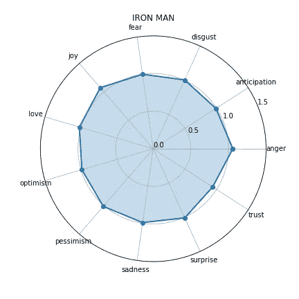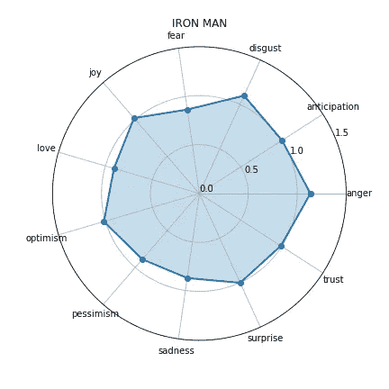

《钢铁侠》前(左)和后(右)特工科尔森死亡

我们看到奇异博士的第三个反应。想象你是你所在领域的天才神经外科医生，直到有一天你遇到了一次事故，使你的手无法进行手术。渴望治愈，你旅行到遥远的地方参加一个邪教，突然墙壁融化，人们从手中射出火焰，你被告知魔法是真实的。当一个黑巫师攻击你并杀死你的导师时，你从最初的震惊中恢复过来。

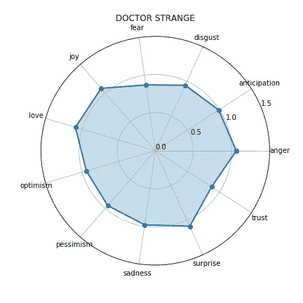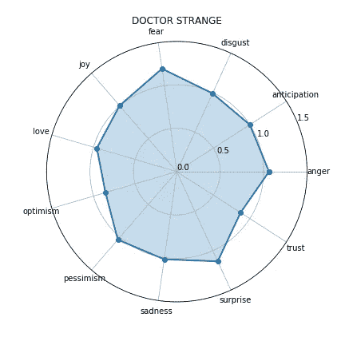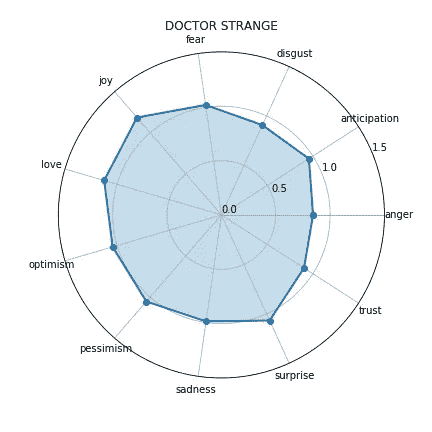

奇异博士在卡玛·泰姬陵之前(左)，在学会巫术之后，但在古代人死亡之前(中)，在古代人死亡之后(右)

了解到魔法和无限宇宙的危险让奇异博士感到恐惧和悲观。但他很好地处理了古人的死亡。当他将自己的精力从愤怒转移到更多的爱和快乐时，他变得更加成熟。

## 3.角色互动

另一个有趣的分析是人物之间的互动。让我们来看看雷神和他收养的弟弟恶作剧之神是如何分享一种关系的。

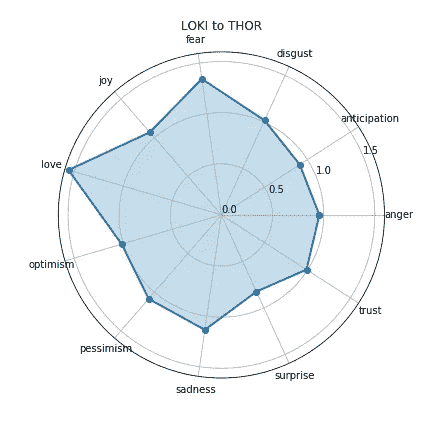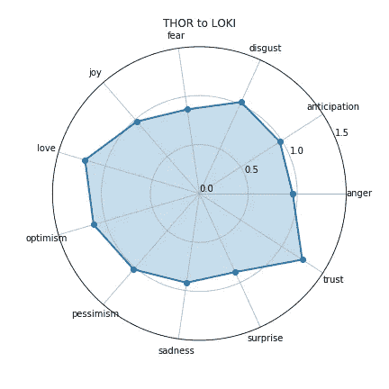

洛基对托尔的情感(左)和托尔对洛基的情感(右)

洛基既爱又怕他的哥哥。他也许本质上并不坏。托尔不那么害怕他的哥哥，但似乎比他应该的更信任他。也许索尔看到了洛基内心的善良，这也是我们在他的性格图表中发现的。

另一对有趣的搭档是布鲁斯·班纳博士(又名绿巨人)和娜塔莎·罗曼诺夫探员(又名黑寡妇)。还记得那个愤怒的绿巨人追杀罗曼诺夫特工差点杀了她的场景吗？


学分:漫威影业有限责任公司

让我们看看之后他们的关系是如何变化的。

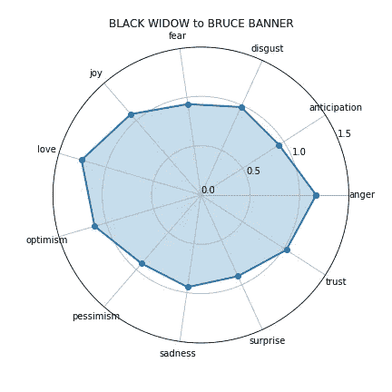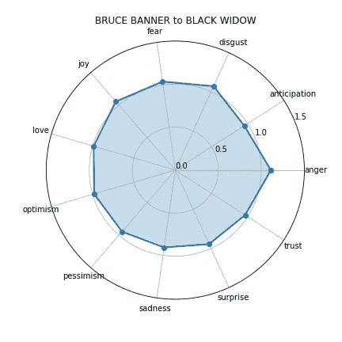

攻击前黑寡妇对班纳博士的情绪(左)和班纳博士对黑寡妇的情绪(右)

罗曼诺夫探员对班纳博士表现出了一些爱和乐观的情绪。另一方面，班纳博士很全面，没有强烈的感情。现在，让我们看看袭击后发生了什么。

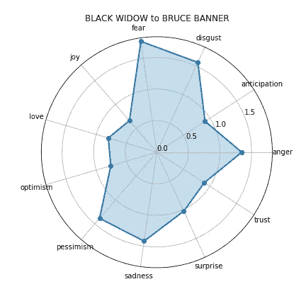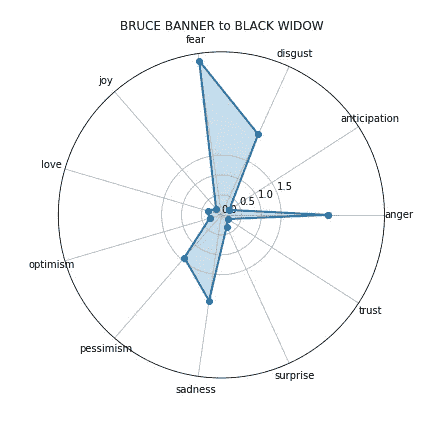

袭击发生后，黑寡妇对班纳博士的情绪(左)和班纳博士对黑寡妇的情绪(右)

不出所料，娜塔莎从班纳博士那里获得了爱和乐观的下层感情。她害怕，厌恶，愤怒。袭击的罪恶感似乎对班纳博士影响更大。他的变化似乎超出了图表，因为他害怕，悲伤，愤怒和厌恶。似乎是想扼杀你的浪漫兴趣的自然反应。

# 密码

用于构建模型的代码文件存放在[https://github.com/palash2492/EmotionDetection](https://github.com/palash2492/EmotionDetection)。

# 结论和下一步措施

因此，我们看到，我们可以使用一个相当小的训练数据集来检测虚构人物的情绪。虽然这些是虚构的人物，但我们从他们身上看到了非常人性化的反应——包括一些字面上的神和传说中的巫师。

接下来的步骤将取决于收集带注释的数据，并使用机器进行一些我们在这里手动进行的分析。然而，正如我们所见，获得带注释的数据并不容易。类似的方法可以用于真实的人的反应，而不是虚构的人物。

下面给出了计划模型的示意图。

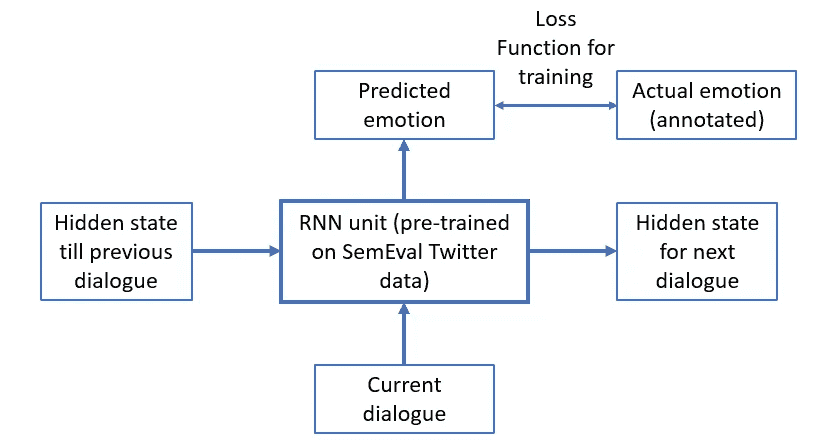