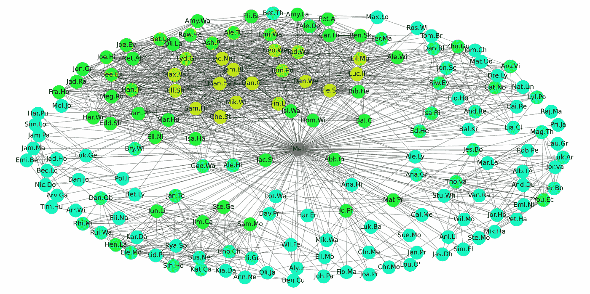
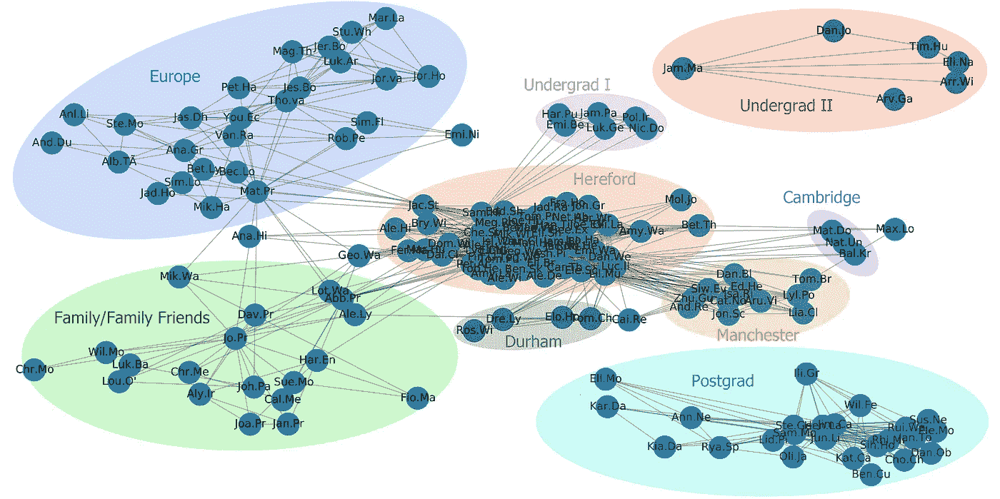
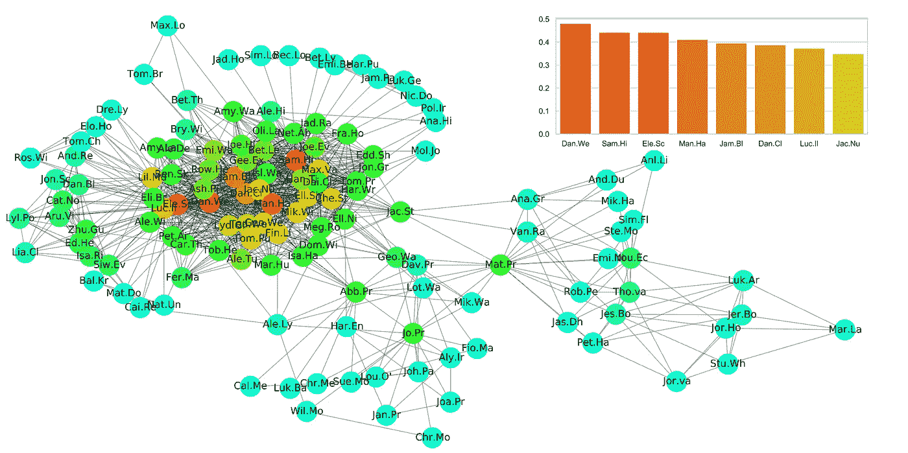
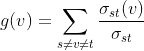
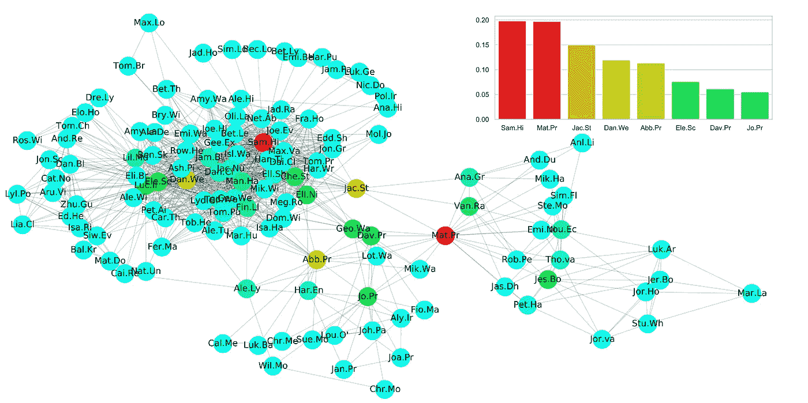
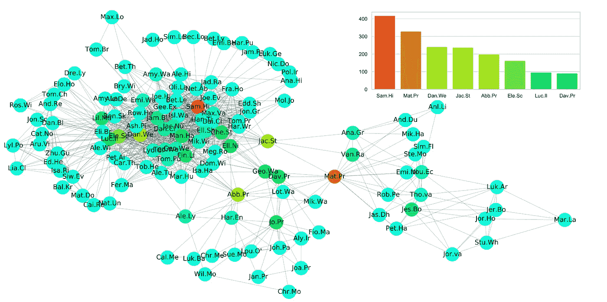
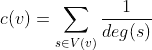
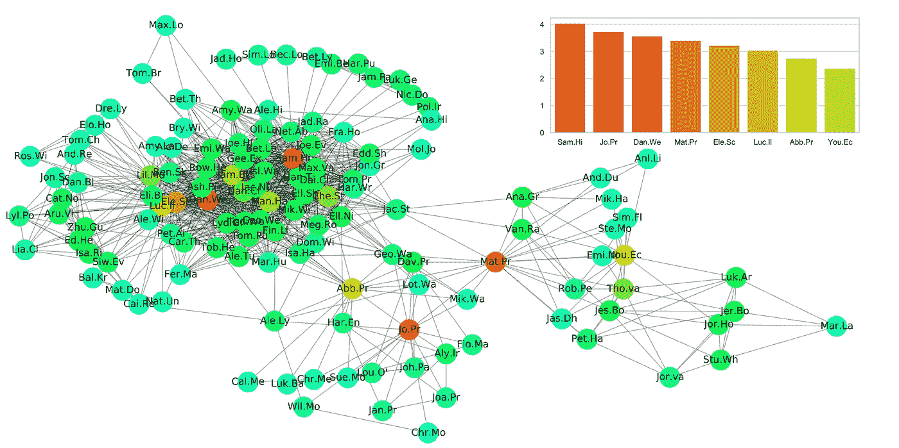

# 谁是社交网络中最重要的人？

> 原文：<https://medium.com/analytics-vidhya/who-is-the-most-important-person-in-a-social-network-dfcfbb9c3f36?source=collection_archive---------12----------------------->

最近我有点迷上了图论。当你让自己如此深入地研究图表时，你就开始在日常生活中看到它们。他们消耗你。当我看着一个人时，我只是看到了图上的另一个节点。我再也不能简单地从家走到商店了。现在我必须遍历源顶点和目标顶点之间的路径。我开始有点担心了。然而，与我的理智不同，图论的流行是毫无疑问的。它的应用范围从语言学到计算机科学，你很难找到图论不能应用的领域。网络真的无处不在。我想是时候让你多了解他们一些了。还有什么比图论中最核心的概念更好的起点呢？中心性！网络中最重要节点的标识。这是一个很大的话题，所以我准备了一个数据集，希望能帮助你直观地理解这些概念。

我的脸书朋友网。

这是我在脸书的朋友网络(如果看起来有点小，请将鼠标放在上面)。图上的每个节点都是我在脸书的朋友。节点之间的边(线)连接两个也是脸书朋友的人。如果两个节点之间没有链接，那么它们彼此不认识。当一个群体中有足够多的人没有连接到网络的其他部分时，社会集团就会形成。这些集团可以包含许多人，其中一些人将是其他集团的一部分。有些人会完全没有小团体…

你能看出把这个图看成一个真实的社交网络是多么容易吗？也许我最近出去得不够多。没关系，如果你愿意进一步纵容我的困扰，我想开始讨论名义上的问题！谁是这个网络中最重要的人？

很明显，是我。看，我就在中间！正确回答这个问题的第一步是将我自己从网络中移除！：

我被移除后的社交网络。

我们已经设法形成了 3 个不同的子图。没人会把“本科生朋友 II”或“研究生朋友”与网络的其他部分联系起来。如果我在大学遇见你，我可以告诉你，你不是最重要的人。从现在开始，我们将只关注这 3 个网络中最大的一个，我们称之为“主网络”。

仔细看看这个“主网络”。谁是最重要的人？有很多潜在的答案，我的母亲在那个图表中。我怀疑她会对我质疑她的重要性感到高兴。因此，为了避免冒犯任何人，我们将不得不让无情的数学和逻辑指引我们找到答案。我认为一个重要的人物也是受欢迎的人。网络中最受欢迎的人将会是拥有最多朋友的人。最受欢迎=最重要。简单。

# 程度中心性

是的，这个想法已经有名字了。程度中心性可以说是最简单的中心性度量。一个节点的度数由它拥有的连接数给出。你有 10 个朋友？你的度数是 10。我们实际上用分数来表示学位。如果你的度是 0.5，你就是一个社交网络中一半人的朋友！

你实际上已经见过一次程度中心性，我在第一张图中使用了它。但是，现在我们将只对主网络应用度中心性:

程度中心性。

好吧，我们完成了吗？是丹。我们是最重要的人？不，我不这么认为。更准确地说，我不认为学位是衡量一个人重要性的最佳指标。一些最流行的节点是重要的，但不是所有的。前 8 名(在条形图上)都位于同一个集群中。该集群中的许多节点具有很高的度，但是其中一些节点在该组之外没有连接。伙计。ha’拥有网络中第四多的朋友，但是如果他被移除，网络的强度不会受到影响，因为他们的所有连接都包含在单个密集组中。

一个社交网络不仅仅是一群人，它由许多更小的群体组成。和你一起工作的人；学校的朋友和酒吧的小伙子。受欢迎程度只是衡量一个人在这些群体中的重要性的一个很好的标准。然而，我认为，在社交网络中，将这些群体联系在一起的人是最重要的。

# 中间中心性

我们将部署中间中心性来查找将该网络连接在一起最多的人！你会问，它是如何工作的？

让我们考虑在图表两端的一对人。因为网络是完全连接的，我们可以从一个节点到另一个节点追踪一条线来连接这些人。如果你用足够多的线对来做这件事，你会发现你经常经过一些节点。中间中心性找到这些具有高流量的节点。

它通过查找网络中每个节点对之间的所有最短路径来做到这一点。然后，节点的介数中心性由该节点所在的总最短路径的分数给出。在数学符号中，这由下式给出:

其中，σₛₜ是从节点 **s** 到节点 **t** 的最短路径的总数，而σₛₜ ( **v** )是经过 **v** 的那些路径的数量。

希望你能明白为什么中间中心性可以帮助我们识别重要的人。将网络连接在一起最多的节点将具有较高的介数中心性，因为许多路径将通过它们来连接节点对。例如，如果你和你的伙伴戴夫一起工作，而戴夫认识酒吧里的几个小伙子。戴夫是两个小组之间的纽带。两个组之间的所有路径都必须通过戴夫。戴夫有很高的中间中心性。

中间中心性。

在突出重要人物方面，这比学位中心性做得好得多。像‘人’这样的节点。仅在单个集群内有连接的“Ha”不再出现在前 8 名中。现在，所有前 8 个节点都可以在集群的边缘或集群之间找到。这些是真正将网络连接在一起的节点。但是，还有一个问题。我想在这个网络中找到一个最重要的人。萨姆的介值。“嗨”是 0.1978，“Mat。Pr '是 0.1971。对我来说，这些价值观太接近了，以至于我很难称它们中的任何一个更重要。需要进一步研究。

撒母耳“嗨”很像“节点人”。‘哈’，他们在主星团内都有很多连接，不过，‘山姆。“Hi”可以从集群外部的一些连接中产生大量中间性。链接到“Jac。圣达夫。进入主群集的 Pr '流量将从这两个节点流向 Sam。你好。撒母耳 hi’还垄断了主集群上的 10 个节点与整个网络的连接，因为这是它们与整个网络的唯一连接。

另一方面，Mat。“Pr”实际上位于图表的中心。作为连接图的左侧和右侧的仅有的两个连接之一，导致大量流量将通过该节点。然而，与‘山姆’不同。嗨，如果马特。“Pr”被移除，网络中不会丢失任何节点。

这有点进退两难，两个节点都是最重要的。由于中间中心性如此接近，我们将不得不转向另一种度量来解决僵局。

# Shapley 中间中心性

我们的解决方案可以在博弈论的领域中找到。在合作博弈中，Shapley 值用于根据个人的贡献在群体中公平分配收益。[在本文](http://ifaamas.org/Proceedings/aamas2012/papers/1B_4.pdf)中，Shapley 值被应用于中间性中心性，创建了 Shapley 中间性中心性。它调整中心性值以考虑连接节点组的重要性。或者，正如他们在报纸上所说:

> “一个顶点对任何可能的顶点组(该顶点所属的组)的性能的贡献越大，其介数中心性就应该越高。”

Shapley 的中间中心性做得很聪明。如果您有兴趣，请随时查看我的实现:

[https://gist . github . com/Adam price 97/3bc 20831 CDB 7 F4 a 79955 ad 7014 a 4323 c](https://gist.github.com/adamprice97/3bc20831cdb7f4a79955ad7014a4323c)

但是，用我们都能理解的话来说:Shapley 介数中心性通过检查节点故障(从网络中移除)对网络不同子部分的影响来计算节点的值。本质上，如果节点的移除对任何节点组都是有害的，则该节点将具有高 Shapley 介数中心性。你能看出这对在社交网络中寻找重要人物有什么用吗？

匀称的中间性。

我们有一个明确的赢家！以及所有前 8 个节点的强候选。通过对连接较小组的节点的介数值进行加权，Shapley 介数中心性提供了迄今为止我们看到的最佳评估。顶部节点都对网络的强度有最大的影响。这一点的极端体现在《山姆。如果移除，将导致网络中节点的丢失。

终于准备好回答这个有名无实的问题了。嗯，是的，但是，我仍然有一个中心性的衡量标准需要讨论。我自己的！

# 累积逆度

我喜欢根据节点被移除后网络损失的强度来评估节点的想法。例如，如果一组节点仅由另外两个节点连接到网络，如果其中一个节点被移除，网络的强度将会大大降低。

我找不到一个可以直观地做到这一点的中心性指标，所以，我自己做了一个！(并给它起了一个数学名字)。它类似于学位，但有一个主要的变化。对于节点 a 具有的每个连接，度不是增加 1，而是在目标节点的度上增加 1。用数学术语来说:

其中 **V(v)** 是链接到节点 **v** 的节点集合，deg( **s** )是节点 **s** 的度。

该度量将为连接到较少连接的节点的节点提供较高的值。我的假设是，连接到许多低度(低流行度)节点的节点将是社交网络上的重要节点:

累计倒数度数。

看起来很好，如果我这么说的话。到目前为止，我们看到的许多排名较高的节点在这里再次突出显示。对于这样一个计算成本低廉的指标，我认为它已经做得很好了。我为我的创作感到骄傲。

与前两个指标一样，它还突出显示了“Sam”。你好，也是网络上最重要的节点。我承认这个问题终于有了答案。恭喜山姆。你好，很高兴你了解了我最近的困扰。