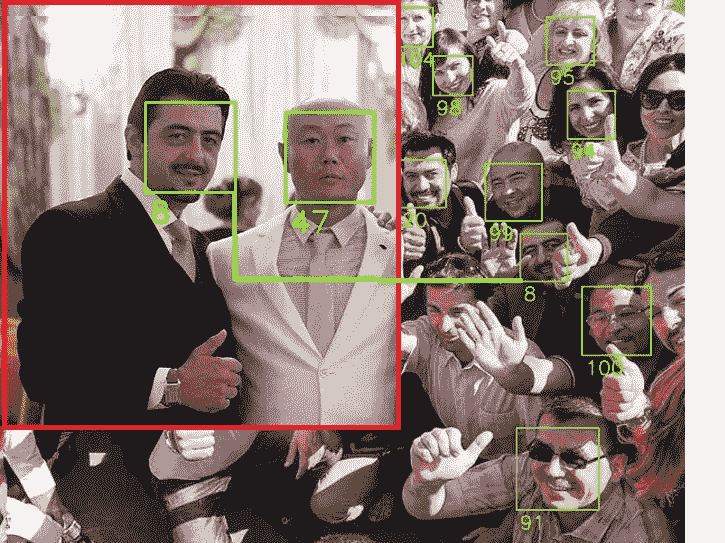
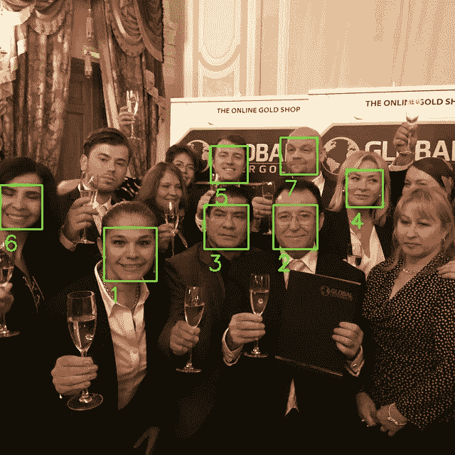
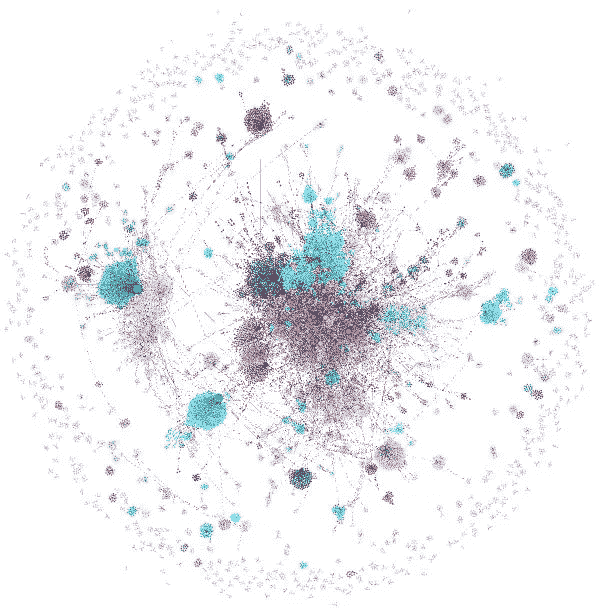
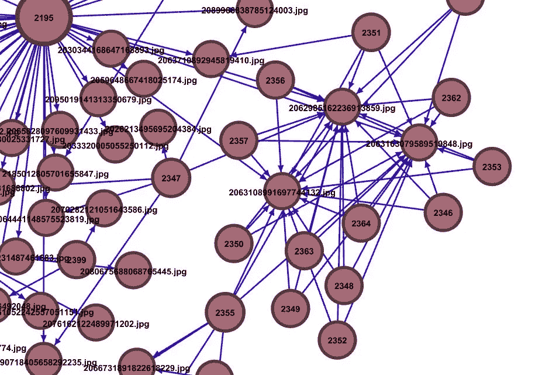
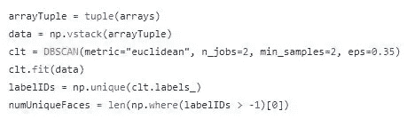

# Who-Where-WhomWith(WWWW):一个面部识别工具，用于基于图像的数据收集和图形分析

> 原文：<https://medium.com/analytics-vidhya/who-where-whomwith-wwww-a-facial-recognition-tool-for-image-based-data-gathering-and-graph-dd8f2b13c279?source=collection_archive---------4----------------------->

在[这篇](/@lorenzoromani/facial-recognition-with-python-and-elasticsearch-quick-tutorial-85cd02fe903d)上一篇文章中，我展示了建立一个 Elasticsearch 实例来存储面部编码和建立自己的面部识别数据库是多么容易。

在这篇博客中，我将基于相同的架构添加一个非常有趣的特性。因此，如果您不知道如何设置 Elasticsearch 并存储面部编码以供进一步分析，请返回并设置所有内容！

之前的帖子展示了如何从一张已知的图片开始，在数据库**中搜索一个看似合理的匹配。基本上，这被称为**监督学习**。从概念上讲，这是最简单的任务。但是，面部识别数据库可以做更多的事情，我相信它在信息分析中会非常有用:我们正在谈论的是**面部聚类**。**

使用人脸聚类，我们不是从输入图像开始在数据库中搜索匹配:我们要求我们的计算机找到独特的人脸(属于同一个人的人脸编码)并对这些人脸做一些事情。这是一个**无监督学习**任务。

想象一下，你从社交媒体上收集了数以千计的图片，这些图片与许多不同的人参加的一个或多个公共事件有关。假设您想要调查每位与会者，他/她出现在哪个图像中，同一个人是否出席了多个活动，以及此人与谁一起出席。

你需要一个解决方案，分析图片中显示的所有单个面部，将面部聚集在一起，并生成一个关系图**unique _ face>image.jpg**。

继续读下去，你马上就能做到这一切！

第一步是找到一堆有很多人的图像。如果你还没有收藏，你可以使用**instalouter**很容易地制作一个，这是一个很棒的工具，可以让你从 Instagram 下载数据。您可以通过命令行安装它:

**> > pip 安装安装程序**

现在去[这个](https://github.com/lorenzoromani1983/wwww) github 库下载文件:

**cluster _ faces . py
encode _ faces . py**

**/输出
/温度
/数据集**

**现在通过 pip** 安装所有需要的 Python 库:

**pip 安装 opencv-python
pip 安装 scikit-learn
pip 安装 elasticsearch
pip 安装 numpy
pip 安装 cmake
pip 安装 face_recognition
pip 安装 imutils
pip 安装 networkx
pip 安装 shutil
pip 安装 dlib**

如果您遵循了之前的教程[您应该已经安装了其中的一些库。](/@lorenzoromani/facial-recognition-with-python-and-elasticsearch-quick-tutorial-85cd02fe903d)

现在，你需要用 instalooter 下载一些图片。这个工具让你不仅可以从用户的时间线**下载图片，还可以从标签**下载图片。我发现从事推广庞氏骗局或类似骗局的用户热衷于分享许多事件的照片，所以我选择了一家知名公司( **Global Intergold** )，该公司使用 **#globalintergold** 标签进行推广。

从命令行中，下载所有标记为#globalintergold 的图片，并将它们保存在您之前应该已经创建的“dataset”目录中。使用此命令:

**>>****instalooter 标签 global integold/path-to-dataset-directory**

当你下载了大量的图片后(我设法为这个标签准备了超过 40.000 张)，你需要为每张脸编码面部向量，并把它们存储到你的 Elasticsearch 实例中。使用 **encode_faces.py** 脚本(代码[此处为](https://github.com/lorenzoromani1983/wwww/blob/master/wwww/encode_faces.py))来执行此操作:

**>>python encode _ faces . py-d 路径-数据集-目录**

对于 40，000 张图像，可能需要大约 10/16 个小时来编码你收集的每张脸。

一旦编码工作完成，你就可以开始了！

所以，启动 **cluster_faces.py** 脚本(源代码[此处](https://github.com/lorenzoromani1983/wwww/blob/master/wwww/cluster_faces.py)):

**>>python cluster _ faces . py**

此时，程序将开始面部聚类工作。同样，需要一些时间，因为这是一项对你的 CPU 要求很高的任务。你的电脑将需要 40/60 分钟来聚集 50.000/60.000 个面部向量，以便找到独特的面部。**这样做时，它会给每个独特的脸分配一个数字 ID** 。

请注意，由于我们正在进行一项无人监督的学习工作，**数字 id 将与唯一的面孔相关联，而不是真实姓名**。但这是我们做进一步图形分析所需要的一切。

在该程序将所有的脸聚集在一起并为每个唯一的脸分配一个数字 ID 后，它将开始编辑你的**/数据集**目录**中的图像，在每个脸周围画一个方框。在边界框下方，唯一 ID 也会出现**:

在作业结束时，所有编辑过的图像将被保存在您之前创建的**/输出**目录中。

**在开始对人脸进行聚类之前，最好对原始数据集进行备份！**

该脚本还将在您的根目录中创建一个名为 **face_graph.graphml** 的图形文件。这是最重要的输出。您可以使用 **Gephi** 打开它，以检查和研究独特面孔与显示它们的相应图片之间的所有相关性:

在# globalintergold 的例子中，我能够检测到超过 6000 个独特的面孔。检查图表，您将能够看到文件名和其中出现的人的唯一 id。为了验证图形，您可以在/output 目录中打开文件名。

**注意事项**

没有机器学习/面部识别算法是完美的。你肯定也会发现假阳性和假阴性。然而，我发现这种方法非常可靠。我没有测量过错误率，但我相信它小于 10-5%。

也许需要强调的是，集群工作的可靠性会受到您输入的数据的质量和数量的影响。每个人可用的图片越多，质量越高越好。但是，当从社交媒体/互联网收集数据时，这是您无法控制的，因此您需要考虑潜在的错误，并验证通过图表检查发现的关系。

此外，在 cluster_faces.py 文件中，有几个非常重要的参数可以手动设置: **eps** 和 **min_samples:**

**eps** 定义了欧氏距离值。该值越高，检测到的人脸就越少，而更多的人脸，甚至是属于多个个人的人脸，将聚集在同一个 ID 下，从而导致误导性的结果。我发现面部编码的可靠值是 **0.35/0.37** 。您可以使用 **epsilon.py** (源代码[此处为](https://github.com/lorenzoromani1983/wwww/blob/master/wwww/epsilon.py))脚本在您的数据集中查找平均距离的估计值:

**>>pythonεpy**

然而，我发现，如果数据库中存储了许多(数千个)面部向量，脚本返回的值可以产生良好的结果。不管 epsilon.py 会怎么说，我建议尝试一个介于 0.35 和 0.40 之间的值。

**min_samples** 值是您可以设置的另一个参数，它将定义一个面部是否必须被视为唯一 ID(唯一聚类)。例如，如果将参数设置为 5，如果面部向量在数据集中没有出现至少 5 次，它将被跳过。这意味着可以选择 min_samples 来减少图形和/output 目录中显示的唯一面的总数。如果你的目标只是找出你关系网中最重要的人，这种策略是可以使用的。

**更新**

有些人问是否有可能用视频**代替图片来使用这里描述的技术。的确如此。 [**我已经用两个新的 Python 脚本更新了 Github 库**](https://github.com/lorenzoromani1983/wwww/tree/master/wwww) ，这两个脚本将允许视频分析和人脸聚类。然而，整个过程**仍将基于图像作为面部编码和聚类工作**的输入。事实上，在编码任何东西之前，你需要在你的视频**的同一个目录下运行 **segment_frames.txt** 脚本**。这个脚本将每个视频分割成帧，并将每个帧保存为同一文件夹中的. jpg 图像。例如，给定一个 video.mp4 输入，您将有。jpg 文件命名为:**

**/directory/video . MP4 _ _ _ 500 . jpg
/directory/video . mp5 _ _ _ 1000 . jpg**

其中“__500”字符串将标识视频中的帧号。该脚本目前配置为每 500 帧保存一次，但是您可以更改参数以满足您的需要。显然，参数越低，输出的帧数越多，对人脸进行编码和聚类所需的时间就越长。

将所有视频分割成“第 N”帧后，像标准过程一样运行 encode_faces.py 文件。但是您将需要使用 **cluster_faces_video.py** 脚本，而不是 cluster_faces.py，以便在图形中的边缘处生成输出:

**独一无二的脸>video.mp4**

**而不是:**

**独一无二的脸>frame.jpg**

为了达到这个结果，脚本简单地拆分了每一个。jpg 帧由“__”分隔符分成两部分，其中第一部分将是视频的绝对名称，第二部分将是帧编号。

从技术上讲，它将为每个帧创建一个 Python 列表，例如:

**['video.mp4 '，' 500.jpg']**

并且将只使用索引[0]进入列表，即视频绝对名称。

就这些了。我希望你会喜欢这些代码，并且，很明显，做进一步的改进！