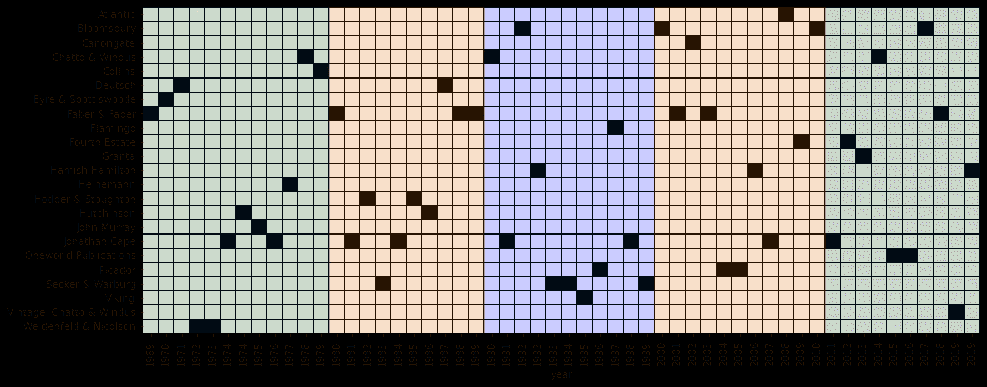
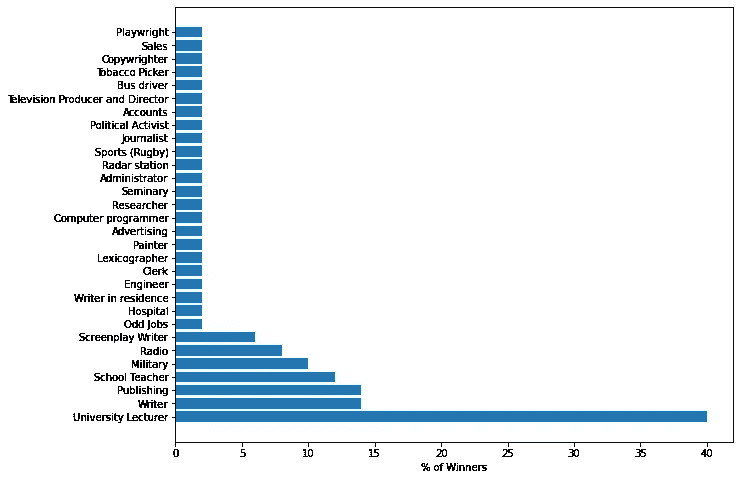

# 谁会赢得布克奖？

> 原文：<https://medium.com/analytics-vidhya/who-wins-a-booker-part-i-3847ac0b091?source=collection_archive---------13----------------------->

## 布克奖获得者对数字和模式的频繁观点！

照片由[思想目录](https://unsplash.com/@thoughtcatalog?utm_source=unsplash&utm_medium=referral&utm_content=creditCopyText)在 [Unsplash](https://unsplash.com/s/photos/books?utm_source=unsplash&utm_medium=referral&utm_content=creditCopyText) 上拍摄

作为一个终生的藏书家，我一直倾向于把小说作为我快乐的源泉。从奇幻小说到历史小说，我尝试过吞噬所有我遇到的类型。在我这个史诗般的探索中，我总是想知道这些作者编织文字和书写散文的迷人方式，以创造出真正象征着格言“*大于其部分之和*”的东西。

# **动机**

那么是什么让这些作家如此优秀，他们的作品如此受欢迎呢？有没有一条共同的线索将这些作者联系在一起？他们过去的事件促使他们凭空编造故事和人物吗？还是扎实的文学功底指引着他们的书法？为了回答其中的一些问题，我决定把重点放在那些在某种程度上被认为比其他作品略胜一筹的虚构作品上。布克奖是一个众所周知的衡量一本书文学价值的标准。

> 布克奖被认为是作家一生中所能获得的最有声望的文学奖之一。这个奖项最初被称为布克-麦康奈尔奖和布克奖，文学界每年都满怀期待地期待着它。人们或许可以认为它是英国文学的奥斯卡。根据他们的网站“该奖项于 1969 年设立，旨在通过奖励在英国出版的年度最佳英文小说来宣传小说中的精品”。根据维基百科的记载，这个奖项最初是由布克·麦康奈尔有限公司赞助的，后来在 2002 年冠名赞助商变成了 Man 集团。布克奖的获胜者将获得 5 万英镑的奖金，这使它成为世界上奖金最丰厚的文学奖之一。

# 免责声明，免责声明！

让我马上说，从分析推理的角度来看任何虚构的作品都违背了它的目的。但我对数据中的数字和模式情有独钟，我不认为我会尝试去理解这个谜语。我必须警告读者，这仅仅是一个有趣的项目，是为了玩弄数据而做的。它本质上是探索性的，任何推论都不能全信

说到这里，我将依靠一种频率主义者的方法来回答我的问题——“谁赢得了布克奖？”。

这里的想法是找到布克奖获得者作为人的潜在特征或属性，然后分析性地剖析他们的工作。所以这篇文章将分为两部分——当前的这篇文章将重点探讨一些关于布克奖本身的有趣问题；而我的下一篇文章将关注这些获奖小说的文学内容。

# 构建数据库

谷歌快速搜索显示，多个网站上有所有布克奖得主的名单，但除了作者姓名、小说和获奖年份之外，什么也没有。[另一方面，维基百科](https://en.wikipedia.org/wiki/Booker_Prize)有一个列表，其中包括作者的流派和国籍。这个列表构成了我的基本数据集，但我希望有更多的功能来捕捉作者或作品的有趣之处。经过几个小时的网上冲浪(主要是维基百科)，我用一组新功能扩展了这个数据集，最终反映了作者的个性或个人历史。他们的想法是，这些特征或许能让他们明白是什么让他们写出了一部获奖小说。

自 1969 年以来，共有 55 位布克奖获得者，只有 J. G .法雷尔在 1970 年获得了回顾性布克奖，也被称为失落的布克奖(我在分析中排除了这一条目)。

## 问:要读多少本书才能成为赢家？

这实际上是一个有趣的问题，因为它告诉我们作者是否有大量的文学作品支持他们，给他们工具去写出一个赢家。我们都知道*熟能生巧*，那么这些获奖者是否进行了大量的练习来提高他们讲故事的技巧呢？数据告诉我们，大多数获奖者之前发表的文章少于 5 篇，而中位数是 6 篇。**阿伦达蒂·罗伊** *(小事之神)*， **DBC Pierre** *(弗农神小)*和**阿维德·阿迪加** *【白虎】*看到他们的处女作获得布克奖，而**金尔西·艾米斯** *【老魔鬼】*在赢得布克奖之前，他的 kitty 已经出版了 37 本书。所以我想我们中的一些人还有机会！

## 问:厚一点的书胜算大吗？

一本厚的书并不意味着它的文学价值，但是你仍然需要合理的页数来构建一个连贯的故事。那么对于一个预订者来说，这个合理的数字是多少呢？似乎很大一部分获奖作品都有 200 到 300 页长，最短的 140 页，是**佩内洛普·菲茨杰拉德**的《离岸》(1979)，最长的 848 页，是*的《杰出人物*、埃莉诺·卡顿**(2013)。**

****

**基于每个获奖条目的页面数的获奖者分布**

**这些年来，人们似乎越来越喜欢厚一点的小说，在过去的十年里，大多数获奖作品似乎都比 50 年来 342 页的平均页数要厚。**

****

**1969 年以来获奖作品厚度的演变**

## **问:名字里有什么？**

**朱丽叶有一个著名的问题:“名字有什么意义？”我也问同样的问题——布克奖小说都有什么样的标题？有趣的是，大多数获奖作品的标题都有 3 到 4 个单词长。最长的冠军是理查德·弗拉纳根**的*和约翰·伯格**的***【g】***。大约 18%的书名在中间或开头有*，*，近 7%的书名有 *of。语法的其他措施将在下一个帖子中显示，所以在此期间，你最好记得交叉你的*‘s’*和*‘of’s’*以获得一个获奖标题！************

******

***获奖作品标题长度的变化***

## ***问:获胜者在哪里出版有关系吗？***

***出版社对你的书的成败起着至关重要的作用。他们投入大量的时间、精力和努力，将初稿变成畅销书。如果他们在其中找到一颗宝石就更好了。在过去的 50 年里，乔纳森·凯普和费伯一直是领先者，拥有最多的预订者。***

******

***出版社的布克奖获奖作品***

***但是，如果从一开始看，这两家公司几乎每十年都会产生获奖作品。这也是因为他们是世界上最古老的出版社之一。Jonathan Cape 成立于 1921 年，Faber & Faber 成立于 1929 年！。然而，回顾过去十年，你会发现只有一个世界出版公司在 2015 年和 2016 年连续出版了获奖者。所以选择和谁一起出版很重要！***

******

***出版社布克这些年的表现***

# ***好了，是时候让我们看看是谁写了这些精彩的书了！***

## ***问:你必须出生在哪里才能获得布克奖？***

***最初，布克奖只考虑英联邦国家的英语出版物。超过一半的获奖者(约 54%)来自英国，澳大利亚人远远落后于第二名(约 9%)。但在 2013 年后，该奖项向世界其他地区开放(这引起了一些争议！).2013 年后，有两位获奖者来自非英联邦国家，特别是美国——**保罗·贝蒂** *【售罄，2016】*和**乔治·桑德斯** *【林肯在巴尔多，2017】*。在 2000 年和 2008 年之间出现了一个有趣的交替模式——2000 年至 2003 年的获奖者要么来自加拿大或澳大利亚，要么来自印度或爱尔兰。我不知道为什么会发生这种事，但这很有趣。***

## ***问:男性更有可能赢得布克奖吗？***

***几年前，许多第一次阅读的读者有这样的误解，认为布克奖只授予男性。相反，Man 这个名字与获胜者的性别无关，而与赞助公司的名字 Man Group 关系更大。尽管如此，如果还有一些人坚持认为布克奖只授予男性，那么我可以保证这并不完全正确。在过去的 50 年里，将近三分之一的获奖者是女性，其余的是男性。自布克奖诞生以来，每十年都会看到男性和女性获得布克奖的人数出现相当大的差距，所以也许这些人没有错。在过去的几年里，有三位女性获得了布克奖——安妮·伯恩斯(T8)凭借《送奶人》(T10)获得了 2018 年的《送奶人》(T11)，玛格丽特·阿特伍德(T12)凭借《遗嘱》(T14)获得了 2019 年的《遗嘱》，伯纳丁·埃瓦里斯托(T17)凭借《女孩、女人、其他》(T19)获得了 2019 年的《遗嘱》。也许这十年可能会有所改变？***

******

***每十年男女布克奖获得者的比例及其分布***

## ***问:有人赢过不止一次吗？***

***事实上，是的！在过去的 50 年里，有四位作家两次获得布克奖。***

1.  *****J. M .库切**为*生活&倍的米歇尔 K* (1983)和*丢脸*(1999)；***
2.  *****彼得·凯里**为*奥斯卡和露辛达* (1998)和*凯利帮的真实历史*(2001)；***
3.  *****玛格丽特·阿特伍德**为*盲人刺客* (2000)和*遗书*(2019)；***
4.  *****希拉里·曼特尔**为*狼厅* (2009)和*调出尸体* (2012)。***

***我将在下一篇文章中探究是什么让他们两次成为冠军。***

## ***问:中年作家会赢得更多的预订者吗？***

***嗯，如果数据必须被相信，那么是的，它似乎是正确的。布克奖获得者的平均年龄为 51 岁，大多数获奖者都在 50-60 岁年龄段。***

******

***布克奖获得者的获奖年龄分布***

***然而也有例外，最年轻的布克奖得主是 28 岁的埃拉诺·卡顿(2013 年因《杰出人物》*获奖)，最年长的是 80 岁的 T4·玛格丽特·阿特伍德(T5 )( 2019 年因《旧约》获奖)。但是这些年来，布克奖获得者的年龄没有任何增加或减少的趋势。****

********

****历年布克奖得主的年龄变化****

## ****问:赢得布克奖需要多长时间？****

****正如我前面提到的，很少有作者的处女作变成了布克小说。人们普遍认为，在你最终赢得布克奖之前，你需要有丰富的文学知识，这在 50 年的数据中得到了反映。从他们开始出版开始，12%的获奖者不到 5 年，75%的获奖者不到 25 年就赢得了他们的第一个布克奖。威廉·戈尔丁为了他的胜利等待了将近 43 年，而阿维德·阿迪加、阿伦达蒂·罗伊和皮耶在第一年就赢得了冠军！****

********

****获胜者赢得第一个布克奖所花的时间****

## ****问:英语学位对获胜有影响吗？****

****显然是这样的，因为在你想从事的领域接受正规教育只会让你做得更好。****

1.  ****近 90%的获奖者至少拥有学士学位，36%拥有硕士学位，6%拥有博士学位！****
2.  ****24%的获奖者在学士学位期间学习过英语，8%学习哲学，4%学习历史；****
3.  ****16%的获奖者拥有文学硕士学位，4%的获奖者拥有艺术硕士学位；****
4.  ****18%在牛津大学学习，4%在剑桥大学学习。****

****所以，如果你想赢得布克奖，那么最好的开始方式就是报名参加牛津大学的英语课程！****

## ****问:全职作家会赢得更多预订者吗？****

****在理想的世界里，如果你想写作，你可以大学一毕业就成为一名作家。但有时生活会阻碍你，你需要走出去，为自己挣一点，支持你的激情。不出所料，大部分获奖者(40%)当时或在获得布克奖之前是大学讲师，而一小部分是全职作家或从事出版业务。一些老一辈的获奖者在获奖前曾在军队服役、从事广播事业或者是学校教师。我想有一个新的谚语——白天教书，晚上写作，杰克很快就会成为一个作家！****

********

****布克奖获得者过去的职业生涯****

# ****就是这样！****

# ****问:那么谁会赢得布克奖呢？****

## ****答:来自英国的中年大学教授，在牛津大学受教育，至少拥有英语学位。在过去的 15 年里，他一直在写小说，并且至少出版了 5 本书。他的获奖小说应该有 200-300 页长，有一个短标题，由 Faber&Faber 或 Jonathan Cape 出版。****

****这就对了。在某种程度上，这是一个每年都会被检验的天真的推论。你必须记住，这完全是从一个常客的角度出发的。说实话，我对这个问题的贝叶斯观点更感兴趣，但那是以后的事了。****

****好了，这篇文章到此为止，但我将在下一篇文章中探索一些更有趣的问题并得出有趣的推论。我还没有开始我自己的 Github 库，所以一旦完成，我会上传数据文件供任何人使用和更新。****

****与此同时，请随时发表您的意见或给我发邮件到 anirudh.chandra@outlook.com。****

****再见。****