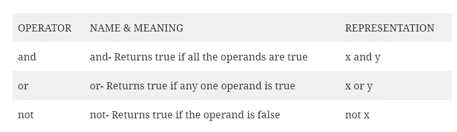

# Python 中运算符的整体概念

> 原文：<https://medium.com/analytics-vidhya/whole-concept-of-operators-in-python-cfc02a93056f?source=collection_archive---------14----------------------->

众所周知，Python 是当今非常流行的编程语言。要学习 Python，你应该了解它的基本概念。Python 中的运算符是进一步使用该语言的重要部分。下面介绍一下 Python 中的运算符！

> **什么是运算符？**

运算符是用于操作数据的构造。它们用于详细说明需要完成的操作。基本上，它们用于对变量和值执行某些操作。

运算符运算的值称为操作数。

python 中的 2+3 将返回输出=5

这里，“+”是执行加法的运算符。“2”和“3”是操作数。

有各种各样的算子，它们有各自独特的性质和功能。python 中的运算符如下:

1.算术运算符

2.赋值运算符

3.逻辑算子

4.按位运算符

5.比较运算符

6.恒等运算符

7.隶属算子

现在，让我们深入运营商，让我们了解更多。

> **1。算术运算符:**与包含数字/数值的项目一起使用，对变量/数值进行各种常见的数学运算。

> **2。赋值运算符:**用于给变量分配不同的值。

> **3。逻辑运算符:**它们用于合并各种条件语句。

4.按位运算符:它们用于比较二进制数。

> **5。比较运算符:**用于比较数值。

> **6。恒等运算符:**它们用于比较对象而非值。如果两个对象是完全相同的对象，并且具有相同的内存位置，那么输出将返回 True，否则将返回 False。

> **7。成员运算符:**用于检查特定元素是否存在于其他元素中。如果元素存在，那么输出将返回 True，否则输出将返回 False。

让我们来看看所有不同使用的运算符的混合程序。

点击这里: [operators.py](https://drive.google.com/file/d/1T_YNVuC0WOrmNS74yK-caZSGKdmmRSPM/view?usp=sharing)

> 现在，让我们检查**“操作者顺序”**:

**PEMDAS** — — P 代表括号，E 代表指数，M 代表乘法，D 代表除法，A 代表加法，S 代表减法。

使用它时，运算符的优先级也很重要。

> **“运算符优先级”:**

此处显示的整体优先级是从最高 ***到最低*** 的所有操作符。而且是从 ***开始从左到右*** 。

这样我们就完成了基本 Python 的另一个重要主题，即运算符、运算符的优先级、运算符的顺序。希望你能发现用更少的时间学到更多的知识对你学习 python 很有用。留在这里等待新的职位。祝你愉快！

更多 python 学习，请访问:[https://wethepythonians.wordpress.com/](https://wethepythonians.wordpress.com/)