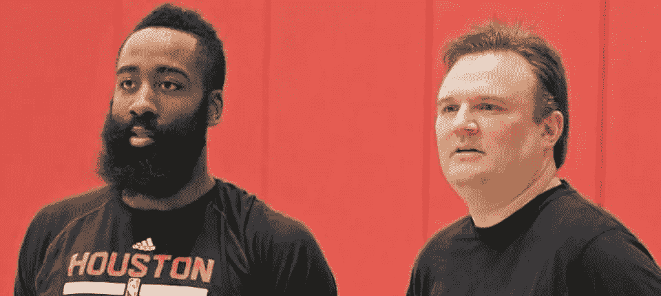
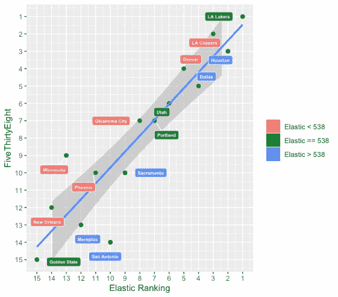
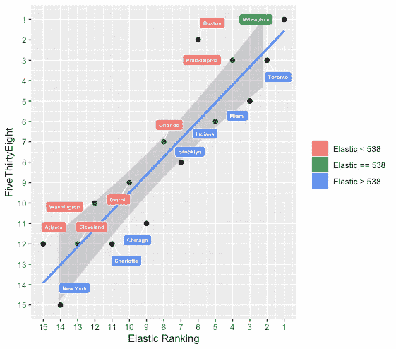
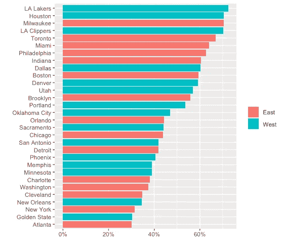
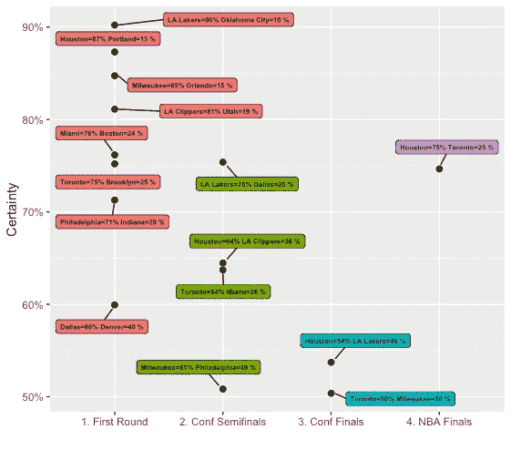
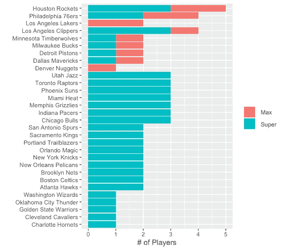
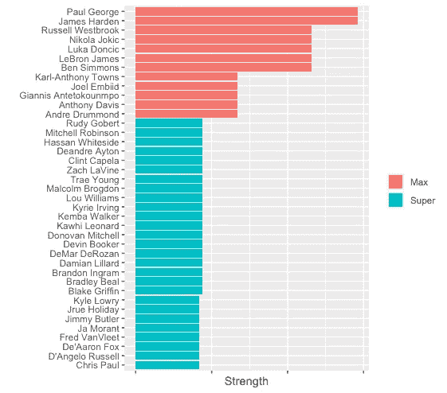
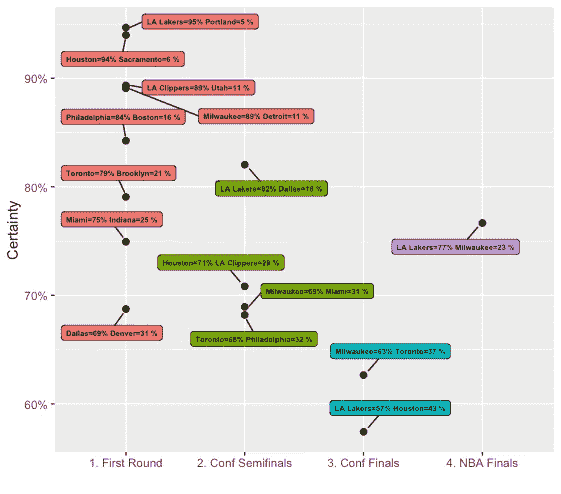

# 谁会赢得 NBA 总决赛？

> 原文：<https://medium.com/analytics-vidhya/wholl-win-the-nba-finals-8b2e966eb793?source=collection_archive---------11----------------------->

2019-2020 NBA 赛季已经进行了 30 场比赛。是时候做一些预测了。我使用**弹性模型**计算了这些数字。

# TL；速度三角形定位法(dead reckoning)

*   火箭队是最有可能赢得 NBA 总决赛的球队。湖人队是第二有可能夺冠的球队。
*   勇士队将以 NBA 第二差的战绩结束常规赛。这可能会导致一个强大的选秀。
*   多伦多和密尔沃基是东部最有可能的竞争者。但是两个队在决赛中都没有机会。

让我们深入研究这些数字。所有预测均基于截至 2019 年 12 月 21 日的数据

# 弹性模型的简要概述

[评分基于一个统计模型](https://github.com/klarsen1/NBA_RANKINGS)，该模型基于三个变量家族预测比赛的获胜者:**花名册**、**表现**和**游戏环境**。

除了功能工程之外，没有人的意见被注入到模型或排名中。

# 让我们看看预测的赛季胜率

我使用弹性模型和[fivethirtyeeight](https://projects.fivethirtyeight.com/2019-nba-predictions/)预测，根据他们本赛季的预计胜率对所有球队进行了排名。然后，我将团队分成三组，分别用绿色、蓝色和红色标签表示。

*   **绿色**:两个模特种子一致的城市。
*   **蓝色**:弹性款*比 538 更*看好团队。
*   **红色**:弹性款*比 538 少*看好团队。

(注意，数字越小意味着级别越高。)

**在西部联盟**中，两个模型都一致认为湖人会赢得本赛季最多的比赛。但他们在 2 号种子上有所不同:538 拥有快船，而弹性模型拥有休斯顿。

在东部，雄鹿预计会赢得两种模式下最多的比赛。但是，再次，模型不同意#2 种子:弹性模型有多伦多和 538 模型有波士顿。

**这里是使用弹性模型的所有团队的原始预测胜率:**

# 常规赛夺冠次数最多≠总冠军

让我们看看，如果我们从每个大会中拿出前 8 名的球队，模拟季后赛会发生什么。下图有点忙。下面就来解读一下:

*   每个点代表一个 7 游戏系列。
*   从左到右带领我们穿过季后赛树，从第一轮到 NBA 总决赛。
*   y 轴代表预测结果的可信度。
*   **例如**:根据模型，休斯顿将有 75%的概率在总决赛中击败多伦多。湖人第一轮打雷霆有 90%的胜算。

# **为什么火箭会战胜湖人？**

如上所述，该模型基于 3 个变量家族:**花名册**、**表现**和**比赛环境**。

让我们双击**花名册组件**:

*   基于标准化的 boxscore 统计数据，使用 k-means 聚类将玩家分为 25 个原型。
*   该算法量化了给每个原型分配更多游戏时间的好处。

为了总结给定名单的优势，我根据模型系数的大小将原型分为三类:**最大玩家>超级玩家>其他所有人。**

(不包括受伤的球员，他们将在 2020 年 3 月 1 日之前无法参赛)

这表明，即使湖人将在常规赛中赢得更多的比赛，他们仍然头重脚轻。火箭有更深的阵容，也有同样多的马克斯球员。

**如果你感兴趣，这里是根据模型排名的前 10%玩家。**x 轴反映了原型强度(有 25 个唯一强度值，每个原型一个，但这里只显示了 5 个)。

# 最后的话

根据最新的可用数据，模型选择了休斯顿。我要选模特。

但是赛季还很早，很多事情都会改变。根据这个模型，西部决赛将会接近掷硬币，这使得季后赛模拟更加不稳定。

为了说明这一点，这里有一个基于更早日期的模拟，湖人队最终在总决赛中对阵密尔沃基队:

全明星赛结束后，我会继续写一篇新的帖子。