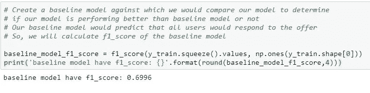
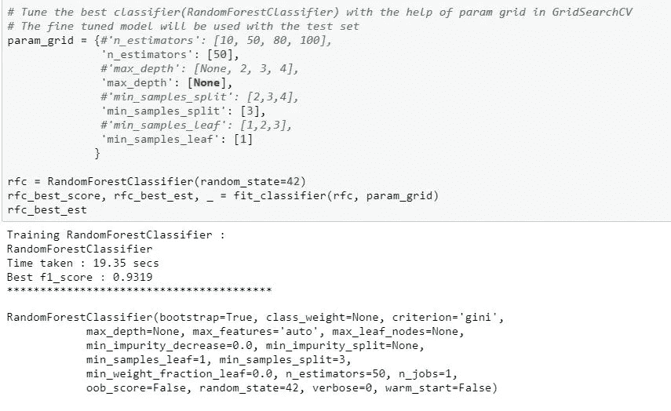

# 谁会响应星巴克的提议？

> 原文：<https://medium.com/analytics-vidhya/whom-will-respond-to-starbucks-offers-84f98eded283?source=collection_archive---------15----------------------->

# 介绍

> 传统营销分析或记分卡对于评估组织过去营销活动的成败至关重要。但今天的营销人员或组织可以利用先进的营销技术，如客户行为预测建模、预测线索评分和各种基于预测分析见解的策略。预测技术可以使一个组织的营销投资更加有效，并有助于定期验证结果。将客户信息与运营数据联系起来，有助于深入了解客户行为和您整体业务的健康状况。

预测营销分析的各种案例包括:

1.  详细的销售线索评分
2.  营销活动培育的销售线索细分
3.  目标内容分发
4.  终生价值预测
5.  流失率预测
6.  追加销售和交叉销售准备就绪
7.  了解产品适合度
8.  营销活动的优化

在本帖中，我们将讨论*“营销活动优化”*的案例。

请参考以下链接，以便更好地了解预测分析对提高营销绩效的影响。

*1。* [*预测分析:它是什么以及为什么重要*](https://www.sas.com/en_us/insights/analytics/predictive-analytics.html)

*2。* [*面向数据丰富环境的营销分析*](https://www.rhsmith.umd.edu/files/Documents/Departments/Marketing/wedel-kannan-jm-2016-final.pdf)

*3。* [*如何利用预测分析提高营销绩效*](https://www.singlegrain.com/digital-marketing-analytics/how-to-use-predictive-analytics-for-better-marketing-performance/)

## 问题陈述

在本帖中，我们将通过 Starbucks 数据集的例子来介绍客户行为的预测建模技术。星巴克提供了模拟数据，模拟星巴克奖励移动应用程序上的客户行为。数据集可以在[这里](https://github.com/gauravansal/Starbucks-Capstone-Challenge/tree/master/data)找到。每隔几天，星巴克就会向手机应用程序的用户发出一次报价。优惠可以仅仅是饮料的广告，也可以是实际的优惠，如折扣或 BOGO(买一送一)。某些用户可能在特定的几周内收不到任何报价。并非所有用户都收到相同的报价，这个数据集是真实星巴克应用程序的简化版本，因为底层模拟器只有一种产品，而星巴克实际上销售几十种产品。

星巴克希望将优惠数据、客户数据和交易数据(运营数据)联系起来，以获得关于客户行为和优惠整体有效性的见解，从而实现商业价值。

***记住上面的关键语句，下面是主要目标或问题动机或问题语句:***

> **建立一个模型，预测客户是否会对报价做出反应。**

> 上述问题是一个二元分类问题，可以通过使用监督机器学习分类算法来解决，如逻辑回归、随机森林、Adaboost、梯度提升。
> 
> 这个问题的解决方案的简要概述是，在数据预处理(清洗和转换)和特征工程之后，星巴克的不同数据集(报价、人口统计和抄本)将被组合以形成组合数据集。适当和正确的组合数据将被输入到各种机器学习分类模型中，这些模型将发现客户行为的隐藏特征，这些特征在影响客户是否对报价做出响应方面起着重要作用。经过训练的分类模型会将客户分类为目标类别(如果客户会响应，则为 1；如果客户不会响应，则为 0)。对于此问题，将基于适当的性能指标(在下一节中讨论)来比较模型的性能。最佳性能分类模型将基于性能度量和训练时间来选择，并且将通过微调所选模型的最佳估计器的超参数来进一步细化。这个项目分析的完整代码可以在[这里](https://github.com/gauravansal/Starbucks-Capstone-Challenge/tree/master/data)找到。

## 概观

***整个分析将包含以下步骤:***

1.  分析每个投资组合、个人资料和交易数据。
2.  清理和转换每个投资组合、配置文件和交易数据。
3.  组合投资组合、个人资料和交易数据。
4.  选择一个性能指标来分析模型的性能并比较不同的模型。
5.  计算基线模型的性能，并与其他不同模型的性能进行比较。
6.  根据指标和培训时间选择最佳性能模型。
7.  计算由训练模型的最佳估计器给出的特征重要性。
8.  计算测试集上最佳模型的性能，并通过混淆矩阵图可视化性能。

# 步骤 1-分析每个投资组合、个人资料和交易数据

该数据集包含模拟星巴克奖励移动应用程序上的客户行为的模拟数据。数据包含在三个文件中:

*   portfolio . JSON——包含要约 id 和关于每个要约的元数据(期限、类型等)。)
*   profile.json —每个客户的人口统计数据
*   transcript.json 记录交易、收到的报价、查看的报价和完成的报价

以下是文件中每个变量的模式和解释:

**portfolio.json**

*   id(字符串)—优惠 id
*   offer_type (string) —优惠的类型，即 BOGO、折扣、信息
*   难度(int) —完成报价所需的最低花费
*   奖励(int) —为完成一项提议而给予的奖励
*   duration(int)-报价开放的时间，以天为单位
*   频道(字符串列表)

**profile.json**

*   age(int)-客户的年龄(缺失值编码为 118)
*   成为会员日期(int) —客户创建应用帐户的日期(格式为 YYYYMMDD)
*   性别(str) —客户的性别(请注意，有些条目包含“O”代表其他，而不是 M 或 F)
*   id (str) —客户 id
*   收入(浮动)—客户的收入

**抄本. json**

*   事件(str) —记录描述(即交易、收到的报价、查看的报价等。)
*   人员(字符串)—客户 id
*   时间(整数)—测试开始后的时间，以小时为单位。数据开始于时间 t=0
*   value —(字符串字典)—报价 id 或交易金额，具体取决于记录

# 步骤 2—清理和转换每个投资组合、配置文件和交易数据

在阅读了。json 文件作为 pandas 数据帧，对所有三个数据文件进行了分析，结果如下。

***投资组合数据***

1.  投资组合数据框架中没有空值。
2.  有 3 种报价类型，即 4 种 bogo 报价、4 种折扣报价和 2 种信息报价。
3.  分类变量被一次性编码，下面是最终的数据框架。

投资组合数据框架

4.最后，以下是投资组合数据框架的特征。

投资组合数据框架的特征

***剖面数据***

1.  删除了对年龄为 118 岁、性别为 None、收入为 nan 的客户的观察。有 2175 个这样的观察。此外，年龄特征中的值 118 表示空值。
2.  已将“年龄”和“收入”功能转换为 bin。'年龄'特征被分成特征'年龄 _10s '，'年龄 _20s '，'年龄 _30s '，'年龄 _40s '，'年龄 _50s '，'年龄 _60s '，'年龄 _70s '，'年龄 _80s '，'年龄 _90s '和'年龄 _100s '。

年龄特征分布

> 从上面我们可以清楚地看到，年龄在 118 岁的客户在分布图中非常突出。因此，从个人资料数据框架中删除这些客户是不现实的，因为这些客户没有任何性别和收入，并且年龄为 118 岁的客户数量为 2175。

无年龄 118 的年龄特征分布

> 从上面的图中，我们可以观察到在丢弃年龄 118 之后的特征年龄是均匀分布的。

3.'收入'特征被分成特征'收入 _ 30 次'，'收入 _ 40 次'，'收入 _ 50 次'，'收入 _ 60 次'，'收入 _ 70 次'，'收入 _ 80 次'，'收入 _ 90 次'，'收入 _ 100 次'，'收入 _ 110 次'和'收入 _ 120 次'。

4.“性别”特征被 one hoten 编码为“F”、“M”和“O”，分别描述女性、男性和其他。

特征性别分布

> 从上面可以看出，男性成员比女性成员多，女性成员比其他人多。

特征收入分布

> 从上图中，我们可以观察到，收入在整个收入范围内呈非均匀分布，高收入低分布，这似乎是合理。

按性别分列的收入直方图

> 从上文中，我们可以看出，男女收入的性别分布似乎相似，男女的最低和最高收入几乎相同，男性收入略偏向低收入。此外，其他人的收入分配也与男性和女性相似，最低和最高收入低于(男性和女性)。

5.对特性“成为 _ 成员 _ 开”进行了特性工程设计，并生成了少量其他特性，即—

*   ‘成员资格 _ 任期’—表示客户成员资格的长度
*   2013 年、2014 年、2015 年、2016 年、2017 年和 2018 年——顾客成为星巴克会员的年份。
*   “月 _1”、“月 _2”、“月 _3”、“月 _4”、“月 _5”、“月 _6”、“月 _7”、“月 _8”、“月 _9”、“月 _10”、“月 _11”和“月 _ 12”——顾客成为星巴克会员的月份。

每年的客户数

> 从上面我们可以观察到，除了 2018 年，成为会员的客户数量每年都在增加。我们不确定，2018 年有多少个月，数据是模拟的。因此，我们可以得出这样的结论:客户会员数量每年都在增加。

每个成员年度的性别分布

> 从上面的图中，我们可以观察到男性成员几乎等于或多于女性成员。因此，男性成员多于女性成员，女性成员多于其他成员。

每月客户分布

> 从上面，我们可以观察到，在寒冷季节后期，特别是在(八月、九月、十月、十一月、十二月、一月)顾客会员增加了，这也是有道理的，因为顾客在寒冷的天气会喝更多的咖啡。

6.最后，以下是 profile 数据框架的特征

轮廓数据帧的特征

***成绩单数据***

1.  抄本数据帧中没有空值。

> 在副本数据帧中有 11.02 %即 33772 个观察值属于 118 岁的客户。因此，我们删除了对 118 岁客户的观察，因为我们还有大约 89%的数据需要进一步分析。
> 
> 有 45.45%的事件为交易，24.38%的事件为收到的要约，18.28%的事件为查看的要约，11.89 %的事件为完成的要约。我们将用“交易”和“报价”类型来分离事件，以便稍后用于分析。

2.最后，以下是抄本数据框架的特征

转录数据帧的特征

# 第 3 步—组合投资组合、个人资料和交易数据

1.  要约数据和交易数据被分离，并创建了两个新的数据帧，即:I)要约 _df，仅包含类型为“已收到要约”、“已查看要约”和“要约已完成”的事件；以及 ii)数据帧 transaction_df，仅包含类型为“交易”的事件。

> 报价类型“bogo”和“discount”具有事件“offer received”、“offer viewered”和“offer completed”，而报价类型“informational”只有事件“offer received”和“offer viewered”。因此，对于优惠类型“bogo”和“discount ”,当在优惠期内出现“已查看优惠”,然后是“已完成优惠”的事件时，我们会将该优惠视为已完成，而对于优惠类型“信息性”,当客户在优惠期内查看信息性优惠后进行购买交易时，我们会将其视为已完成。

2.转换报价 _df &交易 _df。

优惠 _df

交易 _df

3.将交易、人口统计和报价数据合并到 combined_data_df 中。

4.最后，下面是 combined_data_df 数据帧的特点。

组合数据测向的特点

5. ***分析报价回复率***

> 发送给客户的报价分布几乎是均匀的。

offer_id 的分布

以下是客户对不同报价的回应率。

出价回应率

offer_id 的回应率

> offer_id 为“fafdcd 668 e 3743 C1 bb 461111 dcafc 2 a 4”、报价类型为“折扣”的报价得到了客户的最高回应，回应率为 76%，而 offer_id 为“3f 207 df 678 b 143 EEA 3c e 63160 fa 8 bed”、报价类型为“信息性”的报价得到了客户的最低回应，回应率为 37%。

高回应率和低回应率的报价

> offer _ id“fafdcd 668 e 3743 C1 bb 461111 dcafc 2 a 4”是最成功的优惠，与“折扣”优惠相对应，在收到优惠后 10 天内最低消费 10 美元，奖励 2 美元。offer _ id“3f 207 df 678 b 143 EEA 3a ce 63160 fa 8 bed”是最不成功的报价，对应于没有最低消费要求、没有奖励的信息性报价。

# 步骤 4 —选择一个性能指标来分析模型的性能并比较不同的模型

1.  下面是目标类在组合数据中的分布。

组合数据中目标类的分布

目标类在组合数据中的分布百分比

> 从上面可以看出，我们从 Starbucks 数据集(报价数据、客户人口统计数据和交易数据)中创建的组合数据集在目标类别分布方面几乎是平衡的(略微不平衡)(由类别 1 代表的响应报价(54%)的客户和由类别 0 代表的不响应报价(46%)的客户),在这种情况下，准确性等性能指标不是衡量模型性能的正确标准，应该避免。相反，在这种情况下，精确度、召回率和 f1_score 是评估模型的好方法。
> 
> 在这种情况下，用精度和召回率来评估模型将提供对其性能的更好的洞察，而不是准确性。因为，星巴克希望向那些有更多机会兑现优惠的顾客发送优惠，而不是向所有顾客发送优惠，这将使星巴克能够进行有效的营销，并能够从优惠中实现更多的商业价值。f1-得分指标是“精确度和召回率指标的调和平均值”,是提供更大的问题预测能力和预测模型预测效果的更好方法。参考[分类精度不够:更多性能指标您可以使用](https://machinelearningmastery.com/classification-accuracy-is-not-enough-more-performance-measures-you-can-use/)了解更多信息。

# 步骤 5 —计算基线模型的性能，并与其他不同模型的性能进行比较

我们将创建一个基准模型(一个天真的模型)，我们将与我们的模型进行比较，以确定我们的模型是否比基准模型表现得更好。我们的基线模型会预测所有用户都会对报价做出反应。因此，我们将计算基线模型的 f1_score。

> 我们的基本模型的 f1_score 为 0.6996。因此，我们的其他训练分类器应该产生比阈值 f1_score 0.6996 更好的 f1 _ score。

# 第 6 步—根据指标和培训时间选择最佳表现模型

1.  在训练分类器如逻辑回归、随机森林、Adaboost & GradientBoosting 之前，组合数据被分成训练和测试数据。

目标类在训练集中的分布

测试集中目标类的分布

2.从上面我们可以观察到，我们的训练和测试集在目标类的分布方面也几乎是平衡的。

3.combined_data_df 中的一些功能被删除，因为这些功能在训练模型期间不会发挥任何作用，如“客户 id”、“报价 id”、“时间”、“电子邮件”。

I)删除“客户标识”和“报价标识”，因为它们是唯一标识符。

ii)去掉“时间”,因为不需要。它用于检查客户是否对报价做出回应，并计算总金额，然后以正确的形式将适当的数据输入到机器学习算法中。

iii)删除“电子邮件”,因为它在所有观察中只有 1 个值，并且值为 1。

4.在将组合数据分成训练和测试数据后，使用[最小最大缩放器](https://scikit-learn.org/stable/modules/generated/sklearn.preprocessing.MinMaxScaler.html)对诸如“难度”、“持续时间”、“奖励”、“成员资格 _ 任期”、“总额”等特征进行缩放。它通过将每个特征缩放到给定的范围来变换特征，默认范围在 0 和 1 之间*。*

5.对于所有 4 个分类模型，最初使用默认参数值，并且仅设置 random_state 变量以再现结果。稍后，我们将在 GridsearchCV 的帮助下细化最佳模型的参数。

最初使用默认参数

6.在缩放和丢弃不必要的特征之后，各种分类器在训练数据上被训练，并且产生比基线模型的 f1_score 更好的 f1_score。

分类器的 f1_score 和训练时间

> 我们所有训练的分类器产生比阈值 f1_score 0.6996 更好的 f1 _ score。RandomForestClassifier 和 GradientBoostingClassifier 获得了几乎相等的 f1_score(大约。0.92)但是 RandomForestClassifier 比 GradientBoostingClassifier 花费的训练时间要少得多。因此，在上述 4 个分类器中，性能最好的分类器算法是 RandomForestClassifier。

7.在使用 GridSearchCV 对训练好的 RandomForestClassifier 的超参数进行微调之后，我们的模型得到了改进，并产生了更好的 f1 _ score 0.9319，并对测试数据进行了交叉验证。我们的最终模型比之前报道的 f1_score 为 0.6996 的基准模型或基线模型或天真模型更强。

微调已训练的随机森林分类器

# 步骤 7-计算由训练模型的最佳估计器给出的特征重要性

1.  以下是 10 大功能及其重要性。

十大功能

前 10 项功能重要性条形图

2.以下是对 10 大特征的观察—

*   影响客户在查看报价后是否会对报价做出回应的 10 大特征是:`'total_amount', 'membership_tenure' , 'social', 'difficulty', 'duration', 'reward', '2018', '2016', 'income_30ths'`和`'age_50s'`。
*   `total_amount`顾客花费是最大和最大的特征，它可能会在顾客查看报价后单方面影响顾客是否会完成报价，即顾客花费多少可能会决定顾客是否会完成报价。因此，事先知道客户可以花多少钱肯定有助于确定客户是否会对报价做出反应并完成交易。为此，需要另一种监督学习算法，即回归模型，以便根据报价数据和客户人口统计数据预测个人可能花费的总金额。
*   在`'total_amount'`之后，`'membership_tenure'`是第二大特征——它代表了顾客成为星巴克奖励计划会员的时间长短对顾客是否会在回应后完成报价有很大影响。
*   在`'membership_tenure'`、`'social feature'`之后——这表示，如果星巴克通过社交媒体向顾客发送报价，可能会比其他沟通方式得到更多的回应。
*   在`'social'`功能之后，`'difficulty'`功能——表示如果客户响应并完成报价，完成报价所需的最低金额。
*   在`'difficulty'`功能之后，`'duration'`功能——代表优惠有效期的长短，影响客户的反应和优惠的完成。
*   在`'duration'`特征之后，`'reward'`特征——代表作为奖励的金额，如果客户愿意回应并完成报价，客户将会重新获得影响力。
*   在`'reward'`特征之后，`'2018'`和`'2016'`特征代表——如果顾客在 2016 年& 2018 年成为星巴克奖励计划的会员，就有更多的机会对优惠做出回应并完成它。
*   在`'2018'`和`'2016'`特征之后，`'income_30ths'`特征代表-如果客户的收入在 30000 英镑左右，这是起始收入组，那么客户可能会对报价做出更多反应并完成报价。
*   在`'income_30ths’`特征之后，`'age_50s'`特征代表——如果客户年龄在 50 岁以上，那么客户可能会对报价做出更多反应并完成报价。

# 步骤 8-计算测试集上最佳模型的性能，并通过混淆矩阵图可视化性能

1.  测试数据的准备方式与训练数据完全相同，测试数据的类是使用微调的 RandomForestClassifier 预测的。

预测测试数据类别

2.根据测试数据计算 f1_score

精确度、召回率、f1 _ 测试数据得分

> 微调的 RandomForestClassifier 最佳估计器在测试数据上产生了 0.9336 的 f1_score，这是相当好的。

3.从混淆矩阵计算真阴性、假阳性、假阴性和真阳性。

来自混淆矩阵的 tn、fp、fn、tp

4.不归一化绘制混淆矩阵。

无归一化的混淆矩阵

5.绘制标准化混淆矩阵。

标准化混淆矩阵

> 从上面的标准化混淆矩阵中，我们观察到有 4%的机会将一个通常会对一个不会对提议做出反应的个体进行错误分类。类似地，有 11%的机会将一个不会回应的人错误分类为一个会回应提议的人。因为，假阴性比假阳性少，我们的预测模型做得很好，因为它有非常低的机会错过会响应的个体。由于星巴克不希望错过将报价发送给会对报价作出响应的个人，这种模式在这种情况下会很好，并且通过使用这种模式，星巴克不会错过将报价发送给会对报价作出响应的个人，因此，整体业务收入不会受到影响。此外，如果星巴克能够确保他们已经在很大程度上覆盖了会对要约做出回应的个人，星巴克不会介意向少数不会做出回应的个人发送要约。因此，我们的预测模型非常适合这种情况。

## 反射

这个项目中我最感兴趣的方面是如何使用预测建模技术和分析将不同的数据集(即报价数据、客户人口统计数据和交易数据)结合起来，以获得洞察力，从而为企业提供更好的业务决策和价值。整个分析中最困难的部分是找到逻辑和策略，以便根据对客户有效的报价持续时间来生成组合数据集。

## 改进

1.*“想出新功能很困难，很耗时，需要专业知识。‘应用机器学习’基本上是特征工程。”* —吴恩达教授。因此，可以对报价、客户人口统计和交易数据执行更多的特征工程，以便有更多更好的模型。

2.此外，我们可以通过采用另一个问题陈述来改进该项目，即使用受监督的机器学习回归算法，根据报价数据和人口统计数据来确定客户可以花费多少，这反过来将有助于发现客户是否会响应，因为客户可以花费的“总额”是最佳训练分类器模型中最重要的特征。

3.此外，我们可以通过使用 [8 策略将我们接近平衡(略有不平衡)的数据集变成完全平衡的数据集来改善该项目，以消除您的机器学习数据集](https://machinelearningmastery.com/tactics-to-combat-imbalanced-classes-in-your-machine-learning-dataset/)中的不平衡类。这将进一步提高分类模型的性能。

4.我们还可以执行聚类建模(行为聚类、基于产品的聚类、基于品牌的聚类),以便根据几个变量一次将客户细分成几个组。有了它，我们可以针对不同的目标锁定特定的人口统计数据和角色。

这个分析的完整代码可以在这里找到****。****