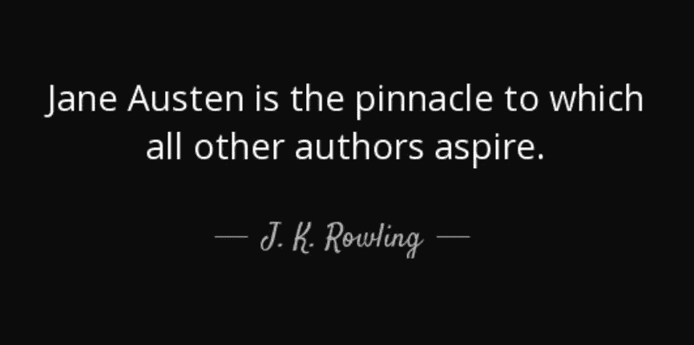
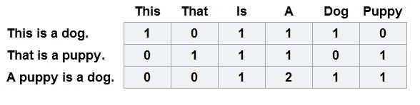
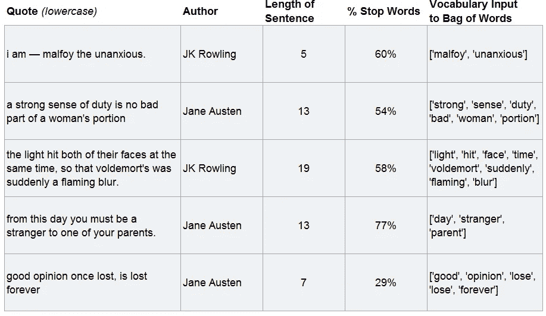
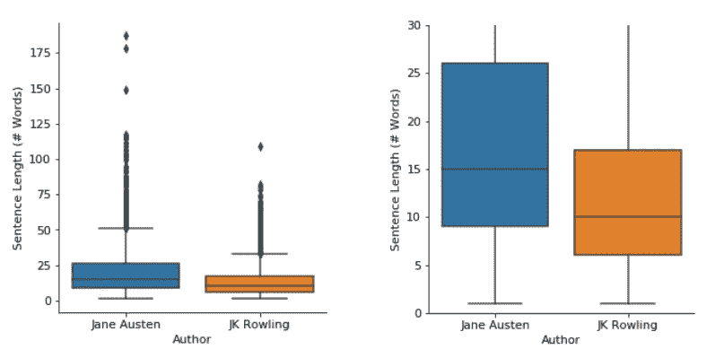
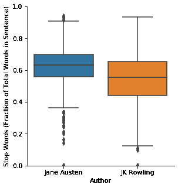
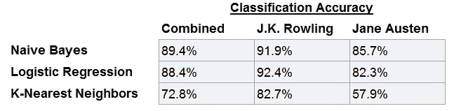
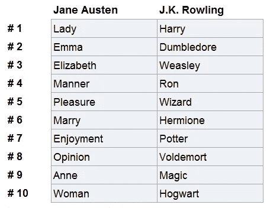
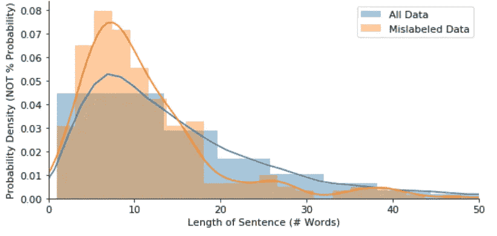

# 台词落谁家

> 原文：<https://medium.com/analytics-vidhya/whose-line-is-it-anyway-622a31507918?source=collection_archive---------24----------------------->

# 介绍

在最近一次去伦敦的旅行中，我和一些英国朋友聊起了俚语的地区差异，以及英语是如何随着时间的推移而演变的。我认为听到我来自英格兰北部的朋友相对于我来自南部的朋友说话有多么不同是很有趣的，我想使用机器学习来进一步探索英语的差异！

我的想法演变成评价著名英国作家的语录。我选择了两位生活在非常不同的时代、有着非常不同写作风格的作家——j . k .罗琳和简·奥斯汀。目标是建立一个机器学习模型，可以预测两个作者中的哪一个写了给定的引用。

我对这个问题感到兴奋，因为我不仅能够用真实的数据测试各种分类算法的优缺点，我还将:(1)学习如何从 web 上抓取数据，(2)清理困难的文本数据，以及(3)窥视自然语言处理的世界。

# 数据

**文字数据**:从 goodreads.com 的行情板块刮来的约 5750 条行情([链接到数据](https://github.com/kscherich/Whose_Line_is_it_Anyway/blob/master/Quotes.csv))。大约 50%引用了简·奥斯汀的话，50%引用了 J.K .罗琳的话。

**提取数值数据**:机器学习模型以数值作为输入。为了让我们的算法从文本数据中提取模式，我们首先需要找到一种方法将其转换为数字数据。

一种常用的方法是创建一个**单词包(BoW)** 。为了生成一个单词包，我们首先创建一个包含数据集中所有单词的词汇表，然后统计每个单词在每个引用中出现的次数。

示例单词袋模型

对于我们的模型，我们将对单词包进行三个简单的改进:

1.  忽略常用英语单词(称为**停用词**)。这些词出现得如此频繁，以至于对文本分类没有太大价值。“The”、“a”和“and”都是停用词的例子。
2.  将有共同词根的单词组合在一起(称为**词汇化**)。作为一个例子，在我们的模型中，“玩”、“玩”和“已玩”都分组在单词“玩”下。
3.  调整单词计数值以衡量单词的重要性。例如，如果“傲慢”一词很少使用，但“男人”一词很常见，则使用“傲慢”一词的两个引号会比使用“男人”一词的两个引号更相似(称为术语频率逆文档频率， **TF-IDF** )

遣词造句并不是简·奥斯汀和 J.K .罗琳的唯一区别。我们还可以通过查看**句子的长度**来获得一些洞察力，由于我们手头有数据，我们还将查看每个句子中停用词所占的**百分比。**

虽然有几种其他方法可以从文本中提取数字特征，但我认为我有足够的特征来构建模型的第一个版本。如果需要，还有很多其他方法可以从文本中提取额外的数字信息，以在未来的迭代中改进模型！

# 数据准备

在能够生成我们的单词袋模型之前，我们需要准备从 goodreads.com 收集的数据。

Goodreads.com 有不同长度的报价。有时一个引用是一个句子，而其他时候一个引用是多个段落。通常，单句引语会在较长的引语中重复出现。为了消除这种重复，我把长引号分解成单独的句子，并认为每个句子都是它自己的引号。然后我把重复的句子都删了。

此外，大量的 goodreads.com 引语是用不同的语言写成的。高精度地识别和消除非英语引用被证明是一个棘手的挑战！

除了以上所述，我还:

1.  将所有字符转换为小写，以同样方式对待“hello”、“HELLO”和“Hello”等单词。
2.  删除所有不相关的字符，如标点符号和数字
3.  完全由常用英语单词(停用词)组成的已删除句子，如“是谁？”或者“他在这里。”

经过数据清理，60%的引文出自 J.K .罗琳，40%出自简·奥斯汀。清理后的数据示例如下所示。

干净的报价样本

# 数据可视化

在深入模型创建和评估过程之前，让我们先了解一下我们正在处理的一些数据！

**特征—句子长度**

我怀疑简·奥斯汀和 J.K .罗琳的句子长度是否会有很大差异。我很高兴地发现简·奥斯汀的句子比 J.K .罗琳的句子长得多。这意味着我们的算法可能会发现这些数据是有用的！

句子长度的分布(第二张图是第一张图的放大版)。方框显示第 25、50 和 75 个百分位数，触须表示排除异常值的值范围，点显示异常值。

**特征—句子中停用词的百分比**

我们还注意到简·奥斯汀比 J.K .罗琳更有可能在她的句子中使用大量的普通英语单词(停用词)。同样，我们的算法可能会发现这些数据很有用！

停用词频分布

# 算法和结果

为了这个项目，我决定尝试三个机器学习分类器。第一，朴素贝叶斯，因为它非常简单、快速，并且通常适用于单词包数据。第二，逻辑回归因为它也比较简单，快捷，应用广泛，而且可以很容易地解释输出，了解输入的重要性。第三，K-最近邻因为这种算法很慢，占用大量内存，并且通常在像我们这样的高维数据上表现很差——所以我认为这将是一个有趣的比较点！

每个算法的一些技术细节:

*   我在我的朴素贝叶斯模型中使用了一个多项分布的概率函数，通过网格搜索来选择 alpha(拉普拉斯平滑项)的值。α的最佳值为 0.01。
*   我使用了 L2 正则化逻辑回归模型和网格搜索来选择 C(正则项)的值。C 的最佳值为 10。
*   我在 KNN 算法中使用了欧几里得距离，通过网格搜索来选择邻居的数量。邻居的最佳数量是 5。
*   所有网格搜索都进行了 10 倍交叉验证。下表中显示的准确度是每个模型的 10 个训练测试分割分组的平均准确度。

每个模型的精确度

仅仅是每次预测多数类(J.K .罗琳)的准确率就达到了 60%。我们用所有的算法显著地击败了它！正如预测的那样，K 近邻表现最差，运行速度也最慢。另一个有趣的注意是，所有的模型对 J.K .罗琳引语的分类准确率都比简·奥斯汀引语高。

通过分析逻辑回归模型，我们可以找到对预测每个作者最有帮助的词，如下所示。注意，J.K .罗琳的清单几乎全是专有名词，而简·奥斯汀的清单专有名词略少。专有名词的大量使用可能与为什么该算法在对 J.K .罗琳的引用进行分类时比简·奥斯汀的引用更好有关。进一步探索删除专有名词会如何影响模型，以及我们是否可以在没有专有名词的情况下构建一个高度精确的模型，这将是非常有趣的。

每位作者的十个最具预测性的词

通过检查错误分类的引文，我们可以了解到很多问题。错误分类的报价示例:

*   “我不知道错误在哪里”——简·奥斯汀
*   “我不认识你”——简·奥斯汀
*   “你不知道我的能力，你不知道我做了什么！”— J.K .罗琳

从这些例子中，我们看到，添加一个统计句子中缩写数量的特性(例如，“不要”与“不要”)可能值得进一步探索

此外，长度为 6 到 12 个单词句子更有可能被错误分类。也许长句和单字句可能包含专有名词，而短句不太可能包含相关信息。

句子长度分布

# 结论

我们能够建立一个算法来正确区分简·奥斯汀和 J.K .罗琳的引用，准确率接近 90%。对每个作者最有预测力的词往往是专有名词(例如，哈利、邓布利多、艾玛、伊丽莎白)。

如果我们能在没有专有名词的情况下建立一个高度精确的模型，这将是一个有趣的探索。通过观察两位作者之间的其他差异，例如缩写的使用(例如，“不”与“不”)，看看我们可以在多大程度上改进我们的模型也是有趣的。

如果有人对我的数据或我的代码感兴趣，可以在 GitHub (github.com/kscherich)上找到！