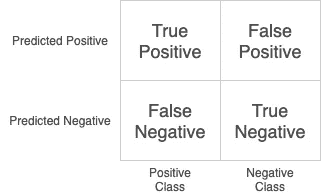
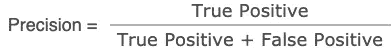
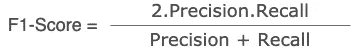
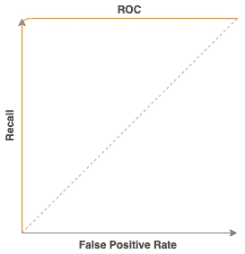

# 为什么准确性不是最好的衡量标准？

> 原文：<https://medium.com/analytics-vidhya/why-accuracy-is-not-the-best-metric-59214724faf3?source=collection_archive---------29----------------------->


# 介绍

目前，世界正在抗击一种疾病——新冠肺炎。致命的是它攻击呼吸器官，可能是致命的。它也在人群中传播，因此，我们需要隔离怀疑感染新冠肺炎病毒的人。我们可以尝试建立一个机器学习模型，根据特征(体温、外部症状或血细胞计数)来预测一个人是否需要隔离。

让我们考虑一个使用决策树分类器构建的样本模型:

```
model = **DecisionTreeClassifier**(max_depth=4).fit(X_train, y_train)
y_pred = model.predict(X_test)
print('accuracy: %.2f'% accuracy_score(y_test, y_pred))
```

> **输出:**
> *精度:0.95*

我们得到了相当好的精度，可能是我们所期望的结果。但是，让我们来看看几个可能会导致问题的场景:

1.  尽管准确性很高，但该模型仍然预测到少数人被错误地归类为新冠肺炎阳性。这将不必要地增加隔离的必要性。另一方面，该模型也可能预测少数新冠肺炎阴性的人，这是危险的，因为患者可能在没有治疗的情况下导致严重的健康问题，并且在没有隔离的情况下不知不觉地传播。在误分类中，前者被称为 ***假阳性*** 或***1 型错误*** ，后者被称为 ***假阴性*** 或***2 型错误*** 。这取决于哪个指标更重要和需要更多关注的问题，考虑到我们的问题陈述，我们需要减少假阴性计数。
2.  在实际数据集中发现的一个常见问题是**不平衡数据集**。我们不能期望真实场景中的类具有相同数量的数据。考虑到上述问题陈述，我们可能将 95%的数据归类为非新冠肺炎患者。用此数据训练的模型在新数据上大多会预测为非新冠肺炎，并且可能显示出较高的准确性。因此，我们发现精确度不是描述我们的模型有多好的最佳度量。

# 让我们看看有助于量化结果的替代指标:

## 混淆矩阵

为了评估二元分类，我们使用混淆矩阵来导出预测结果的重要度量。混淆矩阵看起来像:



它让我们深入了解我们已经讨论过的假阳性和假阴性。它还显示了真阳性和真阴性，正如名称所暗示的，如果我们认为我们的类别是阳性和阴性，那么正确分类的数字将由真阳性和真阴性来表示。

考虑到上述训练的模型，我们获得一个混淆矩阵:

```
(tn, fp, fn, tp) = **confusion_matrix**(y_test, pred_y).ravel()
print('TP: %d, TN: %d, FP: %d, FN: %d' % (tp, tn, fp, fn))
```

> **输出:**
> TP: 29，TN: 397，FP: 6，FN: 18

虽然准确性很高，但该模型仍然产生 18 个假阴性，这将不必要地导致病毒传播。我们需要尽可能地降低这个数字，同时我们不能认为每个人都是积极的，那么这个模型就没有用了。


## **除了准确性之外，其他有用的指标:**

精度它决定了预测为阳性的样本数为正[1]。当我们希望假阳性尽可能少时，它有助于确定指标。让我们考虑网页中经常使用的检测僵尸程序的图像验证系统。现在，如果一个人试图访问并且基于验证系统它拒绝访问，那么它不能提供一个好的提供者系统。因此，我们需要建立模型来减少这种情况下的假阳性。



**回忆** 也称为灵敏度，它决定了正面预测所捕获的正面样本的数量[1]。上面讨论的问题陈述表明，当我们将一个人归类为新冠肺炎患者或非患者时，需要更少的假阴性。


> 在一个模型中考虑这两个指标可能会变得具有挑战性，因为我们可能会构建减少假阳性但导致假阴性增加的模型，反之亦然。需要一个平衡的指标来解决这个问题。因此，我们来到 F1-Score。

**F1 得分**
它是精确度和召回率的调和平均值，其中 F1 得分在 1 [2]处达到最佳值。它提供了一个更好的衡量标准来找到精确度和召回率之间的平衡，并通过不仅仅依赖精确度来更好地理解模型。通常，即使两个模型的精确度非常接近，我们也可能会发现 F1 分数存在明显差异。



## 受试者工作特性曲线

为了决定最终的模型，我们需要决定分类器所有可能的阈值。ROC 曲线显示召回率或真阳性率对假阳性率。假阳性率是指被错误捕获为阳性样本的阴性样本数。我们可以对目标变量设置不同的阈值，并绘制相应的召回率和假阳性率值。具有良好分类的模型将具有高的召回率和假阳性率。因此，理想的曲线应该接近图的左上角，而不好的分类将导致 ROC 曲线接近 45°的线。



理想 ROC 曲线

对应 ROC 曲线的面积称为 **AUROC(受试者工作特性曲线下面积)**。一个理想的好分类模型将具有为 1 的 AUROC 值。分类器的 ***AUROC*** *等于分类器将随机选择的正样本排序高于随机选择的负样本的概率。*

**参考文献**

[1]Andreas c . Muller & Sarah Guido—*“用 python 进行机器学习简介”*

[2]https://en.wikipedia.org/wiki/F1_score

**感谢您阅读本文。编码快乐！**