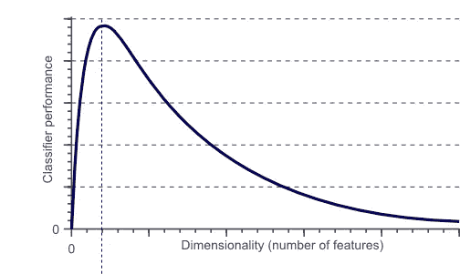
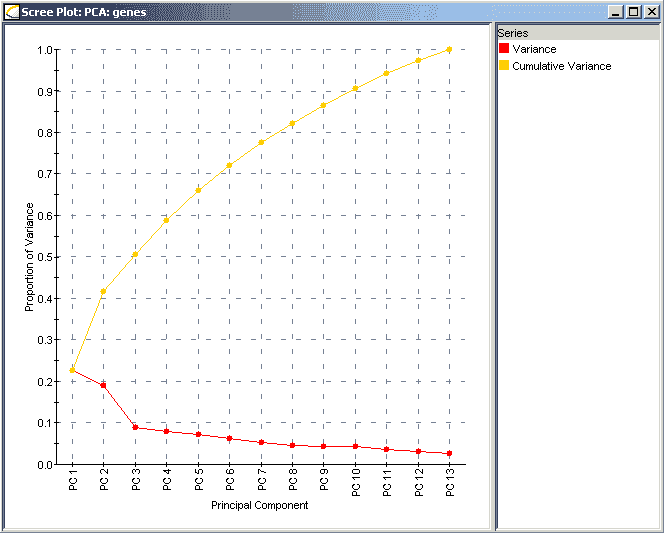

# 为什么以及如何实施认证后活动

> 原文：<https://medium.com/analytics-vidhya/why-and-how-pca-implemented-5d2d9f282a94?source=collection_archive---------24----------------------->

“维度的诅咒”，在我的母语(泰卢固语)中被翻译为“kolathala yoka saapam”听起来像好莱坞配音的恐怖电影，这种现象通常被称为在处理高维数据时出现的问题，这些问题在低维中并不存在。



分类器或回归器的预测能力首先随着使用的维度/特征数量的增加而增加，然后降低

在糟糕的情况下，数据集可能有大量的要素或维度。随着特征数量的增加，可视化(更高的维度，不可能)或训练变得更加复杂，并且模型可能过度拟合数据，导致性能不佳

但在特征数据集较少的情况下，数据量较小，因此需要存储。冗余较少，因此精度提高。此外，该模型运行速度更快

那么，我们如何克服这个问题呢？，降维就来了

# 维度还原

降维是降低数据集中的维度的过程，这意味着在不丢失太多信息的情况下将高维数据转换为低维数据。

降维有两类技术:特征消除和特征提取。主成分分析属于特征提取技术。

降维工具有很多。但是 PCA 比较老但是很受欢迎

# 主成分分析

PCA(主成分分析)是一种用于特征提取的技术，主要用作探索性数据分析的工具和用于建立预测模型。PCA 的思想很简单——将大数据集(k 维)的维数降低到一个更小的(d 维),其中 d

对于给定的数据集，变量之间的线性相关性被分解为独立的变量，这些变量相互独立且正交，它们被称为主成分。这种变换以这样一种方式定义，即第一个主分量具有最大可能的方差(更多地分布在数据中),而每个随后的分量在与前面的分量正交且不相关的约束下又具有最大可能的方差

对于给定的高维数据集，PCA 过程包括:

*   使数据标准化
*   求标准化数据的协方差矩阵。
*   为获得的协方差矩阵计算特征向量和相应的特征值。
*   按照特征值降序排列特征向量。
*   选择第一个 d 特征向量，这将是新的 d 维，将原来的 k 维数据点转换成 d 维。

这可以由 sci-kit learn 通过以下代码轻松实现

```
from sklearn.decomposition import PCA as sklearnPCA
sklearn_pca = sklearnPCA(n_components=2)
Y_sklearn = sklearn_pca.fit_transform(X_std)
```

在上面的代码 n_components=2 中，我们采用了 2 个主分量，这有助于 2 维可视化，但是为了训练模型，我们需要更多具有最多信息的特征，然后我们需要计算所解释的方差，并使用按降序排序的特征值来选择值



例如，在图像中，红线代表 PDF，黄线代表 CDF，当我们取一个主成分(PC 1)时，解释的方差是 23%,而第二个主成分(PC2)是 19%,它们合起来覆盖了 42%的数据。假设我们想要包含 90%的数据，我们从 13 个主成分中取出前 10 个主成分

为了计算解释方差，我们需要按降序排列的特征值(λ1，λ2，…λ13)。仅包含一个主成分的解释方差为λ1/(λ1 + λ2 + … + λ13)=23%。因为只有第二主成分是λ2/(λ1 + λ2 + … + λ13)=19%。对于 90%的数据是(λ1 + λ2 + … + λ10)/(λ1 + λ2 + … + λ13)=91%。

# 结论

我希望这篇文章对你有帮助！欢迎建议

# 参考

[http://sebastianraschka . com/Articles/2014 _ PCA _ step _ by _ step . html](http://sebastianraschka.com/Articles/2014_pca_step_by_step.html)

https://en.wikipedia.org/wiki/Principal_component_analysis

[https://towards data science . com/a-一站式主成分分析-5582fb7e0a9c](https://towardsdatascience.com/a-one-stop-shop-for-principal-component-analysis-5582fb7e0a9c)