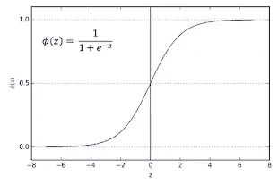
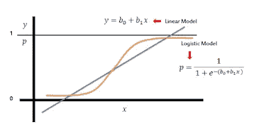
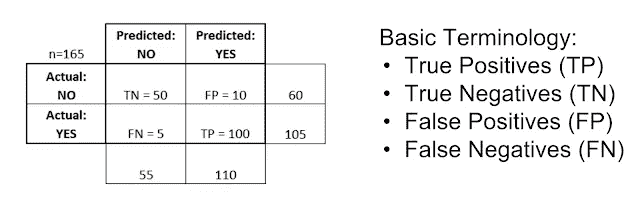

# “为什么”和“什么”是逻辑回归

> 原文：<https://medium.com/analytics-vidhya/why-and-what-is-logistic-regression-dbcce016bbc0?source=collection_archive---------22----------------------->

# 介绍

逻辑回归是主要用于分类目的的统计模型之一。下面我们来了解一下什么是逻辑回归，以及它如何在数据科学和交通运输领域对你有用。

# 为什么是逻辑回归？

逻辑回归主要用作分类方法。我们大多数人都知道线性回归，它用于根据以前的数据预测一个数据。例如:预测交通数据、寻找城市内不同交通方式的增长率等。

但是请考虑这样一种情况，您需要了解用户是选择公共汽车还是火车、汽车还是两轮车、交通用户是男性还是女性等等。在这些情况下，逻辑回归就派上了用场。我们可以使用逻辑回归进行分类(请记住，许多文章和书籍说“虽然名为回归，但逻辑回归是一种分类算法”，这是一种误称)。点击了解更多详情

# Sigmoid 函数

[乙状结肠功能](https://www.transportpythonified.com/2020/08/introduction-lets-understand-what-is.html)

sigmoid 函数给出 0 到 1 之间的输出，与给定的输入无关。记住，很难设计一个输出值仅在 0 和 1 之间的线性回归。sigmoid 函数的方程由**σ(z)= 1/(1+e^(-z)】**给出，如左图所示

现在考虑在这条逻辑曲线上拟合我们的线性模型，如上图所示。现在，我们在线性回归线上的所有值将被转换成相应的逻辑曲线值，其范围在 0 和 1 之间

因此，我们将得到一个概率值作为我们的输出。所以，让我们设定一个 0.5 的阈值来对选择进行分类。因此，如果我们的输出低于 0.5，那么我们将选择分类为 0，否则选择将为 1。

假设我们已经将用户选择公共汽车虚拟编码为 0，将汽车虚拟编码为 1，那么任何低于 0.5 的输出值都将输出为“用户选择公共汽车”，如果输出恰好高于 0.5，那么输出将为“用户选择汽车”

# 模型评估:

当你说，你已经创建了一个预测选择的模型给你的朋友，他们会很好奇你的模型会如何准确地预测用户的选择，不是吗？。每个模型都有自己的评估指标。例如，线性回归有 R、MSE、RMSE 和 MAE 等指标。以类似的方式我们有一个东西叫做****混淆矩阵****

**我用验孕的例子来解释一下混淆矩阵的概念。假设有 165 人(包括男性和女性)参加了妊娠测试，该测试将使用您创建的逻辑回归来执行测试。找到下表以及不言自明的基本术语**

****

**从上图可以看出，参与人数为 165 人，实际怀孕人数为 105 人，未怀孕人数为 60 人。但是我们的模型预测 110 人怀孕，55 人没有怀孕。**

****

**假阳性也被称为 1 型错误，假阴性被称为 2 型错误。所以，正如你看到左边的图片，你现在对模型预测的东西有了更好的理解。**

**现在我们已经了解了**真阳性(TP)、真阴性(TN)、假阳性(FP)和假阴性(FN)** 的基本术语，让我们看看如何估计一个模型的准确度和误分类率。**

****准确度**=(TP+TN)/总样本数**

****误分类率**=(FP+FN)/总样本数**

# **结论:**

**现在，既然我们已经了解了什么是逻辑回归以及它如何用于预测选择，我们可以将它应用于交通领域来预测模式选择，预测基于各种参数的事故概率。拥有逻辑回归的基本概念对机器学习项目也有帮助。**

**如果这对你有用的话，别忘了给两次掌声:)**

****问候，****

**Vignesh Kathirkamar**

**[**运输腐熟**](http://www.transportpythonified.com)**