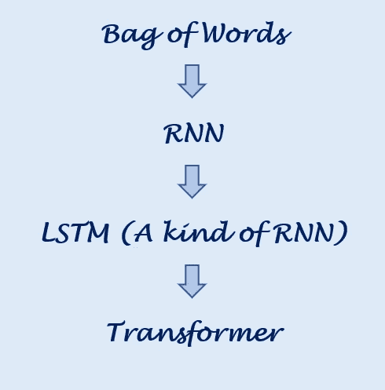
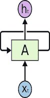
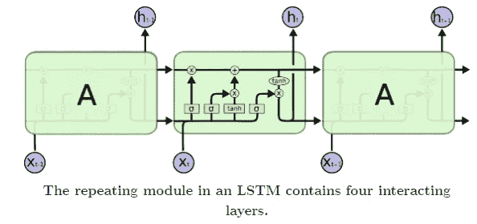
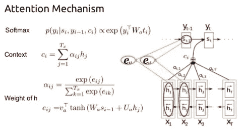
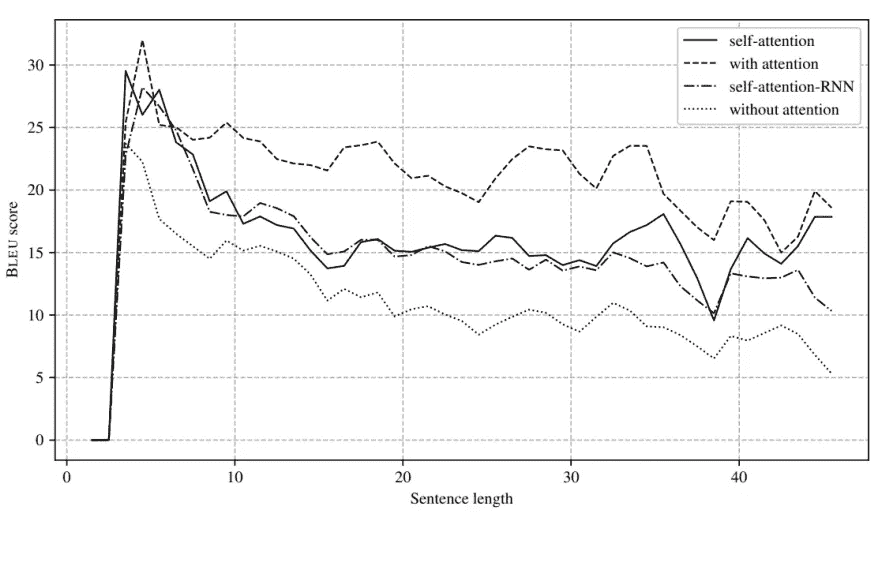
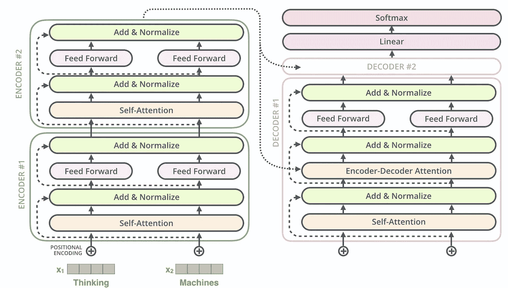

# 为什么 LSTMs 苦苦与变形金刚对决？

> 原文：<https://medium.com/analytics-vidhya/why-are-lstms-struggling-to-matchup-with-transformers-a1cc5b2557e3?source=collection_archive---------2----------------------->

这篇文章揭示了长短期记忆(LSTM)和变压器网络的性能。我们将从了解 LSTM 和变形金刚的信息开始，然后继续了解它们工作的内部机制。让我们来了解一下幕后发生了什么，以及为什么《变形金刚》能够比《LSTM》表现得更好。

# 什么是 RNN，它是如何工作的？

在学习 LSTM 网络之前，让我们知道递归神经网络(RNN)是如何工作的。RNN 是一种神经网络，前一时间步的输出作为输入输入到当前时间步。与前馈神经网络不同，rnn 可以使用其内部状态(记忆)来处理输入序列。因此，神经 rnn 擅长对序列数据建模。

在传统的神经网络中，所有的输入和输出是相互独立的；而在需要连续信息来预测句子的下一个单词的情况下，需要前面的单词，因此需要记住前面的单词。于是，RNN 诞生了。他们在循环结构的帮助下解决了这个问题。RNN 最主要也是最重要的特征是“隐藏”状态，这种状态能记住关于序列的信息。这使得它们适用于诸如未分段的、连接的手写识别或语音识别之类的任务。

来源:colah 的博客

这种循环结构允许神经网络接受输入序列。如果你看到展开的版本，你会更好地理解它。

来源:colah 的博客

香草 RNN 的主要问题是，他们不能照顾长期的依赖性(即，如果来自初始时间步长的输入的信息被要求在网络的后面部分产生输出，则记忆会因为梯度的消失或爆炸而丢失。我们希望 RNN 能够跨多个时间步长存储信息，并在相关时检索信息——但普通的 rnn 通常很难做到这一点。更多解释请查看[本出](https://towardsdatascience.com/understanding-rnn-and-lstm-f7cdf6dfc14e)。

# 长短期记忆(LSTM)网络是如何工作的？

LSTM 网络是递归神经网络的高级版本，它使记忆过去的数据变得更容易。最后，LSTMs 是一种特殊类型的 RNNs，其中您以特定的方式连接这些单元，以避免常规 RNNs 中出现的某些问题(如解决 RNNs 长期依赖性问题的消失和爆炸梯度)。给定未知持续时间的时滞，LSTM 非常适合于分类、处理和预测时间序列。它通过随时间推移使用反向传播来训练模型。

来源:colah 的博客

这里，“A”是接受输入“X”，输出“h”(一个向量)的单位。此外，还有一些向量从前面的单元反馈到 A(由从一个 A 到另一个 A 的右箭头所示)。除了来自前一个单元的输入和单元状态(穿过单元顶部的水平线)，我们还有来自前一个单元的另一个向量(即前一个单元的输出)。因此，每个单元总共有三个输入和两个输出。注意，这里所有的 A 指的是内存中的一个对象——为了便于解释，它们是以展开的方式绘制的。实际情况是，从 A 右侧出来的输出从左侧反馈到同一个 A 模块。

您可以通过多种方式将 LSTMs 用于序列间任务。如上图所示，您可以将输入序列输入到一个 LSTM 中，并获得一个 h 向量序列。然后，您可以根据需要进一步处理这些 h 向量，以执行分类或回归任务。

LSTMs 的主要思想是单元格状态，即贯穿单元格顶部的水平线。

细胞状态有点像传送带。它直接贯穿整个网络，只有很少的线性交互作用。信息很容易沿着它流动——保持不变。这就解决了我们长期依赖的问题。关于 LSTM 氏症的更多详细解释，请浏览 Colah 的博客。

现在最大的问题来了。当进行实验分析时，基于 LSTM 网络或 LSTM 的编码器-解码器模型不适用于长句子，这是因为这种句子具有单个潜在向量作为输出，并且最后的 LSTM 单元可能不能捕捉句子的全部本质。由于长句中的所有单词都被捕获到一个向量中，如果输出单词依赖于特定的输入单词，那么在简单的基于 LSTM 的编码器-解码器模型中没有给予它适当的关注(就像我们人类通常所做的那样)。为了解决这些问题，基于注意力的模型应运而生。

# **什么是变压器？**

变形金刚模型本质上是基于注意力的模型。如果解码器不仅仅依赖于上下文向量，而是可以访问编码器过去的所有状态，会怎么样？这正是注意力在做的事情。在每个解码步骤中，解码器都会查看编码器的任何特定状态。

在这种情况下，使用双向输入，其中向前和向后提供输入序列，然后在传递到解码器之前连接到内容向量(Ci)。注意力模型不是将输入序列编码到单个固定的上下文向量中，而是开发一个上下文向量，该向量专门针对每个输出时间步长进行过滤。每个输出时间步长的内容向量基于其对输入时间步长的依赖性而改变，即由注意力权重(alpha)来照顾。

从下图中，我们可以看到基线模型(没有注意)的 BLEU 分数(这是衡量准确性的尺度之一)随着句子长度的增加而急剧下降。但是，随着注意机制的引入，这个问题得到了缓解。自我注意模型的表现略低于具有注意的 RNN 编解码器，它们处理长句的能力也略低。这些结果表明，基于注意力的模型比传统的编码器-解码器模型具有显著的优势，传统的编码器-解码器模型甚至在长句上也表现出很好的性能。

变压器网络完全建立在自我关注机制上，不使用递归网络架构。变形金刚是用多头自关注模型制作的。他们的灵感来自 CNN 的类似邻居的概念。更多详细解释请阅读本博客。

杰伊·阿拉玛的博客

# **结论:**

如前所述，变压器比基于 RNN 的模型更快，因为所有输入都是一次性接收的。与变压器网络相比，训练 LSTM 更困难，因为 LSTM 网络中的参数数量要多得多。此外，在 LSTM 网络中进行迁移学习是不可能的。seq2seq 型号的变压器现在是最先进的网络。因此，我们的结论是，变压器网络具有最佳精度，并且复杂性和计算成本较低。